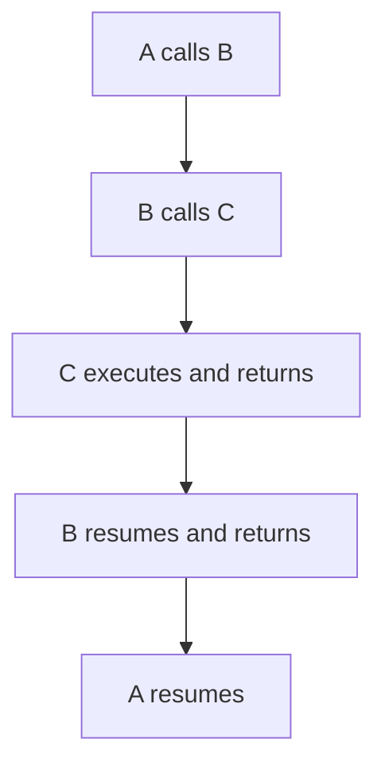
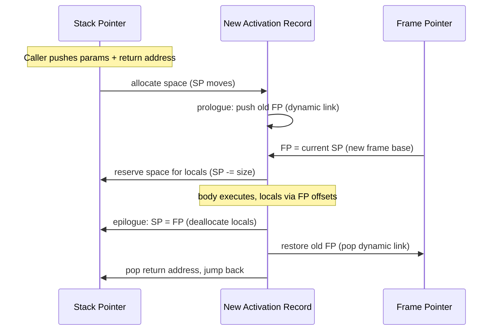

## Stack-Based Allocation Implementation

### Overview

Stack-based allocation is the runtime strategy in which activation record instances are created and destroyed in strict last-in-first-out (LIFO) order, using a single contiguous (or effectively contiguous) region of memory called the **runtime stack** or **call stack**. It is the dominant implementation strategy for subprograms in imperative and many other languages because it naturally matches the nesting behavior of calls and returns: the most recently called subprogram is always the first to return.

### Why LIFO Order Matches Subprogram Calls

Subprogram activations nest in a strictly LIFO pattern under normal (non-coroutine) control flow: if subprogram `A` calls `B`, and `B` calls `C`, then `C` must finish before `B` can resume, and `B` must finish before `A` can resume. This is exactly the discipline a stack enforces, which is why a stack — rather than, say, a heap with arbitrary allocation order — is the natural and efficient data structure for this job.



### Core Mechanics

Two registers (or their logical equivalents) drive stack-based allocation:

- **Stack pointer (SP)** — points to the top of the stack, i.e., the next free location (or the last used location, depending on convention). Incremented/decremented as records are pushed and popped.
- **Frame pointer / base pointer (FP/BP)** — points to a fixed reference location within the *currently executing* activation record instance, used as a stable base from which to compute offsets to locals, parameters, and links. The frame pointer is necessary because the stack pointer itself can move during a call's execution (e.g., when temporaries are pushed), so it is not a reliable fixed reference within a frame.

**Key Points**

- Local variables and parameters are accessed via **fixed offsets** from the frame pointer, computed at compile time — e.g., "local variable `x` is at `FP - 8`."
- Because these offsets are compile-time constants, accessing a local variable is typically a single load/store instruction relative to `FP`, which is why stack-based access is efficient. [Inference — "single instruction" access is the common case on typical register/offset-addressing architectures; some architectures or calling conventions may require additional instructions in edge cases]
- The stack pointer's movement (not the frame pointer's) is what actually implements allocation and deallocation — pushing an activation record instance is essentially "subtract the record's size from SP" (on stacks that grow downward), and popping it is "add the size back."

### Call Sequence Implementation

The following steps implement a call using a stack:

1. **Caller** evaluates actual parameters and pushes them (or arranges for them in registers, per the calling convention).
2. **Caller** pushes the return address (or it is implicitly pushed by a `call` instruction on many architectures).
3. **Callee's prologue** executes: it pushes the old frame pointer (this becomes the new dynamic link), sets the new frame pointer to the current stack pointer, and decrements the stack pointer further to reserve space for local variables.
4. **Callee** executes its body, referencing locals and parameters via `FP`-relative offsets.
5. **Callee's epilogue** executes: it deallocates local variable space by restoring the stack pointer, restores the old frame pointer (popping the dynamic link), and returns control via the saved return address.



### Example: x86-Style Frame Setup (Illustrative Pseudocode)

```plaintext
; Simplified illustrative prologue/epilogue, not a specific real ISA encoding
function_entry:
    push FP              ; save caller's frame pointer (dynamic link)
    FP = SP               ; establish new frame pointer
    SP = SP - local_size   ; reserve space for locals

    ; ... function body accesses locals via [FP - offset] ...

function_exit:
    SP = FP                ; deallocate locals
    FP = pop()             ; restore caller's frame pointer
    return_addr = pop()
    jump return_addr
```

[Unverified — this is a simplified illustrative model of a stack frame prologue/epilogue for teaching purposes; real calling conventions such as System V AMD64, ARM AAPCS, or Microsoft x64 differ in exact register usage, alignment requirements, and which party — caller or callee — is responsible for saving which registers]

### Growth Direction

Whether the stack grows toward lower or higher addresses is an implementation/architecture choice:

- On most common architectures (x86, ARM, and others in typical usage), the call stack **grows downward** — toward lower memory addresses — as new activation record instances are pushed.
- This is purely a convention; the logical LIFO semantics do not depend on which direction the addresses move, only that push and pop are consistent. [Inference — the specific growth direction and any zero-page or guard-page conventions are architecture/OS-specific]

<svg xmlns="http://www.w3.org/2000/svg" viewBox="0 0 460 380">
<text x="230" y="30" font-size="16" font-weight="bold" text-anchor="middle" fill="#1a1a1a">Stack Growth During Nested Calls (svg_diagram)</text>

<text x="60" y="55" font-size="12" fill="`#495057`">High Address</text>

<text x="60" y="345" font-size="12" fill="`#495057`">Low Address</text>

<line x1="80" y1="45" x2="80" y2="350" stroke="`#adb5bd`" stroke-width="1" />

<rect x="120" y="60" width="260" height="60" fill="#e8f0fe" stroke="#3b5bdb" stroke-width="1.5" />
<text x="250" y="95" font-size="13" text-anchor="middle" fill="#1a1a1a">main's frame</text>
<rect x="120" y="130" width="260" height="60" fill="#fff3bf" stroke="#f08c00" stroke-width="1.5" />
<text x="250" y="165" font-size="13" text-anchor="middle" fill="#1a1a1a">A's frame (called by main)</text>
<rect x="120" y="200" width="260" height="60" fill="#e6fcf5" stroke="#0ca678" stroke-width="1.5" />
<text x="250" y="235" font-size="13" text-anchor="middle" fill="#1a1a1a">B's frame (called by A)</text>
<rect x="120" y="270" width="260" height="50" fill="#fff0f6" stroke="#d6336c" stroke-width="1.5" stroke-dasharray="4" />
<text x="250" y="300" font-size="13" text-anchor="middle" fill="#1a1a1a">SP → next free slot</text>
<polygon points="80,340 74,325 86,325" fill="#495057" />
<text x="95" y="335" font-size="11" fill="#495057">stack growth direction</text>
</svg>

### Advantages of Stack-Based Allocation

- **Automatic support for recursion** — each call gets a fresh, independent activation record instance, so recursive calls never overwrite each other's data.
- **Fast allocation/deallocation** — both are typically just an addition or subtraction on the stack pointer, an O(1) operation, versus the bookkeeping a general-purpose heap allocator requires.
- **Automatic storage reclamation** — memory is freed simply by popping, with no need for garbage collection of that memory.
- **Good locality** — frequently accessed data (current locals and parameters) tends to be physically close together and recently touched, which tends to work well with CPU caches. [Inference — cache-performance claims are architecture- and workload-dependent generalizations, not guarantees]

### Limitations of Stack-Based Allocation

- **Cannot outlive the call** — data in a stack frame is deallocated as soon as the subprogram returns, so anything that must persist beyond that point (e.g., a variable captured by a closure, or a coroutine's suspended state) cannot rely purely on the stack.
- **Fixed maximum size** — the stack is typically allocated with a fixed maximum size at program or thread start; exceeding it causes a **stack overflow**, commonly from unbounded or excessively deep recursion.
- **No support for indefinite-extent local data** — a local variable whose lifetime the programmer wants to extend beyond the call (as with returning a pointer to a local in C) cannot safely be implemented purely with stack storage, and doing so anyway is a common source of dangling-pointer bugs.

### Related Topics

- Frame pointers and stack pointers in calling conventions
- Register-based parameter passing and calling conventions (e.g., System V AMD64, AAPCS)
- Stack overflow and recursion depth limits
- Heap-based allocation for closures and coroutines
- Static links and displays for nested subprogram access
- Tail-call optimization and stack frame reuse
- Exception handling and stack unwinding