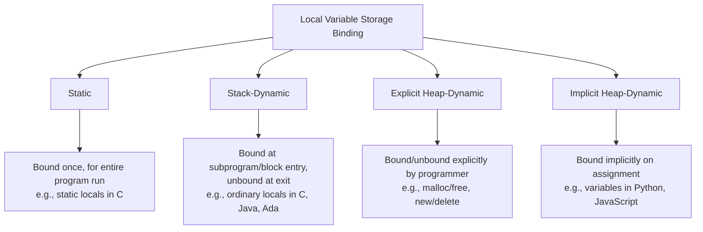
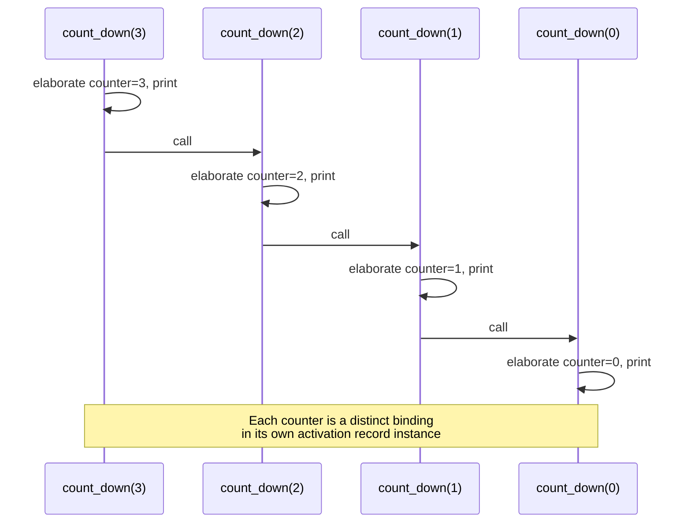

## Dynamic Local Variable Allocation

### Overview

"Dynamic" local variable allocation refers to local variables whose storage is bound at run time rather than at compile time. This is a distinct axis from *where* the storage lives (stack vs. heap) — it is about *when* the binding of a variable to a memory location happens, and correspondingly when that binding is undone. Understanding this distinction is essential because languages differ substantially in which category their local variables fall into, and that choice has direct consequences for recursion support, performance, and what kinds of programs are expressible.

### Binding Time Categories

Local variables can be classified by when their storage is bound, forming a spectrum:

- **Static** — bound to a single memory location for the entire execution of the program, established before execution begins (compile/link time). The binding never changes.
- **Stack-dynamic** — storage is bound when the declaration's containing subprogram (or block) is entered at run time, and unbound when that subprogram/block exits. Allocation occurs on the runtime stack.
- **Explicit heap-dynamic** — storage is allocated and deallocated at arbitrary points during execution, explicitly requested by the programmer (e.g., via `new`/`malloc` and `delete`/`free`), and referenced only indirectly through pointers or references.
- **Implicit heap-dynamic** — storage is bound only when a value is actually assigned, with no explicit allocation request from the programmer at all; the language runtime handles allocation transparently (common for variables in languages like Python, JavaScript, or PHP, where a variable's storage requirements can even change as its type/value changes over its lifetime). [Inference — the exact mechanics of implicit heap-dynamic storage are highly implementation-specific per language runtime]



### Stack-Dynamic Local Variables

This is the default and most common case for local variables in imperative languages (C, Java, Ada, Pascal, and others):

- Storage for a stack-dynamic local is allocated as part of the enclosing subprogram's activation record instance, at the point that subprogram is entered.
- All such storage is deallocated automatically when the subprogram returns, as its activation record instance is popped from the stack.
- Because binding happens fresh at every entry, a **new** location is bound on every call — this is what allows recursive calls to maintain separate copies of local variables.

**Key Points**

- **Elaboration** is the term commonly used for the run-time process of allocating storage and performing any associated initialization for a declaration at the point it becomes active — this is distinct from compile-time processing of the declaration.
- Stack-dynamic locals cannot retain their value between separate calls (in ordinary imperative languages), because the storage itself is destroyed at return and freshly created on the next call.
- If a subprogram needs a local variable to *retain* its value across calls without being reallocated fresh each time, that generally requires a different binding category (static local, as in C's `static` local variables, or an externally/heap-managed variable).

### Example: Stack-Dynamic Binding Across Recursive Calls

```plaintext
function count_down(n)
    local counter = n     ; stack-dynamic: new binding each call
    print(counter)
    if n > 0 then
        count_down(n - 1)
    end if
end function
```

Each invocation of `count_down` elaborates its own `counter`, bound to a distinct memory location in that invocation's activation record instance. The `counter` belonging to `count_down(3)` is entirely separate from the `counter` belonging to `count_down(2)`, even though they share the same declaration in the source code.



### Advantages of Stack-Dynamic Allocation

- Directly supports **recursion**, since every activation gets independent storage.
- Storage is **reclaimed automatically** at subprogram exit, with no need for the programmer or a garbage collector to manage it explicitly.
- **Flexibility**: the storage requirements of the subprogram (in terms of what locals exist) can be tailored per call in languages that allow, for example, runtime-sized local arrays. [Inference — this flexibility applies specifically to languages permitting variable-length local arrays, such as C99's VLAs or Ada's runtime-sized array types; many languages (traditional C, Java) do not permit this]

### Disadvantages of Stack-Dynamic Allocation

- **Allocation/deallocation overhead**, though typically small (an addition/subtraction of the stack pointer), is nonzero and repeated on every call — this matters in performance-critical, frequently-called subprograms. [Inference — the actual performance cost is highly dependent on calling convention, compiler optimization, and whether the subprogram is inlined]
- **No persistence across calls** — if a program's logic actually needs a local variable to retain state between separate invocations, stack-dynamic storage cannot provide that without additional mechanism (e.g., passing the value back in, using a static local, or storing it externally).
- **Indirect addressing cost** — because the exact memory address of a stack-dynamic local depends on where in the stack its activation record instance happens to sit, access typically requires indirection through the frame pointer, versus the potentially more direct addressing possible for static variables. [Inference — the magnitude of this cost difference is architecture- and compiler-dependent, and modern optimizing compilers often eliminate any practical difference]

### Contrast with Static Local Variables

Some languages (C is the clearest example, via the `static` keyword) allow a local variable to be declared with static binding instead of the default stack-dynamic binding:

```plaintext
function call_counter()
    static count = 0     ; static: bound once, persists across calls
    count = count + 1
    print(count)
end function
```

Here, `count` is elaborated exactly once — the first time the enclosing subprogram is loaded/executed — and the same storage location is reused on every subsequent call, so its value persists. This is the opposite of stack-dynamic behavior and directly illustrates why the *binding-time* classification matters independently of syntax: the declaration `static count = 0` looks like an ordinary local declaration but has fundamentally different runtime storage semantics.

### Related Topics

- Activation records and their role in stack-dynamic storage
- Elaboration of declarations and its distinction from compile-time processing
- Explicit vs. implicit heap-dynamic variables
- Scope and lifetime as separate concepts
- Garbage collection for heap-dynamic data
- Variable-length arrays and runtime-sized local storage (C99 VLAs, Ada)
- Closures and the need to escape stack-dynamic storage onto the heap