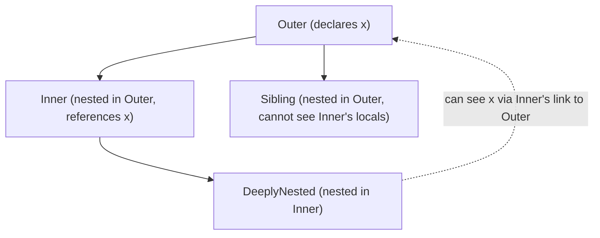
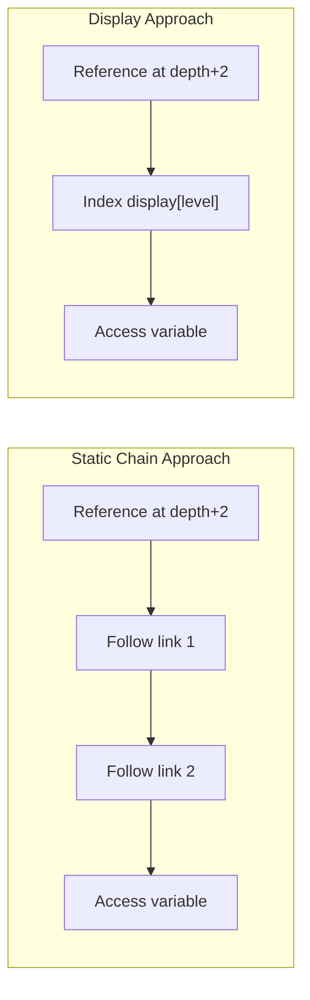
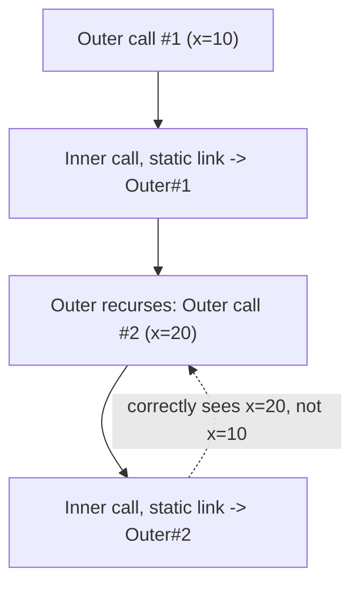

## Nested Subprograms and Static Chains

### Overview

Nested subprograms are subprograms defined lexically inside another subprogram, with visibility into the enclosing subprogram's local variables governed by the language's scoping rules. A static chain (also called an access link chain) is the classic runtime mechanism many languages use to implement this visibility: each activation record includes a pointer back to the activation record of its statically (lexically) enclosing subprogram, forming a chain that a nested subprogram walks to resolve references to non-local variables.

### What Nested Subprograms Are

A nested subprogram is textually defined within the body of another subprogram and, in languages that support this feature, can refer directly to the variables declared in the enclosing subprogram's scope, in addition to its own local variables and any globally visible names.

```pascal
procedure Outer;
  var x : Integer;

  procedure Inner;
  begin
    x := x + 1;  { Inner refers directly to Outer's local variable x }
  end;

begin
  x := 10;
  Inner;
  { x is now 11 }
end;
```

Languages historically associated with nested subprograms as a core feature include Pascal, Ada, and Fortran (in some standards); many contemporary languages support a closely related construct — nested functions or closures — with somewhat different scoping and lifetime rules, discussed below.

### Static Scoping as the Prerequisite

Nested subprograms with non-local variable access are meaningful primarily under **static (lexical) scoping**, where a name reference is resolved based on the textual nesting structure of the program as written, not based on the dynamic sequence of calls at runtime. Under static scoping, `Inner`'s reference to `x` above unambiguously refers to the `x` declared in `Outer`, because `Inner` is lexically nested inside `Outer`, regardless of which subprogram happens to call `Inner` at runtime.



Under **dynamic scoping**, by contrast, a non-local reference would resolve to the most recently active binding of that name at runtime, regardless of lexical nesting — a model used by some Lisp dialects and shell scripting languages, but rare in mainstream statically typed languages, precisely because it makes reasoning about a subprogram's behavior dependent on its calling context rather than its textual location.

### The Addressing Problem Nested Subprograms Create

When a nested subprogram references a non-local variable, the compiler and runtime must determine, at each such reference, *where in memory* that variable currently lives. Because the enclosing subprogram's activation record is created fresh on each call (and destroyed on return, in a typical stack-based model), the nested subprogram cannot simply hardcode an absolute address — it must locate the *currently active* activation record of the correct enclosing subprogram, which may differ across calls if the enclosing subprogram itself is called from multiple places or recursively.

This is the general problem that static chains, and their main alternative, displays, exist to solve.

### Static Chains: The Classic Solution

A **static chain** (or **access link**) is a pointer stored in each activation record that points to the activation record of the subprogram's immediately (lexically) enclosing subprogram's *most recent* activation. To resolve a reference to a variable declared $n$ lexical levels up from the currently executing subprogram, the runtime follows the static chain pointer $n$ times, then applies a fixed offset within that activation record to find the variable.

<svg xmlns="http://www.w3.org/2000/svg" viewBox="0 0 780 340">
  <text x="390" y="26" text-anchor="middle" font-size="18" font-weight="bold" fill="#1a1a1a">Static Chain Across Activation Records (svg_diagram)</text>

  <rect x="280" y="55" width="220" height="80" rx="6" fill="#3498db" fill-opacity="0.15" stroke="#333" stroke-width="1.5" />
  <text x="390" y="75" text-anchor="middle" font-size="12" font-weight="bold">Outer's activation record</text>
  <text x="390" y="95" text-anchor="middle" font-size="11">local: x = 10</text>
  <text x="390" y="113" text-anchor="middle" font-size="10" fill="#555">static link: (none / global)</text>

  <rect x="280" y="165" width="220" height="80" rx="6" fill="#e67e22" fill-opacity="0.15" stroke="#333" stroke-width="1.5" />
  <text x="390" y="185" text-anchor="middle" font-size="12" font-weight="bold">Inner's activation record</text>
  <text x="390" y="205" text-anchor="middle" font-size="11">local: y = 5</text>
  <text x="390" y="223" text-anchor="middle" font-size="10" fill="#555">static link: → Outer's record</text>

  <rect x="280" y="275" width="220" height="55" rx="6" fill="#2ecc71" fill-opacity="0.15" stroke="#333" stroke-width="1.5" />
  <text x="390" y="295" text-anchor="middle" font-size="12" font-weight="bold">DeeplyNested's record</text>
  <text x="390" y="313" text-anchor="middle" font-size="10" fill="#555">static link: → Inner's record</text>

  <line x1="390" y1="165" x2="390" y2="135" stroke="#c0392b" stroke-width="2" marker-end="url(#sc1)" />
  <line x1="390" y1="275" x2="390" y2="245" stroke="#c0392b" stroke-width="2" marker-end="url(#sc1)" />
  <text x="600" y="200" font-size="11" fill="#555">DeeplyNested referencing x:</text>
  <text x="600" y="218" font-size="11" fill="#555">follow static link 2 levels up</text>
  <text x="600" y="236" font-size="11" fill="#555">(Inner → Outer), then offset to x</text>
</svg>

The static chain pointer is set up at *call time* by the caller: when a subprogram $S$ nested at lexical depth $d$ calls a subprogram $T$ nested at lexical depth $d{+}1$ directly inside $S$, $T$'s static link is set to point to $S$'s current activation record. When a subprogram calls another subprogram at the *same or shallower* lexical depth, the static link must instead be computed by walking up the *caller's own* static chain some number of steps before storing it in the new activation record, since the new call may not be nested directly inside the immediately preceding activation.

[Inference] The general algorithm for computing a new static link — "follow the caller's own chain up $k$ steps, where $k$ is the difference in lexical nesting depth between caller and callee's enclosing scope, then that becomes the new link" — is standard textbook material (found in most compiler-construction and programming-language-concepts texts covering activation records), though exact terminology and presentation vary somewhat by source.

### Static Chain vs. Dynamic Chain

It's important to distinguish the static chain from the **dynamic chain** (also called the **control link** or **dynamic link**), which every activation-record-based language maintains regardless of whether it supports nested subprograms:

| | Static chain (access link) | Dynamic chain (control link) |
|---|---|---|
| Points to | The lexically enclosing subprogram's activation | The caller's activation (whoever called this subprogram) |
| Used for | Resolving non-local variable references | Returning control to the caller; unwinding the stack |
| Present in | Languages with nested subprograms and non-local access | Virtually all stack-based activation-record implementations |
| Determined by | Lexical (textual) nesting structure | Runtime calling sequence |

These two chains coincide only when a subprogram's caller happens to also be its lexically enclosing subprogram — in general, they diverge, which is precisely why nested subprograms with non-local access require the *additional* static-chain mechanism beyond the dynamic chain every call already maintains for return-address and stack-unwinding purposes.

### Alternative: Displays

An alternative to walking a static chain at each non-local reference is the **display**, an array (often maintained in a register or a small fixed memory area) indexed by lexical nesting depth, where slot $i$ holds a pointer to the currently active activation record at lexical level $i$. Resolving a variable $n$ levels up becomes a single array indexing operation (`display[n]`) rather than $n$ pointer dereferences, trading the cost of chain-walking for the cost of updating the display array on every call and return.

[Inference] Displays were historically motivated by the performance concern that deeply nested references under a pure static-chain model require a chain-walk proportional to nesting depth on every access, which can be costly if such references occur frequently and nesting is deep; this performance trade-off framing is standard in compiler-construction literature discussing activation record design, though the practical significance of the difference depends heavily on typical nesting depths in real programs, typical compiler optimizations (e.g., caching resolved addresses), and the specific hardware/calling-convention context, so is best treated as a design-space trade-off rather than a fixed universal performance claim.



### Languages and Their Approaches

**Pascal** is the most commonly cited textbook example of a language built around nested subprograms with static-chain-based non-local access, since nested procedure and function declarations were a core, idiomatic feature of the language.

**Ada** supports nested subprograms similarly, with non-local variable access resolved according to the same lexical-scoping principles, and Ada compilers have historically used static-chain or display-based implementations depending on the specific compiler. [Unverified: which specific mechanism any particular Ada compiler implementation uses is an implementation detail not fixed by the language specification itself, so this is described as compiler-dependent rather than as a language-mandated choice.]

**C** does not support nested subprograms with non-local variable access as a standard language feature — a function defined at file scope cannot be nested inside another function in standard C, so the static-chain problem as classically described does not arise in standard C at all. [Unverified: some compilers have historically offered nested functions as a non-standard extension (e.g., GCC's nested function extension), but this is outside the ISO C standard and shouldn't be treated as a portable language feature.]

**Modern languages with closures** (JavaScript, Python, Swift, Rust's closures, Java's lambdas with effectively-final capture) achieve conceptually similar non-local access, but the underlying implementation strategy is generally different from a classic Pascal-style static chain over stack-allocated activation records. Because a closure may need to **outlive** its enclosing function call (the enclosing function can return while the closure, and its captured variables, remain alive — e.g., the `makeMultiplier` closure example from function design), captured variables commonly cannot simply live in a stack frame that gets popped on return. Implementations instead typically:

- Allocate captured variables on the heap rather than the stack, or
- "Box" specific variables that are captured by reference so they survive independently of the frame that originally declared them, or
- Copy captured values into the closure object at creation time (capture-by-value semantics, as in some of Swift's and C++'s closure capture modes).

```javascript
function makeCounter() {
    let count = 0;               // must survive after makeCounter returns
    return function () {
        count += 1;
        return count;
    };
}
const counter = makeCounter();   // makeCounter's frame conceptually "returns"
counter();                       // yet `count` is still accessible and mutable
```

[Inference] This distinction — whether the language needs to support non-local variables that outlive their originally enclosing call — is the main reason closures in dynamically-lifetime-managed languages are generally implemented via heap-allocated captured-variable storage rather than a pure stack-based static-chain walk, since a static chain over stack frames implicitly assumes the enclosing frame is still on the stack (i.e., still executing or suspended, not fully returned and popped) whenever the nested code runs, which does not hold once a closure is allowed to outlive its creator.

### Recursion and the Static Chain

Static chains correctly handle recursive nested subprograms because each new activation gets its own freshly computed static link, distinct from the dynamic chain, which also grows with each recursive call:



Each `Inner` invocation's static link points to whichever `Outer` activation is currently the relevant lexical parent for *that specific call*, which is precisely the correctness property the chain mechanism is designed to preserve — this is what distinguishes a properly maintained static chain from a naive "single shared enclosing frame" assumption that would break under recursion.

### Performance and Design Trade-offs

- **Deeply nested references cost more** under a pure static-chain implementation, since resolving a variable $n$ lexical levels up requires $n$ pointer dereferences at each access, whereas a display reduces this to a constant-time array index at the cost of display-maintenance overhead on every call/return.
- **Flat (non-nested) languages avoid the problem entirely**: C's lack of standard nested-subprogram support means C activation records need only a dynamic chain (or, in many ABI conventions, an implicit return-address mechanism plus frame pointer), simplifying the calling convention at the cost of not supporting this particular scoping feature.
- **Closures shift the cost model**: heap-allocating captured variables avoids the "outlives the stack frame" problem but introduces garbage-collection or reference-counting overhead for those captured variables, a different trade-off than the stack-based static-chain model assumes. [Inference] This is a reasonable general characterization of why closure-heavy languages tend to rely on garbage collection or reference counting for captured state, though exact implementation choices (e.g., Rust's ownership-based capture without a garbage collector) show that this is not a strictly universal requirement, merely a common pattern.

### Key Points

- Nested subprograms with non-local variable access require static (lexical) scoping to be meaningful, since the whole notion of "the enclosing subprogram's variable" depends on textual nesting structure rather than the runtime call sequence.
- A static chain is a per-activation-record pointer to the lexically enclosing subprogram's *current* activation, distinct from the dynamic chain (which points to the caller, regardless of lexical relationship) that virtually all stack-based implementations maintain anyway.
- Resolving a non-local reference under a static chain requires walking the chain a number of steps equal to the difference in lexical nesting depth; displays offer a constant-time alternative at the cost of display-maintenance overhead on every call and return.
- C does not support standard nested subprograms with non-local access, so the classic static-chain problem does not arise in standard C; Pascal and Ada are the more traditional examples where it does.
- Closures in modern languages solve a related but distinct problem — non-local access where the enclosing call may have already returned — typically via heap allocation of captured variables rather than a pure stack-frame-based static chain, since a static chain implicitly assumes the enclosing frame is still live on the stack.

### Related Topics

- Activation records and the runtime stack
- Static vs. dynamic scoping
- Closures and variable capture semantics (by reference vs. by value)
- Displays as an alternative non-local addressing mechanism
- Garbage collection and heap-allocated closure state
- Calling conventions and stack frame layout
- Recursive subprogram activation and stack growth
- Lexical analysis and scope resolution during compilation