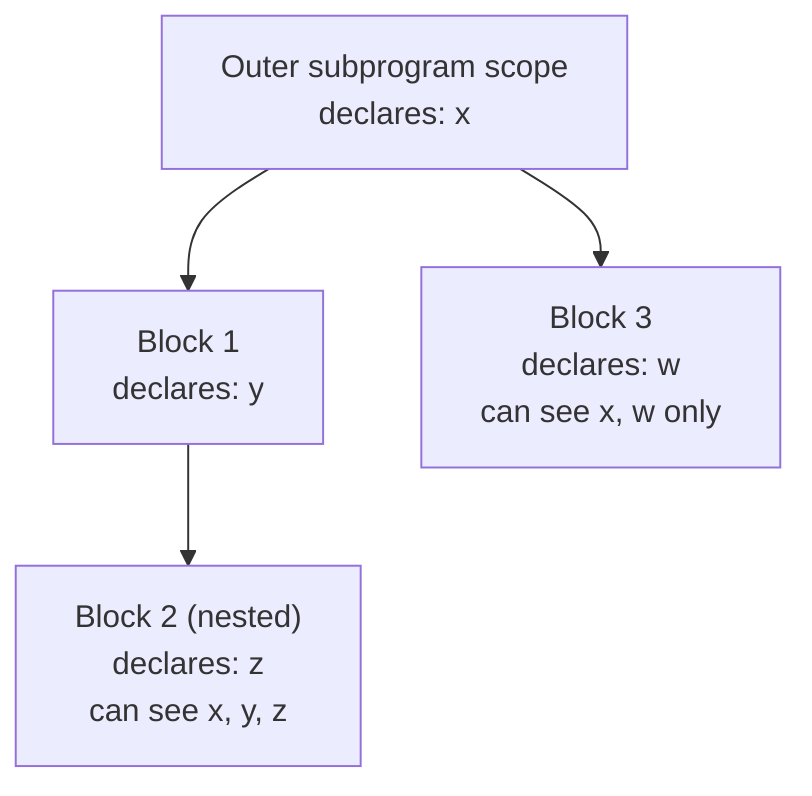
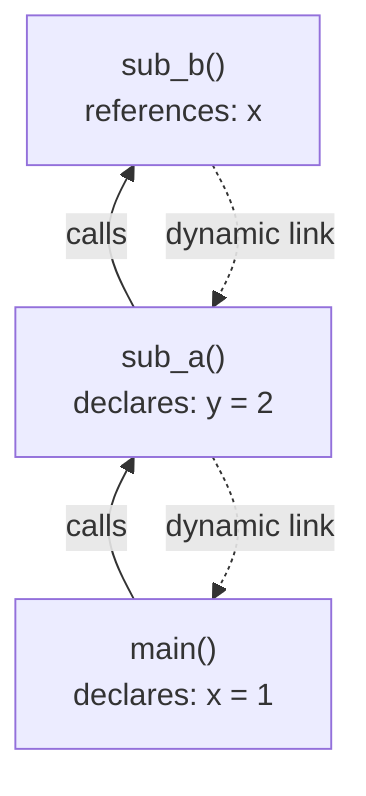
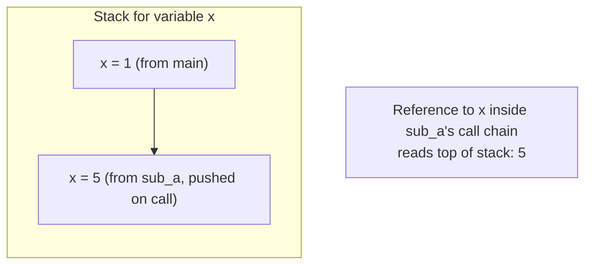

## Blocks and Dynamic Scoping Implementation

### Blocks as Subprogram-Like Constructs

A block is a section of code, delimited by markers such as `{ }` or `begin...end`, that can contain its own local variable declarations. Blocks are treated as "miniature subprograms" — they establish a new scope without requiring a name, parameter list, or explicit call mechanism. The classic example is a C-style compound statement that declares a local variable:

```c
void example() {
    int x = 10;
    {
        int y = 20;   // block-local variable
        x = x + y;
    }
    // y is not visible here
}
```

Blocks are implemented using the same run-time support as subprograms: an activation record (or a segment of one) is created to hold the block's local variables, and this storage is reclaimed when control leaves the block.

### Stack-Based Implementation of Blocks

Because blocks nest and follow a strict last-in-first-out entry/exit pattern, their local variables are almost universally allocated on the run-time stack. When a block is entered:

1. Space for the block's local variables is pushed onto the stack, either as a distinct activation record or as an extension of the enclosing subprogram's activation record.
2. Any initialization code for the local declarations executes.
3. On block exit, the space is popped, and the variables cease to exist.

Two common implementation strategies exist:

- **Treat every block as its own activation record.** This is conceptually clean but adds overhead for entering and exiting every block, even ones with no declarations.
- **Merge block locals into the enclosing subprogram's activation record**, computing the maximum stack depth needed at compile time (since blocks that are never simultaneously active can share the same stack slots). This is the approach used by many production compilers, since it avoids a separate frame per block. [Inference — the specific optimization strategy is a compiler design choice and varies by implementation.]

### Static Scoping and Blocks

Under static (lexical) scoping — the default in languages like C, C++, Java, and Ada — a block's local declarations are resolved based on the block's position in the source text, not on the dynamic call sequence. The compiler determines, at compile time, exactly which declaration a reference to an identifier refers to, by searching outward through enclosing blocks and then the enclosing subprogram and its enclosing scopes.



This diagram illustrates that Block 2 has access to all enclosing declarations (`x`, `y`, `z`), while Block 3 — a sibling of Block 1 — has no visibility into Block 1's `y`, since scoping follows lexical nesting rather than execution order.

### Dynamic Scoping Overview

Dynamic scoping resolves a free identifier reference by searching the chain of *dynamically active* subprogram calls, in reverse order of activation, rather than the lexical nesting of the source code. Under dynamic scoping, the meaning of a reference to a nonlocal variable depends on the sequence of calls that led to the current point of execution, not on where the code is textually written.

Languages that historically used dynamic scoping include early Lisp dialects (pre-Common Lisp), APL, SNOBOL4, and Perl (via its `local` keyword, as opposed to `my`, which is lexically scoped). [Confirmed]

### Implementing Dynamic Scoping: Deep Access

**Deep access** implements dynamic scoping by maintaining a **dynamic chain** (also called a dynamic link) — a pointer in each activation record back to the activation record of the *caller*, as opposed to the static chain used for static scoping, which points to the lexically enclosing scope's activation record.

To resolve a nonlocal reference under deep access:

1. Search the current activation record for the variable.
2. If not found, follow the dynamic link to the caller's activation record and search there.
3. Repeat, following dynamic links up the call chain, until the variable is found or the chain is exhausted (an error).



In this call sequence, `sub_b` references `x`, which is not declared locally. Deep access follows the dynamic chain: `sub_b` → `sub_a` (no `x` found) → `main` (found `x = 1`). If `sub_a` had instead declared its own `x`, that value — not `main`'s — would be found, because the search stops at the first match along the dynamic chain.

**Key Points**

- The search path under deep access changes from call to call, since it depends on the run-time call sequence rather than fixed source-code structure.
- Deep access requires no extra work at subprogram entry beyond setting the dynamic link (which is needed for control return anyway), making activation record construction relatively cheap.
- Every nonlocal reference potentially requires searching multiple activation records at run time, which is comparatively expensive. [Inference — relative cost depends on call depth and reference frequency in a given program.]

### Implementing Dynamic Scoping: Shallow Access

**Shallow access** takes the opposite tradeoff: it makes variable *references* cheap at the cost of more work during subprogram call and return.

Under shallow access, each variable name (rather than each subprogram) is given a single storage location — typically implemented as a stack, one stack per variable name, sometimes called a **central variable table** or **name stack**:

1. Each distinct variable identifier in the program has its own stack.
2. When a subprogram that declares a local variable named `x` is called, the new value of `x` is pushed onto `x`'s stack.
3. Any reference to `x` anywhere in the program, at any nesting depth, simply accesses the top of `x`'s stack directly — no chain traversal is needed.
4. When the subprogram returns, `x`'s value is popped off `x`'s stack, exposing the previous (enclosing) binding of `x`, if any.



**Key Points**

- Reference resolution is O(1): a direct lookup into the named stack's top element, rather than a search up a chain.
- Call and return are more expensive, since every subprogram call must push (and every return must pop) an entry for each local variable it declares — and the implementation must also handle variables that are referenced but never locally declared anywhere.
- This is essentially a table-driven variant of dynamic scoping and is more common in interpreted or specialized environments than deep access. [Inference — relative prevalence across implementations is not a fixed rule.]

### Deep vs. Shallow Access — Comparison

| Aspect | Deep Access | Shallow Access |
| --- | --- | --- |
| Storage organization | One activation record per call, with a dynamic link | One stack per variable name |
| Reference cost | Search up the dynamic chain | Direct top-of-stack access |
| Call/return cost | Low (just link setup) | Higher (push/pop per declared variable) |
| Best suited for | Programs with shallow call chains or infrequent nonlocal references | Programs with frequent nonlocal references |

### Dynamic Scoping — Practical Implications

Dynamic scoping creates a dependency between a subprogram's correctness and the calling context in which it executes, since a free variable's binding is determined by *who called it*, not by where it is textually defined. This has several consequences:

- **Readability suffers**, because understanding a reference to a nonlocal variable requires knowing the full possible set of call chains that could reach that code, which in general cannot be determined by reading the subprogram in isolation. [Inference — this is a widely cited critique in language design literature rather than a measurable property.]
- **Type checking of nonlocal references becomes difficult at compile time**, since the binding — and therefore the type — of a nonlocal variable may not be knowable until run time, undermining static type safety guarantees.
- **Aliasing and unintended interference** can occur when a called subprogram accidentally references a variable of the same name from a caller, without either party intending a connection.

**Example**



```
var x

procedure sub1()
    x = x + 1
end

procedure sub2()
    var x = 10
    call sub1()   // under dynamic scoping, sub1's "x" resolves to sub2's local x
    print(x)      // prints 11, not 10
end

sub2()
```

Under static scoping, `sub1`'s reference to `x` would resolve to the global `x` declared outside both procedures, regardless of who calls `sub1`. Under dynamic scoping, because `sub2` is the active caller and has its own local `x`, that binding takes precedence.

### Blocks Under Dynamic Scoping

When blocks are combined with dynamic scoping, the same deep-access or shallow-access mechanisms apply, but the "chain" being searched is the sequence of dynamically entered blocks and subprogram calls, rather than lexical nesting. Each block entry effectively pushes a new set of bindings onto the search structure (whether that is a dynamic chain of frames or per-variable stacks), and block exit pops them — mirroring subprogram call/return but at a finer grain.

**Related Topics**

- Static scoping implementation via static chains and displays
- Activation record structure and stack frame layout
- Nested subprograms and closures
- Parameter passing mechanisms (pass-by-value, pass-by-reference, pass-by-name)
- Garbage collection interaction with block-local heap allocations
- Symbol table management during compilation