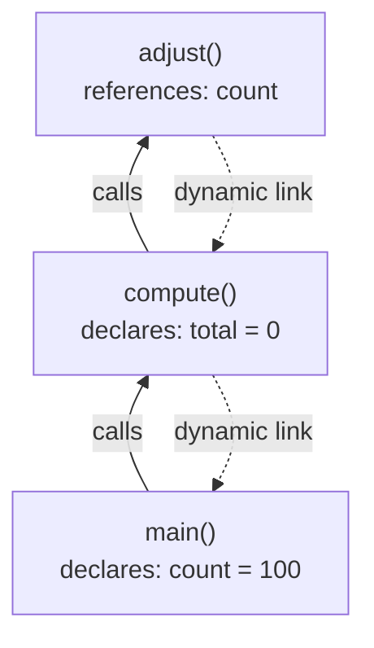
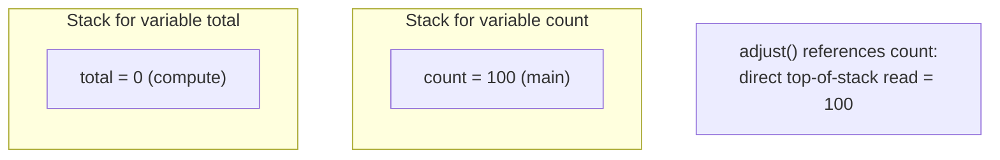

## Implementing Dynamic Scoping

### Overview of the Implementation Problem

Dynamic scoping resolves a reference to a nonlocal variable by searching the chain of subprograms that are *currently active* at run time, in reverse order of activation — that is, by looking at who called whom, rather than how the code is lexically nested. This means the same line of source code can resolve a given identifier to different storage locations on different executions, depending entirely on the call sequence that led to it. Implementing this requires run-time mechanisms fundamentally different from those used for static scoping, since no fixed, compile-time-determined path to a variable's declaration can exist. The two principal implementation techniques are **deep access** and **shallow access**.

### Deep Access Implementation

Deep access implements dynamic scoping by giving each activation record a **dynamic link** — a pointer to the activation record of the subprogram that made the call, established at call time and distinct from the static link used in static-scoping implementations.

**Mechanism**

1. When a subprogram is called, its activation record is pushed onto the run-time stack, and its dynamic link is set to point to the activation record of the caller (the record currently on top of the stack before the push).
2. To resolve a reference to a nonlocal variable, the search begins in the current activation record.
3. If the variable is not declared there, the search follows the dynamic link to the caller's activation record.
4. This continues, following dynamic links up the chain of callers, until an activation record containing a declaration of the variable is found, or the chain is exhausted (a run-time error, typically "undeclared variable").

In this sequence, `adjust` references `count`. Deep access searches `adjust`'s own record (not found), follows the dynamic link to `compute` (not found — `compute` only declares `total`), then follows the dynamic link to `main`, where `count` is found.

**Key Points**

- Setting the dynamic link costs no extra work beyond what call/return already requires, since a pointer back to the caller is needed for control transfer regardless of scoping rule.
- The cost is shifted entirely to variable *reference*: every nonlocal access potentially requires traversing multiple activation records, and this cost grows with call-chain depth.
- Because a subprogram may be called from many different places, the number of records searched — and therefore the cost of resolving a given reference — is not fixed and can vary from call to call. [Inference — actual performance impact depends on program-specific call patterns and depth.]

### Shallow Access Implementation

Shallow access reorganizes storage around variable *names* rather than around subprograms, trading cheaper references for more expensive calls and returns.

**Mechanism**

1. A separate stack (or equivalent structure) is maintained for each distinct variable name that appears in the program — sometimes implemented as a single global table with one stack-like entry list per name.
2. When a subprogram that declares a local variable `v` is called, a new cell for `v` is pushed onto `v`'s stack, holding the newly created local instance.
3. Any reference to `v`, anywhere in the currently executing code, accesses the top of `v`'s stack directly, with no traversal required.
4. When the subprogram returns, `v`'s cell is popped from `v`'s stack, re-exposing whatever binding of `v` was active before the call (if any).

**Key Points**

- Reference resolution is a constant-time operation: read the top element of the named stack, with no chain search.
- Every subprogram call must push an entry for each local variable it declares (even if that variable is never referenced nonlocally elsewhere), and every return must pop those same entries — increasing the fixed cost of call and return.
- A mechanism is needed to detect references to variables that have no active binding at all (an undeclared-variable error), typically by checking whether the corresponding stack is empty.
- Shallow access is well suited to language implementations — often interpreters — where variable references are frequent relative to calls, since it optimizes the more common operation. [Inference — the relative frequency of references versus calls is program-dependent.]

### Deep vs. Shallow Access — Comparison

| Aspect | Deep Access | Shallow Access |
| --- | --- | --- |
| Underlying structure | Activation records linked by dynamic links | One stack per variable name |
| Cost of a nonlocal reference | Proportional to chain search distance | Constant time |
| Cost of call/return | Minimal (link setup only) | Proportional to number of declared locals |
| Undeclared-variable detection | Chain exhausted without a match | Corresponding name-stack is empty |
| Favorable when | References to nonlocals are infrequent | References to nonlocals are frequent |

### Central Reference Table — A Variant of Shallow Access

Some implementations realize shallow access through a **central reference table**: a single table with one entry per distinct variable name, where each entry acts as a stack of bindings. This differs from maintaining physically separate stacks in that all variables share one table structure, simplifying storage management while preserving the same constant-time-reference property. Entries are pushed and popped in exactly the manner described for shallow access, keyed by name rather than by declaring subprogram. [Inference — implementation is described in language-design literature as a common realization of shallow access, though exact internal representation varies by system.]

### Run-Time Cost Tradeoffs

The choice between deep and shallow access is a tradeoff between two operations that occur at very different frequencies depending on program structure:

- Programs with **deep call chains and few nonlocal references** tend to favor deep access, since chain traversal is rare and call overhead stays low.
- Programs with **frequent nonlocal variable access relative to the number of calls** tend to favor shallow access, since the cost of chain traversal under deep access would be paid repeatedly.

No implementation is universally cheaper; the tradeoff depends on the ratio of variable references to subprogram calls in a given program's execution profile. [Inference — this is a general characterization from language implementation literature, not a guarantee for any specific program.]

### Interaction with Type Checking

Because dynamic scoping determines a variable's binding — and hence its type — only at run time, static type checking of nonlocal references is fundamentally limited under either implementation strategy. Neither deep access nor shallow access changes this: both are run-time mechanisms operating after the compiler has already had to give up on statically determining which declaration a nonlocal reference binds to. This is frequently cited as a central disadvantage of dynamic scoping relative to static scoping, independent of which access implementation is chosen.

### Blocks and Dynamic Scoping Interaction

When a language with dynamic scoping also supports blocks with local declarations, block entry and exit are treated identically to subprogram call and return for scoping purposes: entering a block pushes new bindings (a new activation-record segment under deep access, or new top-of-stack cells under shallow access), and exiting the block pops them. The dynamic chain or name stacks are updated at block granularity, not just at subprogram granularity.

**Related Topics**

- Blocks and dynamic scoping implementation
- Static chains and displays for static scoping
- Activation record layout and stack management
- Referencing environments and the scope of a declaration
- Perl's `local` versus `my` as a real-world dynamic/static scoping contrast
- Symbol table design for scoped languages