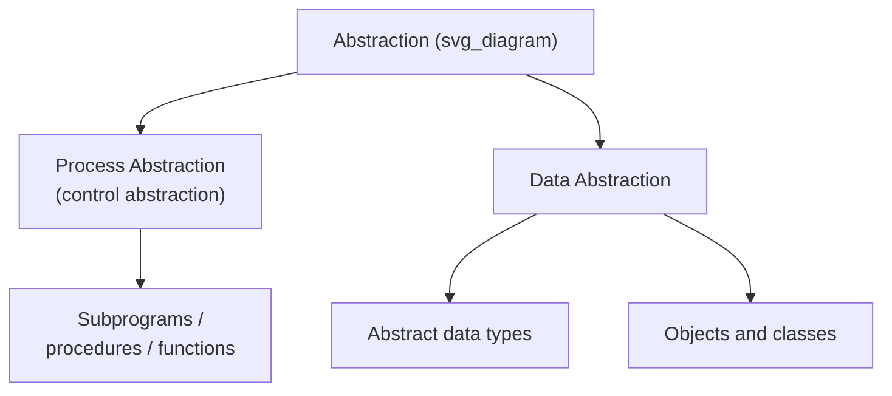
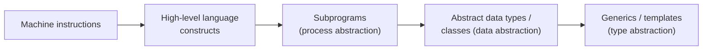

## The Concept of Abstraction

### Definition

Abstraction, in the context of programming languages, is the process of separating the essential properties and behavior of an entity from the details of how that entity is implemented. It allows a programmer to work with a simplified conceptual model — what something does — without needing to consider, or even know, how it does it. Abstraction is widely regarded as one of the central organizing principles of software design and programming language design, since it is the primary tool for managing complexity in large systems. [Inference — the centrality of abstraction to language design is a widely shared view in the programming language literature, not a formally provable claim.]

### Why Abstraction Matters

As programs grow, the number of details a programmer must track grows with them: memory layout, control flow, low-level operations, and the interactions among many program components. Abstraction manages this growth by allowing a programmer to interact with a component through a simplified interface, while the complexity of its internal workings is hidden and handled separately. This division of concerns supports:

- **Reduced cognitive load** — a programmer using an abstraction needs to understand only its interface, not its implementation.
- **Independent development and modification** — the internal implementation of an abstraction can change without requiring changes to code that uses it, provided the interface stays the same.
- **Reusability** — a well-designed abstraction can be applied in many different contexts without rewriting its internal logic.
- **Error isolation** — bugs in an abstraction's implementation can often be fixed in one place rather than everywhere the abstraction is used.

### Two Principal Forms of Abstraction

Programming language literature generally distinguishes two major categories of abstraction, corresponding to the two major kinds of entities a language manipulates: actions and data.



### Process Abstraction

Process abstraction (also called control abstraction) is the abstraction of a sequence of operations. The subprogram is the fundamental unit of process abstraction: a set of statements is given a name, and that name — along with a parameter interface — is used elsewhere in the program in place of writing out the statements themselves each time.



```
function distance(x1, y1, x2, y2)
    return sqrt((x2 - x1)^2 + (y2 - y1)^2)
end
```

A caller invoking `distance(0, 0, 3, 4)` does not need to know that the implementation uses a square root computation, or how that square root is computed; the caller needs only to know the interface — name, parameters, and return value — and the guarantee of what the function computes. This substitution of a name and interface for a sequence of operations is the essence of process abstraction.

**Key Points**

- Process abstraction is what makes subprograms useful as reusable units, since a subprogram can be invoked many times from many places without re-examining its internals at each call site.
- It is the historical starting point of abstraction in programming languages, predating widespread data abstraction support.
- Control structures — loops, conditionals — are sometimes described as lower-level abstractions of control flow, abstracting over sequences of jump/branch instructions.

### Data Abstraction

Data abstraction is the abstraction of a data structure and the set of operations that are valid on it, bundled together such that the data can only be manipulated through its defined operations, and its internal representation is hidden from code outside the abstraction.

An **abstract data type (ADT)** is the language-level construct that realizes data abstraction: it defines a type along with the complete set of operations permitted on values of that type, and it conceals the underlying representation from the rest of the program.



```
type Stack
    operations: push(item), pop(), top(), isEmpty()
    -- internal representation (array, linked list, etc.)
    -- is hidden from code that uses Stack
end
```

Code that uses a `Stack` interacts with it only through `push`, `pop`, `top`, and `isEmpty`; whether the stack is implemented internally as an array or a linked list is irrelevant to, and inaccessible from, the calling code.

**Key Points**

- Data abstraction enforces **encapsulation** — the internal representation is not just conventionally hidden but is language-enforced as inaccessible from outside the defining unit.
- Languages implement data abstraction through constructs such as packages (Ada), classes (C++, Java, C#), modules (Modula-2, ML), and structs with associated functions (in disciplined use, though C's `struct` alone does not enforce encapsulation).
- Object-oriented programming extends data abstraction with **inheritance** (deriving new abstractions from existing ones) and **polymorphism** (allowing a single interface to operate over multiple underlying types), building on the base concept of the abstract data type. [Inference — the characterization of OOP as an extension of data abstraction, rather than a wholly separate paradigm, reflects a common framing in language-design textbooks.]

### Abstraction Compared to Related Concepts

Abstraction is frequently discussed alongside, and sometimes conflated with, several related but distinct concepts:

| Concept | Relationship to Abstraction |
| --- | --- |
| Encapsulation | The mechanism (often language-enforced) that hides implementation details, supporting abstraction by preventing access to what should be abstracted away |
| Information hiding | A design principle closely related to encapsulation, focused on concealing design decisions likely to change |
| Modularity | The organization of a program into separate, largely independent units — abstraction is a tool used to design the interfaces between modules |
| Generalization/specialization | Relationships (as in inheritance hierarchies) that build on abstract types but describe how abstractions relate to one another, not the act of abstracting itself |

### Levels of Abstraction in Language Design

Abstraction operates at multiple levels within a language and its use:

- **Machine-level abstraction** — high-level language constructs (variables, expressions, control structures) abstract away the details of machine instructions, registers, and memory addresses.
- **Procedural abstraction** — subprograms abstract away sequences of operations, as described above.
- **Data abstraction** — abstract data types abstract away data representation, as described above.
- **Type abstraction / generic programming** — generics and templates abstract over the specific type a piece of code operates on, allowing one definition to apply across many types.



Each level is built on, and hides the complexity of, the level below it — a progression frequently used to illustrate how programming languages have evolved historically toward higher levels of abstraction. [Inference — presenting this as a strict historical progression is a simplification; not all languages or paradigms adopted these levels in this order.]

### Abstraction and Language Design Tradeoffs

Support for strong abstraction mechanisms is not without cost, and language designers weigh several tradeoffs:

- **Runtime overhead** — enforcing encapsulation and dynamic dispatch (in object-oriented abstraction) can introduce indirection costs relative to direct, unabstracted code. [Inference — the magnitude of such overhead is implementation- and workload-dependent.]
- **Learning curve** — richer abstraction mechanisms (generics, higher-kinded types, complex object systems) generally increase the conceptual burden on programmers learning the language.
- **Flexibility versus safety** — strict enforcement of abstraction boundaries improves safety and maintainability but can reduce flexibility in cases where direct access to implementation details is genuinely needed (e.g., performance-critical low-level code).

**Related Topics**

- Abstract data types and encapsulation mechanisms
- Object-oriented programming: inheritance and polymorphism
- Modularity and information hiding
- Generic programming and parametric polymorphism
- Subprograms as units of process abstraction
- Language support for information hiding (Ada packages, Java access modifiers, C++ access specifiers)