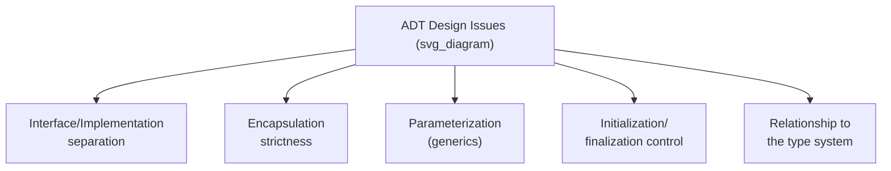

## Design Issues for Abstract Data Types

### Overview

Designing language support for abstract data types (ADTs) requires resolving several distinct questions about what a language construct should provide, how strictly it should enforce boundaries, and how much control the programmer retains over the type's lifecycle. These design issues recur across languages that support ADTs — Ada packages, C++/Java/C# classes, Modula-2 modules — with each language resolving them differently. The major design issues are: the presence of an explicit interface separate from implementation, the strictness of encapsulation, parameterization (generic ADTs), initialization/finalization control, and the relationship between the ADT and the broader type system.



### Interface and Implementation Separation

A core design issue is whether the language requires — or even permits — a syntactic separation between an ADT's public interface (the operations it exposes) and its private implementation (the representation and internal logic).

- **Explicit two-part separation.** Ada packages use a `package specification` (the interface) and a `package body` (the implementation), which can be compiled and even distributed separately. This makes the interface a distinct, independently examinable artifact.
- **Single-construct declaration.** C++ and Java classes combine interface and implementation within a single class declaration, using access modifiers (`public`, `private`, `protected`) to mark which members belong to the interface and which are implementation detail, rather than physically separating them into different files or sections (though C++ conventionally splits declarations into header files and definitions into source files, this is a convention, not a language-enforced structural separation).

**Key Points**

- Explicit separation (as in Ada) makes the contract of an ADT easier to review in isolation, since the interface file contains no implementation noise.
- Combined declaration (as in C++/Java) reduces the number of artifacts a programmer must maintain but requires access modifiers to communicate the interface/implementation boundary within a single unit.

### Encapsulation Strictness

A central design issue is how strictly the language enforces that client code cannot access an ADT's internal representation directly, bypassing its defined operations.

- **Strong enforcement.** Languages such as Ada, Java, and C# enforce access restrictions at compile time (and, in some cases, additionally at run time via reflection controls), making it a language-level error to access a private member from outside the defining unit.
- **Convention-based or partially enforced.** C's `struct` provides no encapsulation at all — any code with access to the struct's definition can access its fields directly. C++ enforces access modifiers at compile time but permits explicit workarounds (e.g., `friend` declarations, pointer casting) that can defeat encapsulation when a programmer deliberately chooses to.
- **Module-level encapsulation.** Modula-2 and similar module systems hide implementation details at the level of the module (translation unit) rather than at the level of an individual type, meaning encapsulation boundaries follow file/module structure rather than type structure. [Inference — module-based encapsulation systems vary in exact scoping rules across specific languages.]

**Key Points**

- Stricter enforcement improves the maintainability guarantee that internal representation changes cannot break unrelated client code, since no legal client code could have depended on the representation in the first place.
- Escape hatches (such as C++'s `friend`) represent a deliberate design tradeoff: they weaken the enforcement guarantee in exchange for flexibility in specific, programmer-controlled cases.

### Parameterization: Generic Abstract Data Types

A recurring design issue is whether an ADT definition can be parameterized over a type, so that a single ADT definition (e.g., a stack) can be instantiated to hold elements of different types (e.g., a stack of integers, a stack of strings) without rewriting the ADT for each element type.



```
generic
    type Element_Type is private;
package Stack_Package is
    procedure Push(item : Element_Type);
    function Pop return Element_Type;
end Stack_Package;
```

- **Generics/templates** (Ada generics, C++ templates, Java/C# generics) provide compile-time parameterization, where the compiler generates or type-checks a version of the ADT for each concrete type used.
- **Dynamically typed containers**, common in languages such as Python or JavaScript, avoid this design issue altogether by allowing any type to be stored without a separate parameterization mechanism, at the cost of losing compile-time type checking of the contained elements.

**Key Points**

- Generic parameterization allows reuse of a single ADT implementation across many element types while preserving compile-time type safety for each instantiation.
- The design of the generic mechanism itself raises further sub-issues: whether constraints can be placed on the parameter type (e.g., requiring it to support comparison operations), and how instantiation is triggered (explicit instantiation versus implicit, as in C++ template argument deduction). [Inference — the specific constraint mechanisms and instantiation rules are language-specific and not uniform across generic systems.]

### Initialization and Finalization Control

Because an ADT hides its representation, client code cannot directly set up or tear down that representation — the ADT itself must provide mechanisms to do so. Design questions here include whether initialization is mandatory or optional, and whether finalization (cleanup) is automatic or must be explicitly invoked.

- **Constructors and destructors.** C++ and Java (via constructors, and finalizers/`try-with-resources` in Java's case) allow an ADT to define code that runs automatically at object creation and, in C++, at object destruction.
- **Explicit initialization procedures.** Some languages (and some ADT designs even in languages with constructors) rely on explicitly called initialization operations rather than automatic invocation, placing the responsibility on the client to call them correctly.
- **Automatic memory-managed cleanup.** In garbage-collected languages (Java, C#), deterministic finalization at the moment of resource release is not guaranteed, which raises additional design considerations for ADTs that manage external resources (files, network handles) rather than pure memory. [Inference — the exact guarantees around finalizer timing are documented per-language and vary between garbage collector implementations.]

**Key Points**

- Automatic constructor/destructor mechanisms reduce the chance of a client forgetting to initialize or clean up an ADT instance correctly.
- Languages without deterministic destruction (most garbage-collected languages) generally require a separate explicit-cleanup convention (such as an explicit `close` or `dispose` operation) for ADTs managing non-memory resources.

### Relationship to the Type System

A further design issue is how an ADT relates to the language's broader type system — specifically, whether an ADT defines a genuinely new, distinct type (with its own type-checking rules) or is merely a naming/organizational convenience over existing types.

- **True new types.** In strongly typed languages, an ADT typically introduces a new type name that is distinct from its underlying representation type, so that even if a `Stack` is represented internally using an array, a `Stack` value and a raw array value are not interchangeable without going through the ADT's operations.
- **Type equivalence considerations.** This raises the general type-equivalence question (see also structural vs. name equivalence) in the specific context of ADTs: languages must decide whether two ADT instantiations (e.g., two different generic instantiations of the same stack template) are considered the same type or different types.

**Key Points**

- Treating an ADT as a genuinely distinct type is what allows the compiler to prevent client code from bypassing the ADT's operations by manipulating the underlying representation type directly.
- This design issue connects ADT design directly to a language's broader rules for type equivalence and type checking, rather than being fully independent of them.

### Summary Comparison Across Languages

| Design Issue | Ada | C++ | Java |
| --- | --- | --- | --- |
| Interface/implementation separation | Explicit (spec vs. body) | Convention (header vs. source) | Combined in class body |
| Encapsulation enforcement | Compile-time, strict | Compile-time, with `friend` escape hatch | Compile-time, strict |
| Parameterization | Generics | Templates | Generics (type-erased at run time) |
| Initialization | Explicit or via generic instantiation | Constructors | Constructors |
| Finalization | Programmer-managed | Destructors (deterministic) | Garbage collector (non-deterministic) plus `try-with-resources` |

**Related Topics**

- Abstract data types and encapsulation mechanisms
- Generic programming and parametric polymorphism
- Type equivalence: name versus structural
- Object-oriented extensions of ADTs: inheritance and dynamic binding
- Resource management patterns (RAII, try-with-resources, explicit dispose)
- Information hiding and module design