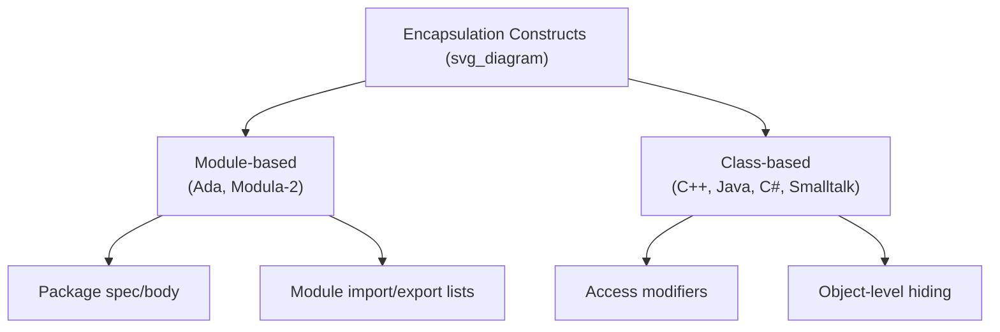

## Language Examples of Encapsulation Constructs

### Overview

Encapsulation constructs are the concrete language features that implement data abstraction's requirement of hiding an entity's internal representation while exposing a controlled interface. Different language families have adopted structurally distinct mechanisms — record-based hiding, module systems, class-based access modifiers, and namespace/package systems — each reflecting different design priorities around granularity, enforcement strictness, and integration with the rest of the type system. This survey covers the major constructs across representative languages: Ada packages, Modula-2 modules, C++ classes, Java classes and packages, C# classes, and Smalltalk objects.



### Ada Packages

Ada's `package` construct is a module-based encapsulation mechanism with an explicit two-part structure: a **package specification** declaring the public interface, and a **package body** containing the hidden implementation.

```ada
package Stack_Pkg is
    procedure Push(item : Integer);
    function Pop return Integer;
private
    -- private part: visible in spec file but not to clients
    Max_Size : constant Integer := 100;
end Stack_Pkg;

package body Stack_Pkg is
    Storage : array(1..Max_Size) of Integer;
    Top : Integer := 0;

    procedure Push(item : Integer) is
    begin
        Top := Top + 1;
        Storage(Top) := item;
    end Push;

    function Pop return Integer is
    begin
        Top := Top - 1;
        return Storage(Top + 1);
    end Pop;
end Stack_Pkg;
```

**Key Points**

- The `private` part of the specification allows declarations (such as constants needed for a type's definition) to be textually present in the spec — because Ada requires full type declarations to be visible to the compiler for size/layout purposes — while still being inaccessible to client code by language rule.
- The package body can be compiled separately from the specification, allowing implementation changes without recompiling client code that depends only on the specification.
- Ada packages can define an ADT directly (a `private type`) so that client code can declare variables of the type without knowing its representation.

### Modula-2 Modules

Modula-2's `MODULE` construct, one of the earliest widely used module-based encapsulation mechanisms, uses explicit `EXPORT` and `IMPORT` lists to control visibility between modules. [Confirmed]



```
DEFINITION MODULE StackModule;
    EXPORT QUALIFIED Push, Pop, StackType;
    TYPE StackType;
    PROCEDURE Push(VAR s: StackType; item: INTEGER);
    PROCEDURE Pop(VAR s: StackType): INTEGER;
END StackModule.

IMPLEMENTATION MODULE StackModule;
    TYPE StackType = RECORD
        storage: ARRAY[1..100] OF INTEGER;
        top: INTEGER;
    END;
    PROCEDURE Push(VAR s: StackType; item: INTEGER);
    BEGIN
        s.top := s.top + 1;
        s.storage[s.top] := item;
    END Push;
    (* Pop similarly defined *)
END StackModule.
```

**Key Points**

- The separation into `DEFINITION MODULE` (interface) and `IMPLEMENTATION MODULE` (implementation) closely parallels Ada's package specification/body split, and the two languages are frequently compared for this shared design choice. [Inference — this comparison is a common observation in language-design textbooks discussing the historical development of module systems.]
- Encapsulation in Modula-2 operates at the granularity of the module, meaning multiple related types and operations within one module share the same encapsulation boundary rather than each type being independently encapsulated.

### C++ Classes

C++ uses the `class` construct with three access-level keywords — `public`, `private`, and `protected` — to mark the visibility of members within a single, combined interface/implementation declaration.

```cpp
class Stack {
public:
    void push(int item);
    int pop();
private:
    int storage[100];
    int top = 0;
};

void Stack::push(int item) {
    storage[top++] = item;
}

int Stack::pop() {
    return storage[--top];
}
```

**Key Points**

- `private` members are accessible only within the class's own member functions (and, if declared, its `friend` functions/classes); `protected` members are additionally accessible to derived classes; `public` members form the class's interface.
- The `friend` mechanism allows a class to explicitly grant access to specific external functions or classes, providing a deliberate, opt-in escape hatch from strict encapsulation.
- C++ enforces access restrictions at compile time only; nothing prevents access via explicit pointer manipulation or casting if a programmer chooses to circumvent the type system, meaning encapsulation in C++ is a compile-time discipline rather than a run-time guarantee. [Inference — the degree to which this constitutes a meaningful weakness depends on the programming context and is a matter of ongoing discussion in the C++ community.]

### Java Classes and Packages

Java encapsulates at two levels simultaneously: the **class** level, using access modifiers on individual members, and the **package** level, using an implicit default (package-private) access modifier plus the `public` keyword to control cross-package visibility.

```java
public class Stack {
    private int[] storage = new int[100];
    private int top = 0;

    public void push(int item) {
        storage[top++] = item;
    }

    public int pop() {
        return storage[--top];
    }
}
```

**Key Points**

- Java's access modifiers — `private`, package-private (no modifier), `protected`, and `public` — form a strictly ordered visibility hierarchy, each level a superset of the more restrictive one.
- Unlike C++, Java provides no `friend`-equivalent escape hatch; access restrictions are enforced by the compiler and the Java Virtual Machine without a built-in bypass mechanism (reflection can circumvent access control, but this is a separate, explicitly invoked API rather than a language-level encapsulation feature).
- Package-level access (the default, no-modifier case) allows related classes within the same package to cooperate closely while still hiding implementation from unrelated code outside the package — a level of granularity that C++ and Ada do not directly replicate in the same form.

### C# Classes

C# closely follows Java's class-based access-modifier model but adds finer-grained options, including `internal` (visible within the same assembly) and `protected internal`.

```csharp
public class Stack {
    private int[] storage = new int[100];
    private int top = 0;

    public void Push(int item) {
        storage[top++] = item;
    }

    public int Pop() {
        return storage[--top];
    }
}
```

**Key Points**

- The `internal` modifier gives C# an assembly-level granularity of encapsulation in addition to class-level and namespace-level visibility, a distinction not present in Java's package-based model.
- C# also supports **properties** (`get`/`set` accessors) as a language-level construct for controlled field access, allowing an ADT to expose what appears syntactically like direct field access to client code while actually routing through methods — a convenience layered on top of, rather than a replacement for, standard encapsulation.

### Smalltalk Objects

Smalltalk, one of the earliest object-oriented languages, encapsulates at the level of the individual object: instance variables are always private to the object and accessible only through methods, with no equivalent of C++'s `public` data members. [Confirmed]

**Key Points**

- All communication with a Smalltalk object occurs through message sends (method calls); there is no syntactic mechanism for external code to read or write an object's instance variables directly, making encapsulation effectively total at the instance-variable level. [Inference — described as the general Smalltalk model in language-design literature; specific dialect implementations may offer debugging/introspection facilities that are separate from the language's normal execution semantics.]
- This uniform total encapsulation is frequently cited as an influence on later object-oriented languages' access-modifier designs, even though most later languages (C++, Java) chose to make encapsulation optional/configurable per member rather than absolute. [Inference — historical influence is a commonly stated view in language-history discussions rather than a directly verifiable causal claim.]

### Comparative Summary

| Language | Primary Construct | Granularity | Notable Feature |
| --- | --- | --- | --- |
| Ada | Package (spec + body) | Module/package | Private part within visible spec |
| Modula-2 | Module (definition + implementation) | Module | Explicit `EXPORT`/`IMPORT` lists |
| C++ | Class | Class member | `friend` escape hatch |
| Java | Class + package | Member and package | No bypass mechanism; package-private default |
| C# | Class + assembly | Member, namespace, and assembly | `internal` modifier; properties |
| Smalltalk | Object | Instance variable (total) | No direct external field access at all |

**Related Topics**

- Design issues for abstract data types
- Information hiding as a design principle
- Object-oriented inheritance and access control interactions (`protected` semantics)
- Namespace and module systems across languages
- Reflection and its relationship to encapsulation guarantees
- Property/accessor patterns versus direct field access