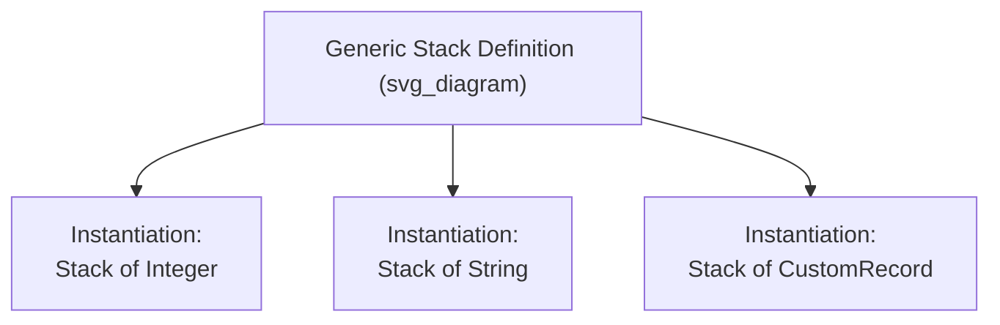

## Parameterized Abstract Data Types

### Definition and Motivation

A parameterized abstract data type is an ADT definition that takes one or more types (or, in some languages, values) as parameters, allowing a single definition to be instantiated for multiple concrete types without rewriting the ADT's logic for each one. The motivating problem is that, without parameterization, defining a type-safe stack of integers and a type-safe stack of strings would require two nearly identical, separately written and separately maintained definitions, differing only in the element type. Parameterized ADTs (also called **generic ADTs**) solve this by separating the algorithmic structure of the ADT from the specific type it operates on.



### The Core Mechanism: Type Parameters

A parameterized ADT declares one or more **type parameters** in its definition — placeholders standing for a type to be supplied later, at instantiation. The compiler (or, in some implementations, the run-time system) uses the supplied actual type to produce a concrete, type-checked version of the ADT.

```java
public class Stack<T> {
    private List<T> storage = new ArrayList<>();

    public void push(T item) {
        storage.add(item);
    }

    public T pop() {
        return storage.remove(storage.size() - 1);
    }
}

Stack<Integer> intStack = new Stack<>();
Stack<String> strStack = new Stack<>();
```

Here `T` is the type parameter. `Stack<Integer>` and `Stack<String>` are both instantiations of the same generic definition, each type-checked as though `T` had been replaced by the corresponding concrete type throughout.

### Implementation Approaches: Compile-Time Expansion

**Template-style expansion**, used by C++ templates, generates a distinct compiled version of the ADT's code for each type it is instantiated with. The compiler substitutes the actual type for the type parameter and compiles the resulting code as if it had been written directly for that type.

```cpp
template <typename T>
class Stack {
public:
    void push(T item) { storage[top++] = item; }
    T pop() { return storage[--top]; }
private:
    T storage[100];
    int top = 0;
};

Stack<int> intStack;
Stack<std::string> strStack;
```

**Key Points**

- Because a fully separate version of the code is generated for each instantiated type, no run-time type information needs to be retained, and operations on the parameter type can be compiled directly and efficiently — for example, `T storage[100]` allocates an array of the actual element type, not a generic reference type.
- This approach can increase compiled code size, since each distinct instantiation produces its own copy of the generated code — a phenomenon sometimes called **template bloat**. [Inference — the extent of code-size growth depends on the number of distinct instantiations in a given program and is implementation- and compiler-dependent.]
- C++ templates additionally support non-type parameters (e.g., a fixed array size as a compile-time constant), extending parameterization beyond just types.

### Implementation Approaches: Type Erasure

**Type erasure**, used by Java generics, takes a different approach: the compiler performs compile-time type checking of generic code but compiles a single version of the ADT's bytecode, with type parameters effectively replaced by their upper bound (`Object` if unbounded) at the bytecode level. Type information about the specific instantiation is discarded ("erased") after compilation, and the compiler inserts casts as needed at usage sites.

**Key Points**

- Only one compiled version of the generic class exists at run time, avoiding the code-size growth associated with template-style expansion.
- Because type information about the specific instantiation does not exist at run time, certain operations become restricted or impossible — for instance, creating an array of a generic type parameter, or using `instanceof` against a specific parameterized type, are disallowed or restricted in Java's generic system. [Confirmed — these are documented restrictions of Java's erasure-based generics.]
- Primitive types cannot directly instantiate a type parameter in Java's erasure model, since the erased representation relies on reference types; this is why Java provides wrapper classes (`Integer`, `Double`) for use with generics. [Confirmed]

### Implementation Approaches: Generic Instantiation with Constraints (Ada)

Ada's generic packages allow parameterization not only by type but by explicit constraints on what operations or properties the actual type must support, checked at instantiation time.

```ada
generic
    type Element_Type is private;
    with function "<"(Left, Right : Element_Type) return Boolean;
package Sorted_Stack_Pkg is
    procedure Push(item : Element_Type);
    function Pop return Element_Type;
end Sorted_Stack_Pkg;

package Int_Sorted_Stack is new Sorted_Stack_Pkg(Integer, "<");
```

**Key Points**

- The `with function` clause allows a generic package to require that the actual type provide a specific operation (here, a `<` comparison), which the compiler checks is satisfiable at the point of instantiation.
- Ada's `generic` mechanism, like C++ templates, produces a distinct instantiated package for each set of actual parameters supplied, following a compile-time-expansion model rather than type erasure.
- This constraint mechanism allows generic ADTs to depend on specific properties of their element type (such as being comparable or having a default value) in a way that is checked before instantiation succeeds, rather than failing at first use.

### Design Issues Specific to Parameterized ADTs

Several design questions arise specifically from parameterization, beyond the general ADT design issues:

- **Constraint expressiveness.** How rich a set of requirements can be placed on a type parameter (e.g., "must support equality," "must support ordering," "must have a specific method")? Ada's generic formal parameters, C++20 concepts, and Java's bounded type parameters (`<T extends Comparable<T>>`) each represent different points on this spectrum.
- **Multiple type parameters.** Whether an ADT can be parameterized over more than one type simultaneously — for example, a generic `Map<K, V>` parameterized by both a key type and a value type.
- **Instantiation syntax and timing.** Whether instantiation is explicit (Ada's `new` instantiation, C++'s explicit `Stack<int>`) or can be inferred implicitly from context (C++ template argument deduction, Java's diamond operator `<>`).
- **Variance.** Whether a parameterized type instantiated with a subtype can be used where the same parameterized type instantiated with a supertype is expected (covariance/contravariance) — a design issue that interacts with the language's broader type-compatibility rules. [Inference — variance rules differ significantly across languages and are frequently a source of subtlety even within a single language's generic system.]

### Comparison of Approaches

| Aspect | C++ Templates | Java Generics (Erasure) | Ada Generics |
| --- | --- | --- | --- |
| Compilation model | Expansion (per-instantiation code) | Erasure (single compiled version) | Expansion (per-instantiation package) |
| Run-time type information | Not needed | Erased; limited availability | Not needed |
| Constraint mechanism | Concepts (C++20) / implicit usage requirements | Bounded type parameters | Explicit generic formal parameters (`with function`, etc.) |
| Primitive type support | Full (no boxing needed) | Requires wrapper classes | Full |
| Code size impact | Potential growth per instantiation | Minimal (single version) | Potential growth per instantiation |

### Practical Example: A Fully Worked Generic ADT

```cpp
template <typename T, int MaxSize>
class BoundedStack {
private:
    T storage[MaxSize];
    int top = 0;
public:
    void push(T item) {
        if (top < MaxSize) storage[top++] = item;
    }
    T pop() {
        return storage[--top];
    }
    bool isEmpty() const { return top == 0; }
};

BoundedStack<double, 50> measurements;
BoundedStack<char, 256> buffer;
```

This example illustrates a template parameterized over both a type (`T`) and a non-type value (`MaxSize`), producing two independently type-checked, independently sized stack instantiations from a single definition.

**Related Topics**

- Design issues for abstract data types
- Generic programming and parametric polymorphism
- Type erasure versus reified generics
- Bounded polymorphism and constraint systems (C++ concepts, Java bounds)
- Variance in generic type systems
- Language examples of encapsulation constructs