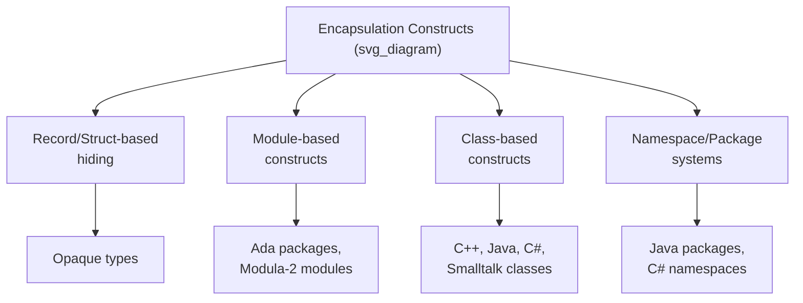
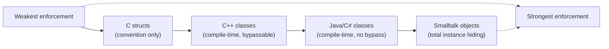

## Encapsulation Constructs

### Definition and Purpose

An encapsulation construct is a language-level mechanism that bundles data together with the operations that act on it, while restricting access to that data from outside the bundle except through those operations. Encapsulation is the enforcement mechanism that makes data abstraction possible: without a language construct capable of hiding representation details, an abstract data type's "hidden" implementation would be hidden only by convention, not by any guarantee the compiler or run-time system enforces. This topic surveys the general categories of encapsulation constructs, the design dimensions along which they differ, and representative mechanisms across language families.



### Categories of Encapsulation Constructs

**Record/struct-based hiding** is the most primitive form: a language allows a type's internal fields to be declared in one place while restricting client code to accessing an **opaque handle** or **opaque type** — a type whose internal structure is deliberately not exposed in headers or interfaces visible to client code. This approach is common in C-based systems programming, where a struct's full definition is placed only in an implementation file, and client code receives only a pointer or forward-declared incomplete type.

```c
/* stack.h — public interface */
typedef struct Stack Stack;  /* opaque type: internals not shown */
Stack* stack_create(void);
void stack_push(Stack* s, int item);
int stack_pop(Stack* s);

/* stack.c — hidden implementation */
struct Stack {
    int storage[100];
    int top;
};
```

**Module-based constructs** encapsulate at the level of a compilation or logical unit rather than an individual type, using explicit interface/implementation separation (Ada packages, Modula-2 modules), as covered in the language-specific survey of encapsulation mechanisms.

**Class-based constructs** encapsulate at the level of an individual type definition, using access modifiers or, in Smalltalk's case, total instance-variable privacy, as covered in the same survey.

**Namespace/package systems** provide a coarser-grained encapsulation boundary above individual types or modules, controlling visibility between larger groups of related code (Java packages, C# namespaces, C++ namespaces) — though namespaces alone typically organize naming and visibility rather than enforcing representation hiding on their own.

### Design Dimensions

Encapsulation constructs across languages differ along several recurring dimensions:

- **Granularity** — the unit at which hiding is enforced: per-instance-variable (Smalltalk), per-class-member (C++, Java, C#), per-module (Ada, Modula-2), or per-namespace/package (in combination with the above).
- **Enforcement strength** — whether the restriction is a compile-time-only discipline that can be circumvented (C++ casting, C opaque-type violations via unsafe pointer manipulation) or effectively unbypassable within the normal language semantics (Java, Smalltalk).
- **Escape hatches** — whether the language provides an explicit, opt-in mechanism to grant access across the encapsulation boundary (C++'s `friend`) or provides none (Java has no direct language-level equivalent).
- **Interface separation** — whether the public interface is a physically distinct artifact (Ada spec, Modula-2 definition module, C header) or is embedded within the same declaration as the implementation, distinguished only by keyword (C++/Java/C# access modifiers).



### Encapsulation Versus Information Hiding

Encapsulation and information hiding are related but distinct concepts frequently discussed together. **Information hiding** is the design principle that a module's internal design decisions — especially those likely to change — should not be visible to, or depended upon by, other modules. **Encapsulation** is the language mechanism that makes information hiding enforceable. A language can provide encapsulation constructs without a programmer necessarily using them to achieve good information hiding (e.g., a C++ class that makes all members `public` is encapsulated syntactically but achieves no actual information hiding), and conversely, information hiding as a design goal predates, and does not strictly require, dedicated encapsulation syntax (early designs achieved partial information hiding through naming conventions and documentation alone, without compiler enforcement). [Inference — the historical claim about pre-encapsulation information hiding practices reflects general software-engineering history rather than a single verifiable source.]

### Encapsulation and Inheritance Interaction

In object-oriented languages, encapsulation constructs interact with inheritance through an intermediate access level, typically `protected`, which exposes a member to subclasses while still hiding it from unrelated external code. This creates a three-way (at minimum) visibility spectrum — private, protected, public — rather than the simple binary hidden/visible distinction sufficient for non-inheriting ADTs. Design questions specific to this interaction include whether a subclass in a different module/package can access `protected` members (Java restricts this to same-package or subclass contexts; C++ allows subclass access regardless of location), and whether private members are inherited at all (in most languages, private members exist in a derived class's memory layout, if applicable, but remain inaccessible by name to the derived class's own code). [Inference — exact protected-access rules are language-specific implementation details documented individually per language.]

### Encapsulation in Non-Object-Oriented Contexts

Encapsulation constructs are not exclusive to object-oriented languages. Functional languages such as ML and Haskell provide module systems (ML's `structure`/`signature`, Haskell's module export lists) that hide implementation details of data types and functions without requiring classes or objects at all.

```haskell
module Stack (Stack, empty, push, pop) where
    data Stack a = Stack [a]
    empty = Stack []
    push x (Stack xs) = Stack (x:xs)
    pop (Stack (x:xs)) = (x, Stack xs)
    -- the internal list representation is not exported,
    -- so client code cannot pattern-match on it directly
```

**Key Points**

- Haskell's module export list determines encapsulation explicitly: only names listed after the module name are visible to importing code, and omitting a type's constructor from the export list hides its internal representation even though the type itself is exported.
- This demonstrates that encapsulation, as a language capability, is orthogonal to the object-oriented paradigm — it is a general mechanism for controlling visibility that object-oriented class systems happen to popularize but do not exclusively own. [Inference — this framing (encapsulation as paradigm-independent) is a standard point made in comparative language-design discussions.]

### Comparative Summary

| Construct Category | Granularity | Typical Languages | Enforcement |
| --- | --- | --- | --- |
| Opaque types (structs) | Per-type, convention-based | C | Weak / bypassable |
| Module (spec + body) | Per-module | Ada, Modula-2 | Strong, compile-time |
| Class with access modifiers | Per-member | C++, Java, C# | Strong (Java/C#); bypassable (C++) |
| Object (total hiding) | Per-instance-variable | Smalltalk | Strong, total |
| Module export lists | Per-exported-name | Haskell, ML/OCaml | Strong, compile-time |
| Namespace/package | Coarse-grained grouping | Java packages, C# namespaces, C++ namespaces | Combines with member/class-level rules |

**Related Topics**

- Design issues for abstract data types
- Language examples of encapsulation constructs
- Information hiding as a design principle
- Parameterized abstract data types
- Object-oriented inheritance and access control interactions
- Module systems in functional languages (ML, Haskell)