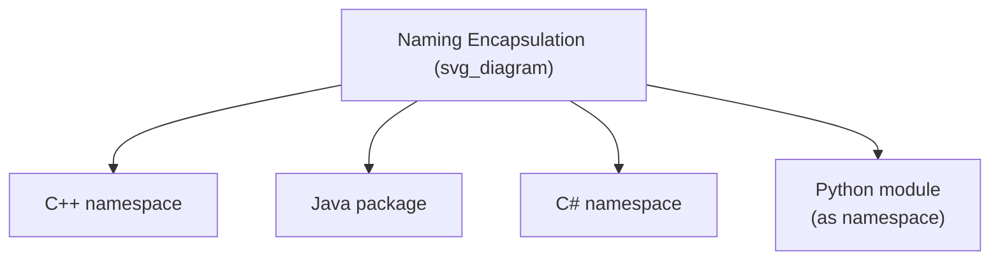
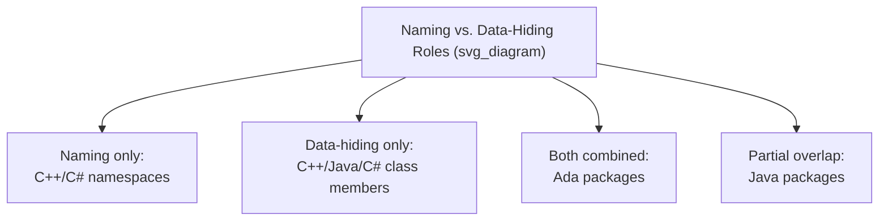

## Naming Encapsulations

### Definition

A naming encapsulation is a language construct whose primary purpose is to organize identifiers into distinct namespaces, preventing name collisions between unrelated parts of a program without necessarily hiding implementation details or bundling data with operations. Naming encapsulation is a narrower concept than the general encapsulation constructs used for abstract data types: its focus is on **scoping large collections of names** — grouping related declarations under a single umbrella identifier — rather than on restricting access to internal representation. Common realizations include namespaces (C++), packages (Java), and modules used purely for naming purposes rather than for data hiding.



### The Naming Collision Problem

As programs grow, or as independently developed libraries are combined into a single program, the likelihood that two unrelated pieces of code choose the same identifier for different purposes increases. Without a naming encapsulation mechanism, a global flat namespace forces every identifier in a program — every function, every global variable, every type — to be unique across the entire program, regardless of which logical part of the system it belongs to.

```c
/* Without namespacing: two libraries both define "init" */
void init();  /* from library A */
void init();  /* from library B — collides! */
```

Naming encapsulation resolves this by allowing the same identifier to exist in multiple, independently defined namespaces simultaneously, disambiguated by which namespace is being referenced.

### C++ Namespaces

C++ namespaces group related declarations under a named scope, using the `namespace` keyword, and require either full qualification (`Namespace::identifier`) or a `using` declaration/directive to access members without full qualification.

```cpp
namespace GraphicsLib {
    void init();
    class Renderer { /* ... */ };
}

namespace AudioLib {
    void init();
    class Renderer { /* ... */ };  /* no collision with GraphicsLib::Renderer */
}

GraphicsLib::init();
AudioLib::init();

using namespace GraphicsLib;
Renderer r;  // resolves to GraphicsLib::Renderer, now unqualified
```

**Key Points**

- C++ namespaces provide **no data hiding** on their own — every member of a namespace is as accessible as it would be without the namespace, provided the correct qualification is used; the namespace's role is purely to disambiguate names, not to restrict access to them.
- Namespaces can be **reopened**: the same namespace name can be used in multiple, separate blocks (even across different files), with all declarations accumulating into the same logical namespace — unlike a class definition, which is normally a single, closed declaration.
- `using namespace` directives import all names from a namespace into the current scope unqualified, which reintroduces collision risk if two `using`-imported namespaces happen to share a name — a design tradeoff between convenience and continued collision safety. [Inference — the practical risk level depends on how many namespaces are imported unqualified in a given translation unit.]

### Java Packages

Java packages serve a dual role: they provide naming encapsulation (preventing class-name collisions across libraries) and they interact with Java's access-modifier system to provide a package-level visibility boundary (as covered under class-based encapsulation constructs). Packages are declared with a `package` statement at the top of a source file and are conventionally named using reversed domain names to guarantee global uniqueness.

```java
package com.example.graphics;

public class Renderer {
    // ...
}
```

```java
package com.example.audio;

public class Renderer {
    // no collision — fully qualified as com.example.audio.Renderer
}
```

**Key Points**

- Java package names are conventionally structured hierarchically using dot-separated segments (`com.example.graphics`), a convention (reversed domain names) intended to ensure that independently developed packages from different organizations do not collide even without central coordination.
- Unlike C++ namespaces, Java packages are tied directly to the physical file/directory structure of the source code (a class in package `com.example.graphics` must reside in a directory path matching `com/example/graphics/`), making Java's naming encapsulation mechanism partly a build-system convention rather than a purely logical grouping. [Confirmed]
- The `import` statement allows unqualified use of a class name from another package, analogous to C++'s `using` declaration, with similar tradeoffs around potential ambiguity if two imported packages define a class with the same simple name.

### C# Namespaces

C# namespaces closely resemble C++ namespaces syntactically and Java packages in general purpose, grouping related types under a named, dot-separated hierarchy, with `using` directives providing unqualified access.

```csharp
namespace Example.Graphics {
    public class Renderer { }
}

namespace Example.Audio {
    public class Renderer { }  // no collision
}

using Example.Graphics;
Renderer r = new Renderer();  // resolves to Example.Graphics.Renderer
```

**Key Points**

- Unlike Java, C# namespaces are not required to correspond to the physical directory structure of source files, making C#'s naming encapsulation a purely logical construct, independent of file organization by language rule (though most build tooling and IDE conventions still encourage matching them). [Inference — the degree to which tooling conventions are followed varies by project and organization.]
- C# namespaces, like C++ namespaces, provide naming disambiguation without independently enforcing data hiding; access control within a namespace is handled separately by C#'s access modifiers (`public`, `private`, `internal`, etc.).

### Naming Encapsulation Versus Data-Hiding Encapsulation

A key distinction worth making explicit is that naming encapsulation and data-hiding encapsulation are separate concerns that different constructs address to different degrees:

| Construct | Prevents Name Collisions | Enforces Data Hiding |
| --- | --- | --- |
| C++ namespace | Yes | No (all members remain as accessible as their own declared access level) |
| C++ class | Not primarily (though nested classes provide some) | Yes (via `public`/`private`/`protected`) |
| Java package | Yes | Partially (package-private default modifier) |
| Java class | Not primarily | Yes (via access modifiers) |
| Ada package | Yes (package name qualifies its contents) | Yes (via `private` part and private types) |

Ada packages notably combine both roles in a single construct — serving simultaneously as a naming boundary and a data-hiding boundary — whereas C++ and C# separate these into two distinct constructs (namespace for naming, class for hiding), and Java packages sit in between, contributing to both roles but not as fully to data hiding as a dedicated class access modifier does.



### Nested and Hierarchical Naming Encapsulation

Most naming encapsulation constructs support nesting, allowing namespaces or packages within namespaces or packages, forming a hierarchy that mirrors the logical structure of a large system.

```cpp
namespace Company {
    namespace Product {
        namespace Module {
            void function();
        }
    }
}
// C++17 nested namespace syntax:
namespace Company::Product::Module {
    void function();
}
```

**Key Points**

- Hierarchical nesting allows very large codebases or combinations of many third-party libraries to maintain unique, organized naming without requiring a single, globally coordinated flat namespace.
- Deeper nesting increases the verbosity of fully qualified names, which is typically mitigated through `using`/`import` mechanisms for names used frequently within a given scope.

**Related Topics**

- Encapsulation constructs
- Language examples of encapsulation constructs
- Information hiding as a design principle
- Design issues for abstract data types
- Module systems in functional languages (ML, Haskell)
- Identifier scope and static scoping rules