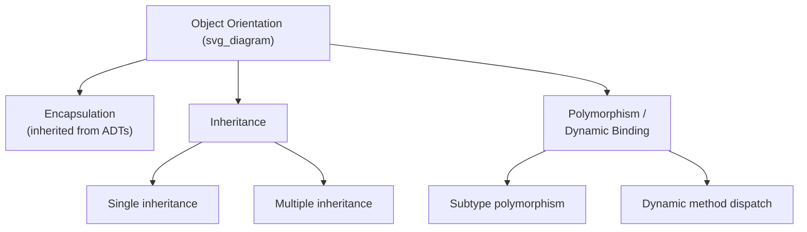
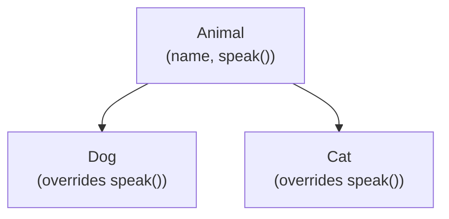

## Introduction to Object Orientation

### Definition and Core Idea

Object orientation is a programming paradigm organized around **objects** — bundles of state (data) and behavior (operations) — and the relationships among the types that define them, principally **inheritance** and **polymorphism**. Where basic abstract data types provide encapsulation and a single, flat definition of a data type's operations, object orientation extends this by allowing new types to be defined in terms of existing ones, sharing and specializing their structure and behavior, and by allowing a single interface to be used uniformly across a family of related types whose exact behavior may differ at run time.



### The Three Pillars: Encapsulation, Inheritance, Polymorphism

Object-oriented programming languages are commonly characterized as building on three interrelated capabilities:

- **Encapsulation** — the bundling of data and operations, and the hiding of implementation details, inherited directly from the abstract-data-type model discussed elsewhere in this material. Object orientation does not introduce encapsulation itself; it relies on the same mechanisms (access modifiers, class boundaries) already used for ADTs.
- **Inheritance** — the ability to define a new class (a **derived class** or **subclass**) in terms of an existing class (a **base class** or **superclass**), automatically acquiring the base class's members and allowing the derived class to add new members or override existing behavior.
- **Polymorphism** — the ability for code written in terms of a base class or interface to operate correctly on objects of any derived class, with the specific behavior invoked determined by the actual run-time type of the object rather than its declared compile-time type.

[Inference — characterizing these three as "the pillars" of OOP is a widely used pedagogical framing across programming-language textbooks, not a formally standardized definition; some sources add abstraction as a fourth pillar, treating it as distinct from encapsulation.]

### Classes and Objects

A **class** is the language construct that defines a new type in object-oriented terms: it specifies the instance variables (state) and methods (behavior) that objects of that type will have. An **object** is a specific instantiation of a class — a concrete allocation of memory holding values for the class's instance variables, capable of responding to the class's defined methods.

```java
class Animal {
    protected String name;

    public Animal(String name) {
        this.name = name;
    }

    public String speak() {
        return name + " makes a sound.";
    }
}

Animal a = new Animal("Generic Animal");
System.out.println(a.speak());
```

**Key Points**

- The relationship between a class and its objects mirrors the relationship between a type and its values in non-object-oriented type systems, but with the addition that the type (class) also defines the operations that can act on its values (objects).
- Multiple objects can be instantiated from the same class, each with its own independent copy of instance variables but sharing the same method definitions (methods are typically stored once, per class, and invoked with a reference to the specific object instance).

### Inheritance

Inheritance allows a new class to be defined as an extension or specialization of an existing class, inheriting its members and optionally adding new ones or overriding inherited behavior.

```java
class Dog extends Animal {
    public Dog(String name) {
        super(name);
    }

    @Override
    public String speak() {
        return name + " barks.";
    }
}

class Cat extends Animal {
    public Cat(String name) {
        super(name);
    }

    @Override
    public String speak() {
        return name + " meows.";
    }
}
```

Here, `Dog` and `Cat` both inherit the `name` field and the general structure established by `Animal`, but each **overrides** the `speak` method to provide type-specific behavior.



**Key Points**

- **Single inheritance** restricts a class to having exactly one direct base class (Java, C#, Smalltalk); **multiple inheritance** allows a class to inherit from more than one base class simultaneously (C++), introducing additional design complexity such as resolving conflicting member names inherited from different base classes (the "diamond problem"). [Confirmed — the diamond problem is a well-documented issue specifically associated with multiple inheritance.]
- Some languages that disallow multiple inheritance of implementation still allow a class to implement multiple **interfaces** (Java, C#) — pure behavioral contracts with no inherited implementation — as a way to gain some benefits of multiple inheritance without its full complexity.
- Inheritance establishes an **is-a relationship**: a `Dog` is-a `Animal`, meaning a `Dog` object can be used anywhere an `Animal` is expected, which is the basis for polymorphism.

### Polymorphism and Dynamic Binding

**Subtype polymorphism** allows a single variable or parameter declared with a base-class type to refer to an object of any derived class, with the specific method implementation invoked determined at run time by the object's actual type — a mechanism called **dynamic binding** or **dynamic dispatch**.

```java
Animal[] animals = { new Dog("Rex"), new Cat("Whiskers"), new Animal("Thing") };

for (Animal a : animals) {
    System.out.println(a.speak());  // dynamically dispatched
}
// Output:
// Rex barks.
// Whiskers meows.
// Thing makes a sound.
```

Although every element of the array is declared as type `Animal`, each call to `speak()` invokes the version defined in the object's actual run-time class, not necessarily the version defined in `Animal`.

**Key Points**

- Dynamic binding requires a run-time mechanism — typically a **virtual method table (vtable)** or an equivalent dispatch structure — that maps a method name to the correct implementation based on the object's actual class, since the compiler cannot always determine this statically. [Inference — vtables are the most commonly described implementation mechanism in language-design literature, though the exact implementation technique varies by language and compiler.]
- Polymorphism is what allows code written against a base class or interface to remain correct and unmodified even when new derived classes are added later, a property often cited as central to extensibility in object-oriented design. [Inference — this benefit is a widely cited design rationale rather than a guarantee that holds in every codebase.]
- Not all languages default to dynamic binding for all methods: C++ requires methods to be explicitly marked `virtual` to receive dynamic dispatch, while Java methods are dynamically dispatched by default (unless marked `final`, `static`, or `private`). [Confirmed]

### Abstract Classes and Interfaces

Object-oriented languages typically provide a way to define a class or contract that specifies method signatures without providing a full implementation, intended to be completed by derived classes.

- An **abstract class** may define some methods fully and leave others abstract (unimplemented), and cannot itself be instantiated directly.
- An **interface** defines only method signatures (in most traditional forms) with no implementation at all, and a class may implement multiple interfaces even in single-inheritance languages.

```java
interface Speaker {
    String speak();
}

class Robot implements Speaker {
    public String speak() {
        return "Beep boop.";
    }
}
```

**Key Points**

- Interfaces provide a way to achieve polymorphic treatment of unrelated classes (classes with no shared base class beyond a common root) as long as they implement the same interface, decoupling polymorphism from the single-inheritance hierarchy.
- Some languages (Java 8+, C#) allow interfaces to include **default method implementations**, blurring the traditional strict distinction between interfaces and abstract classes. [Confirmed]

### Object-Oriented Support Across Languages

| Language | Inheritance Model | Dynamic Binding Default | Interfaces |
| --- | --- | --- | --- |
| Smalltalk | Single | Always dynamic | No separate construct (all messaging is dynamic) |
| C++ | Single or multiple | Static unless `virtual` | Achieved via pure abstract classes |
| Java | Single (classes); multiple (interfaces) | Dynamic by default | Explicit `interface` construct |
| C# | Single (classes); multiple (interfaces) | Static unless `virtual`/`override` | Explicit `interface` construct |
| Python | Single or multiple | Always dynamic | Achieved via duck typing / abstract base classes |

### Object Orientation as an Extension of Data Abstraction

Object orientation is frequently framed as a direct extension of the abstract-data-type model rather than a wholly separate paradigm: an ADT already provides encapsulated data with an operation interface, and object orientation adds the ability to relate multiple such types hierarchically (inheritance) and to treat related types uniformly through a shared interface (polymorphism). This framing positions object-oriented design as building incrementally on process abstraction, data abstraction, and encapsulation concepts rather than introducing an unrelated set of ideas. [Inference — this incremental framing is a common pedagogical device in language-design textbooks, though object orientation is sometimes alternatively framed as a distinct paradigm with its own independent conceptual foundations.]

**Related Topics**

- Design issues for object-oriented languages
- Inheritance: single versus multiple, and the diamond problem
- Dynamic binding implementation (virtual method tables)
- Abstract classes versus interfaces
- Polymorphism: subtype, parametric, and ad hoc
- Design issues for abstract data types