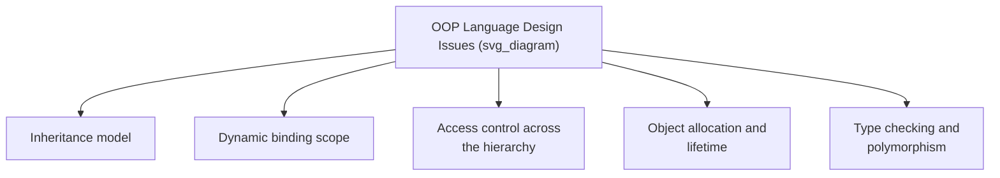
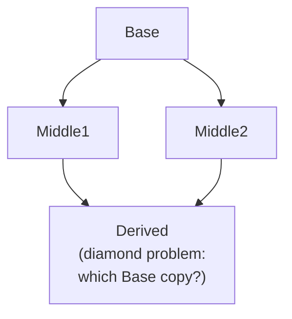

## Design Issues for Object-Oriented Languages

### Overview

Designing object-oriented support into a programming language requires resolving a set of interrelated questions that go beyond the design issues already faced for abstract data types. These issues concern how classes relate to one another (inheritance model, access control across the hierarchy), how method calls are resolved at run time (binding rules), how objects are created and destroyed, and how the type system reconciles static checking with the flexibility that polymorphism demands. Different languages resolve these issues differently, and the specific combination of choices a language makes substantially defines its character as an object-oriented language.

### The Exclusivity of Objects

A foundational design issue is whether the language treats *everything* as an object, or whether it maintains a distinction between objects and other kinds of values, such as primitive types.

- **Pure object model.** In Smalltalk, every value — including integers and booleans — is an object, responding to messages, with no non-object primitive types at all. [Confirmed]
- **Hybrid model.** Java and C# distinguish **primitive types** (`int`, `boolean`, `double`, etc.), which are not objects and do not support method calls or inheritance, from **reference types** (classes), which are. This requires boxing/wrapper mechanisms (`Integer` for `int`) when a primitive value must be treated as an object, such as when stored in a generic collection.
- **Full object model with exceptions for performance.** C++ allows both object types (classes) and non-class built-in types (`int`, `float`), with the choice largely driven by performance considerations, since treating every value as a full object typically carries more overhead than a raw primitive. [Inference — the performance rationale is a commonly cited design motivation in language-design discussions, though actual overhead is implementation-dependent.]

**Key Points**

- The pure object model offers greater conceptual uniformity (every value supports the same kind of interaction) at some run-time cost; the hybrid model optimizes common cases (arithmetic on primitives) at the cost of a two-tier type system that programmers must navigate.

### Inheritance Model: Single Versus Multiple

A central design issue is whether a class may inherit from more than one base class simultaneously.

- **Single inheritance** (Java, C#, Smalltalk) restricts each class to exactly one direct superclass, simplifying the inheritance hierarchy into a tree structure and avoiding ambiguity about which superclass a conflicting member name should resolve to.
- **Multiple inheritance** (C++) allows a class to inherit from several base classes, which can more directly model real-world situations with multiple independent characteristics, but introduces the **diamond problem**: if two base classes both inherit from a common ancestor, and a derived class inherits from both, ambiguity arises about which copy (or version) of the ancestor's members the derived class should use.

**Key Points**

- C++ resolves diamond-problem ambiguity through **virtual inheritance**, an explicit mechanism that ensures only a single shared copy of the common ancestor exists in the derived class, at the cost of additional design complexity for the programmer. [Confirmed]
- Languages that disallow multiple inheritance of implementation frequently still permit multiple **interface inheritance** (implementing multiple interfaces), providing some of the flexibility of multiple inheritance without the diamond problem, since interfaces (in their traditional form) contribute no implementation to conflict.

### Scope of Dynamic Binding

A key design issue is whether dynamic binding applies to all methods by default, or only to methods explicitly marked for it.

- **Dynamic by default** (Java, Smalltalk, Python) — all applicable methods are dynamically dispatched unless explicitly excluded (Java's `final`, `static`, `private` methods are excluded from dynamic dispatch).
- **Static by default, opt-in dynamic** (C++, C#) — methods are statically bound (resolved at compile time based on declared type) unless explicitly marked `virtual`, with dynamic dispatch then requiring the calling code to also declare the method as overriding (`override` in C#) for full effect.

**Key Points**

- Dynamic-by-default designs favor a uniform, always-substitutable object model, aligning naturally with the Liskov substitution expectation that a subclass object can always be used wherever a superclass object is expected. [Inference — this alignment is a widely discussed design rationale, though not every dynamic-by-default language perfectly satisfies substitutability in practice.]
- Static-by-default designs favor performance (static binding avoids virtual dispatch overhead for methods that are never overridden) and explicitness (a reader can tell from the declaration alone whether a method participates in dynamic dispatch), at the cost of requiring programmers to anticipate, at base-class design time, which methods might need to be overridden later. [Inference — the performance/explicitness rationale is the typical justification given in comparative language-design discussions.]

### Access Control Across the Inheritance Hierarchy

Beyond the basic `public`/`private` distinction already needed for ADTs, object-oriented languages must decide how access control interacts with inheritance — specifically, what a derived class can see of its base class's members.

- Most class-based object-oriented languages add a `protected` access level: members marked `protected` are inaccessible to unrelated external code but accessible to subclasses, addressing the specific need of derived classes to build on inherited implementation details that fully external code should not see.
- Languages differ on **where** a subclass must be located to gain `protected` access: C++ grants it to any subclass regardless of file or namespace location; Java restricts `protected` access to subclasses within the same package, or subclasses elsewhere accessing it only through inheritance-based references (not arbitrary instances). [Confirmed — these are documented, differing rules per language specification.]

**Key Points**

- The interaction between access control and inheritance is a recurring source of subtlety, since a member's visibility now depends not just on a fixed public/private label but on the calling code's relationship to the class hierarchy.
- Some languages additionally allow a derived class to change (narrow, in some models; not permitted in others) the access level of an inherited member when overriding it, which raises further consistency questions about whether the base class's original access contract can be effectively violated by a subclass. [Inference — rules governing whether access levels can be changed on override vary by language and are documented individually.]

### Object Allocation, Lifetime, and Initialization

Object-oriented languages must decide where and how objects are allocated, and how their creation and destruction are managed.

- **Heap-only allocation with garbage collection** (Java, C#, Smalltalk) — all objects (of class types) are allocated on the heap, and their memory is reclaimed automatically once no longer reachable, removing explicit deallocation from the programmer's responsibility but also removing precise control over when destruction occurs.
- **Programmer-controlled allocation** (C++) — objects can be allocated on the stack (with automatic, deterministic destruction at scope exit) or explicitly on the heap (with explicit deallocation required, traditionally via `delete`), giving the programmer more control at the cost of more responsibility for correct memory management.

**Key Points**

- Constructors — special methods invoked automatically at object creation — are a near-universal feature of object-oriented languages, but the rules governing constructor inheritance (whether a derived class automatically inherits a base class's constructors, and how base-class construction is sequenced relative to derived-class construction) differ across languages and are a recurring design decision. [Inference — specific constructor-inheritance rules are documented per-language and are not uniform.]
- Destructor/finalizer availability and determinism (covered more fully under ADT design issues) directly interacts with the inheritance hierarchy, since a derived class's destructor must typically ensure the base class's destructor also executes, in the correct order.

### Type Checking and Polymorphism

Supporting polymorphism while preserving useful compile-time type checking raises design tensions that non-polymorphic ADT systems do not face.

- **Type compatibility rules for substitution** — the language must define exactly when an object of a derived class can be used where a base-class object (or reference) is expected, and what operations remain legal on it once substituted (typically only those defined by the declared, not actual, type, unless dynamic binding applies).
- **Covariance and contravariance** in method overriding — whether a derived class's overriding method may use a different (narrower or wider) parameter or return type than the method it overrides, and under what conditions this remains type-safe. [Inference — variance rules for overriding are a well-known area of subtlety across object-oriented type systems and differ significantly by language.]
- **Downcasting** — whether, and how safely, code can convert a base-class reference back to a more specific derived-class reference, and whether this conversion is checked at run time (Java's `instanceof` plus cast, which throws an exception on failure) or left to the programmer's responsibility (C-style casts in some contexts).

### Comparative Summary

| Design Issue | C++ | Java | C# | Smalltalk |
| --- | --- | --- | --- | --- |
| Pure object model | No (primitives + classes) | No (primitives + reference types) | No (primitives + reference types, with boxing) | Yes (everything is an object) |
| Inheritance | Single or multiple | Single (classes), multiple (interfaces) | Single (classes), multiple (interfaces) | Single |
| Dynamic binding default | Static (opt-in `virtual`) | Dynamic (opt-out via `final`) | Static (opt-in `virtual`/`override`) | Always dynamic |
| Object allocation | Stack or heap, programmer-controlled | Heap only, garbage collected | Heap for classes (reference types), stack for structs | Heap only, garbage collected |
| Protected scope | Any subclass, any location | Subclass, generally same-package-restricted | Subclass, similar to Java with `internal` variants | Not applicable in the same modifier-based form |

**Related Topics**

- Introduction to object orientation
- Inheritance: single versus multiple, and the diamond problem
- Dynamic binding implementation (virtual method tables)
- Design issues for abstract data types
- Object lifetime management and garbage collection
- Polymorphism: subtype, parametric, and ad hoc