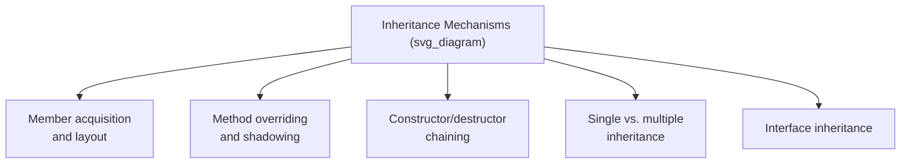
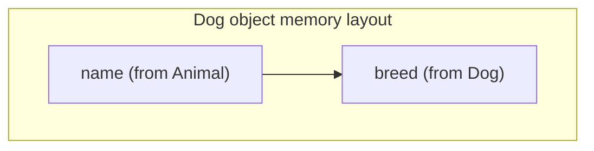
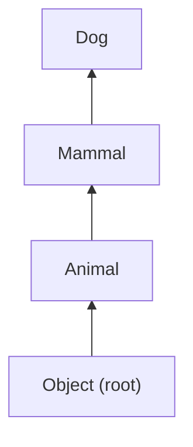

## Inheritance Mechanisms

### Definition and Basic Function

An inheritance mechanism is the set of language rules and run-time structures that allow a derived class (subclass) to acquire the members — instance variables and methods — of a base class (superclass), and to extend or modify that inherited structure. Beyond simply granting access to inherited members, an inheritance mechanism must define how member conflicts are resolved, how derived-class objects are laid out in memory relative to their base class, how construction and destruction are sequenced across the hierarchy, and how access control interacts with the inheritance relationship. This survey focuses on the mechanics of inheritance itself, complementing the broader design-issue overview covered separately.



### Member Acquisition and Memory Layout

When a derived class inherits from a base class, the derived class's objects conceptually contain the base class's instance variables in addition to any the derived class declares itself. A common implementation strategy places the inherited base-class fields first in the object's memory layout, followed by fields introduced by the derived class.



**Key Points**

- This layout convention allows a derived-class object to be treated, at the level of its base-class fields, identically to a base-class object — a property that underlies safe upcasting (treating a derived object as a base object) without needing to reorganize memory.
- Under multiple inheritance, this simple sequential layout becomes more complex, since a derived class may need to incorporate the fields of several unrelated base classes, and the compiler must generate offset adjustments (sometimes called "this-pointer adjustment") when a multiply-inherited object is accessed through a reference to one of its several base classes. [Inference — offset-adjustment mechanics are a known implementation technique for multiple inheritance in languages such as C++, though exact compiler strategies vary.]

### Method Overriding

**Overriding** occurs when a derived class defines a method with the same signature as a method already defined in its base class, replacing the inherited behavior with a new implementation for objects of the derived class (and, under dynamic binding, for any code that accesses the object polymorphically through a base-class reference).

```java
class Shape {
    public double area() {
        return 0.0;
    }
}

class Circle extends Shape {
    private double radius;

    public Circle(double r) { radius = r; }

    @Override
    public double area() {
        return Math.PI * radius * radius;
    }
}
```

**Key Points**

- Overriding requires the derived-class method to match the base-class method's signature (or, in languages that permit covariant return types, a compatible narrower return type) closely enough for the language's type-checking rules to consider it the "same" method for dispatch purposes.
- Explicit override annotations (`@Override` in Java, `override` in C#) allow the compiler to verify that a method genuinely overrides an inherited one, catching the common error where a method intended as an override actually declares a slightly different signature and unintentionally becomes a separate, unrelated method. [Confirmed]
- A base class's original method remains accessible from within an overriding method via an explicit mechanism (`super.method()` in Java, `Base::method()` or `base.Method()` in C++/C#), allowing a derived class to extend rather than fully replace inherited behavior.

### Method Shadowing (Hiding) Versus Overriding

A related but distinct mechanism is **shadowing** (or **hiding**), where a derived class declares a member with the same name as a base-class member, but the member is resolved based on the *declared* (static) type of the reference rather than participating in dynamic dispatch. This typically applies to instance variables (which do not support dynamic dispatch in most languages) and to methods explicitly excluded from dynamic binding (`static` methods in Java, non-`virtual` methods in C++).

```java
class Base {
    public int value = 10;
}

class Derived extends Base {
    public int value = 20;  // shadows, does not override (fields aren't dynamically dispatched)
}

Base b = new Derived();
System.out.println(b.value);  // prints 10 — resolved by declared type
```

**Key Points**

- Shadowing can produce results that appear inconsistent with overriding at first glance, since accessing a shadowed field through a base-class-typed reference yields the base class's field, while calling an overridden (dynamically dispatched) method through the same reference yields the derived class's behavior — a frequently cited source of confusion for programmers new to a language's inheritance rules. [Inference — described as a common point of confusion in language-design pedagogy, though the underlying rules themselves are precisely defined per language.]
- Understanding the distinction between shadowing and overriding requires knowing, for each kind of member (field, static method, instance method), whether the language applies static or dynamic resolution by default.

### Constructor and Destructor Chaining

Because a derived-class object logically contains its base class's state, most inheritance mechanisms require that the base class's constructor execute before the derived class's constructor body runs, ensuring the inherited portion of the object is properly initialized first.

```java
class Animal {
    protected String name;
    public Animal(String name) {
        this.name = name;
        System.out.println("Animal constructed");
    }
}

class Dog extends Animal {
    public Dog(String name) {
        super(name);  // must be first statement if explicit
        System.out.println("Dog constructed");
    }
}
```

Constructing a `Dog` prints "Animal constructed" followed by "Dog constructed," reflecting the base-to-derived construction order.

**Key Points**

- If a derived class's constructor does not explicitly invoke a specific base-class constructor, most languages implicitly invoke the base class's no-argument (default) constructor, and it is a compile-time error if the base class has no such constructor available.
- Destruction (where applicable — languages with deterministic destructors, such as C++) proceeds in the *reverse* order: the derived class's destructor runs first, followed by the base class's destructor, ensuring that any derived-class-specific cleanup occurs before the inherited portion of the object is torn down. [Confirmed — this reverse-order guarantee is a standard, documented property of C++ destructor chaining.]

### Single Inheritance Mechanics

Under single inheritance, the inheritance relationship forms a strict tree, and member resolution (excluding shadowing edge cases) is straightforward: the compiler searches the derived class first, then its single base class, then that class's base class, and so on up the chain, until a matching member is found.



A reference to a member from within `Dog` that is not declared in `Dog` itself is searched for in `Mammal`, then `Animal`, then `Object`, in that fixed order.

### Multiple Inheritance Mechanics

Under multiple inheritance, member resolution must handle the case where two or more base classes (potentially unrelated, or potentially sharing a common ancestor) both define a member with the same name.

- **Explicit disambiguation** — C++ requires the programmer to explicitly qualify which base class's member is intended (`BaseA::method()`) whenever an inherited name is ambiguous between multiple base classes, rather than silently picking one.
- **Method Resolution Order (MRO)** — languages such as Python define a deterministic linearization algorithm (C3 linearization, in Python's case) that establishes a fixed search order across a multiple-inheritance hierarchy, resolving ambiguity automatically according to a well-defined rule rather than requiring explicit qualification at every ambiguous access. [Confirmed — Python's use of C3 linearization for MRO is documented language behavior.]
- **Virtual inheritance** — C++'s mechanism for ensuring that a diamond-shaped inheritance hierarchy shares a single instance of the common ancestor's data, rather than duplicating it once per inheritance path, resolving one specific category of multiple-inheritance ambiguity (shared-ancestor duplication) though not eliminating all naming ambiguity.

### Interface Inheritance

Distinct from implementation inheritance, **interface inheritance** allows a class to inherit only method signatures (a contract) from one or more interfaces, without inheriting any implementation, and without contributing to the diamond problem, since interfaces (in their traditional form) carry no state and no conflicting default implementation.

```java
interface Flyable {
    void fly();
}

interface Swimmable {
    void swim();
}

class Duck implements Flyable, Swimmable {
    public void fly() { System.out.println("Duck flies"); }
    public void swim() { System.out.println("Duck swims"); }
}
```

**Key Points**

- A class can implement any number of interfaces, even in a single-inheritance-of-implementation language, since no state or conflicting method body is being merged.
- Languages that allow interfaces to carry **default method implementations** (Java 8+, C#) reintroduce a limited form of the diamond problem specifically for default methods, requiring explicit resolution rules (Java requires the implementing class to override a method that has conflicting default implementations from two interfaces). [Confirmed]

### Comparative Summary

| Mechanism Aspect | C++ | Java | C# | Python |
| --- | --- | --- | --- | --- |
| Implementation inheritance | Single or multiple | Single only | Single only | Multiple |
| Member conflict resolution | Explicit qualification required | Not applicable (single only) | Not applicable (single only) | C3 linearization (MRO) |
| Diamond problem handling | Virtual inheritance | Not applicable | Not applicable | Resolved via MRO |
| Interface inheritance | Achieved via abstract classes | Explicit `interface`, multiple allowed | Explicit `interface`, multiple allowed | Achieved via abstract base classes / mixins |
| Constructor chaining order | Base before derived | Base before derived | Base before derived | Base before derived (via explicit `super().__init__()`) |

**Related Topics**

- Design issues for object-oriented languages
- Introduction to object orientation
- Dynamic binding implementation (virtual method tables)
- The diamond problem and virtual inheritance
- Interfaces versus abstract classes
- Method Resolution Order and C3 linearization