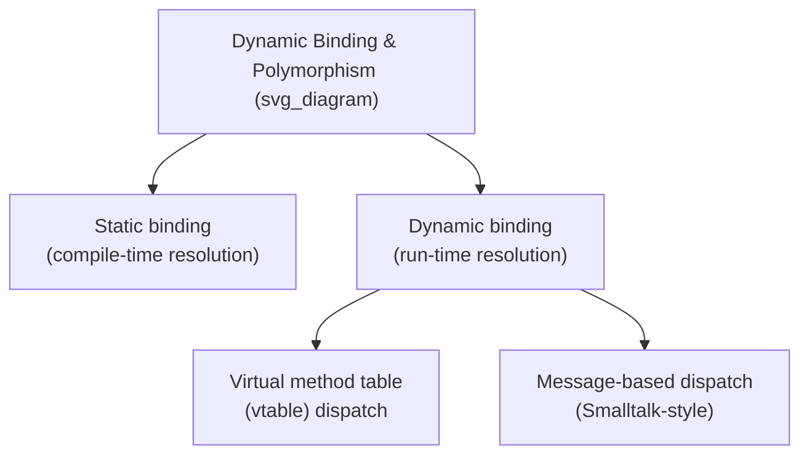
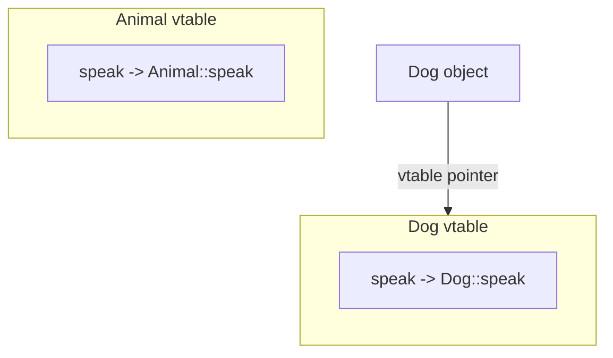
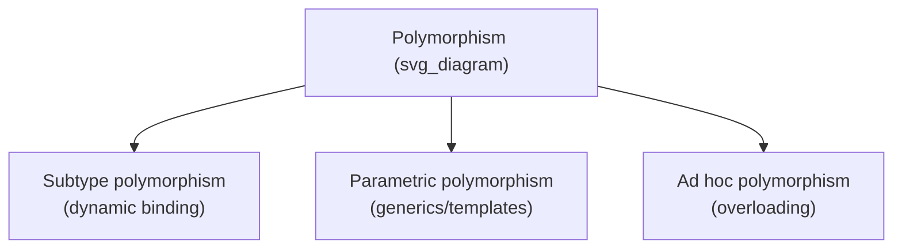

## Dynamic Binding and Polymorphism

### Definitions

**Dynamic binding** (also called dynamic dispatch or late binding) is the run-time determination of which specific method implementation to invoke for a given method call, based on the actual run-time type of the object rather than the declared (static) type of the reference or variable used to make the call. **Polymorphism**, in the object-oriented sense (subtype polymorphism), is the broader capability this enables: code written in terms of a base type can operate correctly and differently across a family of derived types, with the correct type-specific behavior selected automatically. Dynamic binding is the mechanism; polymorphism is the resulting capability it provides.



### Static Binding as a Baseline

Before examining dynamic binding, it is useful to establish static binding as the contrasting baseline. Under **static binding**, the compiler determines, at compile time, exactly which method implementation a given call site invokes, based solely on the declared type of the expression being called on. This is how ordinary (non-polymorphic) function calls, and non-virtual methods in languages like C++, are resolved.

```cpp
class Animal {
public:
    void speak() { std::cout << "Some sound\n"; }  // not virtual
};

class Dog : public Animal {
public:
    void speak() { std::cout << "Bark\n"; }
};

Animal* a = new Dog();
a->speak();  // prints "Some sound" — statically bound to Animal::speak
```

Because `speak` is not declared `virtual`, the compiler resolves the call based on the declared type of `a` (`Animal*`), regardless of the object's actual run-time type (`Dog`).

### Dynamic Binding Mechanism

Under dynamic binding, the same call is instead resolved based on the object's actual run-time type:

```cpp
class Animal {
public:
    virtual void speak() { std::cout << "Some sound\n"; }
};

class Dog : public Animal {
public:
    void speak() override { std::cout << "Bark\n"; }
};

Animal* a = new Dog();
a->speak();  // prints "Bark" — dynamically bound to Dog::speak
```

Marking `speak` as `virtual` instructs the compiler to defer the resolution of this call to run time, looking up the actual object's type to determine which implementation to invoke.

### Implementation: The Virtual Method Table (Vtable)

The most common implementation mechanism for dynamic binding in languages such as C++, Java, and C# is the **virtual method table** (vtable): a per-class array of function pointers, one entry per virtual method, populated with the address of that class's specific implementation (or its inherited implementation, if not overridden).



**Key Points**

- Each object of a class with virtual methods carries a hidden pointer (often called the **vptr**) to its class's vtable, set at object construction time based on the object's actual class.
- A virtual call is compiled into an indirect call: look up the vptr, index into the vtable at the fixed offset corresponding to the called method's slot, and invoke whatever function address is stored there — an operation that takes constant time but is slower than a direct (static) call due to the extra indirection. [Inference — the relative performance cost of vtable indirection versus direct calls is implementation- and hardware-dependent, though the general mechanism and its indirection cost are standard, documented characteristics.]
- Because every class in an inheritance hierarchy that shares the same virtual method assigns it to the same vtable slot number, the calling code does not need to know the object's actual class at compile time — it only needs to know the slot number for the method being called, which is fixed by the declared (base) type.

### Implementation: Message-Based Dispatch

Smalltalk and similar languages implement dynamic binding not through vtables but through a **message-passing** model, in which a method call is conceptually a message sent to an object, and the object's class is searched, at run time, for a matching method — searching up the inheritance chain if not found directly in the object's own class. [Confirmed — Smalltalk's model is documented as message-passing-based rather than vtable-based.]

**Key Points**

- This model is generally more flexible (it can support dynamically adding or changing methods at run time in ways a fixed vtable layout does not directly accommodate) but has historically been associated with greater dispatch overhead compared to a fixed-offset vtable lookup, since a general search may be required rather than a constant-time indexed lookup. [Inference — the specific overhead comparison depends on the particular implementation's optimizations, such as method caching, which many message-passing systems employ to mitigate search cost.]

### Kinds of Polymorphism

The term "polymorphism" is used in programming language theory for several related but distinct concepts, of which subtype (inclusion) polymorphism — enabled by dynamic binding — is only one:

- **Subtype (inclusion) polymorphism** — a value of a derived type can be used wherever a value of its base type is expected, with behavior determined dynamically; this is the form directly enabled by dynamic binding, as covered in this material.
- **Parametric polymorphism** — a single piece of code operates uniformly over many types via type parameters (generics/templates), without needing dynamic dispatch, since the same code structure applies regardless of the specific type substituted.
- **Ad hoc polymorphism** — a single name refers to multiple, potentially unrelated implementations selected based on argument types at compile time, as with function/operator overloading; this is resolved statically, not dynamically.



**Key Points**

- Only subtype polymorphism inherently requires a run-time dispatch mechanism; parametric and ad hoc polymorphism are typically resolved at compile time (though languages combining generics with dynamic dispatch, such as Java generics over polymorphic types, can involve both simultaneously).
- Confusing these categories is common in informal discussion, since all three allow "one interface, multiple behaviors" in some sense, but the mechanism and time of resolution differ substantially. [Inference — this potential for informal conflation is a commonly noted pedagogical caution in language-theory texts.]

### Binding Time as a Design Spectrum

Dynamic binding is one point on a broader spectrum of **binding times** — the point in a program's translation and execution at which a name is associated with a specific attribute, entity, or piece of code:

| Binding Time | Example |
| --- | --- |
| Language design time | Meaning of a keyword like `if` |
| Compile time | Static type of a variable; non-virtual method resolution |
| Load time | Address of a global variable in some systems |
| Run time | Dynamic dispatch of a virtual method; value bound to a variable at execution |

Dynamic binding of method calls represents a deliberate choice to defer this particular binding decision as late as possible — to the moment of the call itself — in exchange for the flexibility that subtype polymorphism provides.

### Costs and Tradeoffs of Dynamic Binding

- **Performance overhead.** Dynamic dispatch requires at least one extra level of indirection (vtable lookup, or search in message-passing systems) compared to a direct, statically resolved call, though modern implementations mitigate this considerably through techniques such as inline caching. [Inference — the practical performance impact varies significantly based on compiler optimizations, call-site predictability, and hardware branch prediction, and is not uniform across implementations or workloads.]
- **Reduced compile-time predictability.** Because the exact code executed at a dynamically bound call site cannot always be determined at compile time, certain compiler optimizations (such as aggressive inlining) that rely on knowing the exact called function become more difficult to apply safely, unless the compiler can prove the call site is monomorphic (always resolves to the same implementation in practice).
- **Increased design flexibility.** In exchange for these costs, dynamic binding allows new derived classes to be introduced later, without modifying or recompiling existing code that operates on the base type — a property frequently cited as central to extensible, maintainable object-oriented design. [Inference — this extensibility benefit is a standard, widely cited design rationale rather than a guaranteed outcome in every codebase.]

### Language Defaults and Opt-In/Opt-Out Rules

| Language | Default Binding | How to Get the Other |
| --- | --- | --- |
| C++ | Static | Mark method `virtual` for dynamic |
| Java | Dynamic | Mark method `final`, `static`, or `private` for static |
| C# | Static | Mark base method `virtual` and derived method `override` for dynamic |
| Smalltalk | Always dynamic | Not applicable — no static option exists |
| Python | Always dynamic | Not applicable in the standard object model |

**Related Topics**

- Inheritance mechanisms
- Design issues for object-oriented languages
- Polymorphism: subtype, parametric, and ad hoc
- Virtual method table implementation details
- Binding time as a general language-design concept
- Introduction to object orientation