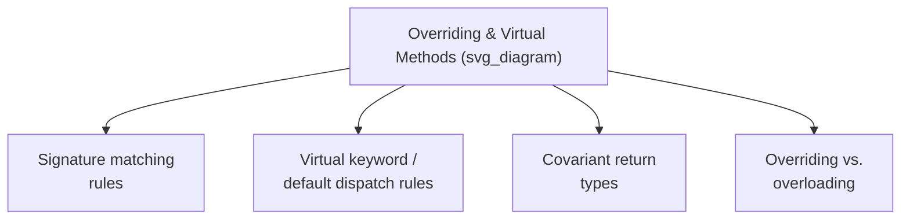

## Method Overriding and Virtual Methods

### Definitions

**Method overriding** is the definition, in a derived class, of a method with the same signature as a method already defined in a base class, intended to replace or specialize the inherited behavior. A **virtual method** is a method explicitly (or, in some languages, implicitly) marked as eligible for dynamic dispatch, meaning that calls to it are resolved based on the object's actual run-time type rather than the compile-time declared type of the reference used to call it. The two concepts are closely linked but distinct: overriding is the act of redefining a method in a subclass; "virtual" describes the binding behavior that determines whether that redefinition actually takes effect polymorphically at a given call site.



### Requirements for a Valid Override

For a derived-class method to count as a genuine override of a base-class method (rather than an unrelated, separately named method or an overload), most languages require the method signatures to match according to specific rules:

- **Method name** must be identical.
- **Parameter types and count** must match exactly (in most languages), since even a slightly different parameter list creates an overload rather than an override.
- **Return type** must generally match, though many languages permit **covariant return types** — allowing the overriding method's return type to be a subtype of the original method's return type, since this remains type-safe (any caller expecting the base return type can still accept the narrower derived type). [Confirmed — covariant return types are supported and documented in C++, Java, and C#.]
- **Access level** — some languages restrict a derived class from narrowing the access level of an inherited method upon override (e.g., overriding a `public` method as `private`), while allowing widening. [Inference — the exact rule (whether narrowing is disallowed, and what happens if attempted) is language-specific and documented individually per language specification.]

```java
class Shape {
    public Shape createCopy() { return new Shape(); }
}

class Circle extends Shape {
    @Override
    public Circle createCopy() { return new Circle(); }  // covariant return type
}
```

### The Virtual Keyword and Explicit Opt-In (C++, C#)

C++ and C# require methods to be explicitly marked to participate in dynamic dispatch, reflecting their static-by-default binding model.

```cpp
class Shape {
public:
    virtual double area() const { return 0.0; }
    virtual ~Shape() {}  // virtual destructor — important for polymorphic deletion
};

class Circle : public Shape {
    double radius;
public:
    Circle(double r) : radius(r) {}
    double area() const override { return 3.14159 * radius * radius; }
};
```

**Key Points**

- In C++, once a method is declared `virtual` in a base class, it remains virtual in all derived classes automatically, even without repeating the `virtual` keyword — though modern C++ style conventionally uses `override` on the derived declaration for clarity and compiler-checked correctness.
- A **virtual destructor** is specifically important in C++: if a base class is intended to be used polymorphically (deleted through a base-class pointer), its destructor must be declared `virtual`, or deleting a derived object through a base pointer will invoke only the base class's destructor, potentially leaking derived-class resources. [Confirmed — this is a well-documented C++ pitfall and standard practice recommendation.]
- C# requires both the base method to be marked `virtual` (or `abstract`) and the derived method to be marked `override`; omitting `override` in the derived class instead creates method **hiding** (shadowing) rather than overriding, resolved statically — a distinction C# makes explicit and requires the `new` keyword to acknowledge intentionally. [Confirmed]

### Dynamic Dispatch by Default (Java)

Java methods are dynamically dispatched by default; no special keyword is required to make a method eligible for overriding. Instead, Java provides keywords to *exclude* methods from dynamic dispatch:

```java
class Shape {
    public double area() { return 0.0; }         // dynamically dispatched by default
    public final double perimeter() { return 0.0; }  // final: cannot be overridden
    public static void describe() { }              // static: not subject to dynamic dispatch
}
```

**Key Points**

- `final` methods cannot be overridden at all by any subclass, which the compiler enforces, providing a way for a base-class designer to guarantee a method's behavior cannot be altered by derived classes.
- `static` methods belong to the class itself rather than to instances, and are resolved at compile time based on the reference type used to call them — they can be redeclared (hidden) in a subclass with the same signature, but this is shadowing, not overriding, and does not participate in dynamic dispatch.
- `private` methods are not inherited in a way that permits overriding at all, since they are not visible to subclasses; a subclass declaring a method with the same signature and name as a base class's private method is defining an entirely unrelated method.

### Overriding Versus Overloading

Overriding and **overloading** are frequently confused but are fundamentally different mechanisms resolved at different times:

| Aspect | Overriding | Overloading |
| --- | --- | --- |
| Relationship | Between base and derived class | Within the same class (or same scope) |
| Signature | Same name, same parameters | Same name, different parameters |
| Resolution time | Run time (if dynamic binding applies) | Compile time |
| Purpose | Specialize inherited behavior | Provide multiple variants of an operation for different argument types |

```java
class Calculator {
    public int add(int a, int b) { return a + b; }        // overload 1
    public double add(double a, double b) { return a + b; } // overload 2 — resolved at compile time
}

class Shape {
    public double area() { return 0.0; }
}
class Square extends Shape {
    @Override
    public double area() { return 4.0; }  // override — resolved at run time (if called polymorphically)
}
```

**Key Points**

- Overloading is a form of ad hoc polymorphism resolved statically by the compiler based on argument types at the call site; overriding is a form of subtype polymorphism, potentially resolved dynamically based on run-time object type.
- A common source of programmer error is unintentionally overloading rather than overriding, by writing a method in a derived class whose signature differs slightly (a different parameter type, a missing parameter) from the intended base-class method — this creates a new, unrelated overload instead of replacing the intended behavior, silently. Explicit override annotations (`@Override`, `override`) exist specifically to let the compiler catch this class of error. [Confirmed]

### Abstract Methods and Mandatory Overriding

An **abstract method** is declared with a signature but no implementation, and the class containing it must itself be declared abstract, forcing any concrete (instantiable) subclass to provide an implementation via overriding.

```java
abstract class Shape {
    public abstract double area();  // no body — must be overridden
}

class Triangle extends Shape {
    private double base, height;
    public Triangle(double b, double h) { base = b; height = h; }

    @Override
    public double area() {
        return 0.5 * base * height;
    }
}
```

**Key Points**

- Abstract methods provide a way for a base-class designer to require, rather than merely permit, that subclasses supply specific behavior, since a class containing an unoverridden abstract method cannot be instantiated at all.
- This differs from simply providing a default implementation that subclasses *may* override, since abstract methods provide no fallback behavior and force an explicit, compile-time-checked decision by every concrete subclass author.

### Invoking the Overridden (Base) Method

Overriding a method does not delete or hide the base class's original implementation entirely; most languages provide an explicit mechanism to invoke it from within the overriding method, allowing the derived class to extend rather than fully replace the inherited behavior.

```java
class Logger {
    public void log(String message) {
        System.out.println("[LOG] " + message);
    }
}

class TimestampedLogger extends Logger {
    @Override
    public void log(String message) {
        super.log("[" + System.currentTimeMillis() + "] " + message);
    }
}
```

Here, `TimestampedLogger` overrides `log` but delegates to the base class's version (`super.log(...)`) after augmenting the message, rather than reimplementing the printing logic from scratch.

### Performance Implications of Virtual Dispatch

Because virtual method calls involve an indirect lookup (via vtable or message search, as covered under dynamic binding), they carry measurably more overhead per call than a statically resolved call, though the magnitude of this overhead depends heavily on the specific implementation, compiler optimizations (such as devirtualization when the compiler can prove the actual type at a call site), and hardware branch prediction behavior. [Inference — the specific performance impact is implementation- and workload-dependent and cannot be stated as a fixed universal cost.] Languages and compilers vary in how aggressively they attempt to eliminate unnecessary virtual dispatch overhead when the actual object type is statically determinable.

**Related Topics**

- Dynamic binding and polymorphism
- Inheritance mechanisms
- Abstract classes versus interfaces
- Design issues for object-oriented languages
- Function/operator overloading and ad hoc polymorphism
- Virtual method table implementation details