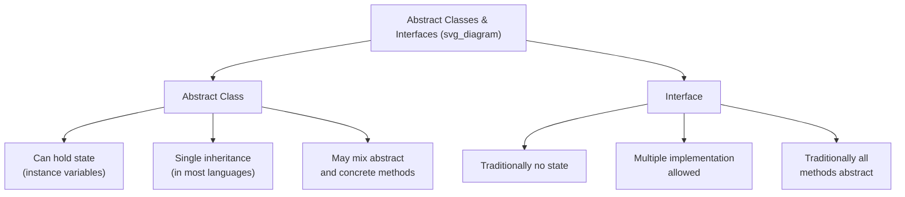

## Abstract Classes and Interfaces

### Definitions

An **abstract class** is a class that cannot be instantiated directly and typically contains at least one **abstract method** — a method declared with a signature but no implementation, which concrete subclasses must provide. An **interface** is a construct that defines a set of method signatures forming a contract, traditionally without any implementation at all, which any implementing class must fulfill regardless of its position in the class inheritance hierarchy. Both constructs exist to separate the specification of behavior from its implementation, but they differ in how much implementation they may carry, how a class relates to them (inheritance versus implementation), and how many a single class may use simultaneously.



### Abstract Classes

An abstract class provides a partial implementation intended as a common base for a family of related subclasses, mixing fully implemented (concrete) methods with abstract methods that subclasses must complete.

```java
abstract class Shape {
    protected String name;

    public Shape(String name) {
        this.name = name;
    }

    public abstract double area();  // abstract — no implementation

    public String describe() {      // concrete — shared by all subclasses
        return name + " has area " + area();
    }
}

class Rectangle extends Shape {
    private double width, height;

    public Rectangle(double w, double h) {
        super("Rectangle");
        width = w;
        height = h;
    }

    @Override
    public double area() {
        return width * height;
    }
}
```

Here, `describe()` is inherited as-is by every subclass, while `area()` must be individually implemented by each concrete subclass, since `Shape` itself provides no meaningful default.

**Key Points**

- Abstract classes can declare instance variables and constructors, and subclass constructors typically invoke the abstract class's constructor via `super(...)`, even though the abstract class itself can never be instantiated directly.
- A class remains abstract, and cannot be instantiated, as long as it has at least one unimplemented abstract method — including abstract methods inherited from a more distant abstract ancestor and not yet overridden.
- Most class-based object-oriented languages restrict a class to extending only one abstract class (following the same single-inheritance-of-implementation rule that applies to ordinary classes), meaning abstract classes participate in the same inheritance constraints as concrete classes.

### Interfaces

An interface specifies a set of method signatures that an implementing class commits to providing, without (in the traditional model) supplying any implementation itself.

```java
interface Drawable {
    void draw();
}

interface Resizable {
    void resize(double factor);
}

class Circle implements Drawable, Resizable {
    private double radius;

    public Circle(double r) { radius = r; }

    @Override
    public void draw() {
        System.out.println("Drawing circle with radius " + radius);
    }

    @Override
    public void resize(double factor) {
        radius *= factor;
    }
}
```

**Key Points**

- A single class can implement any number of interfaces simultaneously, even in languages with single inheritance of implementation, since interfaces traditionally contribute no state or conflicting method bodies to merge.
- Interfaces establish a **can-do** relationship (a `Circle` can be drawn, can be resized) as distinct from the **is-a** relationship established by class inheritance, allowing unrelated classes (with no shared base class beyond a common root) to be treated polymorphically through a shared interface.
- A variable or parameter declared with an interface type can hold a reference to any object of any class that implements that interface, enabling polymorphic code that is not tied to a specific class hierarchy.

### Default Methods: Blurring the Distinction

Newer language versions have introduced **default methods** — interface methods that carry an implementation, used automatically by any implementing class that does not override them.

```java
interface Greetable {
    String getName();

    default String greet() {
        return "Hello, " + getName() + "!";
    }
}

class Person implements Greetable {
    private String name;
    public Person(String name) { this.name = name; }

    @Override
    public String getName() { return name; }
    // greet() inherited as default, not overridden
}
```

**Key Points**

- Default methods (Java 8+, C# 8+) were introduced primarily to allow interfaces to evolve — adding a new method to a widely implemented interface without breaking every existing implementing class, since classes that do not override the new method simply inherit the default behavior. [Confirmed]
- This capability narrows, though does not eliminate, the traditional distinction between abstract classes and interfaces: interfaces with default methods can now supply behavior, much as abstract classes do, though interfaces still cannot hold instance state (instance variables) in most implementations of this feature, preserving one core distinction. [Confirmed — the stateless restriction on interfaces remains standard even with default methods, per Java and C# specifications.]
- When a class implements two interfaces that provide conflicting default implementations of the same method signature, the language typically requires the implementing class to explicitly resolve the conflict by overriding the method itself, rather than silently picking one. [Confirmed]

### Choosing Between Abstract Classes and Interfaces

Language-design and API-design literature commonly frames the choice between an abstract class and an interface around several practical questions:

- **Does the construct need to hold shared state (instance variables)?** If so, an abstract class is typically required, since interfaces traditionally cannot declare instance fields.
- **Might implementing types need to inherit from an unrelated class hierarchy?** If so, an interface is preferable, since a class can implement multiple interfaces but extend only one abstract class in most languages.
- **Is the relationship fundamentally "is-a" or "can-do"?** An "is-a" relationship (a `Car` is-a `Vehicle`) more naturally fits class inheritance (abstract or concrete); a "can-do" capability (a `Car` can-be `Serializable`) more naturally fits an interface.

This is a design guideline rather than a strict rule enforced by any language; both constructs remain available for the programmer to apply according to the specific modeling need. [Inference — this guidance reflects widely repeated object-oriented design advice rather than a formally specified language rule.]

### Comparative Summary

| Aspect | Abstract Class | Interface |
| --- | --- | --- |
| Instantiable | No | No |
| Instance state (fields) | Yes | Traditionally no (though some languages allow constants) |
| Method implementations | Mix of abstract and concrete | Traditionally none; default methods in newer language versions |
| Multiple use per class | No (single inheritance, typically) | Yes (a class may implement many) |
| Constructors | Yes | No |
| Relationship modeled | is-a | can-do / contract |

### Language-Specific Notes

- **C++** has no dedicated `interface` keyword; the same effect is achieved by defining a class consisting entirely of pure virtual functions (`virtual void method() = 0;`), which cannot be instantiated and functions as an interface by convention rather than by a distinct language construct. [Confirmed]
- **Java** distinguishes `abstract class` and `interface` as separate keywords with separate rules, as illustrated above, and has supported interface default methods since Java 8. [Confirmed]
- **C#** similarly distinguishes `abstract class` and `interface`, and has supported default interface method implementations since C# 8.0. [Confirmed]
- **Python** does not enforce a strict interface construct at the language level; abstract base classes (via the `abc` module) provide similar functionality to abstract classes, while "interfaces" are frequently achieved informally through duck typing (an object is treated as fulfilling a role if it supports the required methods, without a formal contract declaration). [Confirmed — Python's `abc` module and its general reliance on duck typing rather than a dedicated interface keyword are documented language characteristics.]

**Related Topics**

- Method overriding and virtual methods
- Inheritance mechanisms
- Dynamic binding and polymorphism
- Design issues for object-oriented languages
- Design issues for abstract data types
- Duck typing and structural typing