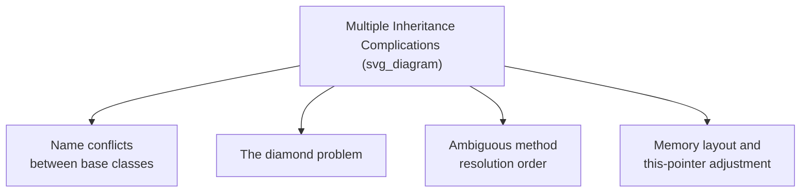
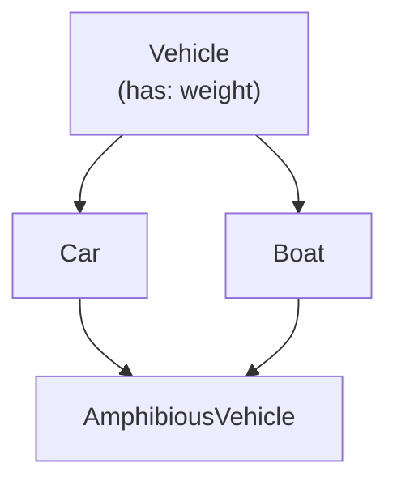
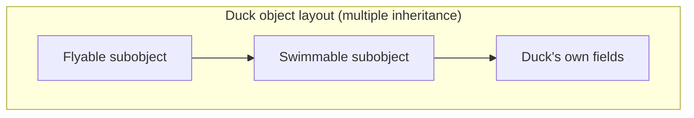

## Multiple Inheritance and Its Complications

### Definition

Multiple inheritance is an inheritance model in which a single derived class may inherit directly from more than one base class simultaneously, acquiring the members of all of them. This contrasts with single inheritance, where each class has exactly one direct base class, forming a strict tree. Multiple inheritance offers greater modeling flexibility — allowing a class to combine characteristics from several independent hierarchies — but introduces a set of well-documented complications around member conflicts, ambiguous ancestry, and memory layout that single inheritance does not face.



### Basic Multiple Inheritance

In its simplest form, a derived class inherits from two or more unrelated base classes, each contributing distinct, non-conflicting members.

```cpp
class Flyable {
public:
    void fly() { std::cout << "Flying\n"; }
};

class Swimmable {
public:
    void swim() { std::cout << "Swimming\n"; }
};

class Duck : public Flyable, public Swimmable {
    // inherits both fly() and swim(), no conflict
};

Duck d;
d.fly();
d.swim();
```

**Key Points**

- When base classes contribute entirely distinct member names, as in this example, multiple inheritance introduces no ambiguity, and the derived class simply gains the union of all inherited members.
- Complications arise specifically when base classes share member names, or when they share a common ancestor — the two major sources of difficulty examined below.

### Name Conflicts Between Unrelated Base Classes

If two base classes, unrelated to each other, happen to define a method with the same name, a derived class inheriting from both faces an ambiguous reference whenever that name is used without qualification.

```cpp
class Employee {
public:
    void describe() { std::cout << "Employee\n"; }
};

class Student {
public:
    void describe() { std::cout << "Student\n"; }
};

class WorkingStudent : public Employee, public Student {
};

WorkingStudent ws;
// ws.describe();  // compile error: ambiguous — Employee::describe or Student::describe?
ws.Employee::describe();  // explicit qualification resolves it
```

**Key Points**

- C++ requires explicit qualification (`ws.Employee::describe()`) to resolve this ambiguity, rather than silently selecting one candidate — the compiler treats an unqualified ambiguous call as an error, forcing the programmer to disambiguate explicitly. [Confirmed]
- This differs from languages using a **method resolution order (MRO)** algorithm, such as Python, which instead defines a fixed, deterministic rule for which method is selected when a name is ambiguous, avoiding a compile-time error but requiring the programmer to understand the linearization rule to predict behavior correctly.

### The Diamond Problem

The **diamond problem** occurs specifically when two base classes that a derived class inherits from are themselves both derived from a common ancestor, forming a diamond-shaped inheritance graph. The ambiguity here concerns not just method names but the ancestor's *data*: should the derived class contain one shared copy of the common ancestor's state, or two independent copies (one via each inheritance path)?



```cpp
class Vehicle {
public:
    double weight;
};

class Car : public Vehicle {};
class Boat : public Vehicle {};

class AmphibiousVehicle : public Car, public Boat {
    // Without virtual inheritance, contains TWO copies of Vehicle::weight
    // — AmphibiousVehicle::Car::weight and AmphibiousVehicle::Boat::weight
};
```

Without special handling, `AmphibiousVehicle` contains two separate `weight` fields — one inherited via `Car`, one via `Boat` — and a reference to `weight` without further qualification is ambiguous, while a reference qualified as `Car::weight` versus `Boat::weight` refers to two genuinely different memory locations that happen to have started from the same original declaration.

**Key Points**

- This duplication may be the *intended* behavior in some designs (if `Car::weight` and `Boat::weight` are conceptually meant to be independently tracked), making the diamond problem not universally a bug to be fixed but a design decision the language must let the programmer control explicitly. [Inference — whether duplication or sharing is "correct" depends entirely on the specific domain being modeled, a point commonly made in discussions of the diamond problem.]
- When a single shared copy of the ancestor's state is intended, the language must provide an explicit mechanism to request it, since implicit duplication is the default outcome of naively combining independently inherited base classes.

### Virtual Inheritance as a Resolution (C++)

C++ resolves the diamond problem's data-duplication aspect through **virtual inheritance**: declaring the shared base class as `virtual` in the intermediate classes ensures that only one shared instance of the common ancestor exists in the final derived class, regardless of how many inheritance paths lead to it.

```cpp
class Vehicle {
public:
    double weight;
};

class Car : virtual public Vehicle {};
class Boat : virtual public Vehicle {};

class AmphibiousVehicle : public Car, public Boat {
    // Now contains exactly ONE shared Vehicle::weight
};
```

**Key Points**

- Virtual inheritance must be declared at the point where the intermediate classes (`Car`, `Boat`) inherit from the shared ancestor, not at the point where the final derived class combines them — meaning the diamond-sharing behavior must be anticipated in advance by the designer of the intermediate classes, which is a frequently cited practical limitation, since a class hierarchy not originally designed with virtual inheritance in mind cannot easily retrofit shared-ancestor semantics. [Inference — this design-time anticipation requirement is a documented practical consequence of how C++ virtual inheritance must be declared, though the broader characterization of it as a "limitation" reflects a common critique in C++ design discussions.]
- Virtual inheritance introduces additional run-time overhead (typically an extra level of indirection to locate the shared base subobject) compared to non-virtual multiple inheritance, since the exact location of the shared base within the object layout can no longer be determined by a simple fixed offset known purely from the immediate derived class. [Inference — the specific overhead mechanism (indirect base-offset lookup) is a documented implementation technique, though its magnitude varies by compiler and is not standardized by the C++ language specification itself.]

### Memory Layout and This-Pointer Adjustment

Under multiple inheritance, a derived-class object must incorporate the memory layout of each of its base classes, which complicates the simple sequential layout sufficient for single inheritance.



**Key Points**

- Because a multiply-inherited object contains multiple base-class subobjects at different memory offsets, a pointer to the derived object must be adjusted (its address shifted by a compile-time-known offset) when it is treated as a pointer to one specific base class rather than another — a mechanism generally called **this-pointer adjustment**. [Inference — this-pointer adjustment is a documented compiler implementation technique for multiple inheritance, though the precise mechanism is compiler- and ABI-specific rather than mandated by the language standard itself.]
- This adjustment happens automatically and transparently to the programmer in most cases, but it is part of why multiple inheritance in C++ carries additional implementation complexity (and, in some cases, run-time cost) relative to single inheritance, even when no naming conflicts or diamond structures are present.

### Language Responses to Multiple Inheritance's Complications

Given these complications, language designers have taken varying positions:

- **Full support with explicit disambiguation** (C++) — multiple inheritance is fully supported, with the complications addressed through explicit qualification, virtual inheritance, and compiler-enforced ambiguity errors, placing the burden of correctness on the programmer.
- **Disallowed for implementation, allowed for interfaces** (Java, C#) — multiple inheritance of implementation is disallowed entirely, sidestepping the diamond problem and most naming-conflict issues, while still permitting a class to implement multiple interfaces, which traditionally cannot conflict in the same way since they carry no state and (traditionally) no implementation.
- **Deterministic linearization** (Python) — multiple inheritance of implementation is fully supported, but ambiguity is resolved automatically and deterministically via the C3 linearization algorithm for method resolution order, avoiding compile-time (or interpretation-time) ambiguity errors at the cost of requiring programmers to understand the linearization rule to predict which implementation is selected in complex hierarchies. [Confirmed]

### Comparative Summary

| Language | Multiple Inheritance (Implementation) | Diamond Problem Handling | Conflict Resolution |
| --- | --- | --- | --- |
| C++ | Fully supported | Virtual inheritance (opt-in) | Explicit qualification required |
| Java | Not supported (single class inheritance) | Not applicable to classes | Interfaces avoid the issue (traditionally stateless) |
| C# | Not supported (single class inheritance) | Not applicable to classes | Interfaces avoid the issue; explicit resolution for conflicting default methods |
| Python | Fully supported | Resolved via MRO (C3 linearization) | Automatic, deterministic linearization |

**Related Topics**

- Inheritance mechanisms
- Design issues for object-oriented languages
- Abstract classes and interfaces
- Method Resolution Order and C3 linearization
- Dynamic binding and polymorphism
- Memory layout of objects and activation records