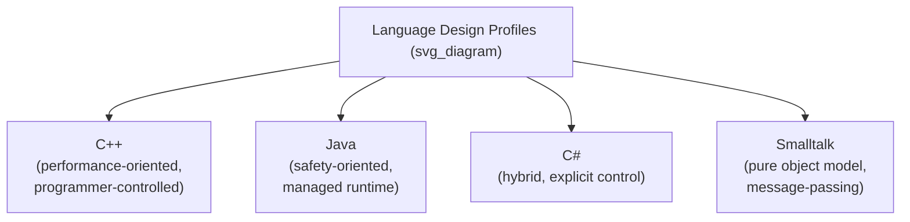

## Design Issues for Object-Oriented Languages Compared

### Overview

This comparison consolidates the recurring object-oriented design issues across four representative languages — C++, Java, C#, and Smalltalk — placing their design choices side by side to highlight how the same underlying questions (object model purity, inheritance model, binding rules, access control, and object lifetime) are resolved differently depending on each language's priorities around performance, safety, and expressiveness. Where the earlier material treated each design issue individually, this material is organized language-first, giving a consolidated profile of each language's overall object-oriented design stance.

### C++: Programmer-Controlled, Performance-Oriented

C++'s object-oriented design consistently favors giving the programmer explicit control and avoiding imposed run-time overhead unless specifically requested.

- **Object model** — hybrid: primitive built-in types (`int`, `double`) coexist with class types; no unifying "everything is an object" model.
- **Inheritance** — supports both single and multiple inheritance, including virtual inheritance to resolve the diamond problem, placing significant hierarchy-design responsibility on the programmer.
- **Binding** — static by default; dynamic dispatch requires the explicit `virtual` keyword, reflecting a design priority of not imposing vtable overhead on calls that do not need polymorphism.
- **Access control across hierarchy** — `protected` access is granted to any subclass regardless of file or namespace location; `friend` provides an explicit escape hatch from encapsulation.
- **Object lifetime** — programmer-controlled: objects may be allocated on the stack (automatic, deterministic destruction) or the heap (explicit `delete` required), with no garbage collector in the base language.

**Key Points**

- C++'s recurring design theme across these issues is that safety and convenience features are almost always opt-in rather than default, consistent with a general design philosophy of not imposing costs the programmer did not explicitly request. [Inference — this characterization reflects widely repeated descriptions of C++'s design philosophy in language-comparison literature.]

### Java: Managed, Safety-Oriented

Java's design choices consistently favor safety, uniformity, and reduced opportunity for entire classes of error, generally at some cost to low-level control.

- **Object model** — hybrid: primitive types are not objects, but every class ultimately descends from a single root type (`Object`), providing more structural uniformity among reference types than C++ offers among its class types.
- **Inheritance** — single inheritance of implementation only; multiple inheritance of interfaces is allowed, sidestepping the diamond problem entirely for classes.
- **Binding** — dynamic by default; static resolution requires explicit `final`, `static`, or `private`, reflecting a design priority favoring safe substitutability over avoiding dispatch overhead by default.
- **Access control across hierarchy** — `protected` access is restricted to the same package or to subclasses accessing through inheritance-based references, a narrower rule than C++'s.
- **Object lifetime** — heap-only allocation for objects, with automatic garbage collection; no direct programmer control over deallocation timing, and no deterministic destructors (though `try-with-resources` addresses deterministic cleanup for specific resource types).

**Key Points**

- Java's recurring design theme is the removal of entire categories of decision (manual memory management, multiple inheritance ambiguity) from the programmer's responsibility, trading some flexibility and performance control for reduced opportunity for certain classes of bugs (dangling pointers, memory leaks, diamond-problem ambiguity). [Inference — this tradeoff characterization is a standard framing in comparative language-design discussions.]

### C#: A Hybrid, Explicit-Control Middle Ground

C# frequently occupies a middle position between C++'s explicit control and Java's imposed safety defaults, often chosen deliberately at each design point.

- **Object model** — hybrid, similar to Java, but with an additional distinction between reference types (classes, heap-allocated) and value types (structs, typically stack-allocated or inline), giving programmers more direct control over allocation strategy than Java provides while still offering full garbage collection for reference types.
- **Inheritance** — single inheritance of implementation, multiple inheritance of interfaces, matching Java's approach.
- **Binding** — static by default like C++, but requiring both an explicit `virtual` on the base method and an explicit `override` on the derived method, a stricter mutual-acknowledgment requirement than either C++ (base `virtual` alone suffices) or Java (dynamic by default) impose.
- **Access control across hierarchy** — provides `protected`, plus an additional `internal` modifier (assembly-level visibility) and `protected internal`, giving finer-grained options than either C++ or Java offer natively.
- **Object lifetime** — heap allocation with garbage collection for reference types (classes), similar to Java, but value types (structs) offer stack-like allocation and deterministic lifetime without requiring a full class/heap model.

**Key Points**

- C#'s recurring design theme is offering explicit, opt-in mechanisms at nearly every design point (the `override` requirement, the value-type/reference-type split, the `internal` access level) rather than committing fully to either C++'s minimal-imposed-overhead philosophy or Java's uniform-safety-by-default philosophy. [Inference — this "middle ground" characterization is a common comparative observation rather than an official design statement from the language's creators.]

### Smalltalk: Pure Object Model, Message-Passing

Smalltalk represents the most conceptually uniform end of the spectrum among these four languages, treating the object-oriented model as the language's sole computational mechanism rather than one feature among others.

- **Object model** — pure: every value, including integers and booleans, is an object responding to messages; there is no non-object primitive type at all. [Confirmed]
- **Inheritance** — single inheritance only; no multiple inheritance mechanism, avoiding diamond-problem complications entirely by design.
- **Binding** — always dynamic; there is no static-binding option, since all interaction with objects occurs through message sends, which are inherently resolved by looking up the receiving object's class at run time. [Confirmed]
- **Access control across hierarchy** — instance variables are always private to the defining object; there is no `public`/`private`/`protected` modifier system as found in C++, Java, or C#, since all external interaction occurs exclusively through methods (messages).
- **Object lifetime** — heap allocation with garbage collection, consistent with its overall managed, uniform-object philosophy.

**Key Points**

- Smalltalk's recurring design theme is uniformity taken to its logical conclusion: rather than offering opt-in or opt-out mechanisms at each design point (as C++, Java, and C# do to varying degrees), Smalltalk commits fully to the object/message model everywhere, eliminating many of the design questions the other three languages must explicitly resolve (there is no primitive-versus-object distinction to make, no static-binding option to design around, no separate access-modifier system to define). [Inference — this framing of Smalltalk's design as "uniformity taken to its logical conclusion" is an interpretive characterization common in language-design surveys, not a claim sourced from a specific official design document.]

### Consolidated Comparison Table

| Design Issue | C++ | Java | C# | Smalltalk |
| --- | --- | --- | --- | --- |
| Object model | Hybrid (primitives + classes) | Hybrid (primitives + reference types) | Hybrid (primitives, reference types, value-type structs) | Pure (everything is an object) |
| Inheritance | Single or multiple | Single (classes), multiple (interfaces) | Single (classes), multiple (interfaces) | Single only |
| Diamond problem | Present; resolved via virtual inheritance | Not applicable to classes | Not applicable to classes | Not applicable (single inheritance) |
| Dynamic binding default | Static (opt-in `virtual`) | Dynamic (opt-out via `final`/`static`/`private`) | Static (opt-in `virtual` + `override`) | Always dynamic |
| Protected access scope | Any subclass, any location | Same package or inheritance-based access | Similar to Java, plus `internal`/`protected internal` | No modifier system (total instance privacy instead) |
| Object allocation | Stack or heap, programmer choice | Heap only | Heap (reference types) or stack-like (value types) | Heap only |
| Memory management | Manual (or RAII patterns) | Garbage collected | Garbage collected (reference types) | Garbage collected |

### General Pattern Across the Comparison

Across all five design issues surveyed, a consistent axis emerges: languages positioned toward the "explicit programmer control, minimal imposed overhead" end (C++) require more decisions and carry more responsibility per decision, while languages positioned toward the "uniform, managed, safety-oriented" end (Smalltalk, and to a large extent Java) resolve more of these questions with a single consistent rule, reducing decision surface at the cost of some flexibility and low-level control. C# is frequently described as occupying a deliberate middle position, offering explicit opt-in mechanisms that give programmers Java-like safety by default in most cases while still providing C++-like control where specifically requested (value types, `internal` visibility). [Inference — this axis-based framing is a synthesized comparative observation drawn from the individual language characterizations above, rather than a claim attributable to a single external source.]

**Related Topics**

- Design issues for object-oriented languages
- Introduction to object orientation
- Multiple inheritance and its complications
- Dynamic binding and polymorphism
- Inheritance mechanisms
- Abstract classes and interfaces