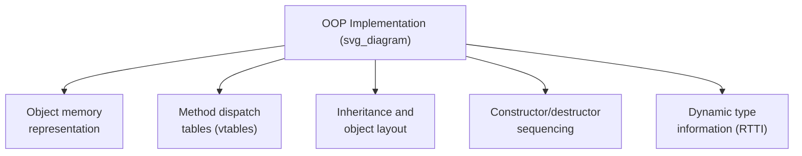
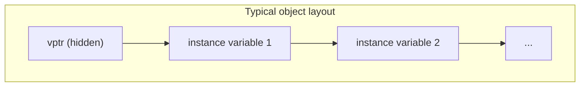
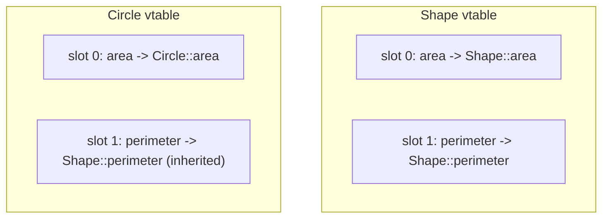
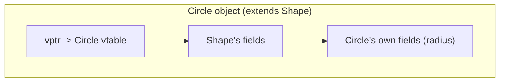
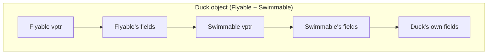
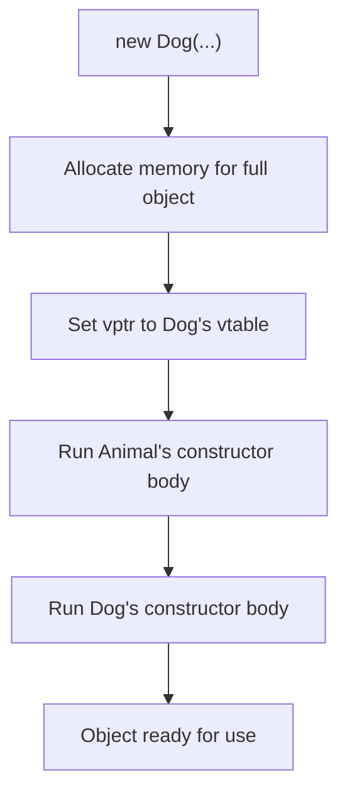

## Implementation of Object-Oriented Constructs

### Overview

Implementing object-oriented language features requires run-time support beyond what a purely procedural language needs: objects must carry enough information to support dynamic dispatch, inheritance must be realized as concrete memory layout and lookup rules, and the compiler and run-time system must cooperate to make polymorphic code both correct and reasonably efficient. This material examines the concrete implementation techniques underlying the object-oriented constructs discussed conceptually elsewhere — object representation, method dispatch tables, inheritance layout, and constructor/destructor sequencing — from an implementer's perspective.

### Object Memory Representation

An object at run time is typically represented as a contiguous block of memory containing its instance variables, along with hidden implementation-level fields the language run-time needs to support dynamic dispatch and, in some languages, run-time type queries.

**Key Points**

- In languages implementing dynamic dispatch via vtables (C++, Java, C#), each object begins with (or otherwise carries) a hidden pointer to its class's vtable, set once at object construction and never changed thereafter (except in unusual low-level scenarios), since an object's class does not change over its lifetime in these languages.
- Instance variables inherited from base classes are typically laid out before instance variables introduced by the object's own class, preserving the property that a derived-class object can be treated, at the level of its inherited fields, identically to a base-class object without reorganizing memory — this is what makes safe upcasting (treating a derived-class pointer as a base-class pointer) a simple pointer-value operation requiring no data copying in single-inheritance scenarios. [Inference — this specific layout convention is a common, though not universally mandated, implementation choice documented across major compiler implementations.]

### Method Dispatch Tables (Vtables)

The virtual method table is the central data structure implementing dynamic dispatch in vtable-based languages. Each class with at least one virtual method has an associated vtable — a fixed-size array of function pointers, one slot per virtual method, shared by all objects of that class (the vtable itself is a single, class-level structure, not duplicated per object).

**Key Points**

- When a derived class overrides a method, the compiler places the derived class's implementation address into the *same slot number* used by the base class, ensuring that code calling through a base-class-typed reference (which only knows the slot number, not the actual class) correctly reaches the overriding implementation.
- When a derived class does *not* override an inherited virtual method, the corresponding vtable slot is simply populated with the base class's implementation address, allowing inherited (non-overridden) behavior to work through exactly the same dispatch mechanism as overridden behavior.
- A virtual call compiles to a small, fixed sequence: dereference the object's vptr to find its vtable, index into the vtable at the method's known slot number, and call the function address found there — a small constant amount of extra work compared to a direct call, but not proportional to the depth of the inheritance hierarchy, since the slot lookup does not require walking up the class chain at call time (that resolution work was already done once, at compile/link time, when the vtable itself was constructed). [Inference — the "constant overhead regardless of hierarchy depth" property is a widely documented characteristic of vtable-based dispatch, though the precise degree of overhead varies with hardware, cache behavior, and compiler optimization.]

### Inheritance and Object Layout Under Single Inheritance

Under single inheritance, object layout is straightforward: the derived class's fields are appended after the base class's fields, and if both classes use virtual methods, they share a common vtable structure with the derived class's vtable extending the base class's slot assignments.

This layout allows a `Circle*` to be used directly as a `Shape*` without any pointer adjustment, since the `Shape` portion of the object begins at the same address as the full `Circle` object.

### Inheritance and Object Layout Under Multiple Inheritance

Under multiple inheritance, a derived class incorporates multiple, independently laid-out base-class subobjects, which — as discussed under multiple inheritance's complications — requires pointer (this-pointer) adjustment when converting between different base-class views of the same object.

**Key Points**

- A `Duck*` used directly as a `Flyable*` may require no adjustment (if `Flyable` is laid out first), but the same `Duck*` used as a `Swimmable*` requires the pointer to be adjusted forward by the size of the `Flyable` subobject, since `Swimmable`'s fields begin at a later offset. [Inference — the specific offset calculation and which base class is placed first are compiler- and ABI-specific implementation details, not mandated uniformly by any language specification.]
- This adjustment is computed at compile time (a fixed, known offset for a non-virtual base) and inserted automatically wherever the compiler generates a conversion between the derived type and a specific base type, remaining transparent to ordinary source code.

### Virtual Inheritance Implementation

Implementing virtual inheritance (used to share a single copy of a common ancestor under diamond-shaped hierarchies) generally requires an additional layer of indirection, since the offset to the shared base subobject can no longer be a single fixed constant known purely from the immediate derived class — it may differ depending on which further-derived class the object actually belongs to.

**Key Points**

- A common implementation technique stores the offset to the virtual base subobject in the vtable itself (or in a related side table), requiring an extra indirect lookup — through the vtable — to locate the shared base, rather than a simple compile-time-constant offset. [Inference — this is a documented general implementation technique used by major C++ compilers, though the exact mechanism (vtable-embedded offset versus a separate table) varies between compiler implementations and is not standardized by the C++ language specification.]
- This extra indirection is the concrete source of virtual inheritance's additional run-time cost relative to non-virtual multiple inheritance, and it is why virtual inheritance is generally used selectively — only where the diamond-sharing semantics are actually needed — rather than applied by default to every base class.

### Constructor and Destructor Sequencing Implementation

At the implementation level, constructing a derived-class object requires the compiler to generate code that first invokes the appropriate base-class constructor(s), then executes the derived class's own constructor body, ensuring the inherited portion of the object is fully initialized before derived-class-specific initialization proceeds.

**Key Points**

- The vptr is typically set to the *most-derived* class's vtable before any constructor body runs, but during base-class constructor execution, virtual calls made from within the base constructor in some languages resolve to the base class's own version, not the derived class's override — a subtlety arising because the object is not yet fully constructed at that point, and language semantics generally avoid dispatching to a derived-class override that might depend on derived-class fields not yet initialized. [Inference — the exact behavior of virtual calls during base-class construction is a documented, but easily overlooked, language-specific rule, and differs between C++ (which uses the base class's own vtable during base construction) and some other languages; consult specific language documentation for precise guarantees.]
- Destructor sequencing (where deterministic destructors exist, as in C++) runs in the reverse order: derived-class destructor body first, then base-class destructor body, mirroring construction's base-to-derived order but reversed, ensuring derived-class-specific cleanup occurs while the inherited portion of the object is still intact.

### Run-Time Type Information (RTTI)

Some languages provide a mechanism for code to query an object's actual run-time type explicitly, beyond what dynamic dispatch alone provides implicitly.

- **C++** provides `typeid` and `dynamic_cast`, both relying on run-time type information stored alongside (or referenced from) the vtable, allowing safe downcasting (checked at run time, failing gracefully via a null pointer or an exception depending on the cast form) and explicit type identification. [Confirmed]
- **Java** provides `instanceof` and reflection (`getClass()`), relying on the JVM's built-in, pervasive type metadata, which is more comprehensive by default than C++'s opt-in RTTI, consistent with Java's managed-runtime design philosophy. [Confirmed]
- **C#** provides `is`, `as`, and reflection (`GetType()`), functioning similarly to Java's mechanisms, consistent with its managed common-language-runtime execution model. [Confirmed]

**Key Points**

- RTTI implementation typically requires storing additional metadata per class (type name, base class relationships) accessible from an object's vtable pointer, imposing a small additional memory and, in C++'s case, potentially avoidable cost if RTTI features are disabled by the compiler for performance-sensitive builds. [Inference — the option to disable RTTI for performance is a documented compiler-specific feature in some C++ toolchains, not a universal guarantee across all implementations.]

### Comparative Summary of Implementation Techniques

| Implementation Aspect | C++ | Java | C# | Smalltalk |
| --- | --- | --- | --- | --- |
| Dispatch mechanism | Vtable | Vtable (JVM-internal) | Vtable (CLR-internal) | Message lookup (with caching) |
| Multiple inheritance layout | Multiple subobjects, this-pointer adjustment | Not applicable to classes | Not applicable to classes | Not applicable (single inheritance) |
| Virtual inheritance support | Yes, via indirect offset lookup | Not applicable | Not applicable | Not applicable |
| RTTI | Opt-in (`typeid`, `dynamic_cast`) | Pervasive (`instanceof`, reflection) | Pervasive (`is`, `as`, reflection) | Pervasive (all objects support introspection) |
| Memory management of objects | Manual or stack-based | Garbage collected | Garbage collected | Garbage collected |

**Related Topics**

- Dynamic binding and polymorphism
- Multiple inheritance and its complications
- Inheritance mechanisms
- Method overriding and virtual methods
- Activation records and run-time stack management
- Design issues for object-oriented languages compared