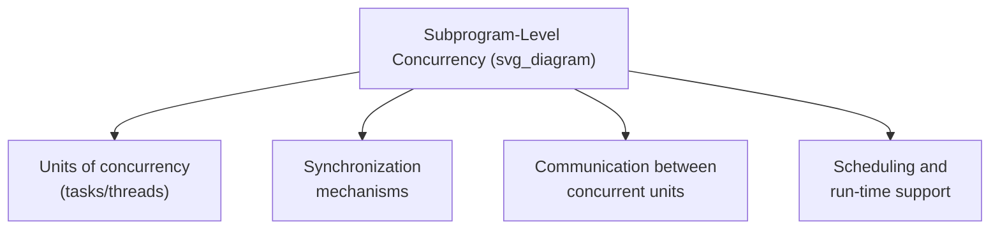
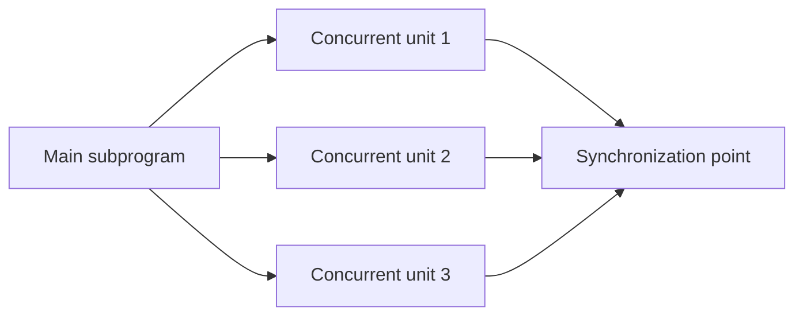

## Introduction to Subprogram-Level Concurrency

### Definition and Motivation

Subprogram-level concurrency refers to language mechanisms that allow multiple subprograms — or multiple invocations of the same subprogram — to execute concurrently, meaning their execution can overlap in time rather than proceeding strictly one after another. This is distinguished from instruction-level or processor-level concurrency (handled largely by hardware) in that subprogram-level concurrency is a language-design concern: the language must provide constructs for creating concurrent units of execution, coordinating their access to shared data, and synchronizing their completion. Concurrency support exists to exploit multi-core and multi-processor hardware for performance, to model inherently concurrent problem domains (simulations, servers handling multiple clients), and to structure programs whose logical activities naturally proceed independently of one another.

### Physical Versus Logical Concurrency

A foundational distinction in this topic is between concurrency that is genuinely simultaneous at the hardware level and concurrency that is merely interleaved.

- **Physical concurrency** occurs when a system has multiple actual processors or cores, allowing separate instruction streams to execute at literally the same moment in time.
- **Logical concurrency** occurs when a system has only a single processor (or fewer processors than concurrent units), and the illusion of simultaneous execution is created by rapidly switching (time-slicing) among the concurrent units, so that from a sufficiently coarse-grained observation, multiple activities appear to progress at once even though only one instruction stream actually executes at any given instant.

**Key Points**

- From a language-design perspective, the distinction between physical and logical concurrency is often deliberately hidden from the programmer: language-level concurrency constructs are typically designed to have the same semantics regardless of whether the underlying hardware provides physical or only logical concurrency, allowing the same program to run correctly (though with different performance characteristics) on single-core and multi-core systems. [Inference — this hidden-distinction design goal is a commonly stated principle in concurrency language design, though the degree to which any specific language achieves fully transparent behavior varies by implementation.]

### Units of Concurrency: Tasks and Threads

The basic unit of concurrent execution goes by different names in different languages and contexts — commonly **task**, **thread**, **process**, or **coroutine** — each with somewhat different connotations regarding weight (resource cost), independence, and how they are created.

**Key Points**

- A **thread** (in most contemporary usage) typically refers to a relatively lightweight concurrent unit that shares memory (the address space) with other threads in the same process, making inter-thread communication straightforward via shared variables, but also introducing the need for explicit synchronization to prevent conflicting concurrent access to that shared memory.
- A **process**, by contrast, is typically a heavier-weight unit with its own separate memory space, requiring more explicit mechanisms (message passing, shared memory regions specifically set up for the purpose) for inter-process communication, since processes do not implicitly share ordinary variables the way threads within one process do.
- The exact terminology and weight associated with "task" versus "thread" versus "process" differs by language and operating system context; Ada, for instance, uses "task" as its primary language-level concurrency construct, while Java and C# use "thread" as the primary construct, and the relative overhead of creating and scheduling each differs by implementation and underlying operating system support. [Inference — precise terminology and performance characteristics are documented per language/platform and are not governed by a single universal standard across all systems.]

### The Need for Synchronization

Because concurrent units may access shared data, or must coordinate the order in which certain events occur, language-level concurrency support must address **synchronization** — mechanisms ensuring correct ordering and safe access when concurrent units interact.

- **Cooperation synchronization** ensures that one concurrent unit does not proceed until another has completed some necessary prerequisite work (e.g., a consumer waiting for a producer to make data available).
- **Competition synchronization** ensures that when multiple concurrent units need access to the same shared resource (a variable, a data structure, a device), their accesses do not interleave in a way that produces incorrect results — often implemented by ensuring only one unit can access the shared resource at a time (mutual exclusion).

**Key Points**

- Without adequate synchronization, concurrent access to shared data can produce a **race condition** — a situation where the final outcome of the program depends on the unpredictable relative timing of concurrent units, potentially producing different (and often incorrect) results on different executions of the same program with the same input. [Confirmed — race conditions are a well-documented category of concurrency bug across the concurrency literature.]
- The design of synchronization mechanisms is one of the most significant and challenging aspects of concurrent language design, since mechanisms that are too coarse-grained can eliminate concurrency's performance benefits (by serializing too much of the program), while mechanisms that are too fine-grained or improperly used can fail to prevent race conditions or introduce new problems such as deadlock. [Inference — this characterization of the difficulty and tradeoffs in synchronization design is a widely shared view across concurrent-programming language design literature.]

### Historical and Design Context

Concurrency support has been added to programming languages through several different design approaches over time:

- **Library-based concurrency** — the language itself provides no dedicated syntax for concurrency; instead, concurrent execution is provided through calls to library routines or operating-system services (e.g., POSIX threads used from C), meaning the compiler has no special awareness of concurrency and cannot assist with catching concurrency-related errors at compile time.
- **Language-level concurrency constructs** — the language itself provides dedicated syntax and semantics for creating and synchronizing concurrent units (Ada's `task` construct, for example), allowing the compiler to be aware of, and in some cases assist in checking, concurrent program structure.
- **Concurrency via language-provided abstractions built on an underlying model** — many contemporary languages (Java, C#) provide concurrency as a structured part of the standard library and run-time system (threads as objects, built-in synchronization primitives), occupying a middle position between raw library calls and fully dedicated language syntax. [Inference — this three-way categorization is a simplification used for organizing the landscape of design approaches, and specific languages may combine elements of more than one approach.]

### Scope of Subsequent Material

Subprogram-level concurrency, as a broad topic, encompasses several major subtopics that are typically treated individually in depth: the specific mechanisms used to create and terminate concurrent units, the categories and implementations of synchronization primitives (semaphores, monitors, message passing, rendezvous), and the language-specific realizations of these ideas (Ada tasking, Java/C# thread and lock-based models, and higher-level abstractions such as async/await or actor models found in more recent language designs). This introduction establishes the shared vocabulary and foundational distinctions (physical versus logical concurrency, tasks/threads/processes, cooperation versus competition synchronization) that this subsequent, more detailed material builds upon.

**Related Topics**

- Synchronization mechanisms: semaphores, monitors, and message passing
- Race conditions and mutual exclusion
- Ada tasking model
- Java and C# thread-based concurrency
- Deadlock and its avoidance
- Design issues for object-oriented languages compared