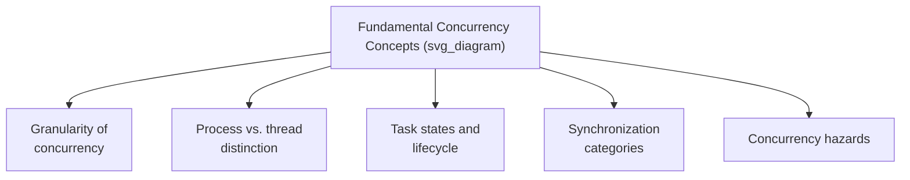
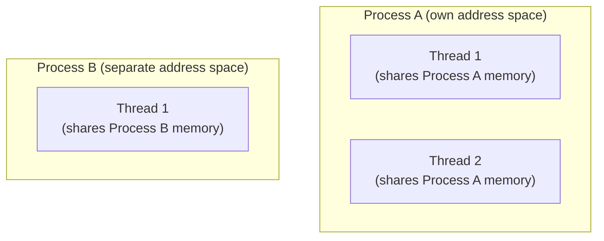
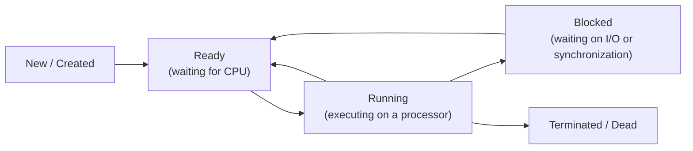
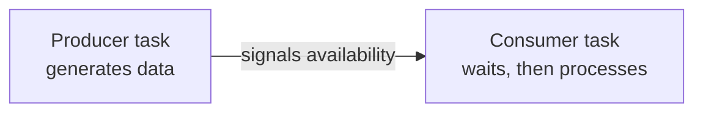
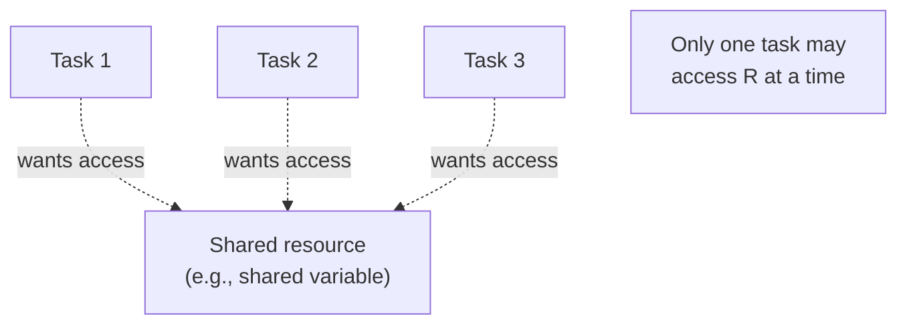

## Fundamental Concepts of Concurrent Execution

### Overview

Understanding language support for concurrency requires a shared vocabulary of foundational concepts that recur across every concurrency model — regardless of whether a specific language implements them through library calls, dedicated syntax, or run-time-managed abstractions. This material establishes those core concepts: the granularity levels at which concurrency can occur, the distinction between processes and threads, the states a concurrent unit passes through during its lifetime, the categories of synchronization problems, and the classic hazards (race conditions, deadlock, starvation) that any concurrency model must guard against.



### Granularity of Concurrency

Concurrency can be discussed at several distinct levels of granularity, each requiring different kinds of language or hardware support:

- **Instruction-level concurrency** — multiple machine instructions executed simultaneously via hardware pipelining or superscalar execution, generally invisible to and unmanaged by the programming language itself.
- **Statement-level concurrency** — potential concurrent execution of individual statements within a single subprogram, relevant primarily in specialized parallel languages or compiler auto-parallelization contexts.
- **Subprogram-level (unit-level) concurrency** — concurrent execution of entire subprograms or logically distinct units of work, the level at which most general-purpose language concurrency constructs (threads, tasks) operate, and the primary focus of language-level concurrency design.
- **Program-level concurrency** — concurrent execution of entirely separate programs (processes), typically managed by the operating system rather than by any single program's language constructs.

**Key Points**

- Language-level concurrency support, as generally discussed in programming-language design, is concentrated at the subprogram/unit level, since this is the granularity at which language constructs (task declarations, thread creation calls) typically operate. [Inference — this focus on subprogram-level granularity as the primary concern of language design is a common framing in language-design literature, though instruction-level and statement-level concurrency remain relevant to compiler and hardware design.]

### Processes Versus Threads

A foundational distinction, already introduced in the broader concurrency overview, deserves fuller treatment here as a core conceptual building block.



**Key Points**

- A **process** has its own independent memory (address space), meaning two processes cannot directly read or write each other's variables without an explicit inter-process communication mechanism (shared memory segments, pipes, sockets) set up deliberately for that purpose.
- A **thread** exists within a process and shares that process's memory with any other threads in the same process, meaning threads can communicate simply by reading and writing ordinary shared variables — a major convenience, but also the direct source of the need for synchronization, since uncoordinated concurrent access to that shared memory is what produces race conditions.
- Creating and switching between threads is generally less resource-intensive than creating and switching between processes, since threads avoid the overhead of setting up and tearing down a separate address space — a property frequently cited as the main practical reason many concurrency-heavy applications favor threads over separate processes when shared-memory communication is acceptable for the problem. [Inference — the specific magnitude of this overhead difference is platform- and operating-system-dependent, though the general direction of the comparison is a standard, widely repeated characterization.]

### Task/Thread Lifecycle States

A concurrent unit (task or thread) typically passes through a sequence of states over its lifetime, managed by the underlying run-time system or operating system scheduler.



**Key Points**

- A task is **ready** when it is eligible to execute but not currently assigned to a processor (waiting its turn under the scheduler's discretion); it is **running** when actually executing instructions on a processor at a given instant.
- A task becomes **blocked** when it cannot proceed further until some external event occurs — commonly, waiting for input/output to complete, or waiting on a synchronization mechanism (a lock, a semaphore, a message) that has not yet become available — and returns to the ready state once that condition is satisfied.
- The specific set of named states and their exact transition rules vary somewhat across concurrency models and language run-time systems, but the general new/ready/running/blocked/terminated pattern is a widely used conceptual model for describing task lifecycle across the concurrency literature. [Inference — exact state names and transition granularity differ by specific run-time system or language specification; the model presented here is a common generalized version rather than a single universally standardized state machine.]

### Cooperation Synchronization

**Cooperation synchronization** addresses situations where one concurrent unit must wait for another to complete some necessary work before it can proceed — the units are cooperating toward a shared goal, and their execution order (for at least some portion of their work) matters for correctness.



**Key Points**

- The classic example is the **producer-consumer problem**: a producer task generates data items and places them into a shared buffer, while a consumer task removes and processes them; the consumer must not attempt to consume from an empty buffer, and (if the buffer has bounded capacity) the producer must not attempt to add to a full buffer — both are cooperation constraints requiring the tasks to wait for each other at appropriate points. [Confirmed — the producer-consumer problem is a standard, well-documented example used throughout the concurrency literature.]
- Cooperation synchronization is fundamentally about **ordering**: ensuring certain events happen before others, regardless of which task happens to be scheduled first by the underlying run-time system.

### Competition Synchronization

**Competition synchronization** addresses situations where multiple concurrent units need access to the same shared resource, and uncoordinated simultaneous access would produce incorrect results — the units are not cooperating toward a shared goal in this specific interaction, but rather competing for exclusive or controlled use of something they all need.



**Key Points**

- The mechanism most commonly used to implement competition synchronization is **mutual exclusion**: ensuring that only one concurrent unit can execute a **critical section** (the portion of code that accesses the shared resource) at any given time, typically enforced through locks, semaphores, or monitors.
- Unlike cooperation synchronization, competition synchronization is not fundamentally about ordering events in a specific sequence, but about preventing simultaneous access — any order of access may be acceptable, as long as accesses do not overlap in time.

### Race Conditions

A **race condition** arises when the correctness of a program's outcome depends on the unpredictable relative timing (interleaving) of concurrent units accessing shared data without adequate synchronization, such that different executions of the same program with the same input can produce different, and potentially incorrect, results.



```
// Two threads both execute: balance = balance + 100
// Without synchronization, this can interleave as:
// Thread A reads balance (say, 500)
// Thread B reads balance (500, before A's write)
// Thread A computes 500 + 100 = 600, writes 600
// Thread B computes 500 + 100 = 600, writes 600
// Final balance: 600 (should have been 700)
```

**Key Points**

- The example above illustrates a classic **lost update**: because the read-modify-write sequence on `balance` is not treated as an indivisible (atomic) operation, one thread's update can be silently overwritten by another's, based purely on the unlucky timing of their interleaving. [Confirmed — the lost-update scenario is a standard, well-documented illustrative example of a race condition in concurrency literature.]
- Race conditions are notoriously difficult to detect through ordinary testing, since they may occur only under specific, timing-dependent interleavings that do not manifest on every execution, making them a frequently cited category of concurrency bug that is especially hard to reproduce and diagnose. [Inference — the characterization of race conditions as difficult to reproduce is a widely shared observation in concurrency literature, reflecting general experience rather than a formally quantifiable claim.]

### Deadlock and Starvation

Two further hazards specifically associated with synchronization mechanisms deserve introduction here, though their detailed treatment (avoidance and detection strategies) belongs to dedicated synchronization-mechanism material:

- **Deadlock** occurs when two or more concurrent units are each waiting for a resource or condition that only another waiting unit can provide, resulting in a cycle of mutual waiting from which none of the involved units can ever proceed. A commonly cited minimal example involves two tasks each holding one of two needed resources while waiting for the other task to release the resource it needs.
- **Starvation** occurs when a specific concurrent unit is perpetually denied access to a resource it needs, not because of a genuine deadlock cycle, but because the scheduling or resource-granting policy repeatedly favors other units, indefinitely postponing the starved unit's progress even though the system as a whole continues to make progress.

**Key Points**

- Deadlock and starvation are distinct hazards: deadlock involves a total halt for the affected units (with no possibility of ever proceeding without external intervention), while starvation involves indefinite but not necessarily permanent delay for one unit, even as other parts of the system continue functioning normally. [Inference — this distinction is a standard conceptual separation made throughout concurrency literature.]

### Summary of Foundational Concepts

| Concept | Core Idea |
| --- | --- |
| Physical vs. logical concurrency | Genuine hardware simultaneity versus time-sliced illusion of simultaneity |
| Process vs. thread | Separate address space versus shared address space within one process |
| Task states | New, ready, running, blocked, terminated |
| Cooperation synchronization | Ensuring correct ordering between dependent concurrent units |
| Competition synchronization | Ensuring exclusive/controlled access to a shared resource |
| Race condition | Outcome depends on unpredictable timing of unsynchronized shared-data access |
| Deadlock | Cyclic, permanent mutual waiting among concurrent units |
| Starvation | Indefinite denial of resource access to one unit due to scheduling policy |

**Related Topics**

- Introduction to subprogram-level concurrency
- Synchronization mechanisms: semaphores, monitors, and message passing
- Deadlock avoidance and detection strategies
- Ada tasking model
- Java and C# thread-based concurrency
- The producer-consumer problem as a synchronization case study