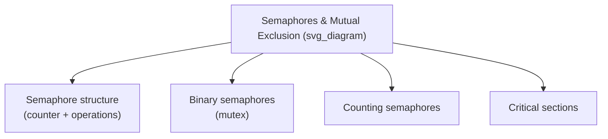

## Semaphores and Mutual Exclusion

### Definition

A **semaphore** is a synchronization construct consisting of an integer counter (or, in a restricted form, a binary flag) together with two atomic operations that increment and decrement it, used to control access to a shared resource among concurrent units. Semaphores were among the earliest general-purpose synchronization mechanisms proposed for concurrent programming and remain foundational to understanding both mutual exclusion and cooperation synchronization, since a semaphore can be used to implement either. **Mutual exclusion** is the property, achieved through semaphores or other mechanisms, that only one concurrent unit at a time may execute within a designated **critical section** — the portion of code that accesses a shared resource in a way that must not overlap with another unit's access.



### The Semaphore Operations

A semaphore provides exactly two operations, traditionally named using Dijkstra's original Dutch-derived terminology, though many languages use more descriptive equivalents:

- **P (wait, or `down`, or `acquire`)** — decrements the semaphore's counter; if the resulting value would be negative (or, in some formulations, if the counter is already zero), the calling task blocks until another task increments the semaphore.
- **V (signal, or `up`, or `release`)** — increments the semaphore's counter; if any tasks are currently blocked waiting on this semaphore, one of them is unblocked (moved to the ready state) as a result.



```
semaphore S = 1;   // initialized to 1: represents one available resource unit

P(S);              // wait: decrement; block if would go negative
// critical section — access to shared resource
V(S);              // signal: increment; wake a waiting task if any
```

**Key Points**

- Both `P` and `V` must be implemented as **atomic operations** — indivisible with respect to other concurrent operations on the same semaphore — since if two tasks could simultaneously read and modify the semaphore's counter without atomicity, the semaphore itself would suffer from the very race conditions it is meant to prevent. [Confirmed — atomicity of the P and V operations is a foundational, well-documented requirement of the semaphore concept as originally formulated.]
- The semaphore's initial value determines its behavior: a semaphore initialized to 1 functions as a mutual-exclusion lock (only one task may pass `P` before a corresponding `V`), while a semaphore initialized to a larger integer $n$ permits up to $n$ concurrent tasks to hold the resource simultaneously, useful for scenarios such as controlling access to a pool of $n$ interchangeable resources.

### Binary Semaphores (Mutex Locks)

A **binary semaphore**, often called a **mutex** (mutual exclusion lock), is a semaphore restricted to only the values 0 and 1, used specifically to enforce that at most one task executes a critical section at a time.



```
mutex M = 1;

// Task A
P(M);
balance = balance + 100;   // critical section
V(M);

// Task B
P(M);
balance = balance + 50;    // critical section — cannot overlap with Task A's
V(M);
```

**Key Points**

- With `M` initialized to 1, the first task to call `P(M)` succeeds immediately (decrementing to 0) and proceeds into the critical section; any second task calling `P(M)` before the first task calls `V(M)` finds the semaphore at 0 and blocks, guaranteeing the two critical sections cannot overlap in time.
- Binary semaphores directly implement competition synchronization, as introduced in the fundamental concepts material: they prevent simultaneous access to a shared resource without imposing any particular required order among the tasks contending for it, beyond whichever order the underlying scheduler happens to grant access.

### Counting Semaphores

A **counting semaphore** permits its integer value to range over more than just 0 and 1, allowing it to represent availability of a resource pool with multiple interchangeable units.



```
semaphore ConnectionPool = 5;   // 5 available database connections

P(ConnectionPool);
// use one of the 5 connections
V(ConnectionPool);
```

**Key Points**

- A counting semaphore initialized to $n$ allows up to $n$ tasks to simultaneously pass `P` and proceed (each decrementing the counter by one) before any task blocks, making it naturally suited to modeling a bounded pool of identical resources (database connections, worker threads, buffer slots) rather than a single all-or-nothing lock.
- Counting semaphores can also directly implement cooperation synchronization: a semaphore initialized to 0, used so that a "signaling" task calls `V` to indicate an event has occurred and a "waiting" task calls `P` to block until that signal arrives, effectively functions as a simple event-notification mechanism rather than a resource-access lock. [Inference — this dual-purpose framing (semaphores for both competition and cooperation) is a standard characterization in concurrency literature, describing capability rather than a fixed rule about how any specific semaphore must be used.]

### Using Semaphores for Cooperation: The Producer-Consumer Problem

Semaphores are commonly illustrated by solving the producer-consumer problem introduced in the fundamental-concepts material, using two counting semaphores to track buffer availability and one binary semaphore for mutual exclusion on the buffer itself.



```
semaphore empty = N;     // count of empty buffer slots (N = buffer size)
semaphore full = 0;      // count of filled buffer slots
mutex bufferLock = 1;    // protects the buffer data structure itself

// Producer
P(empty);                // wait for an empty slot
P(bufferLock);
    add item to buffer
V(bufferLock);
V(full);                 // signal a filled slot now exists

// Consumer
P(full);                 // wait for a filled slot
P(bufferLock);
    remove item from buffer
V(bufferLock);
V(empty);                // signal an empty slot now exists
```

**Key Points**

- The `empty` and `full` semaphores together enforce cooperation synchronization: a producer cannot add to a full buffer (blocked on `P(empty)` when the count reaches 0), and a consumer cannot remove from an empty buffer (blocked on `P(full)` when the count reaches 0).
- The separate `bufferLock` binary semaphore enforces competition synchronization on the buffer's internal data structure itself, ensuring that a producer's insertion and a consumer's removal (or two producers' simultaneous insertions) do not corrupt the buffer through overlapping, unsynchronized modification.
- The ordering of `P(empty)`/`P(bufferLock)` in the producer (and the analogous ordering in the consumer) matters: acquiring the resource-count semaphore before the mutual-exclusion lock is a specific pattern used to avoid a task holding the mutex while potentially blocking for an extended period on the count semaphore, a design consideration relevant to avoiding certain deadlock and performance pitfalls. [Inference — the specific recommended ordering and its rationale are drawn from widely repeated treatments of the classic producer-consumer solution in concurrency textbooks, though exact deadlock/performance consequences depend on the specific implementation details of blocking behavior.]

### Problems and Limitations of Semaphores

Semaphores, while foundational, are widely regarded as a relatively low-level and error-prone synchronization primitive:

- **No enforced pairing.** Nothing in the semaphore construct itself ensures that every `P` operation is matched by a corresponding `V`; a programmer who forgets a `V` call (e.g., due to an exception or an early return bypassing it) leaves the semaphore permanently unavailable to other tasks, and a programmer who calls `V` without a matching `P` can incorrectly permit more concurrent access than intended. [Confirmed — the lack of structural pairing enforcement is a well-documented critique of the raw semaphore construct across concurrency literature.]
- **Scattered critical section logic.** Because `P` and `V` calls can be placed anywhere in a program by any task with access to the semaphore variable, correct usage depends entirely on programmer discipline across potentially many, widely separated pieces of code, making semaphore-based programs difficult to verify for correctness by inspection.
- **No language-level structural guarantee.** Semaphores, as originally conceived, are ordinary shared variables manipulated by explicit operations, rather than a structural language construct that syntactically bundles a critical section with its protection — a gap that later mechanisms such as monitors were specifically designed to address. [Inference — the framing of monitors as a direct response to these specific semaphore limitations is a standard historical narrative in concurrency language-design literature.]

**Key Points**

- These limitations are the primary motivation cited in language-design literature for the development of higher-level synchronization constructs (monitors, and later language-integrated constructs such as Java's `synchronized` blocks or C#'s `lock` statement), which aim to provide the same underlying capability as semaphores while reducing the opportunity for the specific classes of programmer error semaphores are prone to. [Inference — this motivational framing is a standard narrative connecting semaphores to later synchronization mechanisms in comparative concurrency-language design discussions.]

### Semaphores in Practice Across Languages

| Language/System | Semaphore Support |
| --- | --- |
| POSIX (C) | `sem_t` with `sem_wait`/`sem_post` (library-based, not language syntax) |
| Java | `java.util.concurrent.Semaphore` class, with `acquire()`/`release()` methods |
| C# | `System.Threading.SemaphoreSlim` and `Semaphore` classes |
| Ada | Not a primary construct; Ada favors the higher-level `protected object` and rendezvous mechanisms instead |

**Related Topics**

- Fundamental concepts of concurrent execution
- Monitors as a structured synchronization mechanism
- Deadlock avoidance and detection strategies
- The producer-consumer problem as a synchronization case study
- Java and C# thread-based concurrency
- Ada tasking model