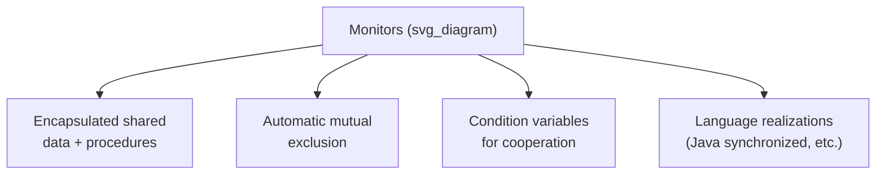

## Monitors and Structured Synchronization

### Definition

A **monitor** is a language-level construct that bundles a shared data structure together with the set of procedures (methods) that operate on it, combined with an implicit guarantee that only one task may be actively executing inside any of the monitor's procedures at a given time. Monitors were developed specifically to address the limitations of raw semaphores — scattered `P`/`V` calls with no structural enforcement — by moving mutual exclusion out of programmer discipline and into a language-enforced property of the construct itself. Where a semaphore is a bare synchronization primitive that the programmer must remember to use correctly around every access to shared data, a monitor is a structural container: mutual exclusion is automatic simply by virtue of code being written as a monitor procedure.



### Structure of a Monitor

A monitor closely resembles an abstract data type in structure — private data plus a public set of operations — but adds the language-enforced guarantee that calls to those operations are automatically serialized.



```
monitor BoundedBuffer {
    private data: array[N] of Item;
    private count, in, out: Integer := 0;

    procedure insert(item : Item) {
        // automatically mutually exclusive with any other
        // monitor procedure call, including concurrent
        // calls to insert or remove
        data[in] = item;
        in = (in + 1) mod N;
        count = count + 1;
    }

    procedure remove() : Item {
        item = data[out];
        out = (out + 1) mod N;
        count = count - 1;
        return item;
    }
}
```

**Key Points**

- The monitor's internal data (`data`, `count`, `in`, `out`) is inaccessible to any code outside the monitor, exactly as with the encapsulation covered under abstract data types — the *only* way to interact with the shared data is through the monitor's own procedures.
- Mutual exclusion among calls to the monitor's procedures is automatic and requires no explicit `P`/`V` calls anywhere in the calling code: if one task is executing inside `insert`, any other task calling either `insert` or `remove` on the same monitor instance is automatically blocked (queued) until the first task exits the monitor. [Confirmed — automatic serialization of monitor procedure calls is the defining, foundational property of the monitor construct as originally formulated.]
- This structural guarantee directly addresses the semaphore limitations discussed previously: a programmer cannot forget to "release" the monitor's implicit lock, since the language itself releases it automatically when a procedure call returns, removing an entire category of programmer error that raw semaphores are prone to.

### The Need for Condition Variables

Automatic mutual exclusion alone solves competition synchronization but does not, by itself, solve cooperation synchronization — a monitor procedure may need to make a calling task wait for some condition (the buffer is not full, the buffer is not empty) that depends on the monitor's current data state, without holding the monitor's implicit lock while waiting (since holding it would prevent any other task from ever entering the monitor to change that state).

Monitors address this with **condition variables** — a distinct synchronization construct, local to the monitor, supporting two operations:

- **wait** — the calling task releases the monitor's implicit lock and blocks until another task signals the same condition variable, at which point it re-acquires the lock and resumes.
- **signal** (sometimes called `notify`) — wakes a task blocked on the condition variable (if any), allowing it to eventually re-acquire the lock and continue.



```
monitor BoundedBuffer {
    private data: array[N] of Item;
    private count, in, out: Integer := 0;
    condition notFull, notEmpty;

    procedure insert(item : Item) {
        if (count == N) {
            wait(notFull);          // release lock, block until space exists
        }
        data[in] = item;
        in = (in + 1) mod N;
        count = count + 1;
        signal(notEmpty);           // wake a waiting consumer, if any
    }

    procedure remove() : Item {
        if (count == 0) {
            wait(notEmpty);         // release lock, block until an item exists
        }
        item = data[out];
        out = (out + 1) mod N;
        count = count - 1;
        signal(notFull);            // wake a waiting producer, if any
        return item;
    }
}
```

**Key Points**

- The `wait` operation's release-lock-and-block behavior must be atomic (the lock release and the act of becoming blocked must happen as a single indivisible step) — otherwise a race condition could arise where the condition changes between releasing the lock and actually blocking, causing a missed signal. [Confirmed — this atomicity requirement is a well-documented, essential property of correct condition-variable implementation.]
- Unlike a semaphore's counter, a condition variable itself carries no stored value or count; a `signal` call on a condition variable with no task currently waiting has no lasting effect (it is not "remembered" for a future `wait` call), which is a key semantic difference from a semaphore's `V` operation, and a common source of subtle bugs if a programmer expects otherwise. [Confirmed — the lack of a "memory" for signals on condition variables, versus the counting behavior of a semaphore, is a standard, well-documented distinction in concurrency literature.]

### Signal-and-Wait Versus Signal-and-Continue Semantics

A specific design issue in monitor implementations concerns exactly what happens immediately after a `signal` call, since both the signaling task and the newly awakened task cannot simultaneously hold the monitor's implicit lock.

- **Signal-and-wait** — the signaling task immediately blocks (giving up its turn), allowing the newly signaled task to proceed immediately with the guarantee that the condition it waited for is still true.
- **Signal-and-continue** — the signaling task continues executing (retaining the lock), and the newly signaled task must wait its turn to re-acquire the lock later, at which point the condition it originally waited for might no longer hold (another task could have changed it in the meantime), requiring the awakened task to re-check its condition, typically via a `while` loop rather than a single `if` check.



```
// Defensive pattern for signal-and-continue semantics:
procedure remove() : Item {
    while (count == 0) {           // re-check after waking, not just once
        wait(notEmpty);
    }
    // ... proceed
}
```

**Key Points**

- Signal-and-continue is the more commonly implemented semantics in practical language realizations (including Java's built-in monitor-like `synchronized`/`wait`/`notify` mechanism), which is why documentation and established practice consistently recommend re-checking the waited-for condition in a loop after `wait` returns, rather than assuming the condition is still guaranteed true. [Confirmed — Java's documented semantics explicitly require re-checking conditions in a loop after `wait()`, reflecting signal-and-continue behavior.]
- This distinction is a recurring, easily overlooked source of subtle concurrency bugs, since code written assuming signal-and-wait semantics (a single `if` check being sufficient) can fail unpredictably under signal-and-continue semantics, particularly when multiple tasks are waiting on the same condition variable simultaneously.

### Comparing Monitors to Semaphores

| Aspect | Semaphores | Monitors |
| --- | --- | --- |
| Mutual exclusion enforcement | Programmer-managed (`P`/`V` calls) | Automatic (structural property of the construct) |
| Risk of forgotten release | High (easy to omit a `V`) | Eliminated (lock released automatically on procedure exit) |
| Data encapsulation | Not inherent — semaphore is separate from the data it protects | Inherent — shared data lives inside the monitor, inaccessible externally |
| Cooperation mechanism | Counting semaphores used directly as signals | Condition variables, used specifically alongside the mutual-exclusion guarantee |
| Structural correctness verification | Difficult — correctness depends on scattered, matched `P`/`V` usage | Easier — mutual exclusion is guaranteed by construction; remaining correctness concerns are localized to condition-variable usage |

### Language Realizations of the Monitor Concept

Few contemporary languages provide a `monitor` keyword exactly as originally conceived, but the underlying concept is realized through closely related constructs:

- **Java** — the `synchronized` keyword, applied to a method or a block, provides automatic mutual exclusion on an object's implicit monitor lock; the `wait()`, `notify()`, and `notifyAll()` methods (inherited from `Object`) provide condition-variable-like cooperation, using signal-and-continue semantics. [Confirmed]
- **C#** — the `lock` statement provides automatic mutual exclusion around a block of code, and the `Monitor` class (in `System.Threading`) provides explicit `Wait`/`Pulse`/`PulseAll` methods offering condition-variable-like functionality, closely mirroring Java's model. [Confirmed]
- **Ada** — the `protected object` construct provides monitor-like automatic mutual exclusion for its protected procedures and functions, with **entry** declarations (guarded by boolean conditions called barriers) providing a structured alternative to explicit condition variables for cooperation synchronization. [Confirmed]

**Key Points**

- Ada's protected-object entry barriers differ structurally from explicit `wait`/`signal` condition variables: rather than the programmer explicitly calling `wait` inside a procedure body, an entry declares a boolean barrier condition upfront, and the Ada run-time system automatically evaluates whether a calling task may proceed, without the programmer writing an explicit block-and-resume sequence. [Confirmed — Ada's protected-object barrier mechanism is documented as a distinct approach from the classic explicit condition-variable model.]
- Despite syntactic differences across these three realizations, all share the monitor's defining core property: automatic, language-enforced mutual exclusion around access to encapsulated shared data, with a separate, explicit mechanism layered on top specifically to handle cooperation synchronization.

**Related Topics**

- Semaphores and mutual exclusion
- Fundamental concepts of concurrent execution
- Ada tasking model
- Java and C# thread-based concurrency
- The producer-consumer problem as a synchronization case study
- Deadlock avoidance and detection strategies