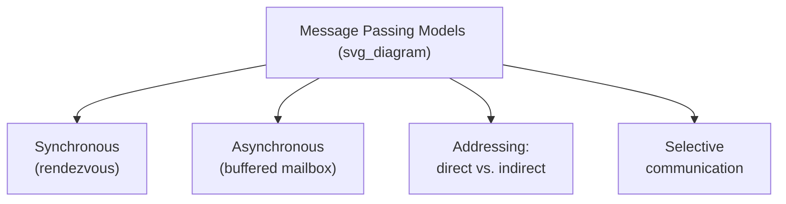
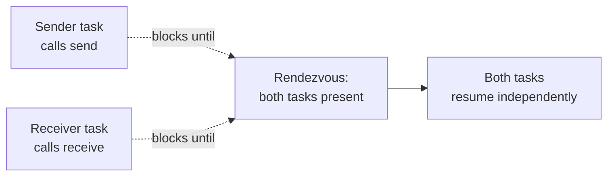
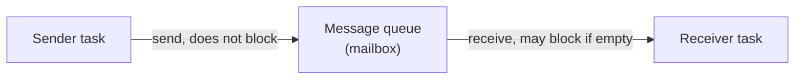

## Message Passing Models

### Definition

Message passing is a synchronization and communication model for concurrent units in which tasks interact exclusively by sending and receiving discrete messages, rather than by reading and writing shared memory. Where semaphores and monitors coordinate access to data that multiple tasks can directly see and modify, message passing avoids shared mutable state between tasks entirely: information moves between tasks only through explicit send and receive operations, and (in its purest form) no variable is ever simultaneously writable by more than one task. This makes message passing a natural fit both for concurrency within a single shared-memory system and for distributed systems where tasks genuinely reside in physically separate memory spaces (separate processes or separate machines) and have no shared memory to coordinate through in the first place.



### Synchronous Message Passing: The Rendezvous Model

In **synchronous** message passing (often called a **rendezvous**), the sending task and the receiving task must both be ready to communicate at the same logical moment: the sender blocks until the receiver is ready to accept the message, and (in many formulations) the receiver blocks until a sender is ready to send.



**Key Points**

- The defining property of a rendezvous is that the send and receive operations act as a synchronization point for both parties, not just a data transfer: neither task can proceed past its send/receive call until the other party has also arrived at the corresponding call, meaning the two tasks are momentarily forced into a known, coordinated state relative to each other. [Confirmed — this mutual-blocking property is the defining, foundational characteristic of the rendezvous model as used in languages such as Ada.]
- Because both tasks block until the meeting occurs, no message buffer is strictly required in the pure rendezvous model — the message is transferred directly at the moment of the meeting — which simplifies the underlying implementation but means a sender with no immediately available receiver simply waits, potentially idling a task that could otherwise have continued other useful work.

### Asynchronous Message Passing: The Mailbox Model

In **asynchronous** message passing, a sending task does not block waiting for a receiver to be ready; instead, the message is placed into a buffer (commonly called a **mailbox** or **message queue**) associated with the receiver, and the sender continues executing immediately after the send completes, regardless of whether or when the receiver actually retrieves the message.



**Key Points**

- Asynchronous message passing decouples the sender's and receiver's execution timing: a sender can send many messages in rapid succession without waiting for any of them to be individually consumed, provided the mailbox has sufficient capacity, making this model well suited to producer-style tasks that should not be delayed by a potentially slower consumer.
- The receiving task typically still blocks (waits) if it attempts to receive from an empty mailbox, meaning asynchronous message passing is asymmetric: the sender never blocks (subject to buffer capacity limits), while the receiver may block when no message is yet available — a distinction from the fully symmetric blocking behavior of the rendezvous model.
- A mailbox with finite capacity reintroduces a degree of synchronous behavior at its capacity limit: if the mailbox becomes full, a further `send` call must either block (making that specific send synchronous after all), fail with an error, or discard the message, depending on the specific system's design choice — meaning "asynchronous" message passing is often asynchronous only up to a bounded buffer size rather than unconditionally in practice. [Inference — the specific behavior at mailbox capacity (blocking, failing, or discarding) is a documented, system-specific design choice rather than a single universal rule across all message-passing implementations.]

### Direct Versus Indirect Addressing

Message-passing systems differ in how a sender specifies the intended recipient of a message:

- **Direct addressing** — the sender specifies the identity of the receiving task explicitly (e.g., `send(TaskB, message)`), and typically the receiving task also names the specific sender it expects to receive from, or accepts from any sender.
- **Indirect addressing** — messages are sent to, and received from, a named intermediary (the mailbox or channel itself) rather than to a specific task identity, meaning the sender and receiver need not know each other's specific task identities, only the shared mailbox's name.

```mermaid
flowchart TD
    subgraph Direct["Direct addressing"]
        S1["Sender"] -->|send(TaskB, msg)| R1["Task B (named directly)"]
    end
    subgraph Indirect["Indirect addressing"]
        S2["Sender"] -->|send(ChannelX, msg)| C["Channel X"]
        C -->|receive| R2["Any receiver reading Channel X"]
    end
```

**Key Points**

- Indirect addressing provides greater flexibility for system structure, since the specific task actually consuming messages from a channel can change over time (e.g., different worker tasks taking turns servicing the same channel) without senders needing any awareness of, or modification for, that change.
- Direct addressing is generally simpler to reason about (a message's origin and destination are both explicit at the call site) but couples sender and receiver code more tightly to specific task identities, which can complicate scenarios where the set of communicating tasks is not fixed or known in advance. [Inference — this coupling characterization is a standard comparative observation in concurrency and distributed-systems literature rather than a claim specific to any single system's documented behavior.]

### Selective Communication

Many message-passing systems provide a construct allowing a task to wait on multiple possible communication events simultaneously, proceeding with whichever becomes ready first, rather than committing to a single specific send or receive operation in advance.

```ada
select
    accept Deposit(amount : Integer) do
        balance := balance + amount;
    end Deposit;
or
    accept Withdraw(amount : Integer) do
        balance := balance - amount;
    end Withdraw;
or
    delay 5.0;
        -- timeout: proceed if neither Deposit nor Withdraw
        -- is called within 5 seconds
end select;
```

**Key Points**

- Ada's `select` statement, illustrated above, is a well-documented example of selective communication: a task offers to accept a call on any of several named entries, proceeding with whichever entry a calling task actually invokes first, with an optional `delay` (or `else`) branch providing a timeout or non-blocking alternative if no caller arrives. [Confirmed]
- Selective communication is particularly useful for tasks that must remain responsive to multiple kinds of incoming requests without dedicating a separate, permanently blocked receive operation to each individual possibility, since a single `select` construct can span several alternatives at once.

### Comparing Message Passing to Shared-Memory Synchronization

| Aspect | Shared-Memory (Semaphores/Monitors) | Message Passing |
| --- | --- | --- |
| Communication medium | Shared variables, directly readable/writable by multiple tasks | Explicit messages, no shared mutable state required |
| Applicability | Requires a shared address space | Works within a single process or across distributed processes/machines |
| Synchronization mechanism | Locks, condition variables | The send/receive operations themselves (especially in synchronous models) |
| Risk of race conditions on shared data | Present if synchronization is used incorrectly | Reduced, since data is not directly shared — though message ordering and loss issues can still arise |
| Natural fit for distributed systems | Poor (requires simulated shared memory) | Strong (message passing is the native model for physically separate memory) |

**Key Points**

- Message passing is frequently favored in language and system designs explicitly targeting distributed computing, since it does not presuppose a shared address space the way semaphores and monitors fundamentally do — a task on one machine can send a message to a task on another machine using the same conceptual model as two tasks within a single process. [Inference — this framing of message passing as the more natural fit for distributed systems is a widely repeated characterization in concurrency and distributed-systems literature.]
- Even within a single shared-memory system, some language designs deliberately favor message passing over direct shared-memory synchronization as a matter of programming-model philosophy, aiming to reduce the likelihood of race conditions and related bugs by avoiding shared mutable state between tasks altogether — a design philosophy closely associated with the actor model of concurrency. [Inference — this design-philosophy motivation is a commonly cited rationale in language-design discussions of message-passing-oriented concurrency models, such as Erlang's actor-based design.]

### Language Realizations

- **Ada** — provides message passing as a primary, dedicated language construct via task entries, the `accept` statement, and the `select` statement, implementing a synchronous rendezvous model directly in the language's syntax and semantics. [Confirmed]
- **Erlang** — built around the actor model, in which lightweight processes communicate exclusively through asynchronous message passing to named or referenced process identifiers, with no shared mutable state between processes by design. [Confirmed]
- **Java and C#** — do not provide message passing as a core built-in language construct in the same dedicated way as Ada, but support it through library-level abstractions (e.g., Java's `BlockingQueue`, various actor-model libraries layered on top of the base language) rather than dedicated syntax.

**Related Topics**

- Monitors and structured synchronization
- Semaphores and mutual exclusion
- Ada tasking model
- Fundamental concepts of concurrent execution
- The actor model of concurrency
- Deadlock avoidance and detection strategies