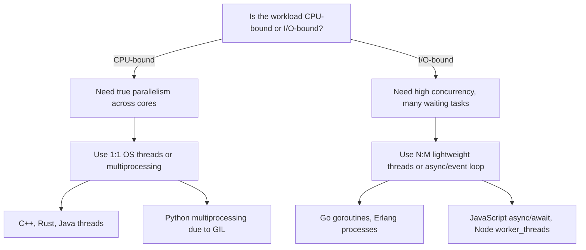

## Threads and Their Language Support

### Conceptual Foundation

A thread is the smallest unit of independent execution that an operating system scheduler manages. A single process can contain multiple threads, all sharing the same address space (heap, global/static memory, open file descriptors) while each thread maintains its own stack, program counter, and register set. This shared-memory model is what distinguishes threads from processes: communication between threads is fast (direct memory access) but requires explicit coordination to avoid corrupting shared state.

Threads exist to exploit parallelism (using multiple CPU cores simultaneously) and concurrency (interleaving multiple logical tasks, even on a single core, to improve responsiveness or throughput during I/O waits). These two goals are related but distinct: a single-core machine can still benefit from threads if tasks frequently block on I/O, while a multi-core machine benefits from threads for CPU-bound work distributed across cores.

### Threading Models

**1:1 (Kernel-Level Threading)**

Each language-level thread maps directly to one OS-scheduled kernel thread. The OS scheduler handles preemption, priority, and core assignment. This is the model used by POSIX threads (pthreads) and Windows threads, and it underlies thread support in C, C++, Java, and Rust's `std::thread`.

- Advantages: true parallelism across cores; the OS scheduler is mature and well-tested; blocking system calls (like file I/O) only block the calling thread, not others.
- Disadvantages: thread creation and context switching carry real OS overhead (typically measured in microseconds), and each thread reserves a fixed-size stack (often 1–8 MB by default), limiting how many threads a process can practically hold — usually thousands, not millions.

**N:M (Hybrid / Green Threads Multiplexed onto Kernel Threads)**

Many lightweight "green threads" or "goroutines" are multiplexed onto a smaller pool of OS threads by a language runtime scheduler. Go's goroutines and Erlang's processes follow this model.

- Advantages: creating a lightweight thread costs kilobytes, not megabytes, so hundreds of thousands of concurrent units are feasible; the runtime scheduler can make cooperative scheduling decisions with more context than the OS kernel has.
- Disadvantages: a blocking system call can potentially stall an entire OS thread (and the green threads multiplexed onto it) unless the runtime intercepts and reschedules around it; the runtime scheduler itself adds a layer of complexity and overhead.

**1:N (Pure Green Threads / Cooperative Threads)**

All threads run within a single OS thread, with the language runtime performing all scheduling. This was Java's original model before JDK 1.2 and is used by cooperative coroutine systems.

[Inference] Pure 1:N models cannot achieve true parallelism on multi-core hardware since only one OS thread is ever active, which is why most modern general-purpose runtimes have moved toward 1:1 or N:M.

### Language-by-Language Support

**C and POSIX Threads (pthreads)**

C has no native threading construct in the language itself; concurrency is provided by the operating system's threading API, most commonly POSIX threads on Unix-like systems.

```c
#include <pthread.h>
#include <stdio.h>

void* worker(void* arg) {
    int id = *(int*)arg;
    printf("Thread %d running\n", id);
    return NULL;
}

int main() {
    pthread_t threads[4];
    int ids[4] = {0, 1, 2, 3};

    for (int i = 0; i < 4; i++)
        pthread_create(&threads[i], NULL, worker, &ids[i]);

    for (int i = 0; i < 4; i++)
        pthread_join(threads[i], NULL);

    return 0;
}
```

Synchronization primitives (`pthread_mutex_t`, `pthread_cond_t`, `pthread_rwlock_t`) are provided but must be used correctly by the programmer; the language offers no compile-time protection against data races.

**C++ (`std::thread`, since C++11)**

C++11 introduced a standard threading library, wrapping the platform's native threads in a portable interface.

```cpp
#include <thread>
#include <iostream>
#include <vector>

void worker(int id) {
    std::cout << "Thread " << id << " running\n";
}

int main() {
    std::vector<std::thread> threads;
    for (int i = 0; i < 4; i++)
        threads.emplace_back(worker, i);

    for (auto& t : threads)
        t.join();

    return 0;
}
```

C++ provides `std::mutex`, `std::lock_guard`, `std::condition_variable`, and atomics (`std::atomic<T>`), but like C, offers no compile-time guarantee against data races — correctness depends on disciplined use of these primitives.

**Java**

Java has built-in language and standard library support for threads, reflecting its design-era emphasis on portable concurrency.

```java
class Worker extends Thread {
    private int id;
    Worker(int id) { this.id = id; }

    public void run() {
        System.out.println("Thread " + id + " running");
    }
}

public class Main {
    public static void main(String[] args) throws InterruptedException {
        Thread[] threads = new Thread[4];
        for (int i = 0; i < 4; i++) {
            threads[i] = new Worker(i);
            threads[i].start();
        }
        for (Thread t : threads) t.join();
    }
}
```

Java threads map 1:1 to OS threads on modern JVMs. The `synchronized` keyword and `java.util.concurrent` package (introduced in Java 5) provide higher-level constructs: `ExecutorService`, `ConcurrentHashMap`, `CountDownLatch`, and atomic classes like `AtomicInteger`. Java 21 introduced **virtual threads** (Project Loom) as a standard feature, providing lightweight, JVM-managed threads that follow the N:M model while keeping the same `Thread` API, addressing the scalability limits of 1:1 threading for I/O-bound workloads.

**Python**

Python's `threading` module provides an OS-thread-backed interface, but CPython's **Global Interpreter Lock (GIL)** ensures that only one thread executes Python bytecode at a time, even on multi-core machines.

```python
import threading

def worker(id):
    print(f"Thread {id} running")

threads = []
for i in range(4):
    t = threading.Thread(target=worker, args=(i,))
    threads.append(t)
    t.start()

for t in threads:
    t.join()
```

This means Python threads provide concurrency for I/O-bound tasks (the GIL is released during blocking I/O and certain C-extension calls) but do not provide parallelism for CPU-bound tasks; for CPU-bound parallelism, Python programmers typically use the `multiprocessing` module instead, which uses separate processes rather than threads. [Unverified] As of Python 3.13, an experimental free-threaded build (PEP 703) that removes the GIL is available, though it was not the default build and its ecosystem/extension compatibility was still maturing at that time.

**Go**

Go does not expose OS threads directly to the programmer; instead, it provides **goroutines**, lightweight functions scheduled by the Go runtime onto a pool of OS threads (N:M model).

```go
package main

import (
    "fmt"
    "sync"
)

func worker(id int, wg *sync.WaitGroup) {
    defer wg.Done()
    fmt.Printf("Goroutine %d running\n", id)
}

func main() {
    var wg sync.WaitGroup
    for i := 0; i < 4; i++ {
        wg.Add(1)
        go worker(i, &wg)
    }
    wg.Wait()
}
```

Goroutines start with a small stack (a few KB) that grows dynamically, making it feasible to spawn hundreds of thousands of them. Go's runtime scheduler cooperates with the network poller so that blocking I/O within a goroutine does not block the underlying OS thread. Communication is idiomatically done through **channels** rather than shared memory locks, reflecting Go's design philosophy: "Do not communicate by sharing memory; instead, share memory by communicating."

**Rust**

Rust's `std::thread` maps 1:1 to OS threads, similar to C++, but Rust's ownership and type system enforce thread-safety guarantees at compile time through the `Send` and `Sync` marker traits.

```rust
use std::thread;

fn main() {
    let mut handles = vec![];

    for id in 0..4 {
        let handle = thread::spawn(move || {
            println!("Thread {} running", id);
        });
        handles.push(handle);
    }

    for handle in handles {
        handle.join().unwrap();
    }
}
```

A type is `Send` if it can be safely transferred across thread boundaries, and `Sync` if it can be safely referenced from multiple threads. The compiler rejects code that would allow a non-`Send` type to cross threads or a non-`Sync` type to be shared without synchronization, which eliminates a large class of data races at compile time rather than at runtime. Rust's ecosystem also offers lightweight async tasks (via runtimes like Tokio) as a separate, non-OS-thread concurrency model for I/O-bound work.

**Erlang / Elixir**

Erlang's concurrency model is built around lightweight, isolated **processes** (not OS threads, and not to be confused with OS-level processes) that share no memory and communicate exclusively via asynchronous message passing.

```erlang
worker(Id) ->
    io:format("Process ~p running~n", [Id]).

start() ->
    [spawn(fun() -> worker(Id) end) || Id <- lists:seq(1, 4)].
```

Because Erlang processes share no state, there is no possibility of a data race in the traditional sense; the BEAM VM schedules millions of these lightweight processes across OS threads (N:M) and provides supervisor trees for fault isolation and recovery, a model often summarized as "let it crash."

**JavaScript**

JavaScript, in both browser and Node.js environments, uses a **single-threaded event loop** for the main execution context; there are no traditional shared-memory threads available to ordinary application code. Concurrency for I/O is achieved through non-blocking asynchronous callbacks, Promises, and `async`/`await`, not through parallel threads. True parallel execution requires **Web Workers** (browser) or **Worker Threads** (Node.js `worker_threads` module), which run in fully isolated memory and communicate via message passing rather than shared state.

```javascript
// Node.js worker_threads example
const { Worker, isMainThread, parentPort } = require('worker_threads');

if (isMainThread) {
    const worker = new Worker(__filename);
    worker.on('message', msg => console.log(msg));
} else {
    parentPort.postMessage('Worker thread running');
}
```

### Comparison of Threading Approaches

| Language | Model | Unit of Concurrency | Shared Memory? | Compile-Time Safety |
| --- | --- | --- | --- | --- |
| C | 1:1 (via pthreads) | OS thread | Yes | No |
| C++ | 1:1 (via `std::thread`) | OS thread | Yes | No |
| Java | 1:1 (or N:M with virtual threads) | Thread / virtual thread | Yes | No |
| Python | 1:1, GIL-limited | Thread | Yes (but serialized) | No |
| Go | N:M | Goroutine | Optional (channels preferred) | Partial (race detector tool) |
| Rust | 1:1 (async tasks separate) | OS thread | Yes, but checked | Yes (`Send`/`Sync`) |
| Erlang/Elixir | N:M | Process (isolated) | No | N/A (no shared state) |
| JavaScript | Single-threaded + workers | Worker (isolated) | No (message passing) | No |

### Common Hazards

- **Data races** occur when two threads access the same memory concurrently, at least one write is involved, and there is no synchronization — the outcome becomes undefined or platform-dependent.
- **Deadlock** occurs when two or more threads each hold a resource the other needs and neither can proceed, most commonly from inconsistent lock ordering.
- **Livelock** occurs when threads actively respond to each other in a way that prevents progress, without actually blocking.
- **Priority inversion** occurs when a lower-priority thread holds a resource needed by a higher-priority thread, and a medium-priority thread preempts the low-priority one, indirectly starving the high-priority thread.

[Inference] Languages that push more of these hazards into compile-time checking (like Rust) or eliminate shared mutable state by design (like Erlang) tend to reduce, but not eliminate, the practical incidence of these bugs, since logical errors like deadlock ordering are generally not fully preventable by a type system alone.

### Illustration — Threading Model Comparison (svg_diagram)

<svg xmlns="http://www.w3.org/2000/svg" viewBox="0 0 900 420" font-family="sans-serif">
<text x="450" y="30" text-anchor="middle" font-size="18" font-weight="bold" fill="#1a1a1a">Threading Models Compared (svg_diagram)</text>


<text x="150" y="65" text-anchor="middle" font-size="14" font-weight="bold" fill="`#1a1a1a`">1:1 (Kernel Threads)</text>

<rect x="60" y="80" width="60" height="30" fill="`#4a90d9`" rx="4" />

<text x="90" y="100" text-anchor="middle" font-size="11" fill="white">Thread A</text>

<rect x="60" y="130" width="60" height="30" fill="`#4a90d9`" rx="4" />

<text x="90" y="150" text-anchor="middle" font-size="11" fill="white">Thread B</text>

<rect x="60" y="180" width="60" height="30" fill="`#4a90d9`" rx="4" />

<text x="90" y="200" text-anchor="middle" font-size="11" fill="white">Thread C</text>

<line x1="120" y1="95" x2="180" y2="95" stroke="#666" stroke-width="1.5" />

<line x1="120" y1="145" x2="180" y2="145" stroke="#666" stroke-width="1.5" />

<line x1="120" y1="195" x2="180" y2="195" stroke="#666" stroke-width="1.5" />

<rect x="180" y="80" width="70" height="30" fill="`#d9822b`" rx="4" />

<text x="215" y="100" text-anchor="middle" font-size="10" fill="white">Kernel T1</text>

<rect x="180" y="130" width="70" height="30" fill="`#d9822b`" rx="4" />

<text x="215" y="150" text-anchor="middle" font-size="10" fill="white">Kernel T2</text>

<rect x="180" y="180" width="70" height="30" fill="`#d9822b`" rx="4" />

<text x="215" y="200" text-anchor="middle" font-size="10" fill="white">Kernel T3</text>

<text x="150" y="240" text-anchor="middle" font-size="10" fill="#555">C, C++, Java, Rust</text>


<text x="450" y="65" text-anchor="middle" font-size="14" font-weight="bold" fill="`#1a1a1a`">N:M (Hybrid)</text>

<rect x="350" y="75" width="55" height="22" fill="`#4a90d9`" rx="3" />

<text x="377" y="90" text-anchor="middle" font-size="9" fill="white">G1</text>

<rect x="350" y="102" width="55" height="22" fill="`#4a90d9`" rx="3" />

<text x="377" y="117" text-anchor="middle" font-size="9" fill="white">G2</text>

<rect x="350" y="129" width="55" height="22" fill="`#4a90d9`" rx="3" />

<text x="377" y="144" text-anchor="middle" font-size="9" fill="white">G3</text>

<rect x="350" y="156" width="55" height="22" fill="`#4a90d9`" rx="3" />

<text x="377" y="171" text-anchor="middle" font-size="9" fill="white">G4</text>

<rect x="350" y="183" width="55" height="22" fill="`#4a90d9`" rx="3" />

<text x="377" y="198" text-anchor="middle" font-size="9" fill="white">G5</text>

<line x1="405" y1="86" x2="460" y2="100" stroke="#666" stroke-width="1" />

<line x1="405" y1="113" x2="460" y2="105" stroke="#666" stroke-width="1" />

<line x1="405" y1="140" x2="460" y2="150" stroke="#666" stroke-width="1" />

<line x1="405" y1="167" x2="460" y2="155" stroke="#666" stroke-width="1" />

<line x1="405" y1="194" x2="460" y2="160" stroke="#666" stroke-width="1" />

<rect x="460" y="90" width="70" height="30" fill="`#d9822b`" rx="4" />

<text x="495" y="110" text-anchor="middle" font-size="10" fill="white">Kernel T1</text>

<rect x="460" y="145" width="70" height="30" fill="`#d9822b`" rx="4" />

<text x="495" y="165" text-anchor="middle" font-size="10" fill="white">Kernel T2</text>

<text x="450" y="240" text-anchor="middle" font-size="10" fill="#555">Go, Erlang</text>


<text x="740" y="65" text-anchor="middle" font-size="14" font-weight="bold" fill="`#1a1a1a`">Single Thread + Workers</text>

<rect x="680" y="85" width="120" height="35" fill="`#4a90d9`" rx="4" />

<text x="740" y="107" text-anchor="middle" font-size="11" fill="white">Event Loop</text>

<rect x="680" y="150" width="55" height="30" fill="`#7a9e5c`" rx="4" />

<text x="707" y="170" text-anchor="middle" font-size="9" fill="white">Worker 1</text>

<rect x="745" y="150" width="55" height="30" fill="`#7a9e5c`" rx="4" />

<text x="772" y="170" text-anchor="middle" font-size="9" fill="white">Worker 2</text>

<line x1="710" y1="120" x2="710" y2="150" stroke="#666" stroke-width="1" stroke-dasharray="3,2" />

<line x1="770" y1="120" x2="770" y2="150" stroke="#666" stroke-width="1" stroke-dasharray="3,2" />

<text x="740" y="205" text-anchor="middle" font-size="9" fill="#555">(message passing)</text>

<text x="740" y="240" text-anchor="middle" font-size="10" fill="#555">JavaScript</text>

<rect x="20" y="280" width="860" height="120" fill="#f5f5f5" stroke="#ccc" rx="6" />
<text x="40" y="305" font-size="12" font-weight="bold" fill="#1a1a1a">Key Distinctions</text>
<text x="40" y="328" font-size="11" fill="#333">1:1 — each language thread is a real OS thread; simplest mental model, higher per-thread cost.</text>
<text x="40" y="350" font-size="11" fill="#333">N:M — many lightweight units multiplexed onto fewer OS threads by a runtime scheduler; cheap to spawn, scheduler adds complexity.</text>
<text x="40" y="372" font-size="11" fill="#333">Single-thread + workers — one logical thread of control for application code; parallelism only via isolated worker units.</text>
</svg>

### Choosing a Model



### Related Topics

- Async/await and cooperative concurrency models
- Mutexes, semaphores, and condition variables in depth
- Lock-free and wait-free data structures
- Memory models and happens-before relationships (C++ memory model, Java Memory Model)
- Actor model concurrency (Erlang/OTP, Akka)
- Software transactional memory
- Data race detection tools (ThreadSanitizer, Go race detector)
- Structured concurrency (Kotlin coroutines, Swift's `async let`, Java's `StructuredTaskScope`)