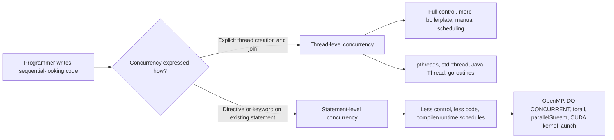

## Statement-Level Concurrency

### Conceptual Foundation

Statement-level concurrency refers to language mechanisms that allow individual statements, or small groups of statements, to execute concurrently rather than requiring the programmer to manage entire threads explicitly. Instead of the unit of concurrency being a full thread with its own control flow, the unit is a single construct embedded directly in sequential code — a `parallel` loop, a `cobegin` block, or a compiler-recognized independent statement — that the language runtime or compiler is responsible for scheduling onto whatever underlying threads or cores are available.

This model sits at a different level of abstraction than thread-based concurrency. Thread APIs (as in [[threads-and-their-language-support]]) expose the unit of execution directly to the programmer: you create a thread, give it a function, and join it. Statement-level concurrency instead expresses *what* can run concurrently within the structure of the code itself, leaving *how* it is scheduled to the language implementation.

### Historical Origins: `cobegin`/`coend`

One of the earliest formal statement-level concurrency constructs was `cobegin`/`coend` (also written `parbegin`/`parend`), proposed by Edsger Dijkstra in the late 1960s. The construct specifies that a set of statements between the markers may execute in any order or concurrently, with the enclosing statement not completing until all of them finish.

```plaintext
cobegin
    statement1;
    statement2;
    statement3;
coend
```

[Inference] `cobegin`/`coend` never saw widespread adoption in mainstream production languages, but it heavily influenced the design of later parallel-loop and parallel-block constructs in more modern languages, since it introduced the core idea of syntactically scoping a concurrent region rather than manually spawning and joining threads.

### Parallel Loops

The most common surviving form of statement-level concurrency in modern languages is the parallel loop, where each iteration (or a chunk of iterations) is distributed across available threads automatically.

**OpenMP (C/C++/Fortran)**

OpenMP is a widely used directive-based API that allows a programmer to annotate an existing sequential loop for parallel execution without restructuring it into explicit thread management.

```c
#include <omp.h>
#include <stdio.h>

int main() {
    int n = 8;
    int data[8] = {1,2,3,4,5,6,7,8};

    #pragma omp parallel for
    for (int i = 0; i < n; i++) {
        data[i] = data[i] * data[i];
        printf("Index %d handled by thread %d\n", i, omp_get_thread_num());
    }

    return 0;
}
```

The `#pragma omp parallel for` directive instructs the compiler to divide the loop's iterations among a pool of threads. The programmer writes what is structurally a sequential loop; the compiler and OpenMP runtime handle thread creation, iteration distribution, and joining. OpenMP also provides `#pragma omp sections` for statement-level (rather than loop-level) concurrent blocks, functionally similar to `cobegin`/`coend`.

```c
#pragma omp parallel sections
{
    #pragma omp section
    { taskA(); }

    #pragma omp section
    { taskB(); }
}
```

**Fortran `DO CONCURRENT`**

Fortran, a language historically strong in scientific and numerical computing, includes `DO CONCURRENT` as a native language construct (not a compiler directive) for expressing loop iterations that have no dependencies on each other and can therefore be executed in any order or in parallel.

```fortran
DO CONCURRENT (i = 1:n)
    data(i) = data(i) ** 2
END DO
```

The semantics require the programmer to guarantee the absence of loop-carried dependencies; a compliant compiler is permitted (but not required) to execute iterations concurrently. [Inference] Because `DO CONCURRENT` is a language-level guarantee rather than merely a scheduling hint, it is generally considered stricter than OpenMP's directive-based approach, though actual parallel execution still depends on compiler support.

**Chapel's `forall`**

Chapel, a language designed explicitly for parallel computing, includes `forall` as a first-class parallel loop construct.

```chapel
forall i in 1..8 {
    writeln("Iteration ", i, " on task ", here.id);
}
```

Chapel distinguishes `forall` (parallel, with implementation-chosen task granularity) from `coforall` (parallel, with exactly one task per iteration) and the ordinary `for` (strictly sequential), giving the programmer fine control over the degree of statement-level parallelism directly in loop syntax.

**Java Streams (`parallelStream`)**

Java's Stream API allows a sequential-looking pipeline of operations to be executed in parallel with a single method call change.

```java
import java.util.List;
import java.util.stream.Collectors;

public class Main {
    public static void main(String[] args) {
        List<Integer> numbers = List.of(1, 2, 3, 4, 5, 6, 7, 8);

        List<Integer> squared = numbers.parallelStream()
            .map(n -> n * n)
            .collect(Collectors.toList());

        squared.forEach(System.out::println);
    }
}
```

Calling `.parallelStream()` instead of `.stream()` instructs the JVM to split the underlying data source and process elements using the common `ForkJoinPool`. The syntactic change is minimal, but the underlying execution model shifts from single-threaded to multi-threaded; behavior may vary based on data size, the cost of the per-element operation, and the number of available cores, since parallel overhead can outweigh benefits for small collections or cheap operations.

### Parallel Array/Vector Operations

Some languages support statement-level concurrency implicitly through array-oriented (data-parallel) operations, where a single statement applied to an entire array is semantically defined to apply independently across elements, making it a natural candidate for concurrent execution.

**APL / array languages**

APL and its descendants (J, K) express whole-array operations as single statements by design.

```apl
squared ← data × data
```

This single statement squares every element of `data`. [Inference] Because array languages define such operations as element-independent by the language's semantics, an implementation is free to execute them concurrently across available hardware (SIMD lanes, GPU cores, or multiple threads) without the programmer expressing any explicit parallelism, though whether a given implementation actually does so depends on the runtime.

**High Performance Fortran (HPF) and `FORALL`**

Fortran 95 introduced `FORALL` as a statement (distinct from `DO CONCURRENT`, introduced later in Fortran 2008) for expressing array assignments that can be evaluated independently for each index.

```fortran
FORALL (i = 1:n, j = 1:n)
    A(i,j) = B(i,j) + C(i,j)
END FORALL
```

`FORALL` semantics require that all right-hand-side expressions be evaluated using the "old" values of the arrays before any assignment happens, which is a stricter data-parallel semantic than an ordinary loop and directly enables safe concurrent execution.

### CUDA and GPU Statement-Level Concurrency

CUDA C/C++ extends the language with kernel launch syntax that expresses a statement (the kernel function call) as something executed concurrently across potentially thousands of GPU threads.

```cuda
__global__ void squareKernel(int *data, int n) {
    int i = blockIdx.x * blockDim.x + threadIdx.x;
    if (i < n) {
        data[i] = data[i] * data[i];
    }
}

// Launch: this single statement runs the kernel across many GPU threads
squareKernel\<\<<numBlocks, threadsPerBlock\>\>>(data, n);
```

The triple-angle-bracket syntax (`\<\<<...\>\>>`) is a language-level extension that turns a single function-call statement into a massively concurrent operation, with the GPU hardware scheduler distributing the work across its execution units.

### Comparison of Statement-Level Constructs

| Construct | Language(s) | Granularity | Dependency Checking |
| --- | --- | --- | --- |
| `cobegin`/`coend` | Conceptual/textbook, some concurrent Pascal variants | Block of statements | Programmer-guaranteed |
| `#pragma omp parallel for` | C, C++, Fortran (OpenMP) | Loop iteration | Programmer-guaranteed |
| `DO CONCURRENT` | Fortran | Loop iteration | Programmer-guaranteed, compiler-checkable in principle |
| `forall` / `coforall` | Chapel | Loop iteration | Programmer-guaranteed |
| `parallelStream()` | Java | Stream element | Runtime-managed via Fork/Join |
| Whole-array ops | APL, J, K, Fortran `FORALL` | Array element | Language-semantic (independent by definition) |
| Kernel launch `\<\<<\>\>>` | CUDA C/C++ | GPU thread | Programmer-guaranteed |

### Hazards Specific to Statement-Level Concurrency

- **False assumption of independence**: the biggest risk in statement-level concurrency is a programmer marking a loop or block as parallel when a loop-carried dependency actually exists (e.g., iteration `i` reads a value written by iteration `i-1`), which produces incorrect results that may not manifest consistently across runs.
- **Overhead vs. granularity mismatch**: because scheduling is delegated to a runtime, spawning parallel work for a computation that is too small per unit can result in worse performance than sequential execution due to thread/task management overhead. [Inference] This is why constructs like Java's `parallelStream()` are generally recommended only for sufficiently large collections or expensive per-element operations, since the overhead of splitting and merging work must be amortized.
- **Reduction hazards**: statements that accumulate into a shared variable (e.g., a running sum) inside a parallel loop require special reduction handling (as in `#pragma omp parallel for reduction(+:sum)`) to avoid data races on the shared accumulator.

### Illustration — Sequential Loop vs Statement-Level Parallel Loop (svg_diagram)

<svg xmlns="http://www.w3.org/2000/svg" viewBox="0 0 900 380" font-family="sans-serif">
<text x="450" y="30" text-anchor="middle" font-size="18" font-weight="bold" fill="#1a1a1a">Sequential vs Parallel Loop Execution (svg_diagram)</text>

<text x="220" y="65" text-anchor="middle" font-size="14" font-weight="bold" fill="`#1a1a1a`">Sequential Loop</text>

<rect x="80" y="85" width="60" height="35" fill="`#4a90d9`" rx="4" />

<text x="110" y="107" text-anchor="middle" font-size="11" fill="white">i = 0</text>

<rect x="160" y="85" width="60" height="35" fill="`#4a90d9`" rx="4" />

<text x="190" y="107" text-anchor="middle" font-size="11" fill="white">i = 1</text>

<rect x="240" y="85" width="60" height="35" fill="`#4a90d9`" rx="4" />

<text x="270" y="107" text-anchor="middle" font-size="11" fill="white">i = 2</text>

<rect x="320" y="85" width="60" height="35" fill="`#4a90d9`" rx="4" />

<text x="350" y="107" text-anchor="middle" font-size="11" fill="white">i = 3</text>

<line x1="140" y1="102" x2="160" y2="102" stroke="#333" stroke-width="2" marker-end="url(#arrow)" />

<line x1="220" y1="102" x2="240" y2="102" stroke="#333" stroke-width="2" marker-end="url(#arrow)" />

<line x1="300" y1="102" x2="320" y2="102" stroke="#333" stroke-width="2" marker-end="url(#arrow)" />

<text x="220" y="150" text-anchor="middle" font-size="11" fill="#555">Time --------------------------&gt;</text>

<text x="220" y="175" text-anchor="middle" font-size="10" fill="#555">One thread, iterations run one after another</text>

<text x="680" y="65" text-anchor="middle" font-size="14" font-weight="bold" fill="`#1a1a1a`">#pragma omp parallel for</text>

<rect x="560" y="90" width="70" height="30" fill="`#7a9e5c`" rx="4" />

<text x="595" y="110" text-anchor="middle" font-size="10" fill="white">i = 0</text>

<text x="700" y="110" font-size="10" fill="#555">Thread 1</text>

<rect x="560" y="130" width="70" height="30" fill="`#7a9e5c`" rx="4" />

<text x="595" y="150" text-anchor="middle" font-size="10" fill="white">i = 1</text>

<text x="700" y="150" font-size="10" fill="#555">Thread 2</text>

<rect x="560" y="170" width="70" height="30" fill="`#7a9e5c`" rx="4" />

<text x="595" y="190" text-anchor="middle" font-size="10" fill="white">i = 2</text>

<text x="700" y="190" font-size="10" fill="#555">Thread 3</text>

<rect x="560" y="210" width="70" height="30" fill="`#7a9e5c`" rx="4" />

<text x="595" y="230" text-anchor="middle" font-size="10" fill="white">i = 3</text>

<text x="700" y="230" font-size="10" fill="#555">Thread 4</text>

<text x="680" y="270" text-anchor="middle" font-size="10" fill="#555">All iterations start concurrently; runtime distributes and joins</text>

<rect x="20" y="300" width="860" height="65" fill="#f5f5f5" stroke="#ccc" rx="6" />
<text x="40" y="325" font-size="11" fill="#333">In both cases the source code structure resembles an ordinary loop.</text>
<text x="40" y="347" font-size="11" fill="#333">The difference is a single annotation/keyword that shifts scheduling responsibility to the compiler/runtime.</text>
</svg>

### Relationship to Thread-Level Concurrency



### Next Steps

- Data dependency analysis and automatic parallelization by compilers
- SIMD (Single Instruction, Multiple Data) vectorization at the instruction level
- Fork-join parallelism and work-stealing schedulers
- GPU programming models beyond CUDA (OpenCL, SYCL, compute shaders)
- Loop-carried dependency detection and safe parallelization patterns
- Reduction operations and associativity requirements in parallel contexts
- Task-based parallelism versus data-based parallelism