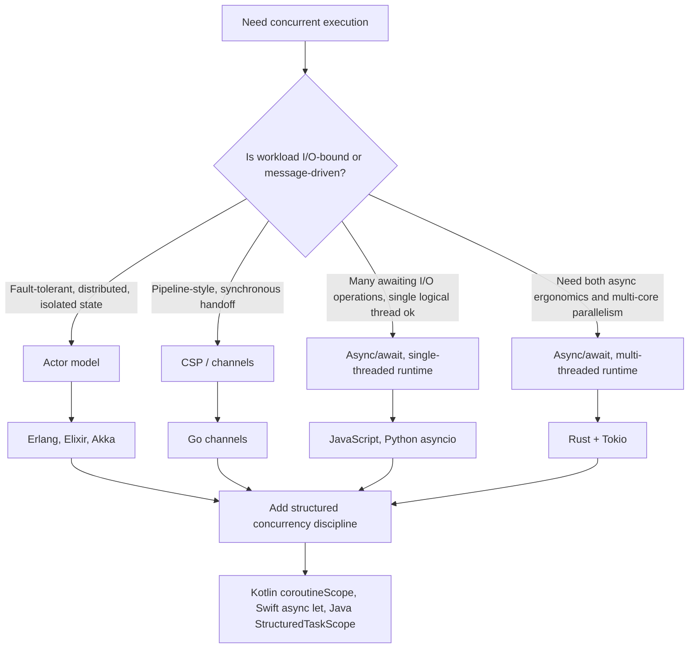

## Actor Model and Modern Concurrency Approaches

### Conceptual Foundation

The actor model is a concurrency paradigm in which the fundamental unit of computation is an **actor**: an independent entity that encapsulates its own private state, communicates exclusively through asynchronous message passing, and processes one message at a time. Actors never share memory directly; there is no mutable state visible to more than one actor, which eliminates data races by construction rather than by locking discipline. The model was formalized by Carl Hewitt in 1973, predating most mainstream thread-based concurrency APIs, and later became the concurrency foundation of Erlang (1986) and, subsequently, of frameworks like Akka on the JVM.

An actor, on receiving a message, may do exactly three things: send messages to other actors (including itself), create new actors, and designate how it will handle the next message it receives (i.e., change its own internal state or behavior). This tightly scoped set of capabilities is what makes formal reasoning about actor systems more tractable than reasoning about arbitrary shared-memory thread interleavings.

### Contrast with Thread-and-Lock Concurrency

In the thread-and-lock model covered under [[threads-and-their-language-support]], concurrent units share an address space and must use mutexes, semaphores, or condition variables to protect shared data. The actor model sidesteps this entirely: since actors never share mutable state, there is nothing to lock. Coordination instead happens through the design of the message protocol itself — an actor either has the information it needs (because it was sent to it) or it does not, and it must ask for it via another message.

This tradeoff moves complexity rather than eliminating it: actor-based systems avoid data races but introduce their own class of concerns — message ordering guarantees, mailbox overflow, and the design of asynchronous protocols to avoid a form of "callback-style" complexity when one actor must wait on responses from several others.

### Erlang and Elixir

Erlang is the language most closely associated with the actor model at production scale, built on the BEAM virtual machine. Erlang's "processes" (an overloaded term — these are not OS processes) are extremely lightweight (a few hundred bytes at creation) actors scheduled N:M onto OS threads by the BEAM runtime.

```erlang
-module(counter).
-export([start/0, loop/1]).

start() ->
    spawn(?MODULE, loop, [0]).

loop(Count) ->
    receive
        {increment} ->
            loop(Count + 1);
        {get_count, From} ->
            From ! {count, Count},
            loop(Count)
    end.
```

Each actor runs `loop/1` recursively, using pattern matching in `receive` to determine how to handle each incoming message, and tail recursion to represent "waiting for the next message" without growing the call stack. The BEAM VM's preemptive scheduling of these lightweight processes, combined with "let it crash" supervision trees, is what gives Erlang/OTP systems their well-documented reputation for fault tolerance in telecom and messaging infrastructure.

Elixir, which compiles to BEAM bytecode, exposes the same actor model with more contemporary syntax:

```elixir
defmodule Counter do
  def start, do: spawn(fn -> loop(0) end)

  def loop(count) do
    receive do
      {:increment} -> loop(count + 1)
      {:get_count, sender} ->
        send(sender, {:count, count})
        loop(count)
    end
  end
end
```

### Akka (JVM: Scala and Java)

Akka brought the actor model to the JVM ecosystem, initially modeled closely on Erlang's semantics but adapted to Scala and Java's type systems.

```scala
import akka.actor.typed.Behavior
import akka.actor.typed.scaladsl.Behaviors

object Counter {
  sealed trait Command
  case object Increment extends Command
  case class GetCount(replyTo: akka.actor.typed.ActorRef[Int]) extends Command

  def apply(count: Int = 0): Behavior[Command] =
    Behaviors.receiveMessage {
      case Increment =>
        apply(count + 1)
      case GetCount(replyTo) =>
        replyTo ! count
        Behaviors.same
    }
}
```

Modern Akka Typed enforces, at compile time, that an `ActorRef[T]` can only receive messages of type `T`, adding a layer of type safety absent from Erlang's dynamically typed message passing. [Inference] This typed-actor approach reflects a broader trend of retrofitting static guarantees onto the actor model in statically typed host languages, trading some of Erlang's dynamic flexibility for compile-time protocol correctness.

### Async/Await: Cooperative Concurrency Without Actors

A separate, widely adopted modern approach addresses concurrency — particularly I/O-bound concurrency — without invoking the actor model at all: `async`/`await`, which structures asynchronous code to look sequential while actually yielding control cooperatively at await points.

**JavaScript**

```javascript
async function fetchUserData(id) {
    const response = await fetch(`/api/users/${id}`);
    const data = await response.json();
    return data;
}

async function main() {
    const results = await Promise.all([
        fetchUserData(1),
        fetchUserData(2),
        fetchUserData(3)
    ]);
    console.log(results);
}
```

Each `await` suspends the enclosing async function without blocking the single JavaScript thread; the event loop is free to run other queued work while the awaited operation completes. `Promise.all` allows multiple independent asynchronous operations to run concurrently (though still within JavaScript's single-threaded execution model) and resolves once all have completed.

**Python**

```python
import asyncio

async def fetch_user_data(id):
    await asyncio.sleep(1)  # simulating I/O
    return f"user {id} data"

async def main():
    results = await asyncio.gather(
        fetch_user_data(1),
        fetch_user_data(2),
        fetch_user_data(3)
    )
    print(results)

asyncio.run(main())
```

Python's `asyncio` provides a single-threaded event loop, similar in spirit to JavaScript's, and remains subject to the GIL constraint discussed under thread-level concurrency — `asyncio` concurrency is cooperative and I/O-oriented, not a mechanism for CPU-bound parallelism.

**Rust (via async runtimes such as Tokio)**

Rust's `async`/`.await` differs structurally: `async fn` compiles to a state machine implementing the `Future` trait, and nothing executes until that future is driven by an executor (commonly Tokio).

```rust
use tokio::time::{sleep, Duration};

async fn fetch_user_data(id: u32) -> String {
    sleep(Duration::from_secs(1)).await;
    format!("user {} data", id)
}

#[tokio::main]
async fn main() {
    let (a, b, c) = tokio::join!(
        fetch_user_data(1),
        fetch_user_data(2),
        fetch_user_data(3)
    );
    println!("{:?} {:?} {:?}", a, b, c);
}
```

Because Rust's async model is a zero-cost abstraction compiled into a state machine rather than a language-mandated single-threaded runtime, Tokio can (and by default does) run async tasks across multiple OS threads, blending async concurrency with genuine multi-core parallelism. [Inference] This is a meaningful distinction from JavaScript and Python's async models, since it means Rust async tasks can experience true parallel execution rather than only interleaved concurrency, though the programmer must still ensure shared data crossing task boundaries satisfies `Send`/`Sync`.

### Structured Concurrency

Structured concurrency is a more recent discipline, popularized by Kotlin coroutines, Swift's concurrency model, and (as a preview feature) Java's `StructuredTaskScope`, which enforces that concurrent tasks form a strict hierarchy: a child task's lifetime can never outlive its parent scope. This directly addresses a common failure mode of unstructured `async`/thread-spawning code, where a "fire and forget" task can leak, outlive the function that started it, or fail silently without the caller ever observing the error.

```kotlin
suspend fun fetchAll() = coroutineScope {
    val a = async { fetchUserData(1) }
    val b = async { fetchUserData(2) }
    val c = async { fetchUserData(3) }
    listOf(a.await(), b.await(), c.await())
}
```

`coroutineScope` in Kotlin will not return until all child coroutines launched within it complete (or one fails, in which case the others are cancelled), which guarantees no coroutine started inside `fetchAll` can leak past its return. [Inference] Structured concurrency does not replace the actor model or async/await as an execution mechanism; rather, it is a discipline layered on top of them for lifecycle and error-propagation safety, which is why Kotlin coroutines use both `async`/`await`-style syntax and structured scoping together.

### Communicating Sequential Processes (CSP) and Go's Channels

A related but distinct model, Communicating Sequential Processes (CSP), formalized by Tony Hoare in 1978, also emphasizes message passing over shared memory, but centers on named **channels** as first-class synchronization points rather than actors with mailboxes and identities. Go's concurrency model draws directly from CSP.

```go
package main

import "fmt"

func worker(id int, results chan<- string) {
    results <- fmt.Sprintf("worker %d done", id)
}

func main() {
    results := make(chan string, 3)
    for i := 1; i <= 3; i++ {
        go worker(i, results)
    }
    for i := 0; i < 3; i++ {
        fmt.Println(<-results)
    }
}
```

[Inference] The distinction between CSP and the actor model is often blurred in casual usage, but a useful technical distinction is that in the actor model, actors send messages to a named actor's mailbox, while in classic CSP, processes communicate over channels that are themselves the addressable entity — goroutines are anonymous, and channels are what get passed and named.

### Comparison of Modern Concurrency Approaches

| Approach | State Sharing | Unit | Coordination Mechanism | Representative Language |
| --- | --- | --- | --- | --- |
| Actor model | None (isolated state) | Actor | Asynchronous messages to actor's mailbox | Erlang, Elixir, Akka |
| CSP | None (isolated state) | Process/goroutine | Synchronous/buffered channels | Go |
| Async/await (single-threaded) | Shared, but single-threaded | Coroutine/task | Event loop scheduling | JavaScript, Python asyncio |
| Async/await (multi-threaded runtime) | Shared, checked or unchecked | Task | Executor across OS threads | Rust + Tokio |
| Structured concurrency | Varies by underlying model | Scoped child task | Enforced parent-child lifetime | Kotlin coroutines, Swift, Java `StructuredTaskScope` |

### Illustration — Actor Model Message Flow (svg_diagram)

<svg xmlns="http://www.w3.org/2000/svg" viewBox="0 0 800 380" font-family="sans-serif">
<text x="400" y="30" text-anchor="middle" font-size="18" font-weight="bold" fill="#1a1a1a">Actor Model Message Passing (svg_diagram)</text>
<circle cx="150" cy="150" r="55" fill="#4a90d9" />
<text x="150" y="145" text-anchor="middle" font-size="12" fill="white" font-weight="bold">Actor A</text>
<text x="150" y="163" text-anchor="middle" font-size="10" fill="white">state: private</text>
<circle cx="400" cy="100" r="55" fill="#7a9e5c" />
<text x="400" y="95" text-anchor="middle" font-size="12" fill="white" font-weight="bold">Actor B</text>
<text x="400" y="113" text-anchor="middle" font-size="10" fill="white">state: private</text>
<circle cx="650" cy="150" r="55" fill="#d9822b" />
<text x="650" y="145" text-anchor="middle" font-size="12" fill="white" font-weight="bold">Actor C</text>
<text x="650" y="163" text-anchor="middle" font-size="10" fill="white">state: private</text>
<rect x="330" y="220" width="140" height="40" fill="#eee" stroke="#999" rx="4" />
<text x="400" y="245" text-anchor="middle" font-size="11" fill="#333">Mailbox (Actor B)</text>
<line x1="190" y1="175" x2="360" y2="220" stroke="#333" stroke-width="1.5" marker-end="url(#arrow2)" />
<text x="250" y="215" font-size="10" fill="#555">msg from A</text>
<line x1="610" y1="175" x2="440" y2="220" stroke="#333" stroke-width="1.5" marker-end="url(#arrow2)" />
<text x="500" y="215" font-size="10" fill="#555">msg from C</text>
<line x1="400" y1="220" x2="400" y2="155" stroke="#333" stroke-width="1.5" marker-end="url(#arrow2)" stroke-dasharray="4,2" />
<text x="410" y="195" font-size="10" fill="#555">processed one at a time</text>
<rect x="20" y="290" width="760" height="75" fill="#f5f5f5" stroke="#ccc" rx="6" />
<text x="40" y="313" font-size="11" fill="#333">Actors A and C never touch Actor B's memory directly.</text>
<text x="40" y="333" font-size="11" fill="#333">Messages queue in B's mailbox and are processed strictly one at a time, so B's own state</text>
<text x="40" y="353" font-size="11" fill="#333">never needs a lock, even though multiple senders are acting concurrently.</text>
</svg>

### Decision Path Across Modern Approaches



### Related Topics

- Erlang/OTP supervision trees and fault-tolerance design ("let it crash")
- Formal comparison of the actor model and Communicating Sequential Processes (CSP)
- Backpressure and mailbox/channel overflow handling
- Software transactional memory as an alternative to locks and message passing
- Coroutines and generators as a language primitive underlying async/await
- Distributed actor systems and location transparency (Akka Cluster, Erlang distribution)
- Cancellation and error propagation semantics in structured concurrency