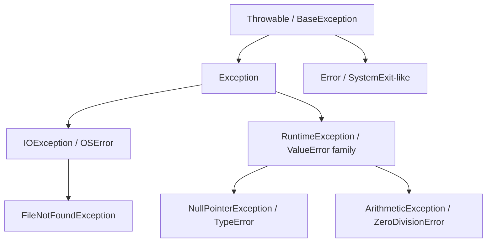
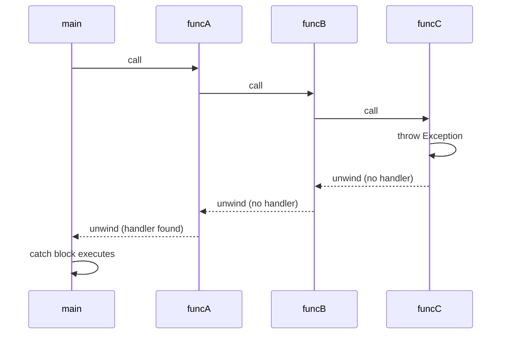

## Introduction to Exception Handling Concepts

### Conceptual Foundation

Exception handling is a language mechanism for detecting and responding to anomalous or erroneous conditions that arise during program execution — conditions that disrupt the normal flow of control and that the code at the point of failure often cannot resolve on its own. Rather than requiring every function to check and propagate error codes manually, exception handling allows an error to be **signaled** (raised or thrown) at the point of failure and **handled** at a different point in the call stack, chosen by whichever caller is equipped to deal with it.

This separation addresses a structural problem in error-prone code: the code that *detects* an error (e.g., a low-level file-reading routine encountering a missing file) is often not the code that knows what to *do* about it (e.g., a high-level application routine that should show the user a dialog or retry with a default). Exception handling lets these two concerns live at different layers of the program without forcing every intermediate layer to explicitly pass the error along.

### Historical Motivation: The Problem With Error Codes

Before structured exception handling became widespread, the dominant error-handling idiom (still used in C) was returning a special value or status code from a function and requiring the caller to check it.

```c
FILE *f = fopen("data.txt", "r");
if (f == NULL) {
    // handle error
    return -1;
}
```

This approach has several well-documented drawbacks: error checks can be silently omitted by the programmer (the code still compiles and often still runs, incorrectly, if a check is skipped); error-handling code is interleaved with normal logic, obscuring the primary control flow; and there is no language-enforced way to ensure an error is actually handled somewhere up the call chain. [Inference] These drawbacks were a primary motivation for languages such as CLU, Ada, and later C++ and Java to introduce dedicated exception-handling constructs, since a language-level `throw`/`catch` mechanism cannot be silently ignored in the same way a return value can be discarded.

### Core Terminology

- **Raising / throwing**: the act of signaling that an exceptional condition has occurred, typically via a `throw` or `raise` statement, which immediately transfers control away from the normal instruction sequence.
- **Exception object / value**: the data associated with the raised condition — often a structured object carrying a type, a message, and sometimes a stack trace, though some languages (like C, via `setjmp`/`longjmp`, or Go, via plain return values) do not have a distinct exception object at all.
- **Handler / catch block**: a block of code associated with a particular exception type (or set of types) that executes when a matching exception propagates to it.
- **Propagation / unwinding**: the process by which control passes up through the call stack, exiting each enclosing function in turn, searching for a handler that matches the raised exception's type — this is often called **stack unwinding**.
- **Try block / protected region**: the syntactic region of code within which exceptions may be thrown and will be intercepted by an associated handler, rather than propagating further up.
- **Finally / ensure block**: a block of code guaranteed to execute whether or not an exception was thrown within the associated try block, typically used for releasing resources.

### Basic Structure Across Languages

**Java**

```java
public class Main {
    public static void main(String[] args) {
        try {
            int[] arr = new int[3];
            System.out.println(arr[5]);
        } catch (ArrayIndexOutOfBoundsException e) {
            System.out.println("Caught: " + e.getMessage());
        } finally {
            System.out.println("Cleanup always runs here");
        }
    }
}
```

**Python**

```python
try:
    numbers = [1, 2, 3]
    print(numbers[5])
except IndexError as e:
    print(f"Caught: {e}")
finally:
    print("Cleanup always runs here")
```

**C++**

```cpp
#include <iostream>
#include <stdexcept>

int main() {
    try {
        throw std::out_of_range("index out of bounds");
    } catch (const std::out_of_range& e) {
        std::cout << "Caught: " << e.what() << std::endl;
    }
    return 0;
}
```

Despite syntactic differences, all three examples follow the same structural pattern: a protected region (`try`), a type-matched handler (`catch`/`except`), and in the Java and Python cases, a guaranteed cleanup block (`finally`). C++ does not have a `finally` keyword; resource cleanup is instead conventionally handled through the RAII (Resource Acquisition Is Initialization) idiom, where destructors run automatically during stack unwinding.

### Checked vs. Unchecked Exceptions

Java makes a language-level distinction between **checked exceptions**, which the compiler requires a method to either handle or declare (via `throws`), and **unchecked exceptions** (subclasses of `RuntimeException`), which carry no such compile-time obligation.

```java
public void readFile(String path) throws IOException {  // checked: must declare or catch
    FileReader reader = new FileReader(path);
}

public void divide(int a, int b) {
    int result = a / b;  // ArithmeticException is unchecked; no declaration required
}
```

[Inference] Checked exceptions were intended to force callers to consciously acknowledge recoverable error conditions (like a missing file) at compile time, while unchecked exceptions are typically reserved for programming errors (like null dereferences or division by zero) that generally indicate a bug rather than an expected, recoverable condition. This distinction has been a subject of ongoing debate in language design circles: [Speculation] many practitioners have argued that mandatory checked exceptions in Java led to boilerplate catch blocks that merely rethrow or swallow exceptions rather than meaningfully handling them, which is one reason most languages designed after Java (including Kotlin, C#, and Python) chose not to include a checked/unchecked distinction at all, treating all exceptions as effectively unchecked.

### Exception Hierarchies

Most object-oriented languages organize exception types into an inheritance hierarchy, allowing a handler to catch either a specific exception type or any of its more general ancestors.



A `catch` (or `except`) clause written against a general ancestor type — for instance, `catch (Exception e)` in Java, or `except Exception:` in Python — will match any more specific exception type beneath it in the hierarchy. This allows handler code to be written at whatever level of specificity is appropriate: a very specific handler for a well-understood failure mode, or a broad handler as a last-resort catch-all. [Inference] Catching overly broad exception types (e.g., a bare `except:` in Python, or `catch (Throwable t)` in Java) is generally discouraged in practice, since it risks silently swallowing unrelated and unexpected errors, including ones the programmer did not anticipate and would have wanted to propagate.

### Stack Unwinding in Detail

When an exception is thrown and no handler exists in the current function, the runtime searches outward through the chain of callers.



Note: the mermaid marker convention requires this to be wrapped as specified; the sequence above illustrates that stack unwinding is not "free" — as each frame is exited, its local objects are destroyed (in C++, this means destructors run; in Java and Python, it means local references become eligible for garbage collection once no longer reachable), and this cleanup happens automatically at every level the exception passes through, whether or not that level has a handler.

### The `finally`/Cleanup Guarantee and Its Limits

The guarantee that a `finally` block runs "no matter what" is strong but not absolute in every language and runtime. [Inference] In most implementations, a `finally` block will not run if the process is forcibly terminated at the OS level (e.g., `kill -9` on Unix, or a JVM crash), since such termination bypasses the language runtime's own unwinding mechanism entirely; this is a limitation of the operating environment rather than a flaw in the exception-handling design itself.

Python's context managers (`with` statement) and Java's try-with-resources both build on the try/finally guarantee to provide a more structured way to ensure resource cleanup without manually writing a `finally` block:

```python
with open("data.txt", "r") as f:
    contents = f.read()
# file is automatically closed here, even if an exception occurred inside the block
```

```java
try (FileReader reader = new FileReader("data.txt")) {
    // use reader
} // reader.close() is called automatically here
```

### Exceptions vs. Alternative Error-Handling Models

Not all modern languages use exception-based control flow. Several prominent recent languages deliberately avoid exceptions for ordinary error handling in favor of making errors explicit values in the type system.

**Go** uses multiple return values, with an `error` as an ordinary returned value that the caller must explicitly check:

```go
data, err := os.ReadFile("data.txt")
if err != nil {
    fmt.Println("Error:", err)
    return
}
```

**Rust** uses the `Result<T, E>` enum, which the type system forces callers to explicitly handle (or deliberately propagate via the `?` operator):

```rust
fn read_data() -> Result<String, std::io::Error> {
    let contents = std::fs::read_to_string("data.txt")?;
    Ok(contents)
}
```

[Inference] The rationale commonly given by the designers of Go and Rust for avoiding traditional exceptions is that explicit error values force every call site to visibly acknowledge the possibility of failure, whereas exceptions can propagate silently through code that gives no syntactic indication it might fail; the tradeoff is that error-checking code becomes more visually repetitive at each call site compared to a language with implicit propagation via exceptions. Both Go and Rust do retain a separate, narrower mechanism (`panic` in both languages) reserved for unrecoverable programming errors, distinguishing "expected, recoverable failure" (handled via return values) from "the program has entered an invalid state" (handled via panic/abort).

### Comparison Table

| Language | Mechanism | Checked Exceptions? | Distinct "Fatal" Path? |
| --- | --- | --- | --- |
| Java | `try`/`catch`/`finally`, class hierarchy | Yes (opt-in via `RuntimeException`) | `Error` subclasses (e.g., `OutOfMemoryError`) |
| Python | `try`/`except`/`finally`, class hierarchy | No | `SystemExit`, `KeyboardInterrupt` (still catchable) |
| C++ | `try`/`catch`, RAII for cleanup | No | `std::terminate` on unhandled exception |
| C | None (return codes, or `setjmp`/`longjmp`) | N/A | `abort()` |
| Go | Explicit `error` return values | N/A | `panic`/`recover` |
| Rust | `Result<T, E>` / `Option<T>` | N/A (enforced by type system instead) | `panic!` |

### Illustration — Exception Propagation Paths (svg_diagram)

<svg xmlns="http://www.w3.org/2000/svg" viewBox="0 0 820 340" font-family="sans-serif">
<text x="410" y="30" text-anchor="middle" font-size="18" font-weight="bold" fill="#1a1a1a">Two Models of Error Propagation (svg_diagram)</text>

<text x="200" y="65" text-anchor="middle" font-size="14" font-weight="bold" fill="`#1a1a1a`">Exception-Based (implicit)</text>

<rect x="100" y="85" width="90" height="35" fill="`#4a90d9`" rx="4" />

<text x="145" y="107" text-anchor="middle" font-size="11" fill="white">funcC throws</text>

<line x1="145" y1="120" x2="145" y2="155" stroke="`#c0392b`" stroke-width="2" marker-end="url(#arrowRed)" />

<rect x="100" y="155" width="90" height="35" fill="#eee" stroke="#999" rx="4" />

<text x="145" y="177" text-anchor="middle" font-size="10" fill="#333">funcB (no catch)</text>

<line x1="145" y1="190" x2="145" y2="225" stroke="`#c0392b`" stroke-width="2" marker-end="url(#arrowRed)" />

<rect x="100" y="225" width="90" height="35" fill="`#7a9e5c`" rx="4" />

<text x="145" y="247" text-anchor="middle" font-size="10" fill="white">main catches</text>

<text x="145" y="290" text-anchor="middle" font-size="10" fill="#555">Propagation is automatic;</text>

<text x="145" y="305" text-anchor="middle" font-size="10" fill="#555">intermediate frames need no code</text>

<text x="620" y="65" text-anchor="middle" font-size="14" font-weight="bold" fill="`#1a1a1a`">Explicit Return Value</text>

<rect x="520" y="85" width="90" height="35" fill="`#4a90d9`" rx="4" />

<text x="565" y="107" text-anchor="middle" font-size="10" fill="white">funcC returns err</text>

<line x1="565" y1="120" x2="565" y2="155" stroke="#333" stroke-width="2" marker-end="url(#arrowBlack)" />

<rect x="520" y="155" width="90" height="35" fill="`#d9822b`" rx="4" />

<text x="565" y="172" text-anchor="middle" font-size="9" fill="white">funcB checks err,</text>

<text x="565" y="184" text-anchor="middle" font-size="9" fill="white">returns err</text>

<line x1="565" y1="190" x2="565" y2="225" stroke="#333" stroke-width="2" marker-end="url(#arrowBlack)" />

<rect x="520" y="225" width="90" height="35" fill="`#7a9e5c`" rx="4" />

<text x="565" y="242" text-anchor="middle" font-size="9" fill="white">main checks err,</text>

<text x="565" y="254" text-anchor="middle" font-size="9" fill="white">handles it</text>

<text x="565" y="290" text-anchor="middle" font-size="10" fill="#555">Propagation is manual;</text>

<text x="565" y="305" text-anchor="middle" font-size="10" fill="#555">every frame must explicitly forward it</text>

</svg>

### Related Topics

- Custom/user-defined exception types and designing exception hierarchies
- Exception safety guarantees in C++ (basic, strong, no-throw)
- Error handling in functional languages: `Maybe`/`Option` and `Either` types
- Panic/recover semantics in Go versus unwinding in exception-based languages
- Performance costs of exception handling (zero-cost exceptions vs. table-based unwinding)
- Retry and fallback patterns built on top of exception handling
- Logging, observability, and exception reporting in production systems