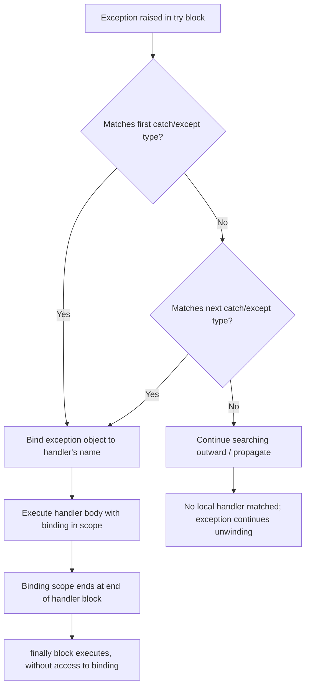

## Exception Handlers and Their Bindings

### Conceptual Foundation

An exception handler does not merely intercept a thrown exception — it also establishes a **binding** between the handler's code and the exception that triggered it, typically by binding the raised exception object (or value) to a name accessible within the handler's scope. This binding is what allows handler code to inspect the exception's type, message, cause, and any custom data it carries, and to make a decision about how to respond: log it, wrap it in a different exception and rethrow, recover with a default value, or propagate it further.

The mechanics of *how* an exception binds to a handler — how matching is determined, what scope the bound name occupies, whether the binding is mutable, and what happens to the binding once the handler exits — vary meaningfully across languages and are a frequent source of subtle bugs when developers carry assumptions from one language into another.

### Binding by Type Matching

The most common binding mechanism, used by Java, C++, C#, and Kotlin, is to associate each `catch` clause with a specific exception type, and to bind the thrown object to a local variable name only within that clause's scope, selecting the first clause (in source order) whose type matches.

```java
try {
    riskyOperation();
} catch (FileNotFoundException e) {
    System.out.println("Specific: " + e.getMessage());
} catch (IOException e) {
    System.out.println("General: " + e.getMessage());
} catch (Exception e) {
    System.out.println("Catch-all: " + e.getMessage());
}
```

Each `e` is a distinct binding, scoped only to its own `catch` block; the compiler enforces that `e` in the first block has static type `FileNotFoundException`, and its scope ends at the closing brace of that block. Because matching proceeds in source order and stops at the first match, **ordering catch clauses from most specific to least specific is required** in languages with this model — placing a general `catch (Exception e)` before a more specific one would make the specific clause unreachable, which Java's compiler rejects as a compile error, but which some other languages permit silently as dead code.

### Binding by Structural/Value Matching

Python's `except` clauses bind similarly to Java's `catch`, but Python additionally allows binding based on tuples of exception types and supports more dynamic inspection of the bound exception object.

```python
try:
    risky_operation()
except (FileNotFoundError, PermissionError) as e:
    print(f"File issue: {e}")
except OSError as e:
    print(f"OS issue: {e}")
except Exception as e:
    print(f"General: {e}")
```

A notable and frequently misunderstood detail of Python's binding: the name bound by `as e` is deleted automatically at the end of the `except` block, even if it was previously defined outside the block. This is a deliberate design choice to avoid the exception object (which may hold a traceback, and therefore indirectly reference many stack frames' local variables) from being kept alive by an outer-scope reference after the handler completes, but it means code like this raises an error:

```python
try:
    raise ValueError("bad value")
except ValueError as e:
    pass
print(e)  # NameError: name 'e' is not defined
```

[Inference] This behavior differs from ordinary Python variable scoping, where names assigned in a block typically remain accessible afterward, which is why the automatic deletion of the exception binding is a common source of confusion for developers new to the language.

### Binding by Pattern Matching

Some languages extend the type-matching model into full pattern matching, allowing a handler to bind not just the exception object as a whole, but to destructure it and bind its internal fields directly.

**Scala**

```scala
try {
  riskyOperation()
} catch {
  case e: java.io.FileNotFoundException =>
    println(s"File not found: ${e.getMessage}")
  case e: IllegalArgumentException if e.getMessage.contains("negative") =>
    println("Negative argument specifically")
  case e: Exception =>
    println(s"General: ${e.getMessage}")
}
```

Scala's `catch` block is itself a pattern-matching expression, which is why it supports **guard clauses** (the `if e.getMessage.contains("negative")` condition) that further restrict when a given binding applies, beyond what type matching alone can express — a capability not directly available in Java's `catch` syntax.

**Rust (structural matching on `Result`)**

Rust does not use `try`/`catch` for its primary error model; instead, binding happens through ordinary pattern matching on the `Result` enum, which makes the "handler" and the "binding" the same syntactic construct.

```rust
match std::fs::read_to_string("data.txt") {
    Ok(contents) => println!("Read: {}", contents),
    Err(e) if e.kind() == std::io::ErrorKind::NotFound => {
        println!("File missing: {}", e);
    }
    Err(e) => println!("Other error: {}", e),
}
```

Here, `contents` and `e` are both bindings introduced directly by the pattern-matching arms, and the guard (`if e.kind() == ...`) plays the same role as Scala's guard clause. [Inference] Because Rust's `Result` is an ordinary enum rather than a control-flow-transferring exception, this binding is not fundamentally different from binding any other pattern-matched value — the "exception handling" here is really just ordinary sum-type destructuring, which is a deliberate design unification in Rust.

### Multi-Catch and Union-Type Bindings

Java 7 introduced multi-catch syntax, allowing a single binding to be shared across several exception types that require identical handling logic, though the compiler restricts the bound variable's static type to the common supertype (or treats it as an implicit union for method-resolution purposes).

```java
try {
    riskyOperation();
} catch (FileNotFoundException | SecurityException e) {
    System.out.println("Access issue: " + e.getMessage());
}
```

A restriction worth noting: within a multi-catch block, `e` is treated as effectively `final` — reassigning it is a compile error — since the compiler cannot statically determine which of the listed types `e` will actually hold at runtime, and permitting reassignment could allow assigning a value inconsistent with one of the alternative types.

### The Bound Exception's Lifetime and the Cause Chain

Many languages allow a caught exception to be **wrapped** and rethrown as a different exception type, while preserving a reference to the original as its **cause**, forming a chain that can be inspected later (useful for translating low-level errors into higher-level, more meaningful ones without losing diagnostic information).

```java
try {
    parseConfig();
} catch (IOException e) {
    throw new ConfigurationException("Failed to load configuration", e);
    // 'e' is bound here as the cause of the new exception
}
```

```python
try:
    parse_config()
except IOError as e:
    raise ConfigurationError("Failed to load configuration") from e
    # Python's exception chaining sets __cause__ automatically
```

In both cases, the original bound exception (`e`) becomes reachable later via the new exception's cause chain (`getCause()` in Java, `__cause__` in Python), rather than being discarded once the handler's binding scope ends. [Inference] This chaining mechanism exists specifically because the automatic scope-deletion of the immediate binding (as seen in Python's `except ... as e` behavior above) would otherwise make the original exception's diagnostic detail permanently inaccessible once the handler completed.

### Binding in `finally`/Cleanup Blocks

A frequently misunderstood interaction concerns what a `finally` block can and cannot access relative to the handler's binding. In most languages, the exception binding from a `catch`/`except` clause is **not** visible inside an associated `finally` block, because `finally` is defined to run regardless of whether an exception was caught at all — including the case where no exception occurred, in which case there is no binding to expose.

```python
try:
    risky_operation()
except ValueError as e:
    print(f"Caught: {e}")
finally:
    # 'e' is not accessible here, even though it was just bound above
    print("Cleanup runs regardless")
```

If code inside `finally` needs access to exception details, the common pattern is to capture what is needed into a variable declared outside the `try` block before entering it, since the `finally` block's scope is defined independently of any particular `except` clause's binding.

### Rebinding on Rethrow

A subtle distinction exists between rethrowing the *same* bound exception object and constructing a *new* one, which affects what information (particularly the stack trace) is preserved.

```java
try {
    riskyOperation();
} catch (IOException e) {
    logError(e);
    throw e; // rethrows the SAME bound object; original stack trace preserved
}
```

```java
try {
    riskyOperation();
} catch (IOException e) {
    throw new RuntimeException("wrapped: " + e.getMessage()); // NEW object; e's stack trace only reachable via message text here, unless passed as cause
}
```

[Inference] Because `throw e;` re-raises the identical bound object rather than creating a new one, most JVM implementations preserve the exception's original stack trace in this case, whereas constructing a brand-new exception object resets the trace to the point of the new `throw`, which is why the cause-chaining pattern shown earlier (passing `e` explicitly as a constructor argument) is generally preferred over losing that binding's diagnostic trail entirely.

### Comparison of Binding Mechanisms

| Language | Binding Construct | Scope of Binding | Guard Clauses? | Auto-Unbind After Handler? |
| --- | --- | --- | --- | --- |
| Java | `catch (Type e)` | Catch block only | No (multi-catch is closest) | Yes (block-scoped) |
| Python | `except Type as e` | Except block only | No (use `if` inside block) | Yes (explicitly deleted) |
| C++ | `catch (Type& e)` | Catch block only | No | Yes (block-scoped) |
| Scala | `case e: Type =>` | Match arm only | Yes | Yes (match-arm scoped) |
| Rust | `Err(e) => ...` (pattern match) | Match arm only | Yes | Yes (match-arm scoped) |

### Illustration — Handler Binding Scope (svg_diagram)

<svg xmlns="http://www.w3.org/2000/svg" viewBox="0 0 820 320" font-family="sans-serif">
<text x="410" y="30" text-anchor="middle" font-size="18" font-weight="bold" fill="#1a1a1a">Exception Binding Scope Across a Try Statement (svg_diagram)</text>
<rect x="60" y="60" width="700" height="230" fill="none" stroke="#999" stroke-width="1.5" rx="6" />
<text x="80" y="85" font-size="12" fill="#555">try block</text>
<rect x="80" y="95" width="660" height="30" fill="#eee" rx="4" />
<text x="410" y="115" text-anchor="middle" font-size="11" fill="#333">risky_operation() — exception may originate here</text>
<rect x="80" y="140" width="320" height="55" fill="#4a90d9" rx="4" />
<text x="240" y="160" text-anchor="middle" font-size="11" fill="white">except FileNotFoundError as e:</text>
<text x="240" y="178" text-anchor="middle" font-size="10" fill="white">'e' bound here only</text>
<rect x="420" y="140" width="320" height="55" fill="#7a9e5c" rx="4" />
<text x="580" y="160" text-anchor="middle" font-size="11" fill="white">except Exception as e:</text>
<text x="580" y="178" text-anchor="middle" font-size="10" fill="white">separate 'e' binding, this scope only</text>
<rect x="80" y="215" width="660" height="55" fill="#d9822b" rx="4" />
<text x="410" y="235" text-anchor="middle" font-size="11" fill="white">finally:</text>
<text x="410" y="253" text-anchor="middle" font-size="10" fill="white">no access to either 'e' binding above</text>

<text x="410" y="305" text-anchor="middle" font-size="10" fill="#555">Each handler clause has its own independent binding scope, invisible to sibling clauses and to finally</text>

</svg>

### Binding Resolution Flow



### Related Topics

- Exception chaining and cause tracking (`__cause__`, `getCause()`, `Caused by:`)
- Guard clauses in pattern-matched error handling
- Stack trace preservation semantics on rethrow versus re-wrap
- Resource cleanup patterns independent of handler bindings (RAII, `with`, try-with-resources)
- Custom exception hierarchies and designing matchable types
- Multi-catch and union-type restrictions across languages
- Differences between exceptions-as-control-flow and errors-as-values in binding ergonomics