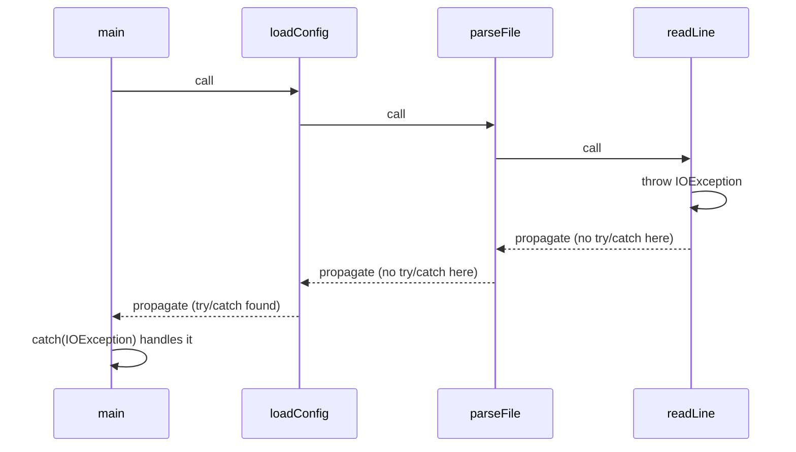
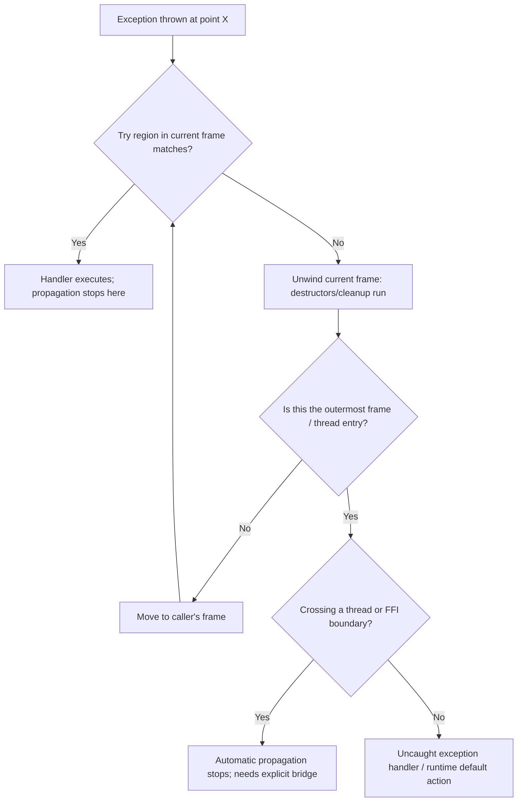

## Exception Propagation

### Conceptual Foundation

Exception propagation is the process by which a raised exception, having found no matching handler in the function where it originated, continues to travel outward through the chain of active callers until either a matching handler is found or the program terminates for lack of one. Propagation is what separates exception-based error handling from a simple local `if`/`return` check: the exception does not need every intermediate function along the way to know about it, check for it, or forward it explicitly — the language runtime does that work automatically as part of unwinding the call stack.

This automatic, implicit forwarding is simultaneously the main ergonomic advantage of exceptions (a deeply nested low-level failure can be handled once, at a high-level, appropriate point) and a common source of subtlety, since a function's signature in many languages gives no visible indication that it might propagate an exception through it.

### The Propagation Search

When an exception is thrown, the runtime conceptually walks the call stack from the throw point outward, examining each enclosing `try` region in turn for a handler whose type matches the exception.



Each arrow labeled "propagate" represents a frame being exited without having handled the exception, but not without consequence: as each frame unwinds, its local variables go out of scope, and in languages with deterministic destruction (C++, Rust with panics, to a lesser degree) any resource-owning locals are cleaned up via their destructors before the search continues outward. This is why propagation is often described as coupled with **stack unwinding** — the two happen together, frame by frame, during the search for a handler.

### Propagation Across Language Boundaries in the Call Stack

Propagation is not merely conceptual; it is observable in the exception's own metadata. Most modern languages attach a **stack trace** to the exception object at the moment it is thrown (or, in some implementations, lazily when first accessed), recording the sequence of frames it passed through.

**Java**

```java
public class Main {
    static void readLine() {
        throw new RuntimeException("simulated failure");
    }
    static void parseFile() { readLine(); }
    static void loadConfig() { parseFile(); }

    public static void main(String[] args) {
        try {
            loadConfig();
        } catch (RuntimeException e) {
            e.printStackTrace();
            // prints: readLine -> parseFile -> loadConfig -> main
        }
    }
}
```

**Python**

```python
def read_line():
    raise RuntimeError("simulated failure")

def parse_file():
    read_line()

def load_config():
    parse_file()

try:
    load_config()
except RuntimeError as e:
    import traceback
    traceback.print_exc()
    # Traceback shows load_config -> parse_file -> read_line
```

The recorded trace is a direct artifact of propagation: it reflects exactly which frames the exception passed through before being caught, which is why stack traces remain one of the most immediately useful debugging tools associated with exception-based error handling.

### Propagation Through Intermediate Handlers That Re-Raise

A function partway up the call stack may catch an exception not to fully handle it, but to perform some local action (logging, resource cleanup, adding context) and then **deliberately continue propagation**, either by rethrowing the same exception or by wrapping it in a new one.

```java
static void parseFile() {
    try {
        readLine();
    } catch (RuntimeException e) {
        System.out.println("Logging at parseFile level");
        throw e; // re-throws; propagation continues past this frame
    }
}
```

```python
def parse_file():
    try:
        read_line()
    except RuntimeError as e:
        print("Logging at parse_file level")
        raise  # bare 'raise' re-raises the currently handled exception
```

Python's bare `raise` (with no argument) inside an `except` block specifically re-raises the exception currently being handled, preserving its original traceback — a distinct and idiomatic mechanism from `raise e`, which in older Python versions could reset parts of the traceback context. [Inference] This distinction reflects a broader pattern seen across languages: propagation-after-partial-handling is common enough (for cross-cutting concerns like logging) that most languages provide a dedicated "re-raise as-is" syntax separate from "raise a new/different exception."

### Propagation Across Thread Boundaries

A significant and frequently overlooked complication: **exceptions do not automatically propagate across thread boundaries** in most thread-based concurrency models, because each thread has its own independent call stack, and propagation is fundamentally a call-stack-walking mechanism.

```java
Thread t = new Thread(() -> {
    throw new RuntimeException("failure in worker thread");
});
t.start();
// The main thread's try/catch around t.start() will NOT catch this exception,
// because the worker thread has its own separate stack.
```

In Java, an uncaught exception in a thread is instead delivered to that thread's `UncaughtExceptionHandler`, not propagated to whichever thread created it. Retrieving an exception from another thread generally requires an explicit mechanism designed for that purpose:

```java
ExecutorService executor = Executors.newSingleThreadExecutor();
Future<Integer> future = executor.submit(() -> {
    throw new RuntimeException("failure inside task");
});

try {
    future.get(); // exception is re-thrown here, wrapped in ExecutionException
} catch (ExecutionException e) {
    System.out.println("Caught from another thread: " + e.getCause());
}
```

`Future.get()` is specifically designed to bridge this gap: it blocks until the task completes and, if the task threw, wraps and rethrows that exception on the calling thread — a mechanism, not automatic propagation, since ordinary automatic propagation cannot cross the thread boundary on its own.

**Async/await propagation** (covered under [[actor-model-and-modern-concurrency-approaches]]) generally handles this more transparently: because an `async` function's exceptions are captured into the returned `Future`/`Promise`/coroutine result, `await`-ing that result re-raises the exception on the awaiting logical task, giving the *appearance* of ordinary propagation despite the underlying execution having potentially run on a different OS thread.

```python
import asyncio

async def worker():
    raise ValueError("failure inside async task")

async def main():
    try:
        await worker()
    except ValueError as e:
        print(f"Caught: {e}")

asyncio.run(main())
```

### Propagation and Resource Safety (Exception Safety Guarantees)

Because propagation can exit a function at any point where an exception-throwing operation exists, code that acquires resources (memory, file handles, locks) must be written defensively against the possibility of an exception propagating through mid-function, potentially skipping cleanup code that appears later in the same function.

```cpp
void process() {
    std::mutex m;
    m.lock();
    riskyOperation(); // if this throws, m.unlock() below is skipped!
    m.unlock();
}
```

```cpp
void process() {
    std::lock_guard<std::mutex> lock(m); // RAII: unlocks automatically during unwinding
    riskyOperation(); // if this throws, lock's destructor still runs
}
```

This concern is formalized in C++ as levels of **exception safety guarantee**: the *no-throw guarantee* (an operation is guaranteed never to throw), the *strong guarantee* (an operation either fully succeeds or leaves state unchanged, as if it had never been attempted), and the *basic guarantee* (an operation may partially complete but leaves the program in some valid, non-corrupted state). [Inference] These formal guarantees exist specifically because propagation can occur at any exception-throwing statement, meaning code must be reasoned about not just for its "happy path" but for every possible mid-execution exit point.

### Propagation Boundaries: Where It Stops by Design

Some constructs intentionally form a "propagation boundary" beyond which an exception is deliberately prevented from continuing outward, converting it into something else instead.

- **Top-level/uncaught handlers**: most language runtimes install a default handler at the outermost level (e.g., the JVM prints a stack trace and terminates the thread; Python's interpreter prints a traceback and exits with a nonzero status), which is itself a form of "final" propagation boundary.
- **Language interop boundaries**: an exception generally cannot propagate across a language boundary in its native form — a C++ exception thrown across a C API boundary is undefined behavior, and most languages' foreign-function interfaces require converting exceptions to error codes (or a language-specific bridging mechanism) before crossing into or out of native code.
- **Destructor/finalizer boundaries in C++**: throwing a new exception out of a destructor while another exception is already propagating (during unwinding) leads to `std::terminate` being called, since the language has no defined way to propagate two simultaneous exceptions at once. [Inference] This specific rule is why C++ style guides near-universally recommend that destructors never throw, since a destructor is likely to run precisely during unwinding, when this dangerous double-exception scenario becomes possible.

### Comparison of Propagation Behavior

| Language | Propagates Across Function Calls? | Propagates Across Threads Automatically? | Propagation Boundary at FFI? |
| --- | --- | --- | --- |
| Java | Yes | No (needs `Future`/handler) | Yes (must convert at JNI boundary) |
| Python | Yes | No (needs `concurrent.futures`) | Yes |
| C++ | Yes | No | Yes (undefined behavior if crossed raw) |
| Go | N/A (errors are values, not propagated) | N/A | N/A |
| Rust | N/A for `Result` (explicit `?`); `panic!` can unwind or abort | `panic!` does not cross threads automatically either | Yes (`panic!` across FFI is undefined behavior) |

### Illustration — Propagation Stopping at Thread and FFI Boundaries (svg_diagram)

<svg xmlns="http://www.w3.org/2000/svg" viewBox="0 0 840 360" font-family="sans-serif">
<text x="420" y="30" text-anchor="middle" font-size="18" font-weight="bold" fill="#1a1a1a">Where Automatic Propagation Stops (svg_diagram)</text>
<rect x="40" y="60" width="300" height="240" fill="none" stroke="#4a90d9" stroke-width="2" rx="6" />
<text x="190" y="85" text-anchor="middle" font-size="12" font-weight="bold" fill="#1a1a1a">Within one thread's call stack</text>
<rect x="70" y="100" width="240" height="30" fill="#4a90d9" rx="4" />
<text x="190" y="120" text-anchor="middle" font-size="10" fill="white">deep function throws</text>
<line x1="190" y1="130" x2="190" y2="155" stroke="#333" stroke-width="2" marker-end="url(#a3)" />
<rect x="70" y="155" width="240" height="30" fill="#eee" rx="4" />
<text x="190" y="175" text-anchor="middle" font-size="10" fill="#333">intermediate frames (no handler)</text>
<line x1="190" y1="185" x2="190" y2="210" stroke="#333" stroke-width="2" marker-end="url(#a3)" />
<rect x="70" y="210" width="240" height="30" fill="#7a9e5c" rx="4" />
<text x="190" y="230" text-anchor="middle" font-size="10" fill="white">caller with matching catch</text>
<text x="190" y="270" text-anchor="middle" font-size="10" fill="#555">Propagation works automatically</text>
<text x="190" y="285" text-anchor="middle" font-size="10" fill="#555">across all frames in this stack</text>
<rect x="400" y="60" width="380" height="240" fill="none" stroke="#c0392b" stroke-width="2" rx="6" />
<text x="590" y="85" text-anchor="middle" font-size="12" font-weight="bold" fill="#1a1a1a">Crossing a boundary</text>
<rect x="430" y="100" width="150" height="30" fill="#4a90d9" rx="4" />
<text x="505" y="120" text-anchor="middle" font-size="10" fill="white">Worker thread throws</text>
<text x="640" y="120" font-size="18" fill="#c0392b">✘</text>
<text x="700" y="120" font-size="10" fill="#c0392b">stops here</text>
<rect x="430" y="150" width="150" height="30" fill="#eee" rx="4" />
<text x="505" y="170" text-anchor="middle" font-size="10" fill="#333">Main thread's try/catch</text>
<text x="590" y="200" text-anchor="middle" font-size="10" fill="#555">Needs explicit bridge:</text>
<text x="590" y="215" text-anchor="middle" font-size="10" fill="#555">Future.get(), join with result,</text>
<text x="590" y="230" text-anchor="middle" font-size="10" fill="#555">or an UncaughtExceptionHandler</text>
</svg>

### Propagation Decision Flow



### Related Topics

- Stack unwinding mechanics and destructor/finalizer execution order
- C++ exception safety guarantees (no-throw, strong, basic) in depth
- Structured concurrency's role in surfacing exceptions from child tasks
- Foreign Function Interface (FFI) error-boundary conventions across languages
- Uncaught exception handlers and default runtime termination behavior
- Exception chaining versus re-raising versus wrapping during propagation
- Async/await's translation of thread-crossing propagation into apparent call-stack propagation