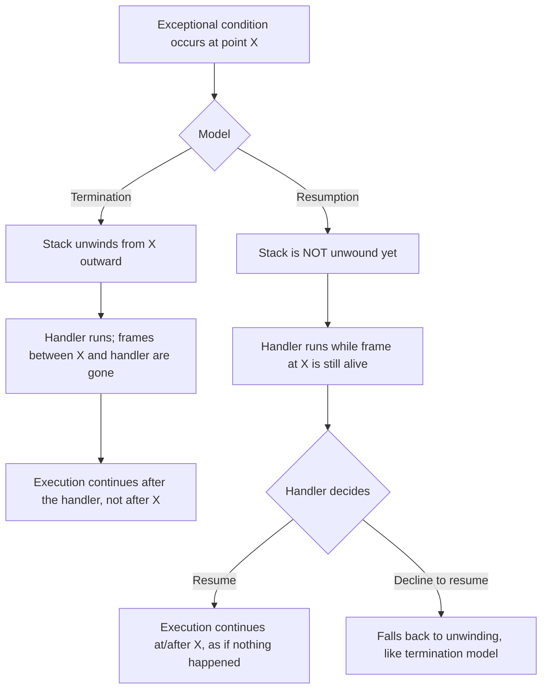

## Continuation and Resumption Models

### Conceptual Foundation

Continuation and resumption models are exception-handling designs in which a handler is given the option to **resume execution back at (or near) the point where the exceptional condition was signaled**, rather than being restricted to unwinding the stack away from it. This stands in contrast to the termination model used by mainstream languages like Java, Python, and C++, where once a handler runs, the frames between the throw point and the handler are permanently gone — there is no way back down into them.

The distinction is significant enough that language-design literature typically frames exception handling as falling into two broad philosophies: the **termination model**, where handling a condition means abandoning the operation that raised it, and the **resumption model**, where handling a condition means the option exists to fix the problem and continue as if the disruption had been addressed inline.

### Termination vs. Resumption: A Direct Comparison



In the termination model, by the time any handler code executes, there is no way to return control to the exact statement that failed — the stack frame it lived in has already been destroyed. In the resumption model, the frame at the point of the signal is still alive while the handler runs, so the handler has the option to supply a value or take corrective action and have execution pick back up as though the disruption were merely a pause, not a departure.

### Common Lisp's Condition System

The most fully developed and widely cited resumption-model implementation in a mainstream (if niche) language is Common Lisp's **condition system**, which deliberately separates the act of *signaling* a condition from the act of *handling* it, and separately again from the act of *deciding how to recover*.

```lisp
(define-condition file-missing (error)
  ((filename :initarg :filename :reader file-missing-filename)))

(defun read-config (path)
  (restart-case
      (if (not (probe-file path))
          (error 'file-missing :filename path)
          (read-file path))
    (use-default-path (new-path)
      (read-config new-path))
    (use-default-config ()
      (return-from read-config *default-config*))))
```

The `restart-case` form establishes named **restarts** — `use-default-path` and `use-default-config` — which represent concrete recovery strategies that a handler further up the call stack can invoke, without the intervening call stack having been unwound first. A handler bound higher up can inspect the signaled condition and then choose to invoke `use-default-path`, which resumes execution back inside `read-config`, rather than merely catching an error and being unable to return to that point:

```lisp
(handler-bind
    ((file-missing
       (lambda (c)
         (invoke-restart 'use-default-path "/etc/default-config.conf"))))
  (read-config "/etc/myapp/config.conf"))
```

`handler-bind` (as distinct from Common Lisp's `handler-case`, which behaves more like a conventional termination-model `try`/`catch`) runs its handler function **without unwinding the stack**, meaning the handler executes while `read-config`'s frame — including all its local state — is still fully alive. If the handler invokes a restart, execution resumes inside that still-live frame; if it does not, the condition continues propagating outward to look for another handler, exactly as an unhandled exception would.

### Why Resumption Enables Something Termination Cannot

The practical capability this unlocks: a piece of low-level code can signal "I don't have enough information to proceed" without needing to know, itself, what the correct fallback should be — and a much higher-level piece of code, with more context about the overall goal, can supply that missing information and let the low-level code simply continue, having never actually failed from the caller's perspective.

```mermaid
sequenceDiagram
    participant caller as High-level caller
    participant reader as read-config (low-level)
    caller->>reader: call
    reader->>reader: file missing; signal file-missing condition
    reader-->>caller: condition propagates UP, but reader's frame stays alive
    caller->>caller: handler decides: invoke-restart use-default-path
    caller-->>reader: control resumes INSIDE reader's still-live frame
    reader->>reader: retries with new path, returns normally
    reader-->>caller: normal return, as if no error occurred
```

[Inference] This is fundamentally different from a termination-model `catch` block calling `read-config` again after catching an exception, because in the termination model, the *entire* original `read-config` call — including any partial progress or accumulated local state within it — must be discarded and the function invoked again from scratch, whereas resumption allows the original invocation itself to continue from exactly where it paused.

### Structured Exception Handling (SEH) on Windows

Microsoft's Structured Exception Handling, available at the OS/compiler level on Windows (and exposed in C/C++ via `__try`/`__except`/`__finally`, and in a more limited way in .NET), includes a resumption-capable mechanism through its **filter expression**, which executes *before* any unwinding occurs.

```c
__try {
    riskyOperation();
}
__except (filterFunction(GetExceptionCode(), GetExceptionInformation())) {
    printf("Handled\n");
}
```

The filter expression can return `EXCEPTION_CONTINUE_EXECUTION`, which — for certain classes of hardware exceptions, such as a page fault the filter has just resolved by mapping in memory — resumes execution at the exact instruction that raised the exception, without ever unwinding the stack. [Unverified] This capability is generally restricted to specific hardware-level exception types where resuming the faulting instruction is meaningful (such as access violations that a filter can repair by adjusting memory protections), and is not a general-purpose "retry any operation" mechanism in the way Common Lisp's restart system is, though the exact scope of continuable exceptions can depend on the specific exception code and platform.

### Why Mainstream OOP Languages Chose Termination

[Inference] The dominant justification given in language-design discussions for why Java, C++, Python, and most other widely used languages adopted the termination model rather than resumption centers on a mix of implementation complexity and a judgment about how often resumption is actually useful in practice: keeping a throwing frame's stack alive while a handler runs elsewhere requires more complex runtime bookkeeping than simply unwinding it, and empirically, most real-world "recoverable" errors (a missing file, a network timeout, invalid input) are more naturally expressed as "abandon this attempt and try something else at a higher level" rather than "patch the exact point of failure and continue as if untouched." Bjarne Stroustrup and other C++ designers have written in the past that they considered and rejected resumption semantics for C++ partly on these grounds. [Speculation] It's also plausible that resumption's power comes with a corresponding cost in reasoning difficulty — code that might resume from literally any statement is harder to verify locally than code where a handler is guaranteed to run only after a clean, total exit from the protected region — though this trade-off is a matter of ongoing design judgment rather than settled empirically.

### Partial Resumption via Retry Loops (Simulating Resumption in Termination-Model Languages)

Languages without a true resumption model can approximate a limited form of it using explicit retry loops around a `try`/`catch`, though this is structurally different from genuine resumption since the entire protected block is re-executed rather than a single suspended point being resumed.

```python
def read_config_with_retry(path, max_attempts=3):
    attempts = 0
    while attempts < max_attempts:
        try:
            return read_config(path)
        except FileNotFoundError:
            attempts += 1
            path = get_fallback_path(attempts)
    raise RuntimeError("All fallback paths exhausted")
```

This achieves a similar practical *outcome* (the operation eventually succeeds despite an initial failure) but not the same *mechanism* — the original call to `read_config(path)` is abandoned entirely on each failed attempt, and a fresh call is made, rather than the original call's own internal state and progress being preserved and continued.

### Comparison of Models

| Language / System | Model | Can Resume at Exact Fault Point? | Mechanism |
| --- | --- | --- | --- |
| Java, C++, Python, C# | Termination | No | `try`/`catch`, stack unwinds before handler runs |
| Common Lisp | Resumption (with fallback to termination) | Yes | `signal`/`error`, `handler-bind`, `restart-case`, `invoke-restart` |
| Windows SEH (C/C++) | Resumption (limited, hardware-exception scope) | Yes, for specific exception classes | `__try`/`__except` filter expression, `EXCEPTION_CONTINUE_EXECUTION` |
| Smalltalk | Resumption | Yes | `on:do:`, exception `resume:` method |
| Retry-loop pattern (any termination-model language) | Simulated resumption | No (re-executes from scratch) | Manual `while`/`try`/`catch` loop |

### Illustration — Live Stack During Resumption vs. Unwound Stack During Termination (svg_diagram)

<svg xmlns="http://www.w3.org/2000/svg" viewBox="0 0 840 360" font-family="sans-serif">
<text x="420" y="30" text-anchor="middle" font-size="18" font-weight="bold" fill="#1a1a1a">Stack State While Handler Runs (svg_diagram)</text>

<text x="200" y="65" text-anchor="middle" font-size="14" font-weight="bold" fill="`#1a1a1a`">Termination Model</text>

<rect x="90" y="85" width="220" height="30" fill="#ccc" rx="4" />

<text x="200" y="105" text-anchor="middle" font-size="10" fill="#666">read-config frame: DESTROYED</text>

<line x1="200" y1="115" x2="200" y2="140" stroke="#999" stroke-width="2" stroke-dasharray="3,3" />

<rect x="90" y="140" width="220" height="30" fill="`#7a9e5c`" rx="4" />

<text x="200" y="160" text-anchor="middle" font-size="10" fill="white">catch handler runs here instead</text>

<text x="200" y="200" text-anchor="middle" font-size="10" fill="#555">No way back into the original frame;</text>

<text x="200" y="215" text-anchor="middle" font-size="10" fill="#555">must call read-config again from scratch</text>

<text x="640" y="65" text-anchor="middle" font-size="14" font-weight="bold" fill="`#1a1a1a`">Resumption Model</text>

<rect x="530" y="85" width="220" height="30" fill="`#4a90d9`" rx="4" />

<text x="640" y="105" text-anchor="middle" font-size="10" fill="white">read-config frame: STILL ALIVE</text>

<line x1="640" y1="115" x2="640" y2="140" stroke="#333" stroke-width="2" marker-end="url(#a4)" />

<rect x="530" y="140" width="220" height="30" fill="`#7a9e5c`" rx="4" />

<text x="640" y="160" text-anchor="middle" font-size="10" fill="white">handler runs, invokes restart</text>

<line x1="640" y1="170" x2="640" y2="115" stroke="#333" stroke-width="2" stroke-dasharray="4,2" marker-end="url(#a4)" />

<text x="640" y="200" text-anchor="middle" font-size="10" fill="#555">Control returns INTO the original frame;</text>

<text x="640" y="215" text-anchor="middle" font-size="10" fill="#555">its state was never destroyed</text>

<rect x="60" y="255" width="720" height="80" fill="#f5f5f5" stroke="#ccc" rx="6" />
<text x="80" y="278" font-size="11" fill="#333">Termination: the handler's environment replaces the failed operation's environment entirely.</text>
<text x="80" y="298" font-size="11" fill="#333">Resumption: the handler's decision is injected back into the still-living failed operation,</text>
<text x="80" y="318" font-size="11" fill="#333">letting it continue as though the disruption had been resolved inline.</text>
</svg>

### Related Topics

- Common Lisp's condition system in depth: `signal`, `warn`, `cerror`, and restart protocols
- Smalltalk exception handling (`on:do:`, `ensure:`, `resume:`)
- Algebraic effects and effect handlers as a modern generalization of resumable conditions
- Coroutines and generators as a related mechanism for suspending and resuming execution
- Windows Structured Exception Handling internals and vectored exception handling
- Trade-offs between resumption power and static reasoning/verification difficulty
- Historical design rationale documents from C++ and Java's exception-model decisions