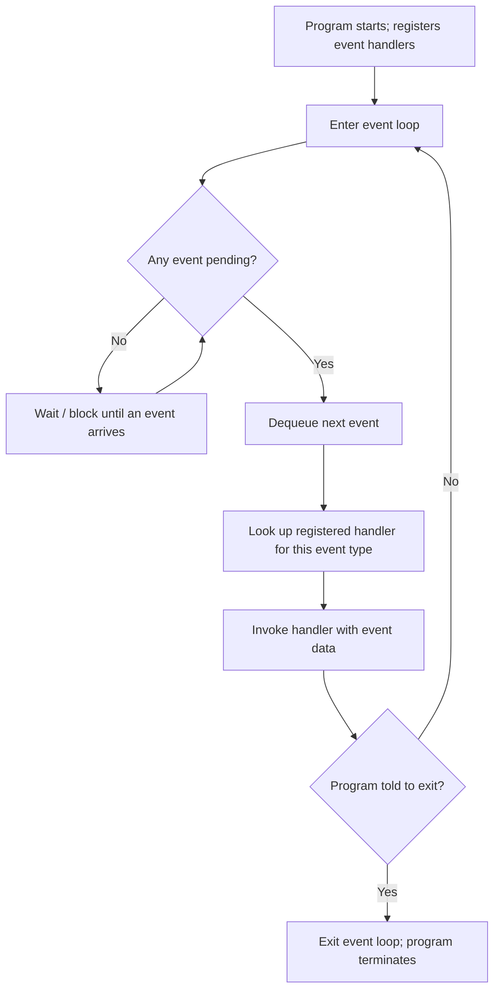
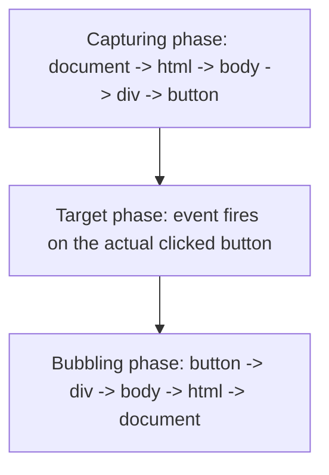

## Event Handling Fundamentals

### Conceptual Foundation

Event handling is a programming model in which a program's control flow is driven not by a predetermined, linear sequence of statements but by the occurrence of discrete **events** — user actions (a mouse click, a key press), system notifications (a timer expiring, a network response arriving), or messages from other parts of a program — each of which the program responds to by executing a designated piece of code called an **event handler** (or **listener**, or **callback**, depending on the language and framework's terminology).

This model inverts the traditional flow of control found in straight-line procedural code. Rather than the program calling into a library and waiting for a result, the program registers interest in certain events ahead of time and then largely waits; the underlying runtime or windowing system decides when to invoke the registered code, and in what order, based on what actually happens. This inversion is frequently summarized as the **Hollywood Principle**: "don't call us, we'll call you."

### The Event Loop

Central to nearly all event-driven systems is an **event loop**: a continuously running cycle that waits for events to occur, dispatches each one to its registered handler(s), and then returns to waiting, repeating indefinitely until the program is instructed to terminate.



The event loop is the mechanism that gives event-driven programs their characteristic responsiveness: the program is never "busy" doing unrelated work while a user interacts with it, because between events, it is simply waiting, ready to dispatch the next occurrence immediately. This is the same underlying mechanism referenced under [[actor-model-and-modern-concurrency-approaches]] as the basis for single-threaded async/await models in JavaScript — the JavaScript runtime's event loop is a concrete, widely encountered instance of this general pattern.

### Registering Handlers

The specific syntax for associating a handler with an event varies considerably by language and platform, but the underlying operation — binding a callable piece of code to a named or typed event — is consistent.

**JavaScript (DOM events)**

```javascript
const button = document.getElementById("submitBtn");

button.addEventListener("click", function(event) {
    console.log("Button clicked at", event.clientX, event.clientY);
});
```

`addEventListener` registers the anonymous function as a handler for the `"click"` event on that specific element; the function is not invoked immediately, but stored by the runtime and invoked later, whenever (and however many times) the actual click occurs.

**Python (Tkinter GUI)**

```python
import tkinter as tk

def on_button_click():
    print("Button was clicked")

root = tk.Tk()
button = tk.Button(root, text="Click Me", command=on_button_click)
button.pack()
root.mainloop()
```

`root.mainloop()` is Tkinter's explicit invocation of the event loop itself; nothing in the program responds to clicks until this call is reached, and the program's `on_button_click` function is otherwise inert, sitting registered but unexecuted, until the loop dispatches a matching event to it.

**Java (Swing GUI)**

```java
import javax.swing.*;
import java.awt.event.ActionListener;

JButton button = new JButton("Click Me");
button.addActionListener(new ActionListener() {
    public void actionPerformed(java.awt.event.ActionEvent e) {
        System.out.println("Button was clicked");
    }
});
```

Java's `ActionListener` interface exemplifies a common pre-lambda idiom: an entire (often anonymous) class is defined solely to provide the single method the event system will call, a pattern later simplified considerably in Java 8 with lambda expressions.

### Events as Data

An event is typically represented as a data structure (an object, struct, or dictionary) carrying information about what occurred: which element was involved, coordinates for pointer events, which key was pressed, a timestamp, and so on. Handlers commonly receive this event object as a parameter, allowing the same handler function to be reused across multiple sources or to branch its behavior based on the event's specific details.

```javascript
document.addEventListener("keydown", function(event) {
    if (event.key === "Enter") {
        submitForm();
    } else if (event.key === "Escape") {
        cancelForm();
    }
});
```

### Event Propagation: Bubbling and Capturing

In hierarchical UI systems — most prominently the browser DOM — an event does not simply fire once at a single target; it typically travels through the structure of nested elements in a defined order, giving multiple levels of the hierarchy a chance to respond to the same underlying occurrence.



By default, most DOM event listeners registered via `addEventListener` respond during the **bubbling** phase — the event fires first at the deepest target element, then "bubbles" upward through each ancestor, giving parent elements a chance to react to events that technically originated on a descendant.

```javascript
document.getElementById("outer").addEventListener("click", () => {
    console.log("Outer div handler (bubbling)");
});

document.getElementById("inner").addEventListener("click", () => {
    console.log("Inner button handler");
});
// Clicking the inner button logs both handlers, inner first, then outer,
// because the click event bubbles upward through the DOM tree.
```

A handler can call `event.stopPropagation()` to prevent the event from continuing to bubble (or capture) further, which is commonly used when a nested interactive element should fully "consume" an event without triggering ancestor handlers that were registered for a broader purpose.

### The Observer Pattern as the Underlying Design

Event handling, at the level of program design (independent of any particular language's syntax), is a specific application of the **Observer design pattern**: one or more "observers" (handlers) register interest with a "subject" (the event source), and the subject notifies all registered observers whenever a relevant state change or occurrence takes place, without the subject needing to know anything about what the observers actually do.

```python
class EventEmitter:
    def __init__(self):
        self._listeners = {}

    def on(self, event_name, handler):
        self._listeners.setdefault(event_name, []).append(handler)

    def emit(self, event_name, *args):
        for handler in self._listeners.get(event_name, []):
            handler(*args)

emitter = EventEmitter()
emitter.on("data_received", lambda data: print(f"Handler A got: {data}"))
emitter.on("data_received", lambda data: print(f"Handler B got: {data}"))
emitter.emit("data_received", "sensor reading 42")
```

This minimal implementation reflects the essential shape common to nearly every event system regardless of language: a registration mechanism (`on`), an internal mapping from event identity to a list of interested handlers, and a dispatch mechanism (`emit`) that invokes every registered handler in turn when the corresponding event occurs. Node.js's built-in `EventEmitter` class is a production version of exactly this pattern.

### Synchronous vs. Asynchronous Handler Execution

A frequently important but easily overlooked detail: whether handlers execute **synchronously** (blocking the event loop until the handler completes, before any further events are dispatched) or **asynchronously** (the handler is scheduled but the loop continues, potentially dispatching other events before the handler finishes) has significant implications for responsiveness.

[Inference] In most GUI frameworks (JavaScript's DOM, Java Swing, Python's Tkinter), handlers run synchronously on the same single thread as the event loop itself by default, which is why a slow-running handler (one that performs an expensive computation or blocks on I/O) causes the entire user interface to become visibly unresponsive — no other events, including redraw or further input events, can be dispatched until that handler returns control back to the loop. This is the practical, hands-on reason why long-running work triggered from a UI event handler is generally offloaded to a background thread or an asynchronous task, rather than performed directly inside the handler itself.

```javascript
button.addEventListener("click", () => {
    // Bad: blocks the event loop, freezes the UI
    for (let i = 0; i < 5_000_000_000; i++) {}
});

button.addEventListener("click", async () => {
    // Better: yields control back to the event loop while awaiting
    const result = await fetchDataAsync();
    updateUI(result);
});
```

### Event-Driven Architecture Beyond GUIs

The same fundamental pattern extends well beyond graphical interfaces into server-side and systems programming. Node.js's entire runtime model is built around non-blocking I/O dispatched through an event loop, treating a completed file read or an incoming HTTP request as just another kind of event.

```javascript
const http = require('http');

const server = http.createServer((req, res) => {
    // 'req' and 'res' here are effectively an event and its associated data,
    // dispatched by Node's underlying event loop whenever a request arrives
    res.end("Hello, World!");
});

server.listen(3000);
```

Similarly, message queues and pub/sub systems (which extend the observer pattern across process or machine boundaries) and hardware interrupt handling at the operating-system level are conceptually the same pattern operating at different layers: something happens, interested parties who previously registered are notified, and a handler runs in response.

### Comparison of Event Handling Approaches

| Context | Registration Mechanism | Dispatch Mechanism | Typical Execution Mode |
| --- | --- | --- | --- |
| Browser DOM | `addEventListener` | Browser's internal event loop | Synchronous, single-threaded |
| Java Swing | `add*Listener` (e.g., `addActionListener`) | Event Dispatch Thread (EDT) | Synchronous, single dedicated thread |
| Python Tkinter | `command=` parameter, `.bind()` | `mainloop()` | Synchronous, single-threaded |
| Node.js | `.on(eventName, handler)` (EventEmitter) | libuv event loop | Handler itself often async internally |
| OS-level interrupts | Interrupt vector table entry | Hardware interrupt controller | Runs in a restricted interrupt context |

### Illustration — Event Dispatch From Source to Handler (svg_diagram)

<svg xmlns="http://www.w3.org/2000/svg" viewBox="0 0 820 320" font-family="sans-serif">
<text x="410" y="30" text-anchor="middle" font-size="18" font-weight="bold" fill="#1a1a1a">Event Registration and Dispatch (svg_diagram)</text>
<rect x="40" y="70" width="160" height="45" fill="#4a90d9" rx="4" />
<text x="120" y="97" text-anchor="middle" font-size="11" fill="white">Program startup:</text>
<text x="120" y="112" text-anchor="middle" font-size="10" fill="white">registers handler</text>
<line x1="200" y1="92" x2="280" y2="92" stroke="#333" stroke-width="1.5" marker-end="url(#a5)" />
<rect x="280" y="70" width="180" height="45" fill="#eee" stroke="#999" rx="4" />
<text x="370" y="97" text-anchor="middle" font-size="11" fill="#333">Internal registry:</text>
<text x="370" y="112" text-anchor="middle" font-size="10" fill="#333">event type -&gt; [handlers]</text>
<rect x="40" y="160" width="160" height="45" fill="#d9822b" rx="4" />
<text x="120" y="187" text-anchor="middle" font-size="11" fill="white">User clicks button</text>
<text x="120" y="202" text-anchor="middle" font-size="10" fill="white">(event occurs)</text>
<line x1="200" y1="182" x2="280" y2="182" stroke="#333" stroke-width="1.5" marker-end="url(#a5)" />
<rect x="280" y="160" width="180" height="45" fill="#eee" stroke="#999" rx="4" />
<text x="370" y="187" text-anchor="middle" font-size="11" fill="#333">Event loop dequeues</text>
<text x="370" y="202" text-anchor="middle" font-size="10" fill="#333">and looks up handlers</text>
<line x1="370" y1="115" x2="370" y2="160" stroke="#666" stroke-width="1.2" stroke-dasharray="4,2" />
<text x="500" y="145" font-size="10" fill="#555">(same registry consulted)</text>
<line x1="460" y1="182" x2="560" y2="182" stroke="#333" stroke-width="1.5" marker-end="url(#a5)" />
<rect x="560" y="160" width="220" height="45" fill="#7a9e5c" rx="4" />
<text x="670" y="187" text-anchor="middle" font-size="11" fill="white">Handler function executes</text>
<text x="670" y="202" text-anchor="middle" font-size="10" fill="white">with event data as argument</text>
<rect x="40" y="240" width="740" height="60" fill="#f5f5f5" stroke="#ccc" rx="6" />
<text x="60" y="263" font-size="11" fill="#333">Registration happens once, ahead of time; dispatch happens later and potentially many times.</text>
<text x="60" y="283" font-size="11" fill="#333">The program's control flow is driven by when events actually occur, not by source-code order.</text>
</svg>

### Next Steps

- DOM event bubbling, capturing, and `stopPropagation()`/`preventDefault()` in depth
- The Observer design pattern in non-event-loop contexts (data binding, reactive programming)
- Node.js's `EventEmitter` and libuv's event loop internals
- Debouncing and throttling high-frequency events (scroll, resize, input)
- Reactive extensions (RxJS, Reactive Streams) as a generalization of event streams
- GUI framework threading models: Java's Event Dispatch Thread, Tkinter's single-threaded constraint
- Message queues and publish/subscribe systems as distributed event handling