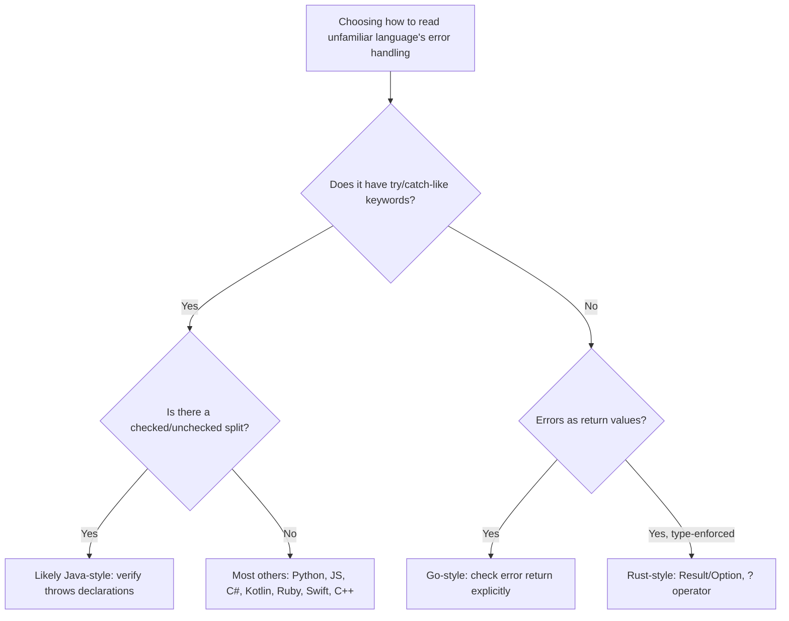

## Language Examples of Exception Mechanisms


### Conceptual Foundation

Every mainstream language that provides structured exception handling implements the same core ideas — raising, matching, handling, propagating, and cleaning up — covered in the earlier topics in this sequence, but the concrete syntax, standard exception hierarchy, and small semantic choices differ enough between languages that a side-by-side survey is useful for recognizing the same underlying concepts wearing different clothes. This entry walks through representative exception mechanisms across a deliberately broad set of languages, chosen to illustrate both the shared core and the meaningful points of divergence.

### C++

C++ exceptions are values of (almost) any type, though deriving from `std::exception` is conventional so that generic catch code can call `.what()`.

```cpp
#include <iostream>
#include <stdexcept>

double safeDivide(double a, double b) {
    if (b == 0.0) {
        throw std::invalid_argument("division by zero");
    }
    return a / b;
}

int main() {
    try {
        std::cout << safeDivide(10, 0) << std::endl;
    } catch (const std::invalid_argument& e) {
        std::cerr << "Error: " << e.what() << std::endl;
    } catch (...) {
        std::cerr << "Unknown exception" << std::endl;
    }
    return 0;
}
```

Distinctive features: no `finally` keyword (RAII/destructors serve this role instead); `catch (...)` catches literally anything, including non-`std::exception` types; exceptions are caught by reference (`const std::invalid_argument&`) by convention, to avoid slicing derived exception types down to their base class.

### Java

Java's exceptions are class instances descending from `Throwable`, split into the checked/unchecked distinction discussed earlier in this sequence.

```java
public class Main {
    static double safeDivide(double a, double b) throws ArithmeticException {
        if (b == 0) {
            throw new ArithmeticException("division by zero");
        }
        return a / b;
    }

    public static void main(String[] args) {
        try {
            System.out.println(safeDivide(10, 0));
        } catch (ArithmeticException e) {
            System.err.println("Error: " + e.getMessage());
        } finally {
            System.out.println("Division attempt complete");
        }
    }
}
```

Distinctive features: mandatory checked-exception declarations via `throws`; a genuine `finally` keyword; try-with-resources (`try (Resource r = ...)`) for automatic `AutoCloseable` cleanup; multi-catch (`catch (A | B e)`) since Java 7.

### Python

Python exceptions are instances of classes descending from `BaseException`, and the language treats exceptions as a normal, expected part of control flow more than most statically typed languages (the "easier to ask forgiveness than permission," or EAFP, idiom).

```python
def safe_divide(a, b):
    try:
        return a / b
    except ZeroDivisionError as e:
        print(f"Error: {e}")
        return None
    finally:
        print("Division attempt complete")
    else:
        print("This runs only if no exception occurred")
```

Distinctive feature not present in the C++/Java examples above: the `else` clause, which runs only if the `try` block completed without raising, distinguishing "code that must run whether or not an exception occurred" (`finally`) from "code that should run only on the success path but is still logically part of the try/except statement" (`else`) — useful for keeping code that could itself raise a *different* exception out of the `try` block's exception-matching scope. [Note: an `else` clause after `except`/`finally` would, in this specific code sample as written, actually raise a `SyntaxError` if placed after `finally` rather than before it; correct placement is `try`/`except`/`else`/`finally`, in that order.]

### JavaScript

JavaScript exceptions can technically be any value at all (`throw 42;` and `throw "oops";` are both legal), though `Error` and its subclasses are conventional.

```javascript
function safeDivide(a, b) {
    if (b === 0) {
        throw new RangeError("division by zero");
    }
    return a / b;
}

try {
    console.log(safeDivide(10, 0));
} catch (e) {
    if (e instanceof RangeError) {
        console.error("Range error:", e.message);
    } else {
        console.error("Unknown error:", e);
    }
} finally {
    console.log("Division attempt complete");
}
```

Distinctive features: no static type checking on what can be thrown at all, so `instanceof` checks inside a single `catch` block are the idiomatic replacement for multiple typed `catch` clauses; optional catch binding (`catch { ... }` without a parameter) is legal when the exception object itself isn't needed; `async`/`await` functions integrate exceptions with `Promise` rejection.

### C#

C# closely resembles Java's model syntactically but omits the checked/unchecked distinction entirely — all exceptions in C# are effectively unchecked.

```csharp
using System;

class Program {
    static double SafeDivide(double a, double b) {
        if (b == 0) {
            throw new DivideByZeroException("division by zero");
        }
        return a / b;
    }

    static void Main() {
        try {
            Console.WriteLine(SafeDivide(10, 0));
        } catch (DivideByZeroException e) when (e.Message.Contains("zero")) {
            Console.Error.WriteLine($"Error: {e.Message}");
        } finally {
            Console.WriteLine("Division attempt complete");
        }
    }
}
```

Distinctive feature: the `when` clause is C#'s native exception filter (a guard condition evaluated before the catch block's body runs, similar in spirit to Scala's pattern-match guards covered earlier), and — importantly — a `when` filter that evaluates false allows propagation to continue searching for another handler *without* having partially entered this one, which differs subtly from catching, inspecting, and rethrowing.

### Ruby

Ruby's exception mechanism is derived directly from `Exception`, with `StandardError` as the practical base for ordinary rescuable errors, and uses `begin`/`rescue`/`ensure`/`else` keywords rather than `try`/`catch`.

```ruby
def safe_divide(a, b)
  begin
    raise ZeroDivisionError, "division by zero" if b == 0
    a / b
  rescue ZeroDivisionError => e
    puts "Error: #{e.message}"
    nil
  ensure
    puts "Division attempt complete"
  end
end
```

Distinctive features: `rescue` (not `catch` — Ruby actually reserves `catch`/`throw` for a separate, non-exception-related non-local control-flow mechanism, which is a frequent point of confusion for newcomers); `ensure` plays the `finally` role; methods can use an implicit `begin` for their entire body, allowing `rescue`/`ensure` to be written directly at the method level without an explicit `begin` keyword.

### Swift

Swift requires functions that can throw to be explicitly marked with `throws` in their signature, and every call site of such a function must be marked with `try`, making the possibility of an error visible at both definition and call site without a full checked-exception hierarchy.

```swift
enum MathError: Error {
    case divisionByZero
}

func safeDivide(_ a: Double, _ b: Double) throws -> Double {
    if b == 0 {
        throw MathError.divisionByZero
    }
    return a / b
}

do {
    let result = try safeDivide(10, 0)
    print(result)
} catch MathError.divisionByZero {
    print("Error: division by zero")
} catch {
    print("Unknown error: \(error)")
}
```

Distinctive features: `Error` is a protocol, and any type (commonly an `enum`, as shown) can conform to it, giving pattern-matchable, structured error values rather than requiring a class hierarchy; `try?` converts a throwing call into an `Optional` (nil on failure) and `try!` asserts the call will not fail (crashing the program if it does), giving three distinct call-site postures toward the same throwing function.

### Kotlin

Kotlin deliberately has no checked exceptions at all — a design decision explicitly stated by its creators as a reaction against the boilerplate they observed resulting from Java's checked-exception requirement.

```kotlin
fun safeDivide(a: Double, b: Double): Double {
    if (b == 0.0) {
        throw ArithmeticException("division by zero")
    }
    return a / b
}

fun main() {
    try {
        println(safeDivide(10.0, 0.0))
    } catch (e: ArithmeticException) {
        println("Error: ${e.message}")
    } finally {
        println("Division attempt complete")
    }
}
```

Distinctive feature: `try` is an *expression* in Kotlin, not merely a statement, meaning it can produce a value directly: `val result = try { safeDivide(a, b) } catch (e: ArithmeticException) { -1.0 }` is valid Kotlin, letting exception handling be woven directly into an expression rather than requiring a separate mutable variable assigned from within the blocks.

### Go and Rust (For Contrast — Not Traditional Exceptions)

As established in the earlier discussion of alternative error models, Go and Rust are included here specifically because they are frequently mentioned in the same breath as "exception mechanisms" despite deliberately not using one for ordinary error handling.

```go
func safeDivide(a, b float64) (float64, error) {
    if b == 0 {
        return 0, errors.New("division by zero")
    }
    return a / b, nil
}
```

```rust
fn safe_divide(a: f64, b: f64) -> Result<f64, String> {
    if b == 0.0 {
        return Err("division by zero".to_string());
    }
    Ok(a / b)
}
```

Both retain a separate `panic` mechanism (Go's `panic`/`recover`, Rust's `panic!`) that behaves more like a traditional unwind-based exception, but idiomatic code in both languages reserves this for unrecoverable programming errors rather than expected, recoverable conditions like the division-by-zero case shown.

### Consolidated Comparison

| Language | Keyword Set | Checked Exceptions? | Cleanup Keyword | Anything Throwable? |
| --- | --- | --- | --- | --- |
| C++ | `try` / `catch` / `throw` | No | None (RAII) | Yes, any type |
| Java | `try` / `catch` / `throw` / `finally` | Yes (opt-in) | `finally` | No (must extend `Throwable`) |
| Python | `try` / `except` / `raise` / `finally` / `else` | No | `finally` | No (must derive `BaseException`) |
| JavaScript | `try` / `catch` / `throw` / `finally` | No | `finally` | Yes, any value |
| C# | `try` / `catch` / `throw` / `finally` / `when` | No | `finally` | No (must derive `Exception`) |
| Ruby | `begin` / `rescue` / `raise` / `ensure` / `else` | No | `ensure` | No (must derive `Exception`) |
| Swift | `do` / `catch` / `throw` / `throws` / `try` | Declared via `throws`, not class hierarchy | `defer` (separate from catch) | No (must conform to `Error`) |
| Kotlin | `try` / `catch` / `throw` / `finally` | No (deliberately omitted) | `finally` | No (must derive `Throwable`) |
| Go | N/A (`error` values); `panic`/`recover` for fatal cases | N/A | `defer` | N/A |
| Rust | N/A (`Result`/`Option`); `panic!` for fatal cases | N/A | Drop trait (destructor-like) | N/A |

### Illustration — Keyword Mapping Across Languages (svg_diagram)

<svg xmlns="http://www.w3.org/2000/svg" viewBox="0 0 860 300" font-family="sans-serif">
<text x="430" y="30" text-anchor="middle" font-size="18" font-weight="bold" fill="#1a1a1a">Same Concept, Different Keywords (svg_diagram)</text>

<text x="120" y="65" text-anchor="middle" font-size="12" font-weight="bold" fill="`#1a1a1a`">Protected region</text>

<rect x="40" y="80" width="160" height="30" fill="`#4a90d9`" rx="4" />

<text x="120" y="100" text-anchor="middle" font-size="10" fill="white">try / do / begin</text>

<text x="320" y="65" text-anchor="middle" font-size="12" font-weight="bold" fill="`#1a1a1a`">Signal condition</text>

<rect x="240" y="80" width="160" height="30" fill="`#d9822b`" rx="4" />

<text x="320" y="100" text-anchor="middle" font-size="10" fill="white">throw / raise</text>

<text x="520" y="65" text-anchor="middle" font-size="12" font-weight="bold" fill="`#1a1a1a`">Handle it</text>

<rect x="440" y="80" width="160" height="30" fill="`#7a9e5c`" rx="4" />

<text x="520" y="100" text-anchor="middle" font-size="10" fill="white">catch / except / rescue</text>

<text x="740" y="65" text-anchor="middle" font-size="12" font-weight="bold" fill="`#1a1a1a`">Guaranteed cleanup</text>

<rect x="660" y="80" width="160" height="30" fill="`#9b59b6`" rx="4" />

<text x="740" y="100" text-anchor="middle" font-size="10" fill="white">finally / ensure / defer</text>

<rect x="40" y="140" width="780" height="140" fill="#f5f5f5" stroke="#ccc" rx="6" />
<text x="60" y="163" font-size="11" font-weight="bold" fill="#333">Row-by-row keyword mapping:</text>
<text x="60" y="185" font-size="10" fill="#333">C++/Java/JS/C#/Kotlin: try / throw / catch / finally</text>
<text x="60" y="203" font-size="10" fill="#333">Python: try / raise / except / finally (plus else)</text>
<text x="60" y="221" font-size="10" fill="#333">Ruby: begin / raise / rescue / ensure (plus else)</text>
<text x="60" y="239" font-size="10" fill="#333">Swift: do / throw / catch (plus separate defer for cleanup)</text>
<text x="60" y="257" font-size="10" fill="#333">Go/Rust: no throw/catch; explicit return values, plus defer / Drop for cleanup</text>
</svg>

### Decision Reference



### Related Topics

- Deep dive into Swift's `Error` protocol and `try`/`try?`/`try!` call-site postures
- Ruby's `catch`/`throw` non-local control flow (distinct from its `rescue` exception system)
- C#'s exception filters (`when`) versus catch-then-rethrow patterns
- Kotlin's `try` as an expression and its interaction with type inference
- Cross-language exception interoperability in polyglot runtimes (JVM languages, .NET languages)
- Standard library exception hierarchies compared across ecosystems
- Idiomatic error-handling style guides per language (EAFP vs. LBYL, Go's error-wrapping conventions)