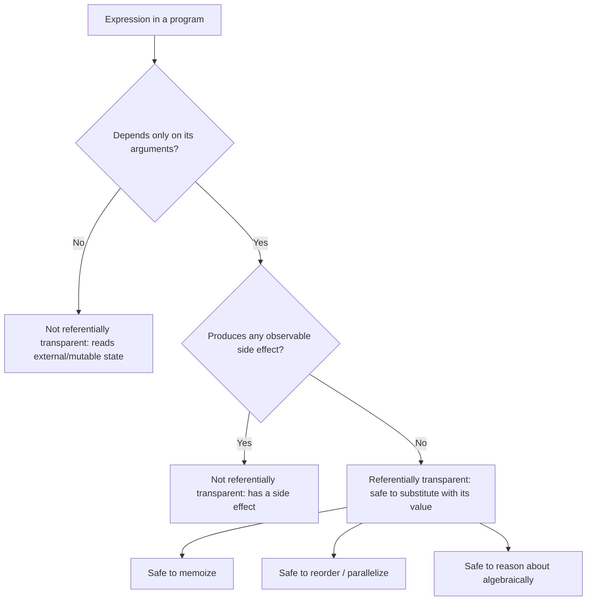

## Mathematical Functions and Referential Transparency

### Conceptual Foundation

A mathematical function, in the strict sense used in functional programming theory, is a mapping from inputs to outputs where the same input always produces the same output, with no dependency on anything other than the input values themselves, and no observable effect beyond producing that output. This is a narrower notion than what most imperative languages call a "function," which is typically just a named, callable block of code with no guarantee that calling it twice with the same arguments yields the same result, or that calling it does nothing besides computing a return value.

**Referential transparency** is the property that formalizes this idea at the level of an entire expression: an expression is referentially transparent if it can be replaced by its evaluated value, anywhere it appears in a program, without changing the program's behavior. A function call is referentially transparent precisely when the function is mathematically pure — same inputs always yield the same output, and no side effects occur — since only then can the call be freely substituted with its result.

### Pure Functions

A function is called **pure** when it satisfies two conditions: its output depends only on its input arguments (no reliance on external mutable state, global variables, file contents, or randomness), and it produces no observable side effects (no mutation of arguments, no I/O, no modification of variables outside its own local scope).

```python
def add(a, b):
    return a + b
# Pure: same inputs always produce the same output, nothing else happens
```

```python
counter = 0

def increment_and_add(a, b):
    global counter
    counter += 1          # side effect: mutates external state
    return a + b + counter  # output depends on external state, not just a and b
# Impure: calling this twice with the same (a, b) gives different results,
# and it silently mutates a global variable as a side effect
```

The impure version violates both conditions simultaneously: its result depends on `counter`, which is external mutable state, and it also mutates that state as a side effect of being called — either violation alone would be sufficient to make the function impure and the corresponding call expression not referentially transparent.

### Demonstrating Referential Transparency Directly

The clearest way to see referential transparency in action is to substitute a function call with its computed value and check whether the surrounding program still behaves identically.

```python
def square(x):
    return x * x

result = square(4) + square(4)
# Referentially transparent: can be rewritten as:
result = 16 + 16
# ...without changing the program's behavior at all, because square(4)
# always evaluates to exactly 16, with nothing else happening as a side effect.
```

```python
import random

def flaky():
    return random.randint(1, 100)

result = flaky() + flaky()
# NOT referentially transparent: cannot be rewritten as, say,
result = 42 + 42
# because flaky() does not reliably return the same value each call,
# and substituting a single evaluated value would change the program's actual behavior.
```

[Inference] This substitution test is the most direct operational definition of referential transparency available: if replacing every call to an expression with one fixed value (obtained by evaluating it once) changes what the program computes or does, the expression was not referentially transparent to begin with.

### Why Referential Transparency Matters

Referential transparency enables a collection of reasoning and optimization techniques that are difficult or unsafe to apply to code containing side effects or hidden state dependencies.

**Equational reasoning.** Because a referentially transparent expression can always be replaced by its value, programs built entirely from such expressions can be reasoned about the way algebraic equations are — by substitution and simplification — rather than by mentally simulating a sequence of state changes over time.

**Safe memoization/caching.** Since a pure function's output depends only on its input, its results can be cached (memoized) without risk of returning stale or incorrect data, because "stale" is not a meaningful concept for a function whose output for a given input never changes.

```python
from functools import lru_cache

@lru_cache(maxsize=None)
def fibonacci(n):
    if n < 2:
        return n
    return fibonacci(n - 1) + fibonacci(n - 2)
# Safe to cache: fibonacci(10) will always be 55, forever,
# so caching introduces no risk of returning an outdated result
```

**Reordering and parallelization.** If two expressions are both referentially transparent and neither depends on the other's result, evaluating them in a different order — or evaluating them concurrently — cannot change the program's observable outcome, since neither has a side effect that the other could observe or be affected by. This is a large part of why languages and paradigms that emphasize purity (Haskell, and the pure subsets of languages like Scala and Clojure) can more aggressively parallelize or reorder computation without introducing the data-race concerns discussed under [[threads-and-their-language-support]] — there is no shared mutable state to race over in the first place.

**Compiler optimization.** A compiler can safely perform transformations like common subexpression elimination (computing an expression once and reusing the result everywhere it appears) or lazy evaluation (deferring computation until a value is actually needed) on referentially transparent code, because the timing and frequency of evaluation cannot be observed to matter — the value would be the same regardless of when or how many times it is actually computed.

### Referential Transparency Across Language Paradigms



**Haskell** enforces this property at the type-system level for the vast majority of code, by requiring any function that performs I/O or other effects to have its effectful nature reflected in its type (via the `IO` monad), making pure and impure code visibly, and in practice largely unavoidably, distinguishable.

```haskell
-- Pure: type signature contains no IO, so this cannot perform side effects
square :: Int -> Int
square x = x * x

-- Impure (by necessity): the IO in the type signature marks this as effectful
greet :: IO ()
greet = putStrLn "Hello, World!"
```

[Inference] Because Haskell's type system tracks the presence of effects in a function's signature, a Haskell programmer (and the compiler) can determine referential transparency largely by inspection of the type alone — a function with no `IO` (or other effect-tracking type) in its signature is guaranteed pure by the language's own rules, which is a stronger guarantee than most other languages provide, where purity is a matter of convention and discipline rather than compiler-enforced fact.

**Most imperative and multi-paradigm languages** (Python, Java, JavaScript, C++) impose no such restriction: any function can freely read global state, mutate its arguments, perform I/O, or return different results on different calls, and the language provides no built-in mechanism to distinguish pure functions from impure ones at the type level. Purity in these languages is a matter of the programmer's own discipline and convention, not something the compiler verifies or enforces.

### Common Sources of Impurity

- **Mutable shared/global state**: reading or writing a variable outside the function's own local scope.
- **I/O operations**: reading from or writing to a file, network socket, database, console, or any external resource, since the observable side effect (a printed line, a written file) is itself a violation of "no observable effect beyond the return value."
- **Non-determinism**: calling a random-number generator, reading the current time or date, or depending on thread-scheduling order, since these make the same input produce different outputs across calls.
- **Exceptions and control-flow effects**: [Inference] a function that can throw an exception is, by some stricter formulations of purity, not fully pure, since throwing is itself an effect distinct from ordinarily returning a value — though many practical, informal definitions of "pure function" in mainstream (non-Haskell) languages set this concern aside and focus primarily on the absence of state mutation and I/O, since exhaustively modeling exceptions as effects adds considerable complexity for comparatively modest practical benefit in those settings.
- **Argument mutation**: a function that modifies a mutable object passed to it (e.g., appending to a list argument in place) is impure with respect to that argument, even if its literal return value is otherwise consistent, since the mutation is an externally observable side effect on the caller's data.

```python
def append_bad(lst, item):
    lst.append(item)   # mutates the caller's list — a side effect
    return lst

def append_good(lst, item):
    return lst + [item]  # returns a NEW list; caller's original list is untouched
```

### Referential Transparency and Equal Hashing/Comparison

A subtler consequence: because a referentially transparent expression always yields the same value, pure functional data structures can safely rely on structural equality and hashing without concern that "the same value" might later change underneath a reference — a concern that is meaningful in languages with pervasive mutable state, where two references that compare equal today might not tomorrow if the underlying object is mutated.

```python
frozen_point_a = (3, 4)
frozen_point_b = (3, 4)
# Tuples are immutable in Python; these can be safely used as dictionary keys
# or compared for equality indefinitely, because neither can be mutated
# to silently diverge from the other after the comparison is made.
```

[Inference] This is part of why immutability and referential transparency are frequently discussed together, even though they are technically distinct concepts: immutable data structures make it substantially easier to write and verify pure functions, since a function operating only on immutable inputs has no opportunity to accidentally introduce a mutation-based side effect, even unintentionally.

### Illustration — Substitution Model of Evaluation (svg_diagram)

<svg xmlns="http://www.w3.org/2000/svg" viewBox="0 0 820 300" font-family="sans-serif">
<text x="410" y="30" text-anchor="middle" font-size="18" font-weight="bold" fill="#1a1a1a">Substitution Model: Pure vs Impure Expressions (svg_diagram)</text>

<text x="200" y="65" text-anchor="middle" font-size="14" font-weight="bold" fill="`#1a1a1a`">Referentially Transparent</text>

<rect x="60" y="80" width="280" height="35" fill="`#4a90d9`" rx="4" />

<text x="200" y="102" text-anchor="middle" font-size="11" fill="white">square(4) + square(4)</text>

<line x1="200" y1="115" x2="200" y2="140" stroke="#333" stroke-width="2" marker-end="url(#a6)" />

<rect x="60" y="140" width="280" height="35" fill="`#7a9e5c`" rx="4" />

<text x="200" y="162" text-anchor="middle" font-size="11" fill="white">16 + 16 (safe substitution)</text>

<text x="200" y="200" text-anchor="middle" font-size="10" fill="#555">Always produces the same result;</text>

<text x="200" y="215" text-anchor="middle" font-size="10" fill="#555">order and repetition don't matter</text>

<text x="620" y="65" text-anchor="middle" font-size="14" font-weight="bold" fill="`#1a1a1a`">Not Referentially Transparent</text>

<rect x="480" y="80" width="280" height="35" fill="`#d9822b`" rx="4" />

<text x="620" y="102" text-anchor="middle" font-size="11" fill="white">flaky() + flaky()</text>

<line x1="620" y1="115" x2="620" y2="140" stroke="`#c0392b`" stroke-width="2" marker-end="url(#a6red)" />

<rect x="480" y="140" width="280" height="35" fill="#ccc" rx="4" />

<text x="620" y="162" text-anchor="middle" font-size="11" fill="#666">NOT safely 42 + 42 (unsound)</text>

<text x="620" y="200" text-anchor="middle" font-size="10" fill="#555">Each call may return a different value;</text>

<text x="620" y="215" text-anchor="middle" font-size="10" fill="#555">substitution would break the program</text>

</svg>

### Related Topics

- Immutability and persistent (immutable) data structures
- Haskell's `IO` monad and effect-tracking type systems
- Memoization strategies and their correctness dependence on purity
- Lazy evaluation and its relationship to referential transparency
- Side effects, effect systems, and algebraic effects as a generalization
- Equational reasoning and formal program verification
- Pure functional core / imperative shell architecture pattern