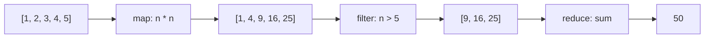

## Fundamentals of Functional Programming


### Conceptual Foundation

Functional programming is a paradigm that treats computation as the evaluation of mathematical functions, structuring programs around the composition of such functions rather than around sequences of statements that change program state. Where imperative programming asks "what steps do I execute, and in what order, to change the machine's state until I reach the answer," functional programming asks "what is the answer, expressed as a composition of functions applied to values." This distinction connects directly to the concept of [[mathematical-functions-and-referential-transparency]]: functional programming is, in essence, the paradigm built around maximizing the proportion of a program's logic that is expressed through pure, referentially transparent functions.

Functional programming is not a single, sharply bounded category but a spectrum. Languages like Haskell enforce purity by design; languages like Clojure and Erlang are built around functional idioms and immutability but permit controlled effects; and multi-paradigm languages like Python, JavaScript, Java, and C++ support functional *style* — first-class functions, immutable data, higher-order functions — without requiring or enforcing it.

### Core Principles

**Immutability.** Functional programming favors data that, once created, cannot be changed. Instead of mutating a data structure, a function that needs to "modify" it produces a new structure reflecting the change, leaving the original untouched.

```python
original = (1, 2, 3)
# "Modifying" functionally means producing a new value, not mutating in place
modified = original + (4,)
print(original)   # (1, 2, 3) — unchanged
print(modified)   # (1, 2, 3, 4)
```

**Pure functions.** As established in the referential transparency discussion, functional programming emphasizes functions whose output depends only on their input and which produce no side effects, since such functions are the building blocks that make the rest of the paradigm's benefits (safe composition, safe reordering, equational reasoning) possible.

**First-class and higher-order functions.** In a functional language, functions are values like any other: they can be assigned to variables, stored in data structures, passed as arguments to other functions, and returned as results from other functions. A **higher-order function** is specifically a function that takes another function as an argument, returns one as a result, or both.

```python
def apply_twice(f, x):
    return f(f(x))

def increment(x):
    return x + 1

result = apply_twice(increment, 5)  # 7
```

**Declarative style over imperative loops.** Functional code tends to describe *what* transformation should occur to a collection of data, rather than *how* to iterate over it step by step with explicit loop counters and mutable accumulators.

```python
numbers = [1, 2, 3, 4, 5]

# Imperative style
squares_imperative = []
for n in numbers:
    squares_imperative.append(n * n)

# Functional style
squares_functional = list(map(lambda n: n * n, numbers))
```

### Map, Filter, and Reduce

Three higher-order functions form the practical backbone of everyday functional programming, appearing under these or closely related names in nearly every language with functional support.

**`map`** applies a function to every element of a collection, producing a new collection of the transformed results, with no mutation of the original.

```python
numbers = [1, 2, 3, 4, 5]
doubled = list(map(lambda n: n * 2, numbers))
# [2, 4, 6, 8, 10]
```

**`filter`** applies a predicate (a function returning a boolean) to every element, producing a new collection containing only the elements for which the predicate returned true.

```python
evens = list(filter(lambda n: n % 2 == 0, numbers))
# [2, 4]
```

**`reduce`** (also called `fold` in many languages) combines all elements of a collection into a single accumulated value, by repeatedly applying a combining function to an accumulator and each successive element.

```python
from functools import reduce
total = reduce(lambda acc, n: acc + n, numbers, 0)
# 15
```



This pipeline — map, then filter, then reduce — is one of the most common functional idioms across languages, precisely because each stage is itself a pure, composable transformation that can be reasoned about, tested, and (given purity) safely parallelized in isolation from the others.

### Function Composition

Functional programming treats the combination of two functions into a new function — where the output of one becomes the input of the next — as a fundamental operation in its own right, often given direct syntactic or library support rather than requiring the programmer to manually nest calls.

```haskell
-- Haskell's (.) operator composes functions directly
addOne :: Int -> Int
addOne x = x + 1

double :: Int -> Int
double x = x * 2

addOneThenDouble :: Int -> Int
addOneThenDouble = double . addOne
-- addOneThenDouble 5 evaluates double(addOne(5)) = double(6) = 12
```

```python
def compose(f, g):
    return lambda x: f(g(x))

add_one = lambda x: x + 1
double = lambda x: x * 2

add_one_then_double = compose(double, add_one)
print(add_one_then_double(5))  # 12
```

[Inference] The value of treating composition as a first-class operation is that it allows programs to be built by assembling small, independently verified functions into larger pipelines, rather than by writing monolithic functions that perform multiple transformations inline — a structural style that tends to track closely with the emphasis on equational reasoning discussed earlier under referential transparency.

### Recursion Over Iteration

Because functional programming discourages mutable state, and a traditional `for` loop with a mutable counter and accumulator variable is itself a form of mutable state, functional languages and functional styles favor **recursion** as the primary mechanism for repetition.

```haskell
factorial :: Int -> Int
factorial 0 = 1
factorial n = n * factorial (n - 1)
```

A significant practical concern with naive recursion is stack growth: each recursive call typically consumes a new stack frame, risking a stack overflow for deep recursion. **Tail call optimization (TCO)** addresses this: when a recursive call is the very last operation performed in a function (its "tail position"), a compiler or runtime that implements TCO can reuse the current stack frame instead of allocating a new one, allowing the recursion to run in constant stack space.

```haskell
-- Tail-recursive version: the recursive call is the last operation,
-- with the accumulator carrying partial results forward
factorialTail :: Int -> Int -> Int
factorialTail acc 0 = acc
factorialTail acc n = factorialTail (acc * n) (n - 1)
```

[Inference] Whether tail call optimization is actually available is highly language- and implementation-dependent: Haskell, Scala, and Scheme implementations generally guarantee or strongly support it, while the JVM (and therefore Java and, with some caveats, Kotlin) and CPython notably do not perform general TCO, meaning deeply recursive functional-style code in those environments can still overflow the stack even when written in an otherwise tail-recursive shape.

### Lazy Evaluation

Several functional languages, most prominently Haskell, evaluate expressions **lazily** by default: an expression is not computed until its value is actually demanded by some other part of the program, and if it is never demanded, it is never computed at all.

```haskell
-- This defines an infinite list, but Haskell's laziness means
-- no infinite computation actually occurs until values are demanded
naturals :: [Integer]
naturals = [1..]

firstFive :: [Integer]
firstFive = take 5 naturals
-- [1, 2, 3, 4, 5] — only the first five elements were ever actually computed
```

[Inference] Lazy evaluation is closely tied to referential transparency: because a pure expression's value cannot change based on when it is evaluated, a language can safely defer evaluation indefinitely (or skip it entirely, if unused) without any risk of changing the program's observable behavior — a strategy that would be far riskier in the presence of side effects, since deferring a side-effecting operation could visibly change the order in which effects occur.

### Algebraic Data Types and Pattern Matching

Functional languages commonly organize data using **algebraic data types** — types built by combining simpler types via "and" (product types, i.e., structures/records with multiple fields) and "or" (sum types, i.e., a value that is one of several distinct variants) — and provide **pattern matching** as the primary mechanism for destructuring and branching on such data.

```haskell
data Shape = Circle Double | Rectangle Double Double

area :: Shape -> Double
area (Circle r) = pi * r * r
area (Rectangle w h) = w * h
```

```rust
enum Shape {
    Circle(f64),
    Rectangle(f64, f64),
}

fn area(shape: &Shape) -> f64 {
    match shape {
        Shape::Circle(r) => std::f64::consts::PI * r * r,
        Shape::Rectangle(w, h) => w * h,
    }
}
```

Pattern matching in this style typically comes with **exhaustiveness checking**: the compiler verifies that every possible variant of a sum type has a corresponding match arm, catching an entire category of bugs (forgetting to handle a case) at compile time rather than at runtime.

### Functional Programming Support Across Languages

| Language | Immutability Default | First-Class Functions | map/filter/reduce | Pattern Matching | TCO Guaranteed |
| --- | --- | --- | --- | --- | --- |
| Haskell | Yes (enforced) | Yes | Yes | Yes | Yes |
| Erlang/Elixir | Yes (enforced) | Yes | Yes | Yes | Yes |
| Scala | Opt-in (`val` vs `var`) | Yes | Yes | Yes | Partial (self-recursion only) |
| Clojure | Yes (persistent data structures) | Yes | Yes | Limited (via `cond`/multimethods) | Explicit (`recur`) |
| Python | No | Yes | Yes | Yes (since 3.10, `match`) | No |
| JavaScript | No (but `const` for bindings) | Yes | Yes | No (destructuring only) | No (not reliably implemented) |
| Java | No (records/`final` help) | Yes (since Java 8, lambdas) | Yes (Streams) | Yes (since Java 21, pattern matching for switch) | No |
| C++ | No | Yes (since C++11, lambdas) | Yes (via `<algorithm>`, ranges) | Limited (via `std::visit`) | No (not guaranteed) |

### Why Functional Programming, in Brief

[Inference] The most commonly cited practical motivations for adopting functional style, across the language-design and software-engineering literature, are: easier reasoning about correctness (since pure functions can be understood in isolation from the rest of the program's state); safer concurrency (since immutable data and the absence of shared mutable state remove the primary source of data races discussed under thread-based concurrency); and more straightforward testing (since a pure function's behavior depends only on its arguments, tests need not construct or reset any surrounding program state to exercise it reliably). These motivations are not universally decisive — [Speculation] many practitioners and language designers hold that a purely functional style can trade away some of this simplicity for a steeper learning curve or for genuine performance costs from excessive allocation of new immutable structures, which is a large part of why most mainstream languages today adopt functional *features* selectively rather than committing to full enforced purity.

### Illustration — Imperative vs Functional Data Transformation (svg_diagram)

<svg xmlns="http://www.w3.org/2000/svg" viewBox="0 0 840 320" font-family="sans-serif">
<text x="420" y="30" text-anchor="middle" font-size="18" font-weight="bold" fill="#1a1a1a">Imperative vs Functional Transformation Style (svg_diagram)</text>

<text x="210" y="65" text-anchor="middle" font-size="14" font-weight="bold" fill="`#1a1a1a`">Imperative</text>

<rect x="60" y="80" width="300" height="30" fill="`#4a90d9`" rx="4" />

<text x="210" y="100" text-anchor="middle" font-size="10" fill="white">result = [] (mutable accumulator)</text>

<rect x="60" y="120" width="300" height="30" fill="#eee" stroke="#999" rx="4" />

<text x="210" y="140" text-anchor="middle" font-size="10" fill="#333">for each item: mutate result in place</text>

<rect x="60" y="160" width="300" height="30" fill="`#7a9e5c`" rx="4" />

<text x="210" y="180" text-anchor="middle" font-size="10" fill="white">result now holds final value</text>

<text x="210" y="215" text-anchor="middle" font-size="10" fill="#555">State changes over time;</text>

<text x="210" y="230" text-anchor="middle" font-size="10" fill="#555">order of steps matters</text>

<text x="630" y="65" text-anchor="middle" font-size="14" font-weight="bold" fill="`#1a1a1a`">Functional</text>

<rect x="480" y="80" width="300" height="30" fill="`#4a90d9`" rx="4" />

<text x="630" y="100" text-anchor="middle" font-size="10" fill="white">original data (untouched)</text>

<line x1="630" y1="110" x2="630" y2="120" stroke="#333" stroke-width="2" marker-end="url(#a7)" />

<rect x="480" y="120" width="300" height="30" fill="`#d9822b`" rx="4" />

<text x="630" y="140" text-anchor="middle" font-size="10" fill="white">map(transform) -&gt; new collection</text>

<line x1="630" y1="150" x2="630" y2="160" stroke="#333" stroke-width="2" marker-end="url(#a7)" />

<rect x="480" y="160" width="300" height="30" fill="`#7a9e5c`" rx="4" />

<text x="630" y="180" text-anchor="middle" font-size="10" fill="white">filter/reduce -&gt; final new value</text>

<text x="630" y="215" text-anchor="middle" font-size="10" fill="#555">Each stage produces a new value;</text>

<text x="630" y="230" text-anchor="middle" font-size="10" fill="#555">original data never mutated</text>

</svg>

### Related Topics

- Monads and effect management in Haskell and similar languages
- Currying and partial application of functions
- Persistent data structures and structural sharing (Clojure, Scala)
- Type classes and ad-hoc polymorphism in functional type systems
- Functional reactive programming and stream-based architectures
- Comparing pure functional languages (Haskell) against functional-influenced multi-paradigm languages
- Tail call optimization internals and trampolining as a workaround in non-TCO languages