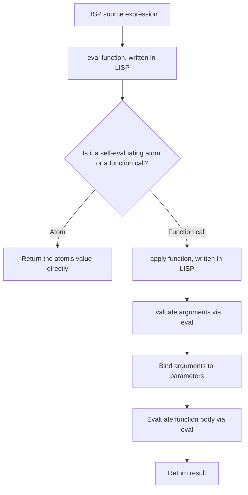
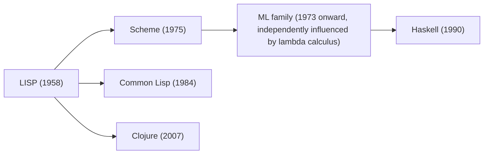

## The First Functional Programming Language

### Conceptual Foundation

The title "first functional programming language" is most widely attributed to **LISP** (LISt Processing), designed by John McCarthy and first implemented in 1958 at MIT. LISP occupies this position because it was the first language to be built directly around McCarthy's own theoretical work on recursive functions computable on symbolic expressions, and because it introduced — in a single, coherent, running system — the majority of the ideas that later became recognized as characteristically "functional": functions as first-class values, recursion as the primary control-flow mechanism, and a program-as-data (and data-as-program) uniformity that later languages inherited directly or by clear intellectual lineage.

It is worth noting at the outset that LISP is not a "purely" functional language in the sense that term is used to describe Haskell — LISP has always permitted mutation (`setq`, `setf`) and side effects freely. Its claim to being the first functional language rests on its being the first language whose core design was organized around functional/recursive computation over symbolic data, not on enforcing purity, which is a distinct and later-developed design goal.

### Theoretical Origins: Lambda Calculus

LISP's design was directly inspired by **Alonzo Church's lambda calculus**, a formal mathematical system developed in the 1930s for expressing computation purely in terms of function definition and application, without any notion of mutable state, loops, or sequential steps.

$$(\lambda x.\, x + 1)\ 5 \;\rightarrow\; 5 + 1 \;\rightarrow\; 6$$

The lambda calculus expresses "define a function that adds one to its argument, then apply it to 5" using nothing but function abstraction ($\lambda x.\, x+1$) and function application. McCarthy recognized that a subset of this formal system — recursive functions defined over symbolic expressions — could serve as a practical basis for a programming language, and LISP's name for a function definition, `lambda`, is a direct and deliberate reference to this theoretical origin.

```lisp
(lambda (x) (+ x 1))
```

This LISP expression is, structurally, a near-direct transcription of the lambda calculus notation above: an anonymous function taking one parameter and returning that parameter plus one. [Inference] This close correspondence between LISP's core syntax and the lambda calculus is precisely why LISP is regarded as the first language to bring a rigorous, mathematically grounded notion of "function" (as discussed under [[mathematical-functions-and-referential-transparency]]) into an actually implemented, runnable programming system, rather than treating "function" as merely a loose synonym for "subroutine," as most contemporaneous languages of the era did.

### McCarthy's Original Paper and Motivation

McCarthy's 1960 paper, "Recursive Functions of Symbolic Expressions and Their Computation by Machine, Part I," laid out the theoretical basis for LISP, framing the central problem as computing with **symbolic expressions** (s-expressions) — a data representation general enough to represent both simple data and, crucially, LISP programs themselves — using recursive function definitions as the primary means of specifying computation over that data. [Inference] This dual focus, on recursion as the mechanism for computation and on a single uniform data structure (the s-expression) as the substrate for both programs and data, is what distinguishes LISP's foundational design most sharply from the imperative languages being developed contemporaneously (such as FORTRAN, which predates LISP by roughly a year and was organized instead around sequential statements, mutable variables, and array-indexed loops reflecting the underlying machine's architecture directly).

### Core LISP Concepts That Became Functional Programming Staples

**S-expressions and homoiconicity.** LISP represents both code and data using the same nested-list syntax, a property later termed **homoiconicity**. This is what makes it natural in LISP to write functions that construct, inspect, or transform other pieces of code as if they were ordinary data.

```lisp
; This is data: a list of three numbers
(1 2 3)

; This is code: a function call that happens to use identical list syntax
(+ 1 2 3)
```

**Functions as first-class values.** LISP allowed functions to be passed as arguments, returned as results, and bound to variables from its earliest implementations, establishing the first-class-functions principle discussed under [[fundamentals-of-functional-programming]] well over two decades before most mainstream imperative languages adopted anything comparable.

```lisp
(defun apply-twice (f x)
  (funcall f (funcall f x)))

(apply-twice #'(lambda (x) (+ x 1)) 5)
; => 7
```

**Recursion as primary control flow.** LISP's original design provided recursive function definition as essentially the sole means of expressing repetition; explicit iteration constructs (like `do` loops) came later and were, in a real sense, layered onto a foundation that was recursive by default.

```lisp
(defun factorial (n)
  (if (= n 0)
      1
      (* n (factorial (- n 1)))))
```

**`cons`, `car`, `cdr`, and recursive list processing.** LISP's fundamental data-building operation, `cons` (construct a pair), together with `car` (access the first element) and `cdr` (access the rest), gave rise to a style of recursive list processing that became the template for functional data manipulation in essentially every later functional language.

```lisp
(defun my-length (lst)
  (if (null lst)
      0
      (+ 1 (my-length (cdr lst)))))
```

### The `eval`/`apply` Metacircular Evaluator

One of the most historically significant results in McCarthy's original paper was the demonstration that a small set of LISP primitives could be used to write a LISP interpreter *in LISP itself* — a **metacircular evaluator**. This was less a practical implementation detail than a theoretical demonstration: it showed that LISP's core (conditionals, function application, `cons`/`car`/`cdr`, and recursion) was expressive enough to define its own semantics, a result with deep ties to computability theory and to the later development of the field of programming language semantics generally.



[Inference] The eval/apply structure demonstrated in this metacircular evaluator became a template that essentially every subsequent interpreter-based language implementation — regardless of paradigm — has followed in some form, which is one reason LISP's historical influence is frequently described as extending well beyond functional programming specifically, into the general theory and practice of language implementation.

### Historical Context and Immediate Influence

LISP was implemented on the IBM 704 in 1958–1960, making it, by most conventional accounts, the second-oldest high-level programming language still in active use today, after FORTRAN (1957). Its influence on the subsequent development of functional programming specifically runs through a fairly direct lineage:



Scheme, developed at MIT in 1975 by Gerald Jay Sussman and Guy L. Steele Jr., is frequently highlighted in language-history discussions as the LISP dialect that most deliberately embraced and refined the language's functional character, adding lexical scoping and a cleaner, more minimal core than the LISP variants that had accumulated over the preceding decade and a half. [Inference] The ML family of languages (and, through it, Haskell) developed somewhat independently of the direct LISP lineage, drawing more heavily on type theory and Church's lambda calculus by a separate path, but both lineages ultimately trace back to the same theoretical wellspring in the lambda calculus that motivated McCarthy's original design.

### LISP's Departures From Later "Pure" Functional Ideals

It is worth being precise about where LISP diverges from the stricter functional-purity ideals developed later, since LISP predates and does not itself embody several ideas now closely associated with "functional programming" as a term.

- **Mutation is pervasive and idiomatic in LISP.** `setq` (set a variable) and `setf` (a generalized mutation operator) are standard, commonly used LISP operations; LISP never enforced or even strongly encouraged the absence of mutable state the way Haskell later would.
- **No static type system enforcing purity.** LISP is dynamically typed, and nothing in its type discipline (informal as it is) distinguishes a pure function from an impure one, unlike Haskell's later use of the `IO` type to track effects.
- **No enforced immutability of data structures.** LISP's `cons` cells are, by default, mutable (`rplaca` and `rplacd` modify a cons cell's contents in place), which is a marked contrast to the persistent, immutable data structures emphasized in later functional languages like Clojure (itself a LISP dialect, but one that specifically reintroduces immutability as a core design commitment that the original LISP lacked).

[Inference] This gap between LISP's actual historical design and the stricter definition of "functional" that developed later is why some historical accounts more precisely credit LISP as the first language to make functions first-class, symbolic, and recursively composable in a practical system, while reserving the description "purely functional" for later languages (ISWIM-influenced languages, and ultimately Haskell) that added enforced immutability and effect-tracking on top of the functional foundation LISP had already established.

### Comparative Timeline

| Language | Year | Key Contribution to Functional Lineage | Enforces Purity? |
| --- | --- | --- | --- |
| LISP | 1958 | First-class functions, recursion, symbolic data, homoiconicity | No |
| ISWIM (proposal) | 1966 | Landin's influential syntax proposal connecting lambda calculus to practical language design | N/A (proposal, not implemented) |
| Scheme | 1975 | Lexical scoping, minimalism, tail-call optimization guarantee | No |
| ML | 1973 | Static typing with type inference, pattern matching | No |
| Common Lisp | 1984 | Standardized, large-scale unification of LISP dialects | No |
| Haskell | 1990 | Enforced purity via type system (`IO` monad), laziness by default | Yes |
| Clojure | 2007 | LISP dialect reintroducing immutability and persistent data structures as defaults | Encouraged, not fully enforced |

### Illustration — LISP's Foundational Contributions (svg_diagram)

<svg xmlns="http://www.w3.org/2000/svg" viewBox="0 0 820 320" font-family="sans-serif">
<text x="410" y="30" text-anchor="middle" font-size="18" font-weight="bold" fill="#1a1a1a">What LISP (1958) Contributed to Functional Programming (svg_diagram)</text>
<circle cx="410" cy="150" r="70" fill="#4a90d9" />
<text x="410" y="145" text-anchor="middle" font-size="13" fill="white" font-weight="bold">LISP</text>
<text x="410" y="163" text-anchor="middle" font-size="10" fill="white">1958</text>
<rect x="60" y="60" width="180" height="45" fill="#7a9e5c" rx="4" />
<text x="150" y="83" text-anchor="middle" font-size="10" fill="white">First-class functions</text>
<text x="150" y="98" text-anchor="middle" font-size="9" fill="white">(from lambda calculus)</text>
<line x1="240" y1="90" x2="345" y2="120" stroke="#666" stroke-width="1.2" />
<rect x="580" y="60" width="180" height="45" fill="#d9822b" rx="4" />
<text x="670" y="83" text-anchor="middle" font-size="10" fill="white">Recursion as primary</text>
<text x="670" y="98" text-anchor="middle" font-size="9" fill="white">control flow</text>
<line x1="580" y1="90" x2="475" y2="120" stroke="#666" stroke-width="1.2" />
<rect x="60" y="235" width="180" height="45" fill="#9b59b6" rx="4" />
<text x="150" y="258" text-anchor="middle" font-size="10" fill="white">Homoiconicity</text>
<text x="150" y="273" text-anchor="middle" font-size="9" fill="white">(code as data)</text>
<line x1="240" y1="250" x2="345" y2="185" stroke="#666" stroke-width="1.2" />
<rect x="580" y="235" width="180" height="45" fill="#c0392b" rx="4" />
<text x="670" y="258" text-anchor="middle" font-size="10" fill="white">Metacircular evaluator</text>
<text x="670" y="273" text-anchor="middle" font-size="9" fill="white">(eval/apply)</text>
<line x1="580" y1="250" x2="475" y2="185" stroke="#666" stroke-width="1.2" />
</svg>

### Related Topics

- Lambda calculus fundamentals: reduction rules, Church numerals, combinators
- Scheme's minimalist design philosophy and its influence on later languages
- Common Lisp's Object System (CLOS) and multi-paradigm capabilities
- Clojure's persistent data structures and its relationship to the JVM
- Landin's ISWIM proposal and its influence on later functional syntax design
- Homoiconicity and macro systems built on code-as-data representation
- The ML family's independent path from lambda calculus to static functional typing