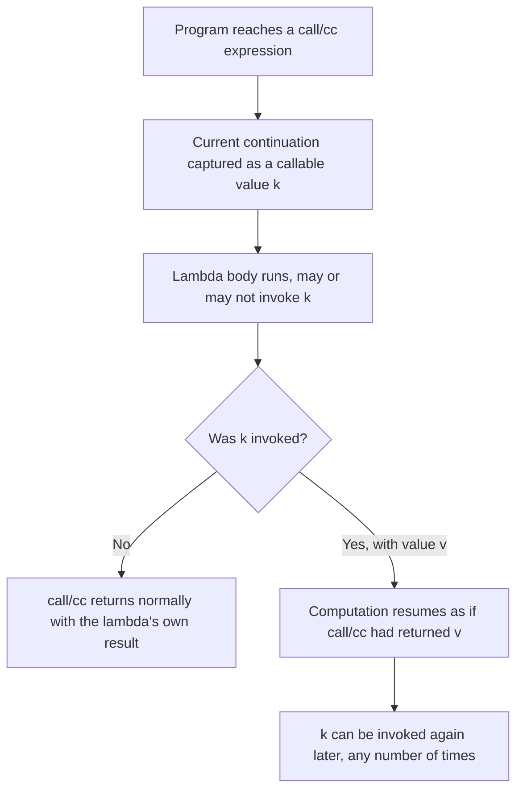
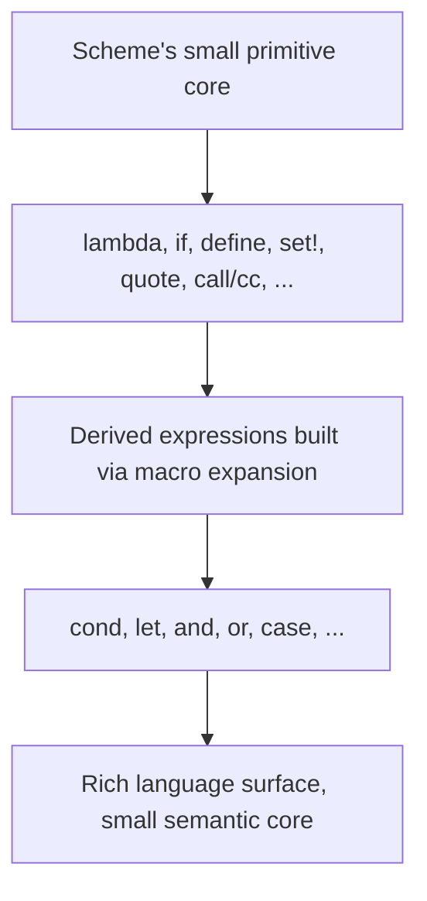

## Introduction to Scheme

### Conceptual Foundation

Scheme is a dialect of LISP, designed in 1975 at MIT by Gerald Jay Sussman and Guy L. Steele Jr., created as part of their research into actor-model semantics (the same actor model discussed under [[actor-model-and-modern-concurrency-approaches]], as it happens — Scheme's origins are directly tied to that line of research) and their desire for a small, theoretically clean language to explore it. Where the LISP dialects circulating by the mid-1970s had accumulated a large, somewhat inconsistent set of special forms and library functions, Scheme was deliberately designed as a minimalist counter-response: a small core language with lexical scoping, a uniform treatment of functions as first-class values, and precisely specified semantics, from which more complex behavior could be built rather than baked in.

Scheme is standardized through a series of documents called the **Revised^n Report on the Algorithmic Language Scheme** (commonly abbreviated R5RS, R6RS, R7RS, denoting successive revisions), which is unusual in language-standardization terms for how much emphasis it places on formally specifying semantics with mathematical precision rather than describing behavior through prose and examples alone.

### Lexical Scoping as a Defining Design Decision

Scheme's adoption of **lexical scoping** (also called static scoping) — where a variable reference resolves to the binding visible in the textual/structural context where it was written, determined at the time the code is written rather than at the time it happens to run — was a significant departure from earlier LISP dialects, many of which used **dynamic scoping**, where a variable reference resolves to whatever binding is currently active on the call stack at the moment of the reference.

```scheme
(define x 10)

(define (show-x) (display x))

(define (test)
  (let ((x 20))
    (show-x)))

(test)
; With lexical scoping (Scheme's actual behavior): prints 10,
; because show-x was DEFINED in a context where x is 10,
; regardless of what x is bound to at the CALL site inside test.
```

[Inference] This lexical-scoping decision is what makes closures — functions that capture and retain access to variables from their defining environment — behave predictably and usefully in Scheme, since a function's free variables are always resolved according to where it was textually written, not according to the potentially very different context from which it later happens to be called.

### Closures

A **closure** is a function bundled together with references to the variables from its enclosing lexical scope, such that those variables remain accessible to the function even after the scope that originally created them has finished executing. Scheme's `lambda` combined with lexical scoping makes closures a natural, pervasive feature rather than a special add-on.

```scheme
(define (make-counter)
  (let ((count 0))
    (lambda ()
      (set! count (+ count 1))
      count)))

(define counter1 (make-counter))
(counter1)  ; => 1
(counter1)  ; => 2
(counter1)  ; => 3

(define counter2 (make-counter))
(counter2)  ; => 1, a completely separate count from counter1
```

Each call to `make-counter` creates a fresh `count` variable and a new closure over it; `counter1` and `counter2` each retain their own independent, persistent reference to a distinct `count`, demonstrating that the closure genuinely captures the variable itself (allowing later mutation via `set!` to be observed on subsequent calls), not merely a copy of its value at creation time.

### Guaranteed Proper Tail Calls

Unlike most languages, where tail call optimization (introduced in the earlier discussion of [[fundamentals-of-functional-programming]]) is an implementation-dependent optimization that a compiler *may* perform, the Scheme standard explicitly **requires** every conforming implementation to properly handle tail calls in constant stack space — a guarantee formalized in the language specification itself, not left to compiler discretion.

```scheme
(define (count-up n limit)
  (if (> n limit)
      'done
      (begin
        (display n)
        (newline)
        (count-up (+ n 1) limit))))

(count-up 1 1000000)
; Runs in constant stack space in any conforming Scheme implementation,
; because the recursive call to count-up is in tail position.
```

Because this guarantee is a language requirement rather than an optional optimization, Scheme programmers can rely on tail recursion as a genuine, safe substitute for iterative loop constructs — and, indeed, Scheme provides no separate dedicated looping keyword comparable to `for` or `while` in imperative languages; tail-recursive function calls (often combined with Scheme's named-`let` construct, shown below) serve that role directly.

```scheme
(define (sum-to-n n)
  (let loop ((i 1) (acc 0))
    (if (> i n)
        acc
        (loop (+ i 1) (+ acc i)))))

(sum-to-n 100)  ; => 5050
```

The named `let` (`let loop (...) ...`) is syntactic sugar that defines a locally scoped recursive function (`loop`) and immediately calls it with the given initial arguments, giving iterative-loop-like syntax while remaining, underneath, an ordinary guaranteed-tail-call recursive function.

### Continuations and `call/cc`

Scheme is distinguished among mainstream languages by exposing **first-class continuations** — a representation of "the rest of the computation" at any given point in a program's execution — as an ordinary value that can be captured, stored, passed around, and invoked (potentially more than once, and potentially long after the point where it was captured), via the procedure `call-with-current-continuation`, almost universally abbreviated `call/cc`.

```scheme
(define saved-k #f)

(+ 1 (call/cc
      (lambda (k)
        (set! saved-k k)
        1)))
; => 2 (the call/cc form evaluated to 1, then 1 + 1 = 2)

(saved-k 10)
; => 11 (invoking the saved continuation resumes "the rest of the +1 computation"
;        as though call/cc had instead evaluated to 10, giving 1 + 10 = 11)
```

`call/cc` captures, as an ordinary callable value (`k`), the entire remaining computation from the point of the call outward — in this case, "add 1 to whatever value is provided." Invoking `saved-k` at any later point (even after the original `(+ 1 ...)` expression has already fully completed and returned) re-enters that captured computation with a new value, producing a new final result. [Inference] This capability is dramatically more general than the resumption-model exception handling discussed earlier, since `call/cc` can capture and re-invoke a continuation arbitrarily many times, from arbitrary later points in the program, whereas even Common Lisp's restart system only ever resumes a computation once, at the moment a condition is actively being handled — `call/cc` is powerful enough to implement exceptions, generators, coroutines, and backtracking search as library-level constructs, rather than requiring separate dedicated language features for each.



### Homoiconicity and Macros

As a LISP dialect, Scheme inherits full homoiconicity — programs are represented as ordinary nested-list data structures, which Scheme code can construct, inspect, and manipulate directly. Scheme's macro system, particularly `syntax-rules` (introduced in later revisions of the standard), allows new syntactic forms to be defined by pattern-based rewriting, executed at compile/expansion time rather than at runtime.

```scheme
(define-syntax my-if
  (syntax-rules ()
    ((_ condition then-branch else-branch)
     (cond (condition then-branch)
           (else else-branch)))))

(my-if (> 5 3) (display "yes") (display "no"))
; Expands, before evaluation, into:
; (cond ((> 5 3) (display "yes")) (else (display "no")))
```

`syntax-rules` is specifically designed to be **hygienic**: variables introduced by a macro's expansion are automatically renamed if necessary to avoid accidentally capturing or colliding with variables from the code that invokes the macro, addressing a well-documented class of subtle bugs (variable capture) that afflicted earlier, non-hygienic LISP macro systems.

### Minimalism as an Explicit Design Value

A frequently quoted illustration of Scheme's minimalist philosophy is that the language specification defines a very small number of core special forms (`lambda`, `if`, `define`, `set!`, `quote`, and a handful of others), with much of what other languages treat as built-in syntax — including, in principle, control structures like `cond`, `and`, `or`, and even a form of `let` — definable as **derived expressions**, expressible in terms of the small primitive core via macro expansion, rather than requiring separate dedicated evaluator support.



[Inference] This layered design — a minimal semantic core with a richer surface syntax defined in terms of it — is frequently cited in programming-language-design literature as a major reason Scheme has remained a popular vehicle for teaching programming-language concepts and for language-design research specifically, since a small, precisely specified core is much easier to reason about formally, extend experimentally, or implement correctly than a large language with many independently specified special cases.

### Scheme's Influence and Legacy

Scheme's ideas — particularly lexical scoping (which most later languages, including Common Lisp itself in a later revision, eventually adopted), guaranteed tail calls, and first-class continuations — influenced later language design well beyond the LISP family. It was also the language chosen for MIT's historically influential introductory computer science curriculum, taught via the textbook *Structure and Interpretation of Computer Programs* (SICP), which used Scheme specifically to illustrate general principles of program structure, abstraction, and language implementation (including, notably, the construction of a metacircular evaluator, extending the tradition established by McCarthy's original LISP paper).

### Comparison: Scheme vs. Common Lisp

| Feature | Scheme | Common Lisp |
| --- | --- | --- |
| Design philosophy | Minimalist, single unified core | Large, feature-rich, "kitchen sink" standard |
| Scoping | Lexical only | Lexical by default, dynamic scoping available (`defvar`/`special`) |
| Namespaces | Single namespace for functions and variables ("Lisp-1") | Separate namespaces for functions and variables ("Lisp-2") |
| Tail calls | Guaranteed by the standard | Not guaranteed by the standard (implementation-dependent) |
| First-class continuations | Yes (`call/cc`) | No native equivalent |
| Macro hygiene | Hygienic macros standard (`syntax-rules`) | Traditional, non-hygienic `defmacro` |
| Standardization body | RnRS reports (R5RS, R7RS, etc.) | ANSI Common Lisp standard |

### Illustration — Scheme's Closure Capturing Its Defining Environment (svg_diagram)

<svg xmlns="http://www.w3.org/2000/svg" viewBox="0 0 820 300" font-family="sans-serif">
<text x="410" y="30" text-anchor="middle" font-size="18" font-weight="bold" fill="#1a1a1a">A Closure Capturing Its Lexical Environment (svg_diagram)</text>
<rect x="60" y="60" width="300" height="100" fill="none" stroke="#4a90d9" stroke-width="2" rx="6" />
<text x="210" y="82" text-anchor="middle" font-size="11" font-weight="bold" fill="#1a1a1a">make-counter's environment</text>
<rect x="90" y="95" width="240" height="30" fill="#4a90d9" rx="4" />
<text x="210" y="115" text-anchor="middle" font-size="10" fill="white">count = 0</text>
<text x="210" y="140" text-anchor="middle" font-size="9" fill="#555">(exists only while make-counter runs,</text>
<text x="210" y="152" text-anchor="middle" font-size="9" fill="#555">unless something keeps a reference to it)</text>
<line x1="360" y1="110" x2="470" y2="110" stroke="#333" stroke-width="1.5" marker-end="url(#a8)" />
<text x="415" y="100" text-anchor="middle" font-size="9" fill="#555">captured by</text>
<rect x="470" y="60" width="290" height="100" fill="none" stroke="#7a9e5c" stroke-width="2" rx="6" />
<text x="615" y="82" text-anchor="middle" font-size="11" font-weight="bold" fill="#1a1a1a">Returned closure (counter1)</text>
<rect x="500" y="95" width="230" height="30" fill="#7a9e5c" rx="4" />
<text x="615" y="115" text-anchor="middle" font-size="10" fill="white">(lambda () (set! count ...) count)</text>
<text x="615" y="140" text-anchor="middle" font-size="9" fill="#555">still holds a live reference to count,</text>
<text x="615" y="152" text-anchor="middle" font-size="9" fill="#555">so count outlives make-counter's own call</text>
<rect x="60" y="190" width="700" height="80" fill="#f5f5f5" stroke="#ccc" rx="6" />
<text x="80" y="213" font-size="11" fill="#333">Each call to make-counter creates a NEW count binding and a NEW closure over it.</text>
<text x="80" y="233" font-size="11" fill="#333">counter1 and counter2 (from two separate calls) hold independent, non-shared</text>
<text x="80" y="253" font-size="11" fill="#333">references to their own count — this is lexical scoping plus closures working together.</text>
</svg>

### Related Topics

- Continuations in depth: implementing generators, coroutines, and backtracking with `call/cc`
- Hygienic macro systems: `syntax-rules` versus `syntax-case`
- Structure and Interpretation of Computer Programs (SICP) as a pedagogical approach to language concepts
- Lexical versus dynamic scoping compared across LISP dialects
- Racket as a modern, heavily extended descendant of Scheme
- Tail call optimization guarantees across the RnRS standards
- The actor-model research context that originally motivated Scheme's creation