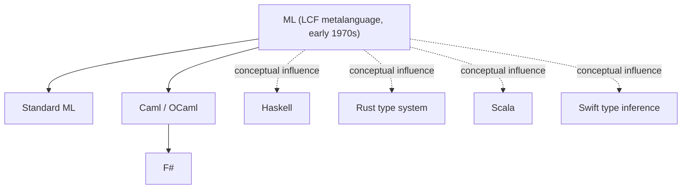
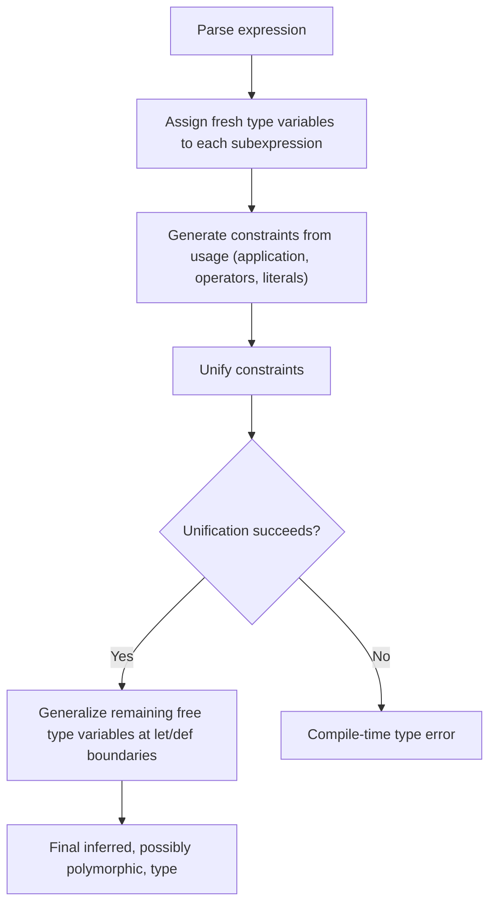

## ML and Static Typing in Functional Languages

### Overview

ML ("Meta Language") is both a specific programming language family and, more broadly, the name attached to a tradition of statically typed functional programming built around a rigorous type system with automatic type inference. ML introduced or popularized several ideas — the Hindley-Milner type inference algorithm, algebraic data types, pattern matching, and parametric polymorphism combined without requiring explicit type annotations — that heavily influenced the design of later languages including Haskell, OCaml, F#, Scala, Rust, and Swift.

### Origins and the ML Family

ML originated in the early 1970s as the metalanguage of the LCF (Logic for Computable Functions) theorem-proving system, developed at the University of Edinburgh, intended originally as a scripting/tactic language for constructing formal proofs rather than as a general-purpose language. Its type system and functional core proved general enough that it evolved into a standalone language family, giving rise to several major descendants:

- **Standard ML (SML)**: a formally standardized dialect (with an official language definition), emphasizing a clean, well-specified module system and a rigorously defined static semantics.
- **OCaml**: an actively developed and widely used descendant, adding object-oriented features (hence "Objective Caml") on top of the ML core, along with a powerful module system.
- **F#**: a .NET-hosted ML-family language, combining ML-style functional programming and type inference with interoperability with the broader .NET ecosystem and object-oriented features.



[Inference] The dotted "conceptual influence" relationships reflect that Haskell, Rust, Scala, and Swift are not literal descendants in an implementation lineage sense but are widely acknowledged, including by their own designers and documentation, to have drawn substantially on ML-family ideas — particularly Hindley-Milner-style inference and algebraic data types — rather than being direct forks of ML source or specification.

### Static Typing as ML's Defining Characteristic

ML-family languages are **statically typed**: every expression's type is determined at compile time, and a program that would apply an operation to a value of the wrong type is rejected before execution, rather than failing at runtime as in dynamically typed languages. What distinguishes ML's static typing from earlier statically typed languages (like Pascal or early C) is that this static typing is achieved largely **without requiring the programmer to write type annotations**, via automatic type inference.

```sml
(* Standard ML: no type annotations required *)
fun square x = x * x;
(* inferred type: int -> int, because * defaults to int in this context *)

fun compose f g x = f (g x);
(* inferred type: ('a -> 'b) -> ('c -> 'a) -> 'c -> 'b — fully general, polymorphic *)
```

The compiler infers that `square` takes and returns an `int` (or, depending on context, could be generalized further), and that `compose` is polymorphic over three independent type variables, entirely without explicit type declarations — a capability that depends on the specific type-inference algorithm ML popularized.

### Hindley-Milner Type Inference

The core algorithm underlying ML's type inference is known as **Hindley-Milner** (or **Damas-Milner**, or **Algorithm W**), named for the researchers whose work established both the algorithm and its key theoretical properties. The algorithm proceeds, at a high level, by:

1. Assigning a fresh type variable to each unannotated identifier and expression.
2. Generating type constraints from how each expression is used (e.g., if `x` is applied as `x + 1`, a constraint is generated that `x`'s type must unify with `int`, given that `+` is defined over `int`).
3. **Unifying** these constraints — solving the resulting system of type equations, substituting type variables where they're determined, and reporting a type error if the constraints are inconsistent (unifiable to no solution).
4. **Generalizing** remaining free type variables into universally quantified type variables at `let`-bindings and top-level function definitions, producing polymorphic types like `'a -> 'a` for the identity function.



A key theoretical property associated with Hindley-Milner is that it computes the **principal type** (the most general type consistent with the expression's usage) whenever one exists, and that type inference and type checking are decidable for the core algorithm — meaning the compiler is guaranteed to either find a valid principal type or correctly determine that none exists, without needing programmer-supplied hints, for programs within the core Hindley-Milner-typed fragment of the language. [Inference: this decidability and principal-type guarantee is a well-established theoretical result specifically about the *core* Hindley-Milner system; many practical ML-family languages extend the type system with features — such as certain forms of subtyping, higher-rank polymorphism, or GADTs in extended dialects — that go beyond what the original decidability guarantee strictly covers, so the guarantee should be understood as applying to the classical core algorithm rather than to every feature of every modern ML-descended language's full type system.]

### Parametric Polymorphism ("Let-Polymorphism")

ML's `let`-bound identifiers can be used polymorphically — instantiated at different, unrelated types at different use sites within the same scope — a feature often called **let-polymorphism**, distinguishing it from languages where a single binding is fixed to one concrete type throughout its lifetime.

```sml
let val identity = fn x => x
in
  (identity 5, identity "hello", identity true)
end;
(* identity is used at int, string, and bool — all from a single polymorphic definition *)
```

This works because the type inference algorithm generalizes `identity`'s type to `'a -> 'a` at the point of its `let`-binding, then instantiates a fresh copy of that polymorphic type at each subsequent use, rather than unifying all uses to a single concrete type.

### Algebraic Data Types and Pattern Matching

ML popularized **algebraic data types (ADTs)** — types built by combining "sum" (choice between alternative forms, tagged with constructors) and "product" (combining multiple values together, as in tuples or records) — together with **pattern matching** as the primary mechanism for destructuring and branching on such values.

```sml
datatype shape =
    Circle of real
| Rectangle of real * real
| Triangle of real * real * real

fun area s =
  case s of
      Circle r => 3.14159 * r * r
| Rectangle (w, h) => w * h
| Triangle (a, b, c) =>
        let val s = (a + b + c) / 2.0
        in Math.sqrt (s * (s - a) * (s - b) * (s - c))
        end
```

The compiler can perform **exhaustiveness checking** on pattern matches — verifying at compile time that every constructor of `shape` (`Circle`, `Rectangle`, `Triangle`) is handled by some pattern in the `case` expression, and typically issuing a warning or error if a case is missing — a static-safety guarantee that depends directly on the closed, statically known structure of an algebraic data type's constructors.

### Type Safety and "Well-Typed Programs Don't Go Wrong"

A frequently cited informal characterization of statically and soundly typed languages like ML, attributed to Robin Milner (one of ML's principal designers), is that "well-typed programs don't go wrong" — meaning that if a program passes the type checker, certain classes of runtime error (applying an operation to a value of the wrong type, for instance) cannot occur during execution, because the type system has already ruled them out. [Inference] This is best understood as an informal summary of a **type soundness** property (formally, a combination of "progress" and "preservation" theorems in the programming-languages-theory literature) rather than a literal claim that ML programs cannot fail at runtime in any way — ML programs can still fail via, for example, unhandled pattern-match exhaustiveness violations at runtime in some configurations, explicit exceptions, non-termination, or (in unsafe/foreign-function-interface code) violations outside what the pure type system covers.

### Contrast with Dynamically Typed Functional Languages

ML-family static typing is often discussed in explicit contrast with dynamically typed functional languages such as Scheme, Common Lisp, Clojure, and Erlang, which instead check types at runtime and generally do not require, or in some cases do not even support, static type declarations at all:

| Aspect | ML-family (static) | Scheme/Clojure-style (dynamic) |
|---|---|---|
| When type errors are caught | Compile time, before execution | Runtime, only if the erroring code path executes |
| Type annotations required | Generally no (inferred) | N/A (no static types to annotate) |
| Polymorphism model | Parametric, checked via unification | Implicit, unchecked until runtime dispatch |
| Refactoring safety net | Compiler catches many usage-site inconsistencies | Relies on tests/runtime coverage |
| Flexibility for heterogeneous data | More constrained (must fit within the type system, e.g., via ADTs) | More flexible (any value, any shape, at runtime) |

[Inference] This table reflects widely discussed trade-offs in the programming-languages community rather than a claim that one approach is strictly superior; language choice in practice depends heavily on project context, team familiarity, and the relative value placed on compile-time guarantees versus runtime flexibility, and is a matter of ongoing debate and differing practitioner opinion rather than a settled technical conclusion.

### Influence on Later Languages

- **Haskell** adopted and extended Hindley-Milner inference substantially, adding type classes (a mechanism partly overlapping with what other languages achieve via ad hoc overloading, discussed separately) and pursuing purity (no side effects outside explicit monadic types) more strictly than most ML dialects.
- **Rust**'s type system draws on Hindley-Milner-style local type inference (inference within a function body, though top-level function signatures require explicit type annotations, unlike full ML-style top-level inference) combined with an ownership/borrowing system that is a substantial departure from the classical ML type system, addressing memory safety concerns ML itself does not address.
- **Swift** and **Kotlin** incorporate substantial local type inference influenced by the broader ML/Hindley-Milner tradition, while still generally requiring explicit type annotations at public API boundaries (function signatures), a middle ground between full ML-style inference and fully explicit typing.
- **Scala** combines an ML/Haskell-influenced type system (algebraic data types via `sealed trait`/case classes, pattern matching, local type inference) with the JVM object model and object-oriented features.

[Inference] Characterizing exactly how much of each of these languages' type systems is "ML-influenced" versus independently developed is necessarily an approximate, qualitative judgment based on documented design history and each language's own stated influences, rather than a precise, quantifiable measurement.

### Type Inference Limitations and Practical Trade-offs

- **Error message locality**: because Hindley-Milner-style inference propagates constraints across an entire expression (or further), a type error's root cause can sometimes surface as a confusing error message reported at a location distant from the actual mistake, a commonly discussed practical usability issue with unification-based inference. [Speculation: while this is a frequently voiced practitioner complaint about ML-family and Haskell tooling, and various techniques (bidirectional type checking, improved error localization heuristics) have been developed partly in response to it, the general severity of the problem is a matter of tooling maturity and specific compiler implementation rather than an inherent, fixed property of the algorithm itself.]
- **Interaction with more advanced type-system features**: extensions like higher-rank polymorphism, type classes with functional dependencies, or GADTs (Generalized Algebraic Data Types) can require the programmer to supply explicit type annotations in places where core Hindley-Milner inference alone is insufficient, since full inference becomes undecidable or ambiguous for some of these extended features.
- **Monomorphism restriction**: some ML-family and Haskell implementations impose restrictions (such as Haskell's "monomorphism restriction") on when a `let`-bound value can actually be generalized polymorphically, a design choice motivated partly by avoiding unexpected recomputation or performance surprises tied to how polymorphic values are compiled, a detail specific to particular language implementations rather than a universal Hindley-Milner requirement.

### Key Points

- ML's distinguishing contribution is combining static typing with automatic type inference (via the Hindley-Milner algorithm), removing the need for the extensive type annotations that earlier statically typed languages generally required.
- Let-polymorphism allows a single binding to be used at multiple, independently inferred types within the same scope, underpinned by the generalization step of the inference algorithm.
- Algebraic data types and exhaustiveness-checked pattern matching, both popularized by ML, provide compile-time guarantees about how thoroughly a program handles the possible shapes of its data.
- The informal slogan "well-typed programs don't go wrong" refers to a formal type soundness property and should not be read as a claim that ML programs are immune to all runtime failure.
- ML-family ideas — particularly Hindley-Milner-style inference and algebraic data types with pattern matching — have substantially influenced later languages including Haskell, OCaml, F#, Rust, Swift, Kotlin, and Scala, though the degree and manner of that influence varies considerably by language.

### Related Topics

- Hindley-Milner type inference algorithm details (Algorithm W)
- Algebraic data types and pattern-match exhaustiveness checking
- Type classes (Haskell) vs. ad hoc overloading
- Module systems in Standard ML and OCaml (functors, signatures)
- Type soundness, progress, and preservation theorems
- Monads and effect encoding in purely functional languages
- Higher-rank polymorphism and GADTs
- Local type inference vs. full program inference (Rust, Swift, Kotlin approaches)