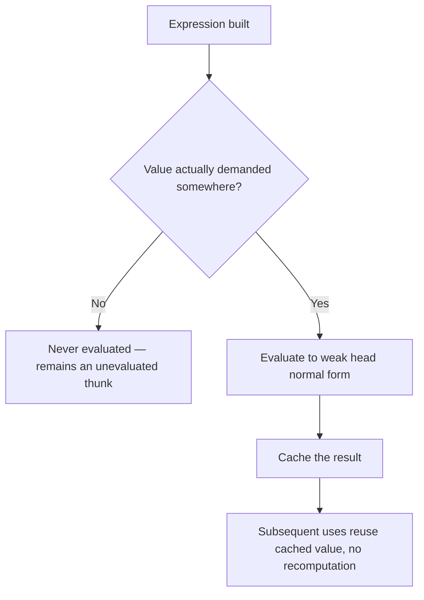
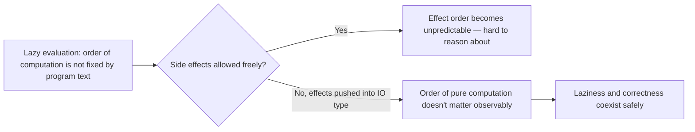

## Haskell and Lazy Evaluation

### Overview

Haskell is a purely functional, statically typed programming language distinguished by two tightly interconnected design commitments: purity (functions have no side effects outside explicit, type-tracked mechanisms) and **lazy evaluation** (also called non-strict or call-by-need evaluation), where an expression's value is not computed until it is actually demanded, and, once computed, is cached so it is never recomputed. These two features shape nearly every other aspect of the language, including its I/O model, its ability to represent infinite data structures, and several classes of performance behavior that differ substantially from eagerly evaluated languages.

### Strict vs. Lazy Evaluation

Most mainstream languages (C, Java, Python, JavaScript) use **strict (eager) evaluation**: when a function is called, its arguments are fully evaluated before the function body begins executing. Haskell instead defaults to **lazy (non-strict) evaluation**: an expression is not evaluated until its value is actually needed by some computation, and if it is never needed, it is never evaluated at all.

```haskell
-- In a strict language, this would force full evaluation of the second argument.
-- In Haskell, myConst discards its second argument entirely, so it is never evaluated:
myConst :: a -> b -> a
myConst x _ = x

result = myConst 5 (1 `div` 0)  -- no error! the division is never evaluated
```

Under strict evaluation, `1 \`div\` 0` would be evaluated before `myConst` is even called, raising a division-by-zero error. Under Haskell's lazy evaluation, the second argument is never forced, because `myConst`'s body never uses it, so `result` evaluates cleanly to `5`.



### Thunks: The Implementation Mechanism

Haskell implements lazy evaluation using **thunks** — unevaluated computation records that capture an expression along with the environment (bindings) needed to eventually evaluate it. When an expression's value is demanded, the thunk is "forced": the runtime evaluates the captured expression and then **overwrites the thunk in place with the computed result**, so that any future reference to the same thunk reuses the cached value rather than recomputing it — a property often called **memoization of evaluation**, though this specific "sharing" mechanism should be distinguished from memoization used as an explicit programmer technique for whole functions (e.g., manually caching a Fibonacci function's results across different arguments), since the sharing described here applies to a *single already-constructed expression*, not automatically across different calls with different arguments.

```haskell
let x = expensiveComputation 42   -- creates a thunk, computation not yet run
in x + x                          -- computed once when first forced, then reused
```

Here, `x` is created as a thunk. When `x + x` is evaluated, the first reference to `x` forces the thunk (running `expensiveComputation 42` once), and the second reference to `x` reuses the now-cached result rather than re-running `expensiveComputation`.

### Weak Head Normal Form (WHNF)

Haskell's laziness typically evaluates expressions only as far as their **weak head normal form** — enough to determine the outermost constructor or function application, without necessarily evaluating everything nested inside. For example, forcing a list `x : xs` (cons cell) to WHNF confirms it is indeed a cons cell (rather than an empty list) but does not force evaluation of `x` or `xs` themselves, which remain thunks until independently demanded.

```haskell
let pair = (1 + 1, error "boom")
in fst pair  -- evaluates to 2; the second component's thunk (the error) is never forced
```

Only `fst pair` demands the first component of the tuple; the second component's thunk, which would raise an error if forced, is simply never touched, illustrating that WHNF evaluation is fine-grained and per-subexpression rather than "all or nothing" for compound data structures.

### Infinite Data Structures

Perhaps the most distinctive practical consequence of lazy evaluation is that Haskell can define and manipulate genuinely **infinite data structures**, because only the portion actually consumed is ever evaluated.

```haskell
naturals :: [Integer]
naturals = [0..]                 -- an infinite list, defined directly

fibs :: [Integer]
fibs = 0 : 1 : zipWith (+) fibs (tail fibs)  -- infinite, self-referential list

take 10 naturals   -- [0,1,2,3,4,5,6,7,8,9] — only the first 10 elements are ever forced
take 10 fibs        -- [0,1,1,2,3,5,8,13,21,34]
```

The `fibs` definition is particularly notable: it defines the infinite Fibonacci sequence by referring to itself, relying on lazy evaluation and thunk sharing so that each element is computed exactly once and only when demanded, with earlier elements' already-cached thunks reused by later computations rather than recomputed from scratch.

### Laziness and Purity: Why They Go Together in Haskell

[Inference] Haskell's designers are widely understood, based on the language's documented design history and rationale, to have found lazy evaluation and purity mutually reinforcing rather than coincidental: because evaluation order under laziness is not generally predictable from the program's textual structure alone, side effects (which are order-dependent by nature — printing "A" then "B" is observably different from "B" then "A") become very difficult to reason about correctly if freely mixed with lazy evaluation. Restricting side effects to be explicit and type-tracked (via the `IO` type and similar mechanisms) sidesteps this problem, since laziness only affects *when* pure values are computed, not *whether* or *in what order* observable effects occur — because under purity, "when a value is computed" has no externally observable consequence in the first place.



### The `IO` Type and Effect Sequencing

Because Haskell functions are pure by default, any computation that performs observable effects (reading input, writing output, mutating external state) must have a type explicitly marked with `IO`, and the language provides `do`-notation (syntactic sugar over the `IO` monad) to sequence such actions in a well-defined order, independent of the surrounding lazy evaluation of pure values:

```haskell
main :: IO ()
main = do
  putStrLn "Enter your name:"
  name <- getLine
  putStrLn ("Hello, " ++ name)
```

The `IO` type here makes explicit, at the type level, that `main` performs effects; a value of type `IO ()` is best understood as a *description* of an action to be performed (an effect placeholder), and the Haskell runtime is responsible for actually sequencing and performing the described actions in the specified order when the program executes — this sequencing guarantee is what allows effectful code to coexist safely with an otherwise lazy, evaluation-order-agnostic pure core.

### Space Leaks: The Major Practical Downside

Lazy evaluation's most frequently cited practical drawback is the **space leak**: because unevaluated thunks accumulate in memory until forced, a computation that builds up a long chain of unevaluated thunks (rather than being forced incrementally) can consume far more memory than an equivalent strict computation would, sometimes catastrophically.

```haskell
-- A classic space leak: this builds up a huge chain of unevaluated thunks
-- for the additions, rather than computing the sum incrementally
sumLazy :: [Int] -> Int
sumLazy = foldl (+) 0
-- foldl builds: (((0+x1)+x2)+x3)+... as a deeply nested unevaluated thunk chain
-- before finally forcing it all at once
```

[Inference] This specific example (`foldl (+) 0` building an unevaluated thunk chain) is a well-documented, frequently taught illustration of the space-leak problem in Haskell educational material and language documentation, and the mitigation — using a **strict** left fold (`foldl'` from `Data.List`, which forces the accumulator at each step rather than deferring it) — is the standard, well-documented recommended fix. Because this is such a commonly encountered pattern, Haskell's standard library provides `foldl'` specifically to address it, and Haskell style guides generally recommend `foldl'` over `foldl` for numeric accumulation for exactly this reason.

```haskell
import Data.List (foldl')
sumStrict :: [Int] -> Int
sumStrict = foldl' (+) 0   -- forces the accumulator at each step, avoiding thunk buildup
```

### Strictness Annotations and `seq`

Haskell provides explicit mechanisms to opt into strict evaluation where needed, rather than relying solely on the default laziness:

- **`seq`**: a built-in function, `seq :: a -> b -> b`, that forces its first argument to WHNF before returning its second argument, giving the programmer a primitive tool to force evaluation at a specific point.
- **Strictness annotations on data fields** (`!` in data declarations): marking a field as strict (`data Point = Point !Double !Double`) ensures that constructing a `Point` value forces its fields to WHNF immediately rather than storing them as thunks, which is commonly used to avoid space leaks in performance-sensitive numeric or record-heavy code.
- **`BangPatterns`** (a common GHC extension) and `deepseq` (for forcing full, not just WHNF, evaluation of nested structures) provide additional, finer-grained control.

```haskell
{-# LANGUAGE BangPatterns #-}
sumStrict' :: [Int] -> Int
sumStrict' = go 0
  where
    go !acc []     = acc         -- ! forces acc to be evaluated at each recursive call
    go !acc (x:xs) = go (acc + x) xs
```

### Laziness and Control Structures as Ordinary Functions

Because Haskell's functions are lazy in their arguments by default, several constructs that require special syntax as language primitives in strict languages (short-circuiting boolean operators, conditionals, custom looping constructs) can be defined as **ordinary functions** in Haskell, without needing to be compiler-recognized special forms, since laziness alone provides the short-circuiting behavior:

```haskell
myIf :: Bool -> a -> a -> a
myIf True  t _ = t
myIf False _ f = f
-- myIf cond expensiveBranchA expensiveBranchB only evaluates the taken branch,
-- because pattern matching only forces the branch actually selected, and the
-- unselected branch's thunk is simply discarded, never forced
```

[Inference] This is a commonly cited illustrative point in Haskell pedagogy about how far laziness's implications extend beyond mere "performance micro-optimization" into enabling ordinary user-defined functions to have control-flow-like behavior that would otherwise require special-cased strict-language syntax (like `&&`, `||`, or `if`/`then`/`else` as compiler primitives) — a genuine structural consequence of the evaluation model rather than a coincidental library design choice.

### Comparison: Strict vs. Lazy Language Trade-offs

| Aspect | Strict evaluation (typical) | Lazy evaluation (Haskell default) |
|---|---|---|
| Unused arguments | Still evaluated (unless short-circuited by special syntax) | Never evaluated |
| Infinite data structures | Not directly representable (would not terminate) | Directly representable, consumed incrementally |
| Evaluation order | Predictable, follows program text | Demand-driven, not fixed by program text alone |
| Memory behavior | Generally predictable | Can space-leak via thunk buildup if not managed |
| Custom control-flow functions | Generally require special compiler syntax | Can often be ordinary functions |
| Debugging evaluation order | Straightforward to trace | Can be harder to trace, since "when" something runs is demand-driven |

### Other Languages' Relationship to Laziness

- **Most mainstream languages are strict by default** but offer opt-in laziness for specific cases: Python's generators and `itertools`, JavaScript's generators, C#'s `IEnumerable`/LINQ deferred execution, and Scala's `lazy val` and lazy collection views all provide lazy evaluation as an explicit, opt-in feature layered on top of an otherwise strict language, rather than as the pervasive default.
- **Scheme and other Lisps** are generally strict by default but provide explicit mechanisms (`delay`/`force`, or "promises") for programmer-controlled laziness where desired.
- **Miranda**, a lazy, purely functional language that predates and significantly influenced Haskell's design, is frequently cited in language-history discussions as an important direct precursor to Haskell's combination of laziness and purity. [Inference: this influence is well documented in Haskell's own design history and the language's published historical retrospectives, though the precise degree of specific feature-by-feature influence versus independent convergent design is, as with most language lineage claims, a matter of historical interpretation rather than a strictly quantifiable fact.]

### Key Points

- Haskell's laziness means expressions are evaluated only when demanded, using thunks that cache their result once forced so no expression is evaluated more than once (sharing).
- Laziness enables direct definition of infinite data structures, consumed incrementally by whatever demands only a finite portion, and allows many control-flow-like constructs to be written as ordinary functions rather than special compiler syntax.
- Purity and laziness are mutually reinforcing in Haskell's design: because evaluation order is not fixed by program text under laziness, confining observable side effects to explicit, type-tracked constructs like the `IO` type avoids the unpredictability that would otherwise result from mixing effects with demand-driven evaluation.
- The major practical cost of default laziness is the space leak, where unevaluated thunk chains accumulate in memory; Haskell provides `seq`, strictness annotations, `foldl'`, and language extensions like `BangPatterns` to opt into strict evaluation where appropriate.
- Most mainstream languages are strict by default and offer laziness only as an explicit, opt-in feature (generators, deferred LINQ, `lazy val`), in contrast to Haskell's laziness-as-default design.

### Related Topics

- Thunks, sharing, and graph reduction as an evaluation model
- The `IO` monad and monadic effect sequencing
- Space leaks, strictness analysis, and the `foldl` vs. `foldl'` distinction
- Weak head normal form vs. full (deep) normal form
- Infinite and corecursive data structures
- Miranda and the historical lineage of lazy functional languages
- `seq`, `deepseq`, and strictness annotations (`BangPatterns`, strict data fields)
- Comparing Haskell's default laziness to opt-in laziness (generators, `lazy val`, deferred LINQ) in other languages