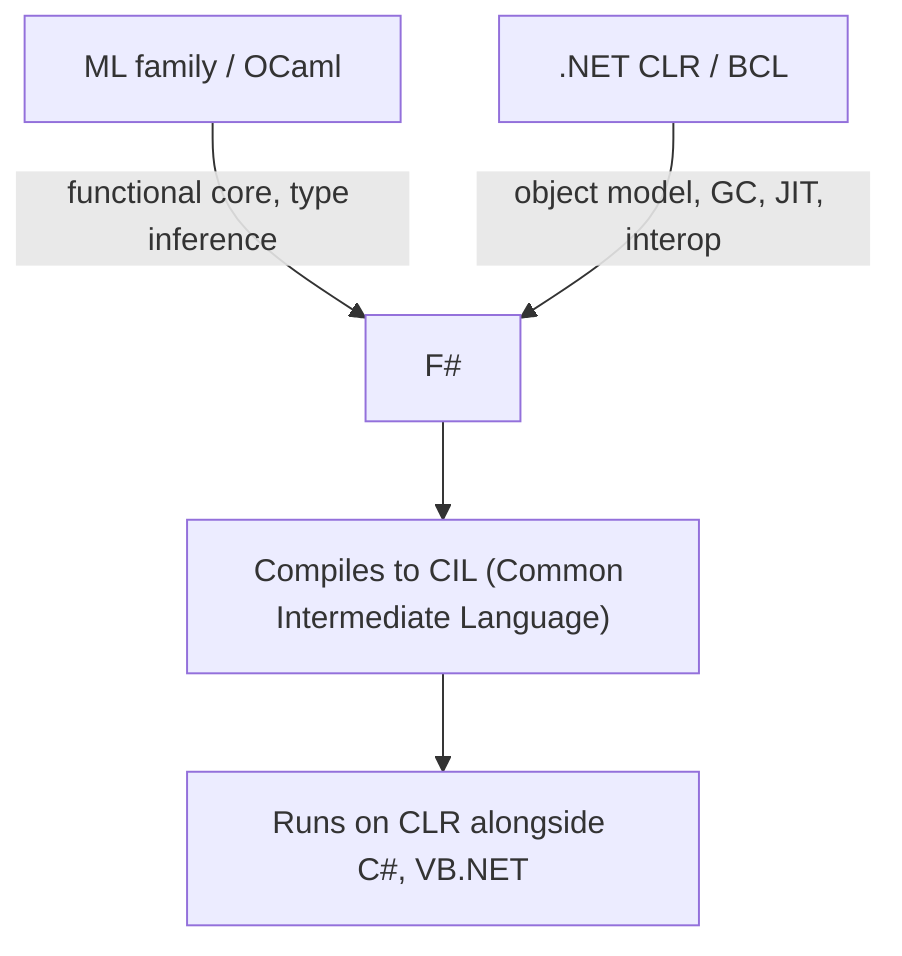

## F# and Functional Programming on a Managed Runtime

### Overview

F# is a statically typed, functional-first programming language that runs on the .NET managed runtime (the Common Language Runtime, CLR), combining ML-family functional programming — type inference, algebraic data types, pattern matching, immutability by default — with full interoperability with .NET's object-oriented, garbage-collected, JIT-compiled execution environment. F# occupies a distinctive design position: rather than being a purely functional language built from scratch, it is functional-first but multi-paradigm, explicitly designed to coexist with, and consume, the vast object-oriented .NET Base Class Library and any C# or VB.NET code in the same runtime.

### Origins and Position in the ML Family

F# descends directly from the ML tradition, specifically influenced heavily by OCaml, and was developed at Microsoft Research beginning in the early 2000s, with Don Syme as its principal designer, aiming to bring ML-style functional programming to the .NET platform while retaining strong interoperability with the rest of the .NET ecosystem.



Because F# targets the CLR, it compiles to **Common Intermediate Language (CIL)**, the same bytecode-like intermediate representation C# and VB.NET compile to, meaning F# code and C# code can call into each other's libraries directly, share the same garbage collector, and participate in the same assembly and type-metadata system — a degree of practical interoperability not typically available between, say, Haskell and Java, or OCaml and C#.

### Type Inference on a Managed Runtime

Like other ML-family languages, F# performs Hindley-Milner-style type inference, letting most code omit explicit type annotations:

```fsharp
let square x = x * x        // inferred: int -> int
let add a b = a + b          // inferred: int -> int -> int

let numbers = [1; 2; 3; 4; 5]
let squared = List.map square numbers   // inferred: int list
```

[Inference] Because F# must also interoperate smoothly with .NET's object-oriented, overload-heavy Base Class Library — which relies extensively on method overloading, a feature that interacts awkwardly with unrestricted Hindley-Milner-style inference, as discussed in the overloaded-subprograms context — F#'s inference algorithm is generally understood, based on its documented design rationale, to include pragmatic accommodations and restrictions not present in "pure" ML dialects like Standard ML, in order to resolve overloaded .NET method calls predictably. The exact scope of these accommodations is an implementation and language-specification detail better verified against current F# language reference documentation than treated as fully fixed here.

### Immutability by Default, Mutability by Choice

F# values are **immutable by default** — a `let` binding cannot be reassigned — reflecting the functional-first philosophy, but F# provides an explicit escape hatch (`mutable`) for cases where mutation is genuinely needed, particularly when interoperating with .NET APIs or writing performance-sensitive imperative code:

```fsharp
let x = 5
// x <- 6   // compile error: x is immutable by default

let mutable y = 5
y <- 6       // legal: y was explicitly declared mutable
```

This default-immutable-with-opt-in-mutability stance is a deliberate middle ground compared to Haskell (which has no direct mutable-variable analog outside specific effect-tracked constructs like `IORef`) and compared to C# (mutable by default), positioning F# as functional-first rather than functional-only.

### Algebraic Data Types and Pattern Matching

F# provides **discriminated unions** (its term for algebraic sum types) and records (product types), together with pattern matching, closely mirroring the ML/Haskell tradition discussed in the ML-family context:

```fsharp
type Shape =
| Circle of radius: float
| Rectangle of width: float * height: float
| Triangle of a: float * b: float * c: float

let area shape =
    match shape with
| Circle r -> System.Math.PI * r * r
| Rectangle (w, h) -> w * h
| Triangle (a, b, c) ->
        let s = (a + b + c) / 2.0
        sqrt (s * (s - a) * (s - b) * (s - c))
```

As with other ML-descended languages, the F# compiler performs exhaustiveness checking on `match` expressions, warning when a discriminated union's cases are not fully covered — a compile-time safety guarantee inherited directly from the ML tradition and made possible by the closed, statically known set of constructors a discriminated union defines.

### Interoperating with the Object-Oriented .NET Ecosystem

A defining characteristic of F# is that it is not a purely functional language walled off from .NET's object model; it directly supports classes, interfaces, inheritance, and exceptions, and can consume any .NET library written in C# or VB.NET without a translation layer, because all three languages compile to the same CIL and share the same runtime type system.

```fsharp
// F# can define classes and implement interfaces, consumed transparently from C#
type Animal(name: string) =
    member this.Name = name
    abstract member Speak : unit -> string
    default this.Speak() = "..."

type Dog(name: string) =
    inherit Animal(name)
    override this.Speak() = "Woof!"
```

```fsharp
// F# consuming a .NET BCL type directly, no wrapper or translation needed
open System.Collections.Generic
let dict = Dictionary<string, int>()
dict.["apples"] <- 3
```

[Inference] This tight interoperability is widely cited, including in F#'s own official documentation and design rationale, as F#'s central practical differentiator relative to other statically typed functional languages (Haskell, OCaml, Standard ML), since it allows F# to be adopted incrementally within existing .NET codebases and to leverage the large existing .NET library ecosystem rather than requiring a separate, parallel library ecosystem of its own.

### Units of Measure: A Distinctive F# Type-System Feature

F# provides a type-system feature not commonly found in other ML-family languages: **units of measure**, which let the compiler track physical or logical units (meters, seconds, dollars) as part of a numeric type, catching unit-mismatch errors at compile time without runtime overhead, since units of measure are erased after type checking.

```fsharp
[<Measure>] type m      // meters
[<Measure>] type s      // seconds

let distance = 100.0<m>
let time = 9.58<s>
let speed = distance / time   // inferred type: float<m/s>

// let bad = distance + time   // compile-time error: incompatible units
```

This is a genuinely distinctive feature relative to most ML-family languages, and reflects F#'s research-lineage origins (units of measure were an active area of programming-languages research at the time F# was developed) combined with F#'s general design emphasis on catching classes of real-world numeric-correctness bugs at compile time.

### Computation Expressions: F#'s Monad-Like Abstraction

F# provides **computation expressions**, a generalized, syntactically lightweight mechanism for defining custom control-flow and effect-sequencing constructs, conceptually related to Haskell's `do`-notation over monads but exposed via a more broadly extensible, less strictly monad-law-enforced mechanism built around builder objects implementing specific member conventions (`Bind`, `Return`, etc.).

```fsharp
let divideSafely x y =
    if y = 0 then None else Some (x / y)

let result =
    option {
        let! a = divideSafely 10 2
        let! b = divideSafely a 0    // this fails, short-circuits the whole expression
        return a + b
    }
// result is None, because the second divideSafely call failed and the
// computation expression short-circuits, similar in spirit to Haskell's Maybe monad chaining
```

F#'s `async { ... }` computation expression, in particular, is F#'s primary mechanism for asynchronous programming, conceptually related to the `async`/`await` model discussed in the coroutines context, but implemented as a computation expression rather than as dedicated core-language syntax the way C#'s `async`/`await` keywords are.

```fsharp
let fetchDataAsync url =
    async {
        let! response = Http.AsyncRequestString(url)
        return response
    }
```

[Inference] Describing computation expressions as "conceptually related to but more broadly extensible than" Haskell's `do`-notation reflects how F#'s own documentation and the broader functional-programming community generally characterize the feature — computation expressions are not restricted to strict monadic semantics the way Haskell's `do`-notation is tied to the `Monad` type class, giving F# more implementation flexibility at some cost to the formal guarantees Haskell's type-class-enforced monad laws provide.

### Performance Characteristics on a Managed Runtime

Because F# runs on the CLR, it inherits several runtime characteristics common to all CLR languages:

- **Garbage collection**: F#'s heap-allocated immutable data structures (lists, discriminated unions, closures) are managed by the same generational garbage collector used by C# and VB.NET, rather than F# needing its own separate memory-management runtime.
- **JIT compilation**: F# code compiled to CIL is just-in-time compiled to native machine code at runtime by the CLR, the same mechanism used for any other .NET language, meaning F#'s runtime performance characteristics generally track those of the broader .NET platform rather than being a distinct, separately optimized runtime.
- **Value types and structs**: F# provides `struct` and other CLR value-type constructs, letting performance-sensitive code opt into stack allocation and avoid garbage-collection pressure for small, frequently created data, similar to how C# exposes the same CLR value-type mechanism.

[Unverified] Precise, quantitative performance comparisons between F# and other CLR languages (C#) or between F# and non-CLR functional languages (Haskell, OCaml) depend heavily on the specific workload, .NET runtime version, and coding style used, and are not treated as a settled, generally quantifiable fact here — this is an area better checked against current, workload-specific benchmarks than asserted in general terms.

### Comparison: F# vs. Other ML-Family and Functional Languages

| Aspect | F# | OCaml | Haskell | C# (for contrast) |
|---|---|---|---|---|
| Runtime | CLR (managed, GC, JIT) | Native (own runtime) | Native (own runtime, GHC) | CLR (managed, GC, JIT) |
| Default mutability | Immutable, opt-in mutable | Immutable, opt-in mutable (`ref`) | Immutable (effects via IO/ST) | Mutable by default |
| Purity enforcement | Not enforced by type system | Not enforced by type system | Enforced via type system (IO) | Not enforced |
| OOP interop | Deep, native (.NET BCL) | Own object layer (less commonly used) | Limited, via FFI | Native (it's the OOP baseline) |
| Type inference | Hindley-Milner-based, with .NET-interop accommodations | Full Hindley-Milner | Full Hindley-Milner, extended | Local inference (`var`), not full HM |
| Units of measure | Yes, built-in | No (not a core feature) | No (not a core feature) | No |
| Primary ecosystem | .NET BCL + NuGet | OCaml-specific (opam) | Haskell-specific (Hackage) | .NET BCL + NuGet |

### Why F# Matters for Understanding "Functional on a Managed Runtime" as a Design Space

F# illustrates a specific point in language-design space: bringing ML-family functional programming benefits (type inference, algebraic data types, immutability-by-default, exhaustiveness-checked pattern matching) into an existing, large, object-oriented managed-runtime ecosystem, rather than requiring a separate runtime, standard library, and interop story of its own. [Inference] This positions F# as a comparison point against other "functional programming on an existing managed runtime" efforts — Scala and Kotlin on the JVM, Clojure on both the JVM and CLR — since all of these languages face a broadly similar design tension: how much of the host runtime's object-oriented, mutable-by-default conventions to embrace directly versus how much functional-programming purity to preserve, a genuine and recurring theme in this corner of language design rather than a claim unique to F# specifically.

### Key Points

- F# brings ML-family static typing, type inference, algebraic data types, and pattern matching to the .NET CLR, compiling to the same CIL intermediate representation as C# and VB.NET for direct, no-translation-layer interoperability.
- F# is functional-first rather than functional-only: values are immutable by default but mutability, classes, inheritance, and exceptions are all available as explicit, opt-in features, reflecting a deliberate design compromise with the surrounding object-oriented .NET ecosystem.
- Units of measure are a distinctive F# type-system feature, allowing compile-time-checked physical/logical unit tracking that is erased at compile time with no runtime cost.
- Computation expressions provide a generalized, F#-specific mechanism for custom effect sequencing and control flow, conceptually related to but more loosely governed than Haskell's monad-law-enforced `do`-notation.
- F#'s performance and memory-management characteristics are inherited from the CLR (garbage collection, JIT compilation), distinguishing its runtime model from natively compiled ML-family languages like OCaml or Haskell's GHC runtime.

### Related Topics

- Hindley-Milner type inference and its interaction with method overloading
- Discriminated unions, records, and pattern-match exhaustiveness checking
- Computation expressions vs. Haskell's monadic `do`-notation
- `async`/`await` and asynchronous programming models across languages
- Units of measure and compile-time dimensional analysis
- Functional programming on the JVM: Scala, Kotlin, and Clojure compared
- CLR internals: CIL, JIT compilation, and garbage collection
- Immutability-by-default vs. mutability-by-default language design philosophies