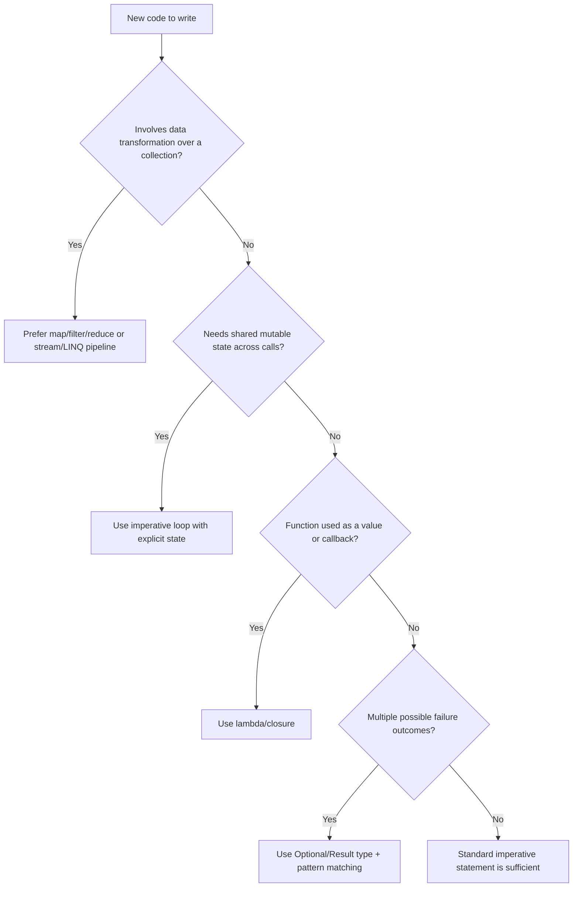

## Support for Functional Programming in Primarily Imperative Languages


### Overview

Many languages designed around imperative, statement-based execution and mutable state have progressively adopted constructs originating in functional programming (FP). This adoption is typically partial and additive: the language retains its imperative core (loops, mutable variables, statement sequencing) while layering on features such as first-class functions, closures, immutability options, pattern matching, and expression-oriented constructs. This hybridization lets developers choose declarative, side-effect-minimizing styles where they aid clarity or safety, without abandoning the imperative idioms already embedded in existing codebases and programmer habits.

### Why Imperative Languages Adopt Functional Features

**Key Points**

- Reducing bugs tied to mutable shared state, especially in concurrent contexts
- Enabling more concise, declarative data transformations (map/filter/reduce over explicit loops)
- Improving composability and reuse through first-class and higher-order functions
- Meeting developer expectations shaped by exposure to FP languages (Haskell, ML family, Lisp family)
- Facilitating easier reasoning and testing via pure functions and referential transparency

[Inference] The specific motivations behind any single language's design decisions are drawn from publicly stated design rationale (e.g., release notes, language specifications, designer talks) and may not reflect every internal consideration.

### Core Functional Constructs Retrofitted into Imperative Languages

#### First-Class and Higher-Order Functions

A function is first-class when it can be assigned to variables, passed as an argument, and returned from other functions. Higher-order functions accept and/or return functions.

```javascript
// JavaScript: functions as values
const double = x => x * 2;
const applyTwice = (fn, x) => fn(fn(x));
console.log(applyTwice(double, 3)); // 12
```

```java
// Java: functional interfaces + lambdas (Java 8+)
import java.util.function.Function;

Function<Integer, Integer> square = x -> x * x;
System.out.println(square.apply(5)); // 25
```

```csharp
// C#: delegates and lambdas
Func<int, int> cube = x => x * x * x;
Console.WriteLine(cube(3)); // 27
```

Java's lambdas compile to instances implementing a single-method functional interface (e.g., `Function<T,R>`), not to a bare function value the way JavaScript or ML-family languages represent functions. [Unverified — implementation detail subject to JVM version and vendor]

#### Closures

A closure captures variables from its enclosing lexical scope, allowing a function to retain access to that state after the enclosing scope has exited.

```python
def make_counter():
    count = 0
    def increment():
        nonlocal count
        count += 1
        return count
    return increment

counter = make_counter()
print(counter())  # 1
print(counter())  # 2
```

```go
// Go: closures over local variables
func makeCounter() func() int {
    count := 0
    return func() int {
        count++
        return count
    }
}
```

Go's closures capture variables by reference to the same underlying storage, so multiple closures sharing a captured variable observe each other's mutations. [Inference — based on documented Go semantics; edge cases around loop-variable capture have changed across Go versions and should be checked against the specific Go version in use]

#### Immutability and Immutable Data Structures

Imperative languages typically default to mutable bindings but provide opt-in immutability.

```java
// Java: final variables, records (Java 16+)
final int MAX = 100;
record Point(int x, int y) {}
```

```csharp
// C#: readonly, records, init-only properties
public record Point(int X, int Y);
```

```rust
// Rust: immutable by default, mutability is opt-in
let x = 5;      // immutable
let mut y = 10; // explicitly mutable
```

Rust is a notable case: rather than retrofitting immutability onto a mutable-by-default model, it inverts the default so mutation requires explicit annotation, while still permitting imperative control flow throughout.

#### Pattern Matching and Destructuring

```javascript
// JavaScript: destructuring
const { name, age } = person;
const [first, ...rest] = array;
```

```csharp
// C#: pattern matching (C# 7+)
object shape = new Circle(5);
if (shape is Circle { Radius: > 0 } c)
{
    Console.WriteLine(c.Radius);
}
```

```rust
// Rust: match expressions
match value {
    0 => println!("zero"),
    n if n < 0 => println!("negative"),
    _ => println!("positive"),
}
```

#### Expression-Oriented Constructs

Functional languages favor expressions (which produce values) over statements (which perform actions). Imperative languages have added expression forms of traditionally statement-based control flow.

```csharp
// C#: switch expressions (C# 8+)
string category = score switch
{
    >= 90 => "A",
    >= 80 => "B",
    _ => "F"
};
```

```rust
// Rust: if and match as expressions
let max = if a > b { a } else { b };
```

#### Higher-Order Collection Operations

```java
// Java Streams API
List<Integer> squares = numbers.stream()
    .filter(n -> n % 2 == 0)
    .map(n -> n * n)
    .collect(Collectors.toList());
```

```csharp
// C# LINQ
var squares = numbers.Where(n => n % 2 == 0).Select(n => n * n).ToList();
```

```python
# Python: map/filter, or comprehensions (more idiomatic in Python)
squares = [n * n for n in numbers if n % 2 == 0]
```

#### Optional/Result Types for Error Handling

Functional-influenced approaches replace null references and exceptions for expected failure cases with explicit sum types.

```rust
fn divide(a: f64, b: f64) -> Result<f64, String> {
    if b == 0.0 {
        Err("division by zero".to_string())
    } else {
        Ok(a / b)
    }
}
```

```java
// Java: Optional (Java 8+)
Optional<String> maybeName = findName(id);
maybeName.ifPresent(System.out::println);
```

### Comparative Table of Adoption Across Languages

| Language | First-Class Functions | Closures | Immutability Support | Pattern Matching | Expression-Oriented Control Flow |
| --- | --- | --- | --- | --- | --- |
| JavaScript | Native since inception | Yes | `const` (shallow) | Destructuring only | Ternary only |
| Python | Native since inception | Yes (`nonlocal`) | Tuples, frozen dataclasses | `match` (3.10+) | Conditional expressions |
| Java | Since Java 8 (lambdas) | Yes (effectively final capture) | `final`, records (16+) | `switch` patterns (21+) | `switch` expressions (14+) |
| C# | Since C# 3 (delegates/lambdas) | Yes | `readonly`, records (9+) | Since C# 7, expanded in 8/9 | `switch` expressions (8+) |
| Go | Native since inception | Yes | No built-in immutable types | No structural pattern matching | No expression-based control flow |
| Rust | Native since inception | Yes (`Fn`/`FnMut`/`FnOnce`) | Default; `mut` opt-in | `match`, extensive | `if`/`match`/blocks are expressions |
| C++ | Since C++11 (lambdas) | Yes (capture lists) | `const` | Limited (structured bindings) | Ternary only |

[Unverified] Exact version numbers reflect commonly cited release milestones; consult each language's official changelog for authoritative version-to-feature mapping, as backports and preview features can shift timelines.

### Illustration: Convergence of Paradigms

<svg xmlns="http://www.w3.org/2000/svg" viewBox="0 0 700 380">
<text x="350" y="30" text-anchor="middle" font-size="18" font-weight="bold" fill="#1a1a1a">Paradigm Convergence (svg_diagram)</text>
<circle cx="220" cy="200" r="140" fill="#cfe8ff" fill-opacity="0.6" stroke="#2b6cb0" stroke-width="2" />
<text x="140" y="110" font-size="15" font-weight="bold" fill="#1a3d5c">Imperative Core</text>
<text x="110" y="135" font-size="12" fill="#1a3d5c">Mutable variables</text>
<text x="110" y="155" font-size="12" fill="#1a3d5c">Loops (for/while)</text>
<text x="110" y="175" font-size="12" fill="#1a3d5c">Statement sequencing</text>
<text x="110" y="195" font-size="12" fill="#1a3d5c">Side effects</text>
<circle cx="480" cy="200" r="140" fill="#d6f5d6" fill-opacity="0.6" stroke="#2f855a" stroke-width="2" />
<text x="500" y="110" font-size="15" font-weight="bold" fill="#1a4d2e">Functional Core</text>
<text x="500" y="135" font-size="12" fill="#1a4d2e">Pure functions</text>
<text x="500" y="155" font-size="12" fill="#1a4d2e">Immutability</text>
<text x="500" y="175" font-size="12" fill="#1a4d2e">First-class functions</text>
<text x="500" y="195" font-size="12" fill="#1a4d2e">Expression evaluation</text>

<text x="350" y="210" text-anchor="middle" font-size="13" font-weight="bold" fill="`#4a1a5c`">Shared Zone</text>

<text x="350" y="228" text-anchor="middle" font-size="11" fill="`#4a1a5c`">Lambdas / Closures</text>

<text x="350" y="244" text-anchor="middle" font-size="11" fill="`#4a1a5c`">Pattern Matching</text>

<text x="350" y="260" text-anchor="middle" font-size="11" fill="`#4a1a5c`">Optional/Result Types</text>

<text x="350" y="276" text-anchor="middle" font-size="11" fill="`#4a1a5c`">Stream/LINQ-style Pipelines</text>

<text x="350" y="350" text-anchor="middle" font-size="12" fill="`#333333`">Examples: Java, C#, JavaScript, Go, Python, C++, Rust</text>

</svg>

### Illustration: Decision Flow for Choosing a Style



### Performance and Design Trade-offs

**Key Points**

- Higher-order functions and closures can introduce allocation overhead (boxing, heap-allocated closures) compared to raw loops, though JIT compilers and modern optimizers often mitigate this. [Inference — general behavior across mainstream runtimes; actual overhead depends on the specific runtime, JIT/AOT settings, and workload, and should be measured via benchmarking rather than assumed]
- Immutability can reduce certain bug classes (aliasing issues, unintended mutation) at the cost of potential extra copying, unless the language uses persistent/structural-sharing data structures.
- Pattern matching often compiles to efficient jump tables or decision trees in languages with proper compiler support, comparable to hand-written if/else chains. [Unverified — depends on specific compiler implementation]
- Mixing paradigms can increase cognitive load for teams unfamiliar with functional idioms, offsetting some readability gains.

### Common Pitfalls

**Key Points**

- Treating `const`/`readonly` as deep immutability in languages like JavaScript or Java, when it only prevents reassignment of the binding, not mutation of the referenced object's internal state
- Capturing loop variables by reference in closures, leading to unexpected shared state (historically an issue in JavaScript with `var`, and in older Go versions with loop variables)
- Overusing method chaining (streams/LINQ) to the point of harming readability or debuggability compared to a clear imperative loop
- Assuming a language's Optional/Result type eliminates all null-related errors when null can still be introduced through interop, unsafe casts, or unchecked APIs

### Example: Same Task, Two Styles

```python
# Imperative style
result = []
for n in numbers:
    if n % 2 == 0:
        result.append(n * n)

# Functional style within the same language
result = [n * n for n in numbers if n % 2 == 0]
```

Both are valid, idiomatic Python; the choice is stylistic and contextual rather than one being universally superior.

### Related Topics

- Closures and lexical scoping in depth
- Immutable and persistent data structures (structural sharing)
- Monadic error handling patterns (Optional/Result/Either) across languages
- Streams API (Java) vs. LINQ (C#) vs. iterator adapters (Rust) — comparative deep dive
- Pattern matching implementation internals (decision trees, jump tables)
- Referential transparency and pure function design in impure languages
- Tail-call optimization support (or lack thereof) in imperative-first languages
- Algebraic data types via sealed classes/enums/discriminated unions