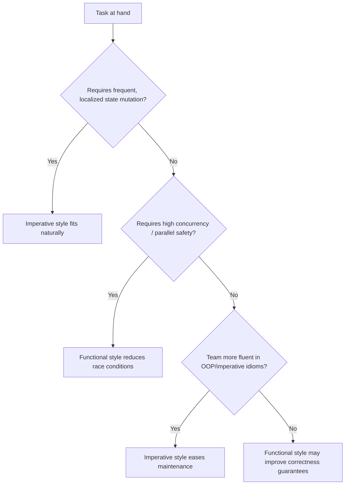

## Comparing Functional and Imperative Languages


### Overview

Functional and imperative languages represent two foundational programming paradigms with different models of computation. The imperative model expresses computation as a sequence of statements that change program state; the functional model expresses computation as the evaluation and composition of expressions, ideally without mutable state. Most real-world languages today are multi-paradigm, but comparing the paradigms in their fuller forms clarifies the trade-offs developers navigate when choosing a language, a library, or a coding style within a single project.

### Core Conceptual Distinction

**Key Points**

- Imperative: program = sequence of commands that mutate state (`x = x + 1`)
- Functional: program = composition of expressions that produce values without side effects (`x' = x + 1`, producing a new value rather than mutating `x`)
- Imperative languages are typically modeled after the von Neumann machine architecture (memory cells, sequential instruction execution)
- Functional languages are typically modeled after the lambda calculus (function application and substitution)

$$\text{Imperative: } S_1; S_2; \dots; S_n \quad \text{(state transitions)}$$


$$\text{Functional: } f(g(h(x))) \quad \text{(function composition)}$$

### Historical Lineage

| Paradigm | Theoretical Root | Early Representative Language | Approx. Era |
| --- | --- | --- | --- |
| Imperative | Turing machine / von Neumann architecture | FORTRAN, ALGOL | 1950s |
| Functional | Lambda calculus (Alonzo Church) | Lisp | 1958 |
| Imperative (OOP branch) | Von Neumann + data abstraction | Simula, Smalltalk | 1960s–70s |
| Functional (typed branch) | Lambda calculus + type theory | ML, Miranda | 1970s–80s |

[Unverified] Precise founding dates and attribution are widely documented in programming language history literature but specific claims (e.g., "first" language to introduce a feature) are sometimes contested among historians of computing.

### State and Mutation

Imperative languages center on mutable state as the primary mechanism of computation.

```c
// C: imperative state mutation
int sum = 0;
for (int i = 0; i < 10; i++) {
    sum += i;
}
```

Functional languages avoid mutation, instead threading values through function calls or using recursion.

```haskell
-- Haskell: no mutation, uses recursion and folds
sumList :: [Int] -> Int
sumList = foldr (+) 0

-- equivalent explicit recursion
sumRec :: [Int] -> Int
sumRec [] = 0
sumRec (x:xs) = x + sumRec xs
```

```scheme
; Scheme: recursion instead of loops
(define (sum-list lst)
  (if (null? lst)
      0
      (+ (car lst) (sum-list (cdr lst)))))
```

### Control Flow

Imperative languages rely on statements: loops, conditionals, and sequencing that control the order of state changes.

```java
// Java: imperative control flow
int factorial(int n) {
    int result = 1;
    for (int i = 2; i <= n; i++) {
        result *= i;
    }
    return result;
}
```

Functional languages express the same logic as expression evaluation, commonly via recursion.

```haskell
-- Haskell: recursive expression, no loop construct
factorial :: Integer -> Integer
factorial 0 = 1
factorial n = n * factorial (n - 1)
```

```fsharp
// F#: pattern-matched recursion
let rec factorial n =
    match n with
| 0 -> 1
| _ -> n * factorial (n - 1)
```

Pure functional languages generally do not have a native `for`/`while` looping construct in the imperative sense; iteration is expressed through recursion, often optimized by the compiler via tail-call elimination. [Inference — true for canonical functional languages like Haskell and Scheme per their language reports; some functional-leaning languages provide loop-like syntactic sugar that desugars to recursion or to higher-order iteration functions]

### Functions as Values vs. Functions as Procedures

In a purely imperative style, functions (procedures) are commands invoked for effect. In functional languages, functions are values — first-class citizens that can be passed, returned, and composed.

```haskell
-- Haskell: function composition operator
processData :: [Int] -> [Int]
processData = map (*2) . filter even
```

```python
# Python (imperative-leaning): explicit intermediate steps common
def process_data(data):
    filtered = [x for x in data if x % 2 == 0]
    doubled = [x * 2 for x in filtered]
    return doubled
```

### Referential Transparency and Side Effects

**Key Points**

- A referentially transparent expression can be replaced by its value without changing program behavior — a property functional languages aim to preserve throughout
- Imperative languages make no such guarantee; a function call's result may depend on and alter global or object state
- Referential transparency simplifies reasoning, testing, and parallelization, since pure functions have no hidden dependencies on execution order
- Real-world I/O still requires side effects; pure functional languages isolate them (e.g., Haskell's IO monad) rather than eliminating them

```haskell
-- Haskell: side effects are explicit in the type signature
main :: IO ()
main = do
    putStrLn "Enter your name:"
    name <- getLine
    putStrLn ("Hello, " ++ name)
```

```c
// C: side effects are implicit, not visible in a function's signature
int counter = 0;
int incrementAndGet() {
    counter++;      // hidden side effect
    return counter;
}
```

### Type Systems and Data Modeling

Functional languages, particularly statically typed ones (Haskell, OCaml, F#), commonly use algebraic data types (sum types and product types) and rely heavily on type inference.

```haskell
-- Haskell: algebraic data type (sum type)
data Shape = Circle Double | Rectangle Double Double

area :: Shape -> Double
area (Circle r) = pi * r * r
area (Rectangle w h) = w * h
```

Imperative/OOP languages more commonly model equivalent concepts through class hierarchies and inheritance.

```java
// Java: inheritance-based modeling
abstract class Shape {
    abstract double area();
}
class Circle extends Shape {
    double radius;
    double area() { return Math.PI * radius * radius; }
}
class Rectangle extends Shape {
    double width, height;
    double area() { return width * height; }
}
```

### Comparative Table

| Dimension | Imperative Languages | Functional Languages |
| --- | --- | --- |
| Core unit of computation | Statement (state change) | Expression (value production) |
| State handling | Mutable variables | Immutable bindings (values, not variables) |
| Control flow | Loops, conditionals, sequencing | Recursion, pattern matching, higher-order functions |
| Side effects | Implicit, pervasive | Explicit, isolated (e.g., monads) |
| Function status | Procedures/subroutines | First-class values |
| Typical data modeling | Classes, inheritance, mutable objects | Algebraic data types, immutable records |
| Concurrency reasoning | Harder due to shared mutable state | Easier due to immutability and no side effects |
| Representative languages | C, Pascal, Java (core), Go | Haskell, Erlang, Scheme, Elm |
| Multi-paradigm hybrids | Python, JavaScript, C#, Java (modern) | F#, Scala, Clojure (Lisp-derived) |

### Concurrency Implications

**Key Points**

- Shared mutable state in imperative programs requires explicit synchronization (locks, mutexes) to avoid race conditions
- Immutability in functional programs removes a large class of race conditions by construction, since concurrently accessed data cannot be mutated
- Erlang's actor model and immutable message-passing are frequently cited as enabling highly concurrent, fault-tolerant systems [Inference — this is a widely repeated claim in Erlang/OTP literature and case studies; the degree of benefit depends on workload and system design, and is not an automatic guarantee of correctness or performance]

```erlang
% Erlang: message passing between isolated, immutable-state processes
loop(State) ->
    receive
        {increment} -> loop(State + 1);
        {get, From} -> From ! State, loop(State)
    end.
```

### Illustration: Two Computation Models

<svg xmlns="http://www.w3.org/2000/svg" viewBox="0 0 700 400">
<text x="350" y="30" text-anchor="middle" font-size="18" font-weight="bold" fill="#1a1a1a">Imperative vs Functional Computation Models (svg_diagram)</text>

<text x="175" y="65" text-anchor="middle" font-size="15" font-weight="bold" fill="`#1a3d5c`">Imperative</text>

<rect x="60" y="80" width="230" height="40" rx="6" fill="`#cfe8ff`" stroke="`#2b6cb0`" />

<text x="175" y="105" text-anchor="middle" font-size="12" fill="`#1a3d5c`">State S0</text>

<line x1="175" y1="120" x2="175" y2="150" stroke="`#2b6cb0`" stroke-width="2" marker-end="url(#arrow1)" />

<rect x="60" y="150" width="230" height="40" rx="6" fill="`#cfe8ff`" stroke="`#2b6cb0`" />

<text x="175" y="175" text-anchor="middle" font-size="12" fill="`#1a3d5c`">Statement mutates -&gt; State S1</text>

<line x1="175" y1="190" x2="175" y2="220" stroke="`#2b6cb0`" stroke-width="2" marker-end="url(#arrow1)" />

<rect x="60" y="220" width="230" height="40" rx="6" fill="`#cfe8ff`" stroke="`#2b6cb0`" />

<text x="175" y="245" text-anchor="middle" font-size="12" fill="`#1a3d5c`">Statement mutates -&gt; State S2</text>

<text x="525" y="65" text-anchor="middle" font-size="15" font-weight="bold" fill="`#1a4d2e`">Functional</text>

<rect x="410" y="80" width="230" height="40" rx="6" fill="`#d6f5d6`" stroke="`#2f855a`" />

<text x="525" y="105" text-anchor="middle" font-size="12" fill="`#1a4d2e`">Value x</text>

<line x1="525" y1="120" x2="525" y2="150" stroke="`#2f855a`" stroke-width="2" marker-end="url(#arrow2)" />

<rect x="410" y="150" width="230" height="40" rx="6" fill="`#d6f5d6`" stroke="`#2f855a`" />

<text x="525" y="175" text-anchor="middle" font-size="12" fill="`#1a4d2e`">f(x) -&gt; new value y</text>

<line x1="525" y1="190" x2="525" y2="220" stroke="`#2f855a`" stroke-width="2" marker-end="url(#arrow2)" />

<rect x="410" y="220" width="230" height="40" rx="6" fill="`#d6f5d6`" stroke="`#2f855a`" />

<text x="525" y="245" text-anchor="middle" font-size="12" fill="`#1a4d2e`">g(y) -&gt; new value z</text>

<text x="175" y="300" text-anchor="middle" font-size="12" fill="`#333333`">Same variable, changing state</text>

<text x="525" y="300" text-anchor="middle" font-size="12" fill="`#333333`">New values, no mutation</text>

</svg>

### Illustration: Choosing an Approach



### Performance Considerations

**Key Points**

- Imperative languages with direct memory control (C, C++, Rust) often achieve lower-level performance tuning since state mutation maps closely to hardware operations
- Functional languages relying on immutability may incur allocation and garbage-collection overhead from creating new values instead of mutating in place, though persistent data structures with structural sharing mitigate much of this cost [Inference — well documented in functional-language implementation literature (e.g., Okasaki's work on persistent data structures); actual overhead is workload- and implementation-specific]
- Compiler optimizations (strictness analysis, deforestation, tail-call optimization) can substantially narrow the performance gap for many workloads, but do not guarantee parity in all cases
- Behavior may vary significantly based on compiler/runtime version, optimization flags, and hardware, so benchmarking for the specific use case is advisable rather than relying on general paradigm reputation

### Readability and Maintainability Trade-offs

**Key Points**

- Imperative code can more directly mirror a step-by-step mental model of "what happens when," which some developers find easier to trace and debug
- Functional code can be more concise and composable, but recursion-heavy or heavily point-free code can be harder to read for those unfamiliar with the idioms
- Pure functions are generally easier to unit test in isolation since they require no environment setup or mocking of shared state
- Debugging imperative code often uses step-through debuggers tracing state changes; debugging functional code often relies more on reasoning about expression evaluation and type signatures

### Common Misconceptions

**Key Points**

- Functional languages do not forbid all side effects in practice — I/O must occur; the difference is whether the effect is made explicit and controlled versus implicit and pervasive
- Imperative does not mean "no functions" — imperative languages have always had procedures/functions, but historically not as first-class values
- Using functional-style syntax (e.g., `map`/`filter` in Python or JavaScript) in an otherwise imperative language does not make the language purely functional; the underlying execution model, mutability defaults, and effect handling remain imperative
- Object-oriented programming is not synonymous with imperative programming, though most mainstream OOP languages are imperative at the statement level; the distinction is about state mutation and control flow, not about objects specifically

### Example: Same Algorithm Contrasted

```python
# Imperative (Python)
def fibonacci_imperative(n):
    a, b = 0, 1
    for _ in range(n):
        a, b = b, a + b
    return a
```

```haskell
-- Functional (Haskell)
fibonacci :: Int -> Integer
fibonacci n = fibs !! n
  where fibs = 0 : 1 : zipWith (+) fibs (tail fibs)
```

The Haskell version relies on lazy evaluation to define an infinite list of Fibonacci numbers and index into it, a technique that has no direct imperative equivalent without simulating laziness manually.

### Next Steps

- Lazy vs. strict evaluation strategies and their trade-offs
- Persistent data structures and structural sharing implementation
- Monads and effect systems as a bridge between purity and I/O
- Actor-model and message-passing concurrency (Erlang/Elixir deep dive)
- Type inference algorithms (Hindley-Milner) in functional languages
- Multi-paradigm language design case studies (Scala, F#, Rust)
- Tail-call optimization mechanics across language runtimes
- Category theory foundations relevant to functional programming (functors, monads, applicatives)