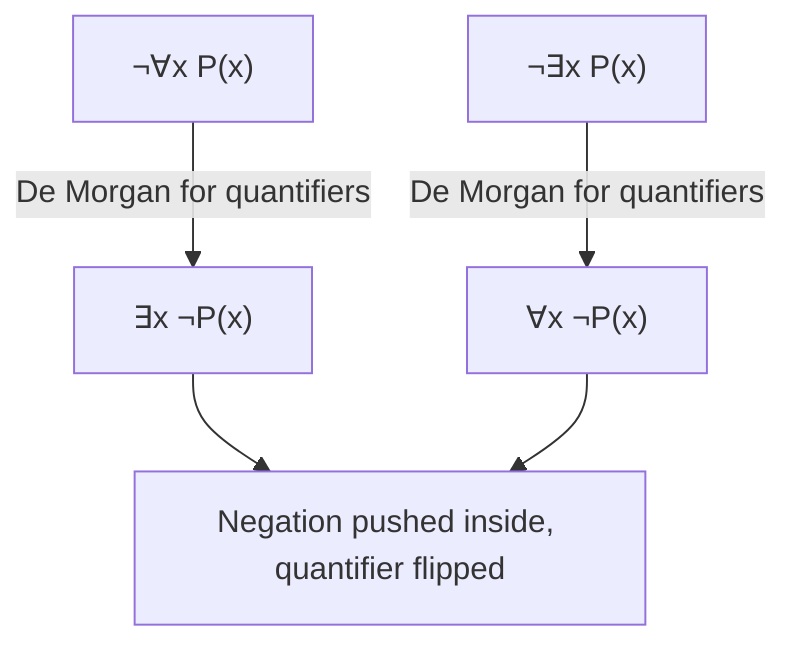

## Predicate Calculus Fundamentals

### Overview

Predicate calculus (also called predicate logic or first-order logic) is a formal system that extends propositional logic by introducing quantification over individuals, along with predicates that express properties of and relationships between those individuals. Where propositional logic can only combine whole statements with logical connectives, predicate calculus can express statements like "all humans are mortal" or "there exists a prime number greater than 100" by reasoning about the internal structure of statements — subjects, properties, and relations. Predicate calculus forms the theoretical foundation for logic programming, formal verification, database query semantics, and much of the formal reasoning underlying computer science.

### Basic Building Blocks

**Key Points**

- **Constants**: symbols denoting specific individuals (e.g., $a$, $b$, `socrates`)
- **Variables**: symbols standing for arbitrary individuals (e.g., $x$, $y$, $z$)
- **Predicates**: symbols denoting properties or relations (e.g., $P(x)$ meaning "x has property P", $Loves(x, y)$ meaning "x loves y")
- **Functions**: symbols mapping individuals to individuals (e.g., $father(x)$ denotes the father of $x$)
- **Terms**: constants, variables, or function applications — the "noun phrases" of the logic
- **Atomic formulas**: a predicate applied to terms (e.g., $Mortal(socrates)$)

### Quantifiers

Predicate calculus introduces two quantifiers that bind variables over a domain of discourse.

$$\forall x \, P(x) \quad \text{("for all } x \text{, } P(x) \text{ holds")}$$

$$\exists x \, P(x) \quad \text{("there exists an } x \text{ such that } P(x) \text{ holds")}$$

**Key Points**

- The **universal quantifier** ($\forall$) asserts a property holds for every individual in the domain
- The **existential quantifier** ($\exists$) asserts a property holds for at least one individual in the domain
- Quantifiers can be nested, and the order of nesting changes meaning: $\forall x \exists y \, Loves(x, y)$ ("everyone loves someone") is not equivalent to $\exists y \forall x \, Loves(x, y)$ ("someone is loved by everyone")
- The scope of a quantifier is the formula over which it applies; variables outside that scope are unaffected by the binding

### Classic Example: Socrates Syllogism

$$\forall x \, (Human(x) \rightarrow Mortal(x))$$

$$Human(socrates)$$

$$\therefore Mortal(socrates)$$

This translates the classical syllogism "All humans are mortal; Socrates is human; therefore Socrates is mortal" into predicate calculus, using universal quantification and the implication connective to formalize the general rule, then instantiating it for a specific individual.

### Logical Connectives Recap (Inherited from Propositional Logic)

| Symbol | Name | Meaning |
| --- | --- | --- |
| $\neg$ | Negation | "not" |
| $\land$ | Conjunction | "and" |
| $\lor$ | Disjunction | "or" |
| $\rightarrow$ | Implication | "if...then" |
| $\leftrightarrow$ | Biconditional | "if and only if" |

Predicate calculus combines these connectives with quantified formulas, e.g.:

$$\forall x \, (Bird(x) \land \neg Penguin(x) \rightarrow CanFly(x))$$

### Free vs. Bound Variables

**Key Points**

- A variable is **bound** if it occurs within the scope of a quantifier that names it
- A variable is **free** if it is not bound by any quantifier
- A formula with no free variables is called a **closed formula** or **sentence**, and has a definite truth value in a given interpretation
- A formula with free variables is an **open formula**, whose truth value depends on what those free variables are assigned

$$\forall x \, P(x, y) \quad \text{— } x \text{ is bound, } y \text{ is free}$$

### Interpretation and Domain of Discourse

A formula in predicate calculus has no fixed truth value on its own; truth is assigned relative to an **interpretation**, which specifies:

**Key Points**

- A **domain of discourse**: the set of individuals the variables range over
- An assignment of each constant symbol to a specific individual in the domain
- An assignment of each predicate symbol to a specific relation over the domain
- An assignment of each function symbol to a specific function over the domain

For example, $\forall x \, P(x)$ is true or false only once we fix what the domain is and what $P$ means — the same formula can be true under one interpretation and false under another.

### Quantifier Equivalences and Negation

$$\neg \forall x \, P(x) \equiv \exists x \, \neg P(x)$$

$$\neg \exists x \, P(x) \equiv \forall x \, \neg P(x)$$

These are the predicate-logic analogues of De Morgan's laws, allowing negation to be pushed through quantifiers by flipping the quantifier type.

### Well-Formed Formulas (WFFs)

A formula is well-formed if it is built according to the formal grammar of predicate calculus:

**Key Points**

- Every atomic formula is a WFF
- If $\phi$ is a WFF, then $\neg \phi$ is a WFF
- If $\phi$ and $\psi$ are WFFs, then $(\phi \land \psi)$, $(\phi \lor \psi)$, $(\phi \rightarrow \psi)$, and $(\phi \leftrightarrow \psi)$ are WFFs
- If $\phi$ is a WFF and $x$ is a variable, then $\forall x \, \phi$ and $\exists x \, \phi$ are WFFs
- Nothing else is a WFF (this closure clause ensures the grammar is precisely bounded)

### Illustration: Structure of a Predicate Calculus Formula

<svg xmlns="http://www.w3.org/2000/svg" viewBox="0 0 700 380">
<text x="350" y="30" text-anchor="middle" font-size="18" font-weight="bold" fill="#1a1a1a">Formula Structure Tree (svg_diagram)</text>
<text x="350" y="55" text-anchor="middle" font-size="13" fill="#333">∀x (Human(x) → Mortal(x))</text>
<rect x="300" y="80" width="100" height="40" rx="6" fill="#cfe8ff" stroke="#2b6cb0" stroke-width="2" />
<text x="350" y="105" text-anchor="middle" font-size="12" fill="#1a3d5c">∀x (...)</text>
<line x1="350" y1="120" x2="350" y2="150" stroke="#333" stroke-width="1.5" marker-end="url(#am1)" />
<rect x="280" y="150" width="140" height="40" rx="6" fill="#e0d4fa" stroke="#6b46c1" stroke-width="2" />
<text x="350" y="175" text-anchor="middle" font-size="12" fill="#3c1a78">Implication →</text>
<line x1="320" y1="190" x2="200" y2="230" stroke="#333" stroke-width="1.5" marker-end="url(#am1)" />
<line x1="380" y1="190" x2="500" y2="230" stroke="#333" stroke-width="1.5" marker-end="url(#am1)" />
<rect x="120" y="230" width="160" height="40" rx="6" fill="#ffe8cc" stroke="#c05621" stroke-width="2" />
<text x="200" y="255" text-anchor="middle" font-size="12" fill="#7c2d12">Atomic: Human(x)</text>
<rect x="420" y="230" width="160" height="40" rx="6" fill="#d6f5d6" stroke="#2f855a" stroke-width="2" />
<text x="500" y="255" text-anchor="middle" font-size="12" fill="#1a4d2e">Atomic: Mortal(x)</text>

<text x="200" y="300" text-anchor="middle" font-size="11" fill="#333">Predicate: Human</text>

<text x="200" y="318" text-anchor="middle" font-size="11" fill="#333">Term (variable): x</text>

<text x="500" y="300" text-anchor="middle" font-size="11" fill="#333">Predicate: Mortal</text>

<text x="500" y="318" text-anchor="middle" font-size="11" fill="#333">Term (variable): x</text>

</svg>

### Relation to Propositional Logic

| Aspect | Propositional Logic | Predicate Calculus |
| --- | --- | --- |
| Basic unit | Whole propositions (atomic, no internal structure) | Predicates applied to terms |
| Quantification | Not available | Universal and existential quantifiers |
| Expressiveness | Cannot express "all" or "some" over a domain | Can express general and existential statements |
| Truth assignment | Fixed truth values per proposition | Requires an interpretation (domain + assignments) |
| Decidability | Decidable (finite truth tables) | Undecidable in general (though semi-decidable via proof procedures) |

[Unverified] The undecidability of first-order predicate calculus in the general case is a well-established result (related to Church's and Turing's independent proofs in 1936), but characterizing exactly which decidable fragments exist involves technical qualifications beyond the scope of a summary table.

### Horn Clauses: The Bridge to Logic Programming

A **Horn clause** is a disjunction of literals with at most one positive literal, and can be rewritten in implicational form:

$$\neg B_1 \lor \neg B_2 \lor \dots \lor \neg B_n \lor A \quad \equiv \quad A \leftarrow B_1 \land B_2 \land \dots \land B_n$$

**Key Points**

- Horn clauses restrict full predicate calculus to a fragment that is efficiently computable via resolution
- This restriction is what makes languages like Prolog practical: full first-order predicate calculus has no general decision procedure, but Horn clause reasoning is tractable enough for automated inference
- Facts are Horn clauses with an empty body; rules have both head and body; a query is treated as a headless clause (a goal to refute)

### Substitution and Instantiation

Replacing a variable with a specific term is called **substitution**, and applying a substitution to a quantified formula (removing the quantifier and replacing the bound variable) is called **instantiation**.

$$\forall x \, P(x) \quad \xrightarrow{\text{instantiate } x := socrates} \quad P(socrates)$$

**Key Points**

- Universal instantiation: from $\forall x \, P(x)$, one may infer $P(t)$ for any specific term $t$ in the domain
- Existential generalization: from $P(t)$ for a specific term $t$, one may infer $\exists x \, P(x)$
- These inference rules underlie the formal proof systems (natural deduction, sequent calculus) built on top of predicate calculus

### Applications in Computer Science

**Key Points**

- **Logic programming** (Prolog and related languages) directly implements a computable fragment of predicate calculus (Horn clauses) as an executable programming model
- **Database query languages**: relational algebra and SQL semantics have deep correspondences to predicate calculus, particularly through relational calculus formulations
- **Formal verification and model checking**: specifying program correctness properties (preconditions, postconditions, invariants) is commonly done in predicate-logic notation, as in Hoare logic
- **Automated theorem proving**: tools like resolution provers and SAT/SMT solvers operate on formulas expressed in or reducible to predicate-calculus fragments
- **Knowledge representation and ontologies**: description logics used in the Semantic Web (OWL) are decidable fragments of predicate calculus

[Inference] The listed application areas reflect standard textbook associations between predicate calculus and computer science subfields; the extent of predicate calculus's direct use versus indirect theoretical influence varies by application and is not uniformly documented here.

### Example: Translating English to Predicate Calculus

| English Statement | Predicate Calculus |
| --- | --- |
| "All dogs are mammals" | $\forall x \, (Dog(x) \rightarrow Mammal(x))$ |
| "Some cats are black" | $\exists x \, (Cat(x) \land Black(x))$ |
| "No reptiles are mammals" | $\forall x \, (Reptile(x) \rightarrow \neg Mammal(x))$ |
| "Every student has a favorite teacher" | $\forall x \, (Student(x) \rightarrow \exists y \, (Teacher(y) \land Favorite(x, y)))$ |
| "Only one person is the president" | $\exists x \, (President(x) \land \forall y \, (President(y) \rightarrow y = x))$ |

### Common Pitfalls

**Key Points**

- Confusing $\forall x \exists y$ with $\exists y \forall x$ — quantifier order is semantically significant and not interchangeable
- Forgetting that an open formula (with free variables) has no truth value until those variables are bound or instantiated
- Misapplying negation across quantifiers without flipping the quantifier type (a direct violation of the De Morgan-style equivalences)
- Assuming predicate calculus statements are automatically decidable/computable; full first-order logic is only semi-decidable, meaning a valid formula's provability can always eventually be confirmed, but invalidity cannot always be confirmed in finite time

### Related Topics

- Propositional logic fundamentals as a prerequisite foundation
- Resolution and unification as computational proof procedures
- Horn clauses and their direct realization in Prolog
- Natural deduction and sequent calculus proof systems
- Relational calculus and its correspondence to SQL
- Decidable fragments of first-order logic (description logics, guarded fragments)
- Hoare logic and formal program verification
- Second-order logic and its increased expressiveness versus predicate calculus