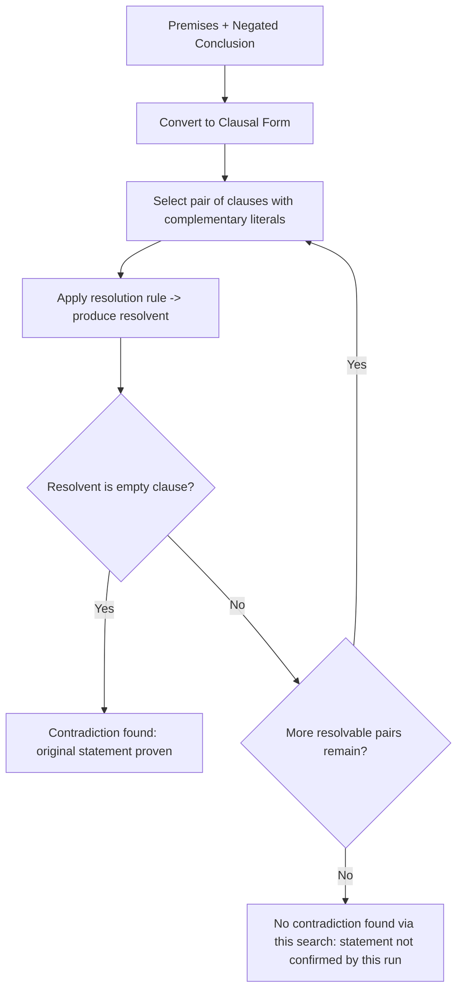
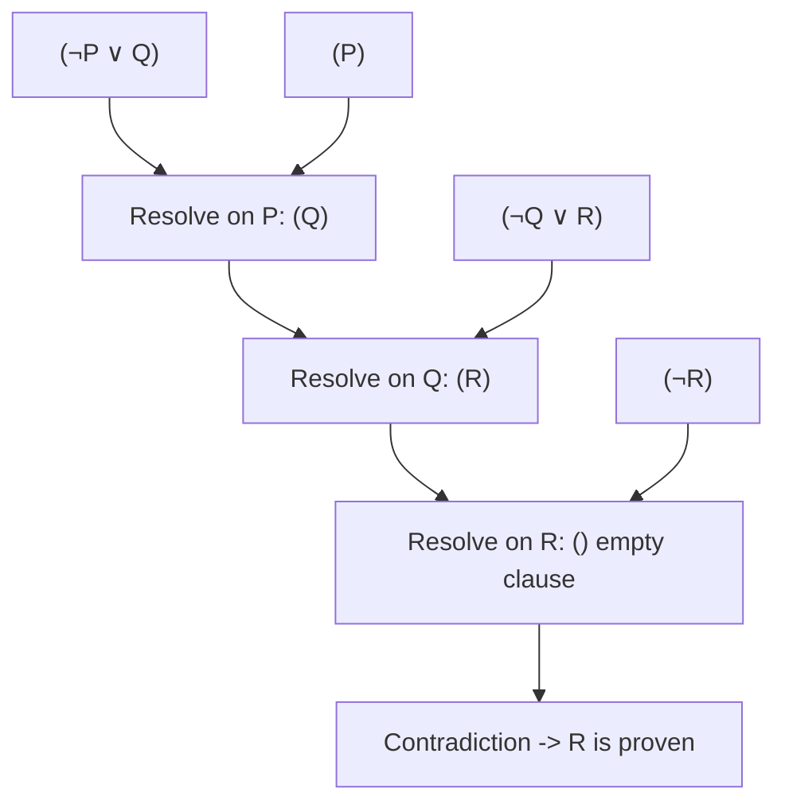

## Resolution and Proof by Contradiction

### Overview

Resolution is a single, sound inference rule used to mechanically derive new clauses from existing ones, and it forms the computational backbone of automated theorem provers and logic programming systems like Prolog. Rather than working forward from axioms toward a desired conclusion, resolution-based proof typically works by **refutation**: to prove a statement is a logical consequence of a set of premises, the negation of that statement is added to the premises, and the resolution procedure attempts to derive a contradiction (the empty clause). If a contradiction is found, the original statement is proven true — this is proof by contradiction, formalized into an algorithmic, mechanizable process.

### Clausal Form

Resolution operates on formulas in **clausal form**: a conjunction of clauses, where each clause is a disjunction of literals (a literal being an atomic formula or its negation).

$$(\neg P \lor Q) \land (\neg Q \lor R) \land P$$

**Key Points**

- Any formula in predicate calculus can be converted into an equivalent clausal form through a sequence of standard transformations (eliminating implications, pushing negations inward, skolemization, and distributing disjunction over conjunction)
- A clause is often written as a set of literals, e.g., $\{\neg P, Q\}$, since disjunction is commutative and associative
- The **empty clause**, written $\square$ or $\{\}$, represents a contradiction — a disjunction of zero literals is always false

### The Resolution Rule

Given two clauses that each contain complementary literals (one has $L$, the other has $\neg L$), resolution produces a new clause consisting of the remaining literals from both, with the complementary pair removed.

$$\frac{C_1 \lor L \qquad C_2 \lor \neg L}{C_1 \lor C_2}$$

**Example (propositional case):**

$$\frac{(P \lor Q) \qquad (\neg Q \lor R)}{(P \lor R)}$$

Here, $Q$ and $\neg Q$ are complementary, so they cancel, leaving the resolvent $(P \lor R)$ built from the remaining literals of each parent clause.

### Resolution Refutation Procedure

**Key Points**

- To prove that a formula $\phi$ follows from premises $\Sigma$, negate $\phi$ and add it to $\Sigma$, then convert the whole set to clausal form
- Repeatedly apply the resolution rule to pairs of clauses containing complementary literals, adding each resolvent to the clause set
- If the empty clause is ever derived, the clause set is **unsatisfiable**, meaning the original premises plus the negated conclusion cannot all be true simultaneously — this proves $\phi$ follows from $\Sigma$
- If no more resolvents can be produced and the empty clause has not been derived, the set may be satisfiable (in the propositional case, this confirms $\phi$ does **not** follow; in the first-order case, the procedure may simply not terminate, since first-order validity is only semi-decidable)



### Worked Propositional Example

**Premises:**

1. $P \rightarrow Q$
2. $Q \rightarrow R$
3. $P$

**Goal:** Prove $R$

**Step 1 — Convert to clausal form:**

- $P \rightarrow Q \equiv (\neg P \lor Q)$
- $Q \rightarrow R \equiv (\neg Q \lor R)$
- $P$ stays as $(P)$
- Negate the goal: $\neg R$, giving clause $(\neg R)$

**Step 2 — Clause set:**

$$\{(\neg P \lor Q),\ (\neg Q \lor R),\ (P),\ (\neg R)\}$$

**Step 3 — Resolve:**

- Resolve $(P)$ and $(\neg P \lor Q)$ on $P/\neg P$ → resolvent $(Q)$
- Resolve $(Q)$ and $(\neg Q \lor R)$ on $Q/\neg Q$ → resolvent $(R)$
- Resolve $(R)$ and $(\neg R)$ on $R/\neg R$ → resolvent $()$, the **empty clause**

The empty clause is derived, so the original clause set (premises + negated goal) is unsatisfiable, confirming that $R$ follows from the premises.



### Resolution in First-Order Logic: Unification

In propositional logic, complementary literals must match exactly. In first-order logic, literals may contain variables, so resolution requires **unification** to find a substitution that makes two literals complementary.

$$\frac{C_1 \lor P(x) \qquad C_2 \lor \neg P(a)}{\sigma(C_1 \lor C_2)} \quad \text{where } \sigma = \{x/a\}$$

**Key Points**

- The unifying substitution $\sigma$ is applied to the entire resolvent, not just the literals being resolved
- The **most general unifier (MGU)** is preferred, since it keeps the resolvent as general as possible, preserving the widest range of subsequent applicability
- Occurs-check (ensuring a variable is not unified with a term containing itself) is theoretically necessary for soundness, though many practical implementations omit it for performance, accepting the small risk of unsound results in pathological cases [Inference — this trade-off is well documented in automated theorem proving and Prolog implementation literature; specific behavior depends on the given system's configuration]

### Skolemization

Before converting a formula with existential quantifiers to clausal form, those quantifiers must be eliminated through **Skolemization** — replacing each existentially quantified variable with a new function (or constant, if not inside the scope of any universal quantifier) that represents "whatever witness makes the existential true."

$$\forall x \, \exists y \, Loves(x, y) \quad \xrightarrow{\text{Skolemize}} \quad \forall x \, Loves(x, f(x))$$

**Key Points**

- $f(x)$ is a **Skolem function**: it does not claim to compute who $x$ loves in a constructive sense, only that such a value exists, dependent on $x$
- Skolemization preserves satisfiability (not logical equivalence) — the Skolemized formula is satisfiable if and only if the original is, which is sufficient for resolution-based refutation procedures
- If the existential is not within the scope of any universal quantifier, a plain **Skolem constant** is used instead of a function

### Refutation Completeness and Limitations

**Key Points**

- Resolution is **refutation complete** for first-order logic: if a set of clauses is unsatisfiable, resolution is guaranteed to eventually derive the empty clause, given unbounded time and a fair search strategy
- Resolution is not guaranteed to terminate when the clause set **is** satisfiable, since first-order logic validity is only semi-decidable — the absence of a contradiction after finite search does not prove satisfiability in general [Unverified as a blanket claim outside specific decidable fragments — this reflects the general semi-decidability result for first-order logic; certain restricted fragments (e.g., propositional logic, Horn clause sets under specific conditions) are fully decidable]
- Search strategy matters enormously in practice: naive exhaustive resolution can generate an explosion of irrelevant clauses, motivating refinements
- Common refinements include **unit resolution** (always resolving with a single-literal clause), **linear resolution** (each new resolvent must use the immediately preceding resolvent), and **SLD resolution** (the Horn-clause-restricted strategy used in Prolog)

### SLD Resolution: The Prolog Connection

SLD resolution (Selective Linear Definite clause resolution) is the specific resolution strategy Prolog uses, restricted to Horn clauses (Definite clauses), applied Linearly (each step resolves the current goal against a clause from the database), with a Selection function determining which literal in the goal to resolve next.

```prolog
% Facts and rule
parent(tom, bob).
parent(bob, ann).
grandparent(X, Y) :- parent(X, Z), parent(Z, Y).

% Query, treated as a goal clause to refute
?- grandparent(tom, ann).
```

Internally, the query is treated as a negated goal; Prolog's engine performs SLD resolution against the clause database, and successfully deriving the empty clause corresponds to proving the query true, with variable bindings recorded along the way via unification.

### Illustration: Resolution as Refutation

<svg xmlns="http://www.w3.org/2000/svg" viewBox="0 0 700 340">
<text x="350" y="30" text-anchor="middle" font-size="18" font-weight="bold" fill="#1a1a1a">Proof by Contradiction via Resolution (svg_diagram)</text>
<rect x="40" y="60" width="220" height="50" rx="8" fill="#cfe8ff" stroke="#2b6cb0" stroke-width="2" />
<text x="150" y="90" text-anchor="middle" font-size="12" fill="#1a3d5c">Premises (clausal form)</text>
<rect x="440" y="60" width="220" height="50" rx="8" fill="#ffe8cc" stroke="#c05621" stroke-width="2" />
<text x="550" y="90" text-anchor="middle" font-size="12" fill="#7c2d12">Negated Conclusion</text>
<line x1="150" y1="110" x2="330" y2="160" stroke="#333" stroke-width="1.5" marker-end="url(#ar1)" />
<line x1="550" y1="110" x2="370" y2="160" stroke="#333" stroke-width="1.5" marker-end="url(#ar1)" />
<rect x="250" y="160" width="200" height="50" rx="8" fill="#e0d4fa" stroke="#6b46c1" stroke-width="2" />
<text x="350" y="190" text-anchor="middle" font-size="12" fill="#3c1a78">Combined Clause Set</text>
<line x1="350" y1="210" x2="350" y2="240" stroke="#333" stroke-width="1.5" marker-end="url(#ar1)" />
<rect x="250" y="240" width="200" height="50" rx="8" fill="#d6f5d6" stroke="#2f855a" stroke-width="2" />
<text x="350" y="270" text-anchor="middle" font-size="12" fill="#1a4d2e">Apply Resolution Repeatedly</text>
<line x1="350" y1="290" x2="350" y2="310" stroke="#333" stroke-width="1.5" marker-end="url(#ar1)" />

<text x="350" y="330" text-anchor="middle" font-size="13" font-weight="bold" fill="`#742a2a`">Empty Clause -&gt; Contradiction -&gt; Conclusion Proven</text>

</svg>

### Resolution Strategies Compared

| Strategy | Restriction Applied | Typical Use Case |
| --- | --- | --- |
| General resolution | None beyond clausal form | Theoretical completeness proofs |
| Unit resolution | At least one parent clause has a single literal | Efficient for certain restricted problem classes |
| Linear resolution | Each resolvent must involve the prior resolvent or an input clause | General-purpose automated theorem provers |
| SLD resolution | Restricted to Horn/Definite clauses, linear, with a selection function | Prolog and logic programming engines |
| Ordered resolution | Literals resolved according to a fixed ordering | Reducing search space in modern provers |

### Common Pitfalls

**Key Points**

- Forgetting to negate the conclusion before beginning refutation — resolution proves unsatisfiability of premises-plus-negated-goal, not satisfiability of the goal directly
- Applying resolution to non-clausal formulas without first performing the required normalization steps (implication elimination, negation normal form, Skolemization, distribution)
- Confusing Skolem functions with ordinary functions that compute a value; a Skolem function only asserts existence of *some* witness, without giving an algorithm for finding it
- Assuming termination is guaranteed for a satisfiable first-order clause set, when in general the search may run indefinitely without confirming satisfiability

### Related Topics

- Predicate calculus fundamentals (quantifiers, WFFs, interpretations) as a prerequisite
- Unification algorithms and the most general unifier (MGU) computation
- Skolemization and conjunctive/disjunctive normal forms in detail
- SLD resolution and its direct implementation in Prolog engines
- Automated theorem proving systems and modern SAT/SMT solving techniques
- Completeness and soundness proofs for resolution-based inference
- Ordered and paramodulation-based resolution refinements
- Applications of resolution in program verification and model checking