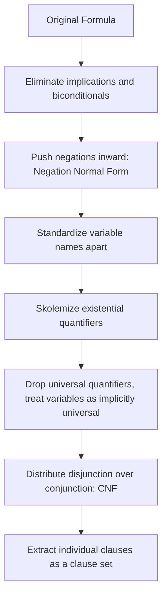

## Clausal Form and Horn Clauses

### Overview

Clausal form is a normalized representation of logical formulas as a conjunction of clauses, each clause being a disjunction of literals, and it is the required input format for resolution-based inference procedures. Horn clauses are a restricted subset of clausal form — clauses containing at most one positive literal — that carry special computational significance because they can be processed efficiently and map directly onto the fact/rule/query structure of logic programming languages like Prolog. Understanding how arbitrary formulas are converted into clausal form, and why the Horn restriction matters, is foundational to both automated theorem proving and logic programming.

### What Is a Clause

**Key Points**

- A **literal** is an atomic formula (e.g., $P(x)$) or its negation (e.g., $\neg P(x)$)
- A **clause** is a disjunction of literals: $L_1 \lor L_2 \lor \dots \lor L_n$
- A set or conjunction of clauses represents a formula in **Conjunctive Normal Form (CNF)**: $(L_{11} \lor \dots) \land (L_{21} \lor \dots) \land \dots$
- Clauses are commonly written as sets of literals, since disjunction is commutative, associative, and idempotent, so order and repetition do not matter semantically
- The **empty clause**, containing zero literals, is unsatisfiable by definition (an empty disjunction is always false)

$$\text{Clause: } \{\neg P, Q, \neg R\} \quad \equiv \quad \neg P \lor Q \lor \neg R$$

### Converting Formulas to Clausal Form

Any formula in predicate calculus can be transformed into an equivalent (or, for formulas with existential quantifiers, equisatisfiable) clausal form through a standard sequence of steps.

#### Step 1: Eliminate Implications and Biconditionals

$$A \rightarrow B \quad \equiv \quad \neg A \lor B$$

$$A \leftrightarrow B \quad \equiv \quad (\neg A \lor B) \land (\neg B \lor A)$$

#### Step 2: Push Negations Inward (Negation Normal Form)

Using De Morgan's laws and quantifier negation equivalences:

$$\neg(A \land B) \equiv \neg A \lor \neg B \qquad \neg(A \lor B) \equiv \neg A \land \neg B$$

$$\neg \forall x \, P(x) \equiv \exists x \, \neg P(x) \qquad \neg \exists x \, P(x) \equiv \forall x \, \neg P(x)$$

$$\neg \neg A \equiv A$$

#### Step 3: Standardize Variables Apart

Rename bound variables so that no two quantifiers in the formula use the same variable name, preventing accidental variable capture in later steps.

#### Step 4: Skolemization

Replace each existentially quantified variable with a Skolem function (or constant) of the universally quantified variables in whose scope it falls, then discard the existential quantifiers.

$$\forall x \, \exists y \, Loves(x, y) \quad \rightarrow \quad \forall x \, Loves(x, f(x))$$

#### Step 5: Drop Universal Quantifiers

Since all remaining quantifiers are universal and apply to the whole formula, they can be dropped, with the convention that all remaining free variables are implicitly universally quantified.

#### Step 6: Distribute Disjunction over Conjunction

$$A \lor (B \land C) \quad \equiv \quad (A \lor B) \land (A \lor C)$$

This produces a formula that is a conjunction of disjunctions — CNF — from which individual clauses can be read off directly.

### Worked Conversion Example

**Original formula:**

$$\forall x \, (Human(x) \rightarrow Mortal(x))$$

**Step 1 (eliminate implication):**

$$\forall x \, (\neg Human(x) \lor Mortal(x))$$

**Steps 2–5 (already in NNF, no existentials, drop quantifier):**

$$\neg Human(x) \lor Mortal(x)$$

**Resulting clause:**

$$\{\neg Human(x), Mortal(x)\}$$

A more complex example involving an existential:

**Original formula:**

$$\forall x \, (Student(x) \rightarrow \exists y \, (Teacher(y) \land Advises(y, x)))$$

**After implication elimination and NNF:**

$$\forall x \, (\neg Student(x) \lor \exists y \, (Teacher(y) \land Advises(y, x)))$$

**After Skolemization** ($y$ depends on $x$, so it becomes $g(x)$):

$$\neg Student(x) \lor (Teacher(g(x)) \land Advises(g(x), x))$$

**After distributing disjunction over conjunction:**

$$(\neg Student(x) \lor Teacher(g(x))) \land (\neg Student(x) \lor Advises(g(x), x))$$

**Resulting clause set:**

$$\{\neg Student(x), Teacher(g(x))\} \quad \text{and} \quad \{\neg Student(x), Advises(g(x), x)\}$$

### Horn Clauses Defined

A **Horn clause** is a clause containing **at most one positive literal** (a literal without negation).

**Key Points**

- A clause with exactly one positive literal and zero or more negative literals is a **definite clause**: $\{A, \neg B_1, \neg B_2, \dots, \neg B_n\}$, rewritable as $A \leftarrow B_1 \land B_2 \land \dots \land B_n$
- A clause with zero positive literals is a **goal clause** (or negative clause): $\{\neg B_1, \dots, \neg B_n\}$, used to represent queries in refutation
- A definite clause with an empty body (no negative literals) is a **fact**: $\{A\}$, i.e., $A \leftarrow \text{true}$
- Not every clause is a Horn clause — a clause with two or more positive literals, such as $\{P, Q\}$, falls outside the Horn restriction and cannot be directly expressed as a single Prolog-style rule or fact

$$\underbrace{\{A, \neg B_1, \neg B_2\}}_{\text{Horn: definite clause}} \qquad \underbrace{\{P, Q\}}_{\text{Not Horn: two positive literals}}$$

### Why the Horn Restriction Matters

**Key Points**

- Horn clauses can be directly read as **if-then rules**, giving them an intuitive procedural interpretation alongside their declarative meaning
- SLD resolution — the strategy used by Prolog — is specifically defined over Horn (definite) clauses and goal clauses, and is both sound and refutation-complete for this restricted class
- Reasoning with unrestricted clausal form (arbitrary CNF) is more expressive but computationally harder to control; Horn clause reasoning admits efficient, largely deterministic-feeling execution strategies
- The Horn restriction is precisely what allows a clause to be interpreted as "the head is true whenever the body is true," since with at most one positive literal, there is no ambiguity about what is being concluded

[Inference] The characterization of Horn clauses as enabling more tractable and intuitive procedural reading is a widely held view in logic programming literature (e.g., foundational work by Kowalski and van Emden), though "tractable" here refers to control and implementation simplicity rather than a formal complexity-class guarantee across all Horn clause reasoning problems.

### Types of Horn Clauses in Prolog

| Clause Form | Logical Shape | Prolog Syntax | Role |
| --- | --- | --- | --- |
| Fact | $\{A\}$ | `parent(tom, bob).` | Unconditional truth |
| Rule | $\{A, \neg B_1, \dots, \neg B_n\}$ | `grandparent(X,Y) :- parent(X,Z), parent(Z,Y).` | Conditional derivation |
| Goal/Query | $\{\neg B_1, \dots, \neg B_n\}$ | `?- grandparent(tom, ann).` | Statement to be refuted/proven |
| Non-Horn clause | $\{A_1, A_2, \dots\}$ (2+ positive literals) | Not directly expressible | Requires full clausal resolution, not SLD |

### Illustration: Horn Clauses Within the Space of All Clauses

<svg xmlns="http://www.w3.org/2000/svg" viewBox="0 0 700 380">
<text x="350" y="30" text-anchor="middle" font-size="18" font-weight="bold" fill="#1a1a1a">Horn Clauses as a Subset of CNF Clauses (svg_diagram)</text>
<ellipse cx="350" cy="220" rx="320" ry="140" fill="#cfe8ff" fill-opacity="0.5" stroke="#2b6cb0" stroke-width="2" />
<text x="350" y="100" text-anchor="middle" font-size="14" font-weight="bold" fill="#1a3d5c">All CNF Clauses</text>
<text x="350" y="120" text-anchor="middle" font-size="11" fill="#1a3d5c">(any number of positive literals)</text>
<ellipse cx="350" cy="240" rx="190" ry="90" fill="#d6f5d6" fill-opacity="0.7" stroke="#2f855a" stroke-width="2" />
<text x="350" y="200" text-anchor="middle" font-size="13" font-weight="bold" fill="#1a4d2e">Horn Clauses</text>
<text x="350" y="218" text-anchor="middle" font-size="10" fill="#1a4d2e">(at most 1 positive literal)</text>
<ellipse cx="350" cy="270" rx="100" ry="45" fill="#ffe8cc" fill-opacity="0.8" stroke="#c05621" stroke-width="2" />
<text x="350" y="265" text-anchor="middle" font-size="11" font-weight="bold" fill="#7c2d12">Definite Clauses</text>
<text x="350" y="280" text-anchor="middle" font-size="9" fill="#7c2d12">(facts + rules)</text>

<text x="150" y="350" text-anchor="middle" font-size="10" fill="#333">Example non-Horn: {P, Q}</text>

<text x="550" y="350" text-anchor="middle" font-size="10" fill="#333">Example goal clause: {¬P, ¬Q}</text>

</svg>

### Definite Programs and Their Semantics

**Key Points**

- A **definite program** is a set of definite clauses (facts and rules, no goal clauses) — this is exactly what a Prolog source file (minus queries) consists of
- Definite programs have a well-understood **least model** (or least Herbrand model) semantics: the unique smallest set of ground facts that satisfies all the rules, which corresponds to "everything derivable from the program"
- This clean semantic foundation is part of why definite/Horn clause programs are considered well-behaved compared to arbitrary logic programs, especially once negation-as-failure is introduced (which steps outside pure Horn clause logic)
- Prolog's negation-as-failure (`\+`) is a practical extension beyond strict Horn clause logic, since classical Horn clause semantics has no native negation

### Beyond Pure Horn Clauses

**Key Points**

- **Normal logic programs** extend definite programs by allowing negative literals in rule bodies (negation-as-failure), which is what real Prolog programs use in practice
- **Disjunctive logic programs** relax the Horn restriction to allow multiple positive literals in a clause head, requiring more general resolution and yielding multiple possible minimal models rather than one unique least model
- **Constraint logic programming (CLP)** extends Horn clauses with constraint solving over specific domains (integers, reals, finite domains) integrated into the resolution process
- Answer Set Programming (ASP) generalizes further, using stable model semantics to handle disjunction and negation in ways that go beyond both pure Horn clause and normal logic program semantics

### Common Pitfalls

**Key Points**

- Assuming any implication-shaped statement is automatically a Horn clause — a rule head must be a single positive literal; $P \land Q \rightarrow R$ is fine (rewrites to $\{R, \neg P, \neg Q\}$), but $P \rightarrow Q \lor R$ is not, since it has two positive literals in clausal form
- Forgetting to standardize variables apart before Skolemization, which can cause a Skolem function to be built from the wrong set of enclosing universally quantified variables
- Treating Skolem functions as if they compute an actual value, rather than merely asserting existence of some witness
- Conflating "Horn clause" with "definite clause" — a goal clause (all-negative) is still a Horn clause by the formal definition (at most one positive literal, satisfied vacuously with zero), even though it is not a definite clause

### Related Topics

- Predicate calculus fundamentals as the source formulas being clausified
- Resolution and proof by contradiction as the inference procedure operating on clausal form
- SLD resolution and its exclusive use of Horn/definite clauses in Prolog
- Least Herbrand model semantics for definite logic programs
- Negation as failure and its departure from pure Horn clause logic
- Disjunctive logic programming and stable model semantics (Answer Set Programming)
- Constraint logic programming (CLP) as an extension of the Horn clause framework
- Skolemization and Herbrand universes in automated theorem proving