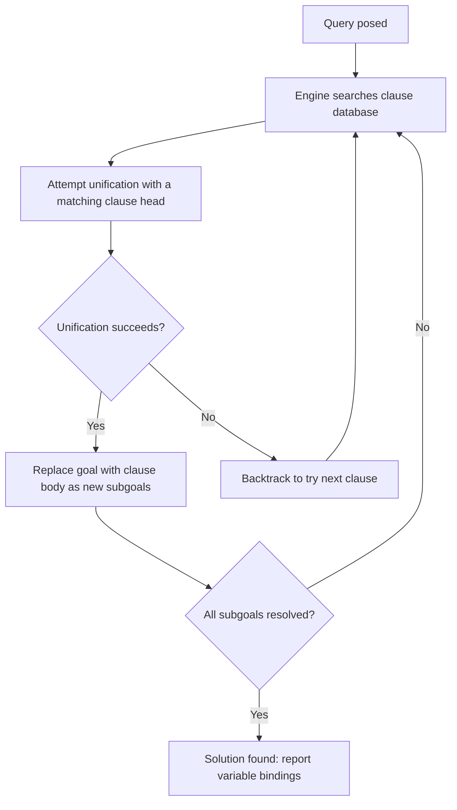

## Overview of Logic Programming


### Introduction

Logic programming is a declarative programming paradigm in which programs are expressed as sets of logical statements — facts and rules — and computation proceeds by having an inference engine search for answers that follow logically from those statements. Rather than specifying a sequence of operations to execute, a logic program describes relationships that hold true, and a query asks the system to find values consistent with those relationships. This paradigm sits at the intersection of formal logic, automated reasoning, and executable programming, with Prolog as its most established and widely used realization.

### Theoretical Foundations

**Key Points**

- Logic programming rests on **first-order predicate calculus**, restricted primarily to **Horn clauses** for computational tractability
- The theoretical basis for treating logical inference as computation was established by **Robert Kowalski**, who articulated the "Algorithm = Logic + Control" formulation, separating what is true (logic) from how to search for it (control)
- **Robinson's resolution principle** (1965) provided the mechanical inference rule that makes automated deduction over these formulas practical
- **SLD resolution** (Selective Linear Definite clause resolution) is the specific resolution strategy that operationalizes Horn clause logic into an executable procedure, and is the basis of Prolog's execution model

[Unverified] Specific historical attributions and dates regarding the origin and naming of concepts like "logic programming" are drawn from standard computer science history sources; some details of who first used particular terminology are subject to minor disagreement among historians of the field.

### Facts, Rules, and Queries

A logic program consists of a knowledge base of facts and rules, against which queries are posed.

```prolog
% Facts: unconditionally true statements
parent(tom, bob).
parent(tom, liz).
parent(bob, ann).

% Rule: a conditional statement, read as "X is a grandparent of Y if..."
grandparent(X, Y) :- parent(X, Z), parent(Z, Y).

% Query: asks the system to find bindings that satisfy the goal
?- grandparent(tom, ann).
% true.

?- grandparent(tom, Who).
% Who = ann.
```

**Key Points**

- Facts represent base-level truths with no preconditions
- Rules define derived relationships in terms of existing facts and other rules
- Queries (goals) trigger the inference engine to search the knowledge base and report bindings that make the goal true
- The declarative reading ("what is true") and procedural reading ("how the engine searches") coexist, and understanding both is important for writing efficient logic programs

### The Execution Model: Unification and Resolution

Two mechanisms underlie how a logic program actually computes an answer: **unification** (matching terms and binding variables) and **resolution** (deriving new goals from existing clauses).



**Key Points**

- **Unification** finds a substitution that makes two terms syntactically identical, binding variables as needed
- **SLD resolution** repeatedly reduces a goal to subgoals using matching rule bodies, until either all subgoals are satisfied (success) or no further matches are possible (failure)
- **Backtracking** automatically occurs when a chosen path fails, causing the engine to revisit earlier choice points and try alternative clauses
- This combination gives logic programs their characteristic behavior: a single query can yield multiple solutions, explored one at a time via backtracking

### Recursion as the Iteration Mechanism

Since logic programming has no imperative loop constructs, recursive rule definitions serve the role that loops play in imperative languages.

```prolog
% List length via recursion
list_length([], 0).
list_length([_|T], N) :- list_length(T, N1), N is N1 + 1.

% Transitive closure via recursion
ancestor(X, Y) :- parent(X, Y).
ancestor(X, Y) :- parent(X, Z), ancestor(Z, Y).
```

### Negation, Cut, and Practical Extensions

Pure Horn clause logic has no native negation, but practical logic programming languages add extensions for expressiveness and control.

**Key Points**

- **Negation as failure** (`\+ Goal` in Prolog) succeeds when `Goal` cannot be proven from the current knowledge base, which is a pragmatic, non-classical form of negation tied to the closed-world assumption
- The **cut** (`!`) operator commits to choices made so far, pruning backtracking alternatives — useful for efficiency but capable of altering declarative meaning if misused
- Arithmetic requires explicit evaluation via operators like `is/2`, since terms are otherwise treated as uninterpreted symbolic structures
- These extensions push practical Prolog beyond the cleanly defined semantics of pure Horn clause logic, trading some theoretical elegance for expressiveness and performance control

### Logic Programming vs. Other Paradigms

| Dimension | Logic Programming | Imperative | Functional |
| --- | --- | --- | --- |
| Core unit | Facts and rules (clauses) | Statements | Expressions |
| Computation mechanism | Unification + resolution | State mutation | Function application |
| Control flow | Automatic search + backtracking | Explicit (loops, branches) | Explicit (recursion, combinators) |
| Multiple results per query | Natural (via backtracking) | Requires explicit looping | Requires explicit list/stream handling |
| Side effects | Minimal in pure form; present in practice (I/O) | Pervasive | Isolated in pure variants |
| Canonical language | Prolog | C | Haskell |

### Illustration: Logic Programming Conceptual Map

<svg xmlns="http://www.w3.org/2000/svg" viewBox="0 0 700 400">
<text x="350" y="30" text-anchor="middle" font-size="18" font-weight="bold" fill="#1a1a1a">Logic Programming Conceptual Map (svg_diagram)</text>
<rect x="270" y="55" width="160" height="45" rx="8" fill="#e0d4fa" stroke="#6b46c1" stroke-width="2" />
<text x="350" y="82" text-anchor="middle" font-size="13" font-weight="bold" fill="#3c1a78">Predicate Calculus</text>
<line x1="350" y1="100" x2="350" y2="130" stroke="#333" stroke-width="1.5" marker-end="url(#b1)" />
<rect x="270" y="130" width="160" height="45" rx="8" fill="#cfe8ff" stroke="#2b6cb0" stroke-width="2" />
<text x="350" y="157" text-anchor="middle" font-size="13" font-weight="bold" fill="#1a3d5c">Horn Clauses</text>
<line x1="350" y1="175" x2="350" y2="205" stroke="#333" stroke-width="1.5" marker-end="url(#b1)" />
<rect x="270" y="205" width="160" height="45" rx="8" fill="#d6f5d6" stroke="#2f855a" stroke-width="2" />
<text x="350" y="232" text-anchor="middle" font-size="13" font-weight="bold" fill="#1a4d2e">SLD Resolution</text>
<line x1="350" y1="250" x2="350" y2="280" stroke="#333" stroke-width="1.5" marker-end="url(#b1)" />
<rect x="270" y="280" width="160" height="45" rx="8" fill="#ffe8cc" stroke="#c05621" stroke-width="2" />
<text x="350" y="307" text-anchor="middle" font-size="13" font-weight="bold" fill="#7c2d12">Prolog Execution</text>
<rect x="40" y="205" width="180" height="45" rx="8" fill="#fde8e8" stroke="#c53030" stroke-width="2" />
<text x="130" y="232" text-anchor="middle" font-size="12" fill="#742a2a">Unification</text>
<line x1="220" y1="227" x2="270" y2="227" stroke="#333" stroke-width="1.5" marker-end="url(#b1)" />
<rect x="480" y="205" width="180" height="45" rx="8" fill="#fde8e8" stroke="#c53030" stroke-width="2" />
<text x="570" y="232" text-anchor="middle" font-size="12" fill="#742a2a">Backtracking</text>
<line x1="480" y1="227" x2="430" y2="227" stroke="#333" stroke-width="1.5" marker-end="url(#b1)" />

<text x="350" y="360" text-anchor="middle" font-size="11" fill="#333">Practical extensions: negation-as-failure, cut, arithmetic (is/2)</text>

</svg>

### Major Logic Programming Languages and Extensions

| Language/System | Distinguishing Focus |
| --- | --- |
| Prolog | General-purpose logic programming, the canonical implementation |
| Datalog | Restricted subset (no complex terms, no function symbols in most variants); used in deductive databases and static analysis |
| Constraint Logic Programming (CLP) | Integrates constraint solving (over integers, reals, finite domains) into resolution |
| Answer Set Programming (ASP) | Uses stable model semantics; handles disjunction and negation beyond normal logic programs |
| Mercury | Adds static typing, mode declarations, and determinism annotations to a logic programming core |
| miniKanren | Embeds relational/logic programming as a library within host languages (Scheme, Racket, Clojure, etc.) |

[Inference] The characterization of each language's "distinguishing focus" reflects commonly cited descriptions in logic programming literature and official documentation; the full feature set of each language extends well beyond a one-line summary.

### Applications

**Key Points**

- **Expert systems and knowledge representation**, where domain rules map naturally onto facts and inference rules
- **Natural language processing**, historically significant in early parsing and grammar systems (e.g., Definite Clause Grammars in Prolog)
- **Deductive and graph databases**, particularly via Datalog and Datalog-inspired query languages
- **Program analysis and verification tooling**, where Datalog-style fixpoint computation is used to compute reachability, points-to analysis, and similar properties
- **Constraint satisfaction and combinatorial optimization**, via constraint logic programming, applied to scheduling, planning, and resource allocation problems
- **Automated theorem proving and formal methods**, sharing theoretical machinery (resolution, unification) with logic programming

[Inference] These application domains are commonly cited in academic and industry surveys of logic programming; their relative current prominence in production systems, as opposed to research and specialized tooling, is not independently verified here.

### Strengths and Limitations

**Key Points**

- **Strength**: naturally expresses relational and combinatorial problems (family relationships, graph traversal, constraint satisfaction) with concise, declarative code
- **Strength**: backtracking search is built into the language, removing the need to hand-write search algorithms for many problems
- **Limitation**: performance can be difficult to predict, since it depends heavily on clause ordering, indexing, and search strategy, which are semi-hidden from the purely declarative reading of the program
- **Limitation**: pure declarative semantics is compromised in practice by control-oriented features (cut, negation-as-failure, I/O side effects) needed for efficiency and real-world usability
- **Limitation**: the paradigm shift required — thinking in terms of relationships and unification rather than sequential steps or data transformations — presents a steep learning curve for most working programmers

### Example: A Small Logic Program End to End

```prolog
% Knowledge base
employee(alice, engineering).
employee(bob, engineering).
employee(carol, sales).
manager(alice, bob).
manager(carol, dave).
employee(dave, sales).

% Rule: same-department colleagues
colleague(X, Y) :- employee(X, D), employee(Y, D), X \= Y.

% Rule: reports-to chain (transitive)
reports_to(X, Y) :- manager(Y, X).
reports_to(X, Y) :- manager(Z, X), reports_to(Z, Y).

% Example queries:
% ?- colleague(alice, bob).      -> true.
% ?- reports_to(bob, alice).     -> true.
```

### Common Misconceptions

**Key Points**

- Logic programming is not "just declarative with no execution order" — clause and goal ordering materially affects performance and, in the presence of cut or side effects, can affect correctness
- Negation as failure is not classical logical negation; it reflects an assumption that unprovable statements are false, which can diverge from real-world truth when the knowledge base is incomplete
- Prolog is not the entirety of logic programming; Datalog, ASP, CLP, and embedded systems like miniKanren represent substantially different trade-offs within the same broad paradigm
- Logic programming and functional programming are both "declarative" in a loose sense, but they rest on different formal foundations (predicate logic and inference vs. lambda calculus and evaluation) and are not interchangeable approaches

### Next Steps

- Predicate calculus and Horn clause theory as prerequisite formal foundations
- Resolution and unification algorithms in computational detail
- Prolog language reference: control constructs, cut, built-in predicates
- Datalog and its role in deductive databases and static analysis tooling
- Constraint logic programming (CLP) for scheduling and optimization problems
- Answer Set Programming and stable model semantics
- miniKanren and embedding relational programming in non-logic host languages
- Comparative paradigm study: logic vs. functional vs. imperative programming