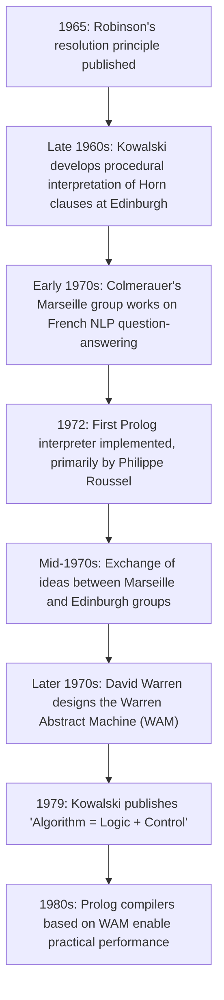

## The Origins of Prolog

### Overview

Prolog (from the French "Programmation en Logique") emerged in the early 1970s from a convergence of theoretical work on automated theorem proving and practical efforts to build natural language processing systems. Its development is most closely associated with a research group at the University of Aix-Marseille in France, led by Alain Colmerauer, working in collaboration with ideas from Robert Kowalski at the University of Edinburgh in Scotland. Prolog became the first — and remains the most widely used — practical realization of logic programming as an executable paradigm, translating theoretical resolution-based inference into a usable programming language.

### The Theoretical Precursors

**Key Points**

- **J.A. Robinson's resolution principle** (1965) provided the mechanical inference rule — a single rule capable of deriving contradictions from clausal-form logic — that made automated deduction computationally tractable
- **Robert Kowalski**, working at Edinburgh, developed the procedural interpretation of Horn clauses: the insight that a logical clause of the form $A \leftarrow B_1 \land \dots \land B_n$ could be read simultaneously as a declarative truth and as a procedure ("to solve A, solve $B_1$ through $B_n$")
- Kowalski's later formulation, **"Algorithm = Logic + Control"** (published 1979, though the underlying ideas circulated earlier), articulated the conceptual split between the logical content of a program and the strategy used to execute it — a foundational idea for the entire logic programming paradigm
- This theoretical groundwork answered the question of *whether* logic could be executed; the practical question of building a usable language and interpreter fell to the Marseille group

[Unverified] Precise dates of when specific ideas were first circulated versus formally published are subject to some variation across historical accounts, since research ideas often predate their formal publication by conference or journal proceedings.

### Alain Colmerauer and the Marseille Group

**Key Points**

- Alain Colmerauer led a research team at the University of Aix-Marseille that was working on **natural language processing**, specifically a system for question-answering in French, when the ideas that became Prolog took shape
- Colmerauer had earlier developed **Q-systems**, a formalism for natural language processing based on grammar rewriting rules, which fed into his thinking about rule-based computation
- The practical motivation for Prolog was building a tool to parse and reason about natural language queries, not an abstract exercise in logic — the language grew out of an applied NLP project rather than being designed as a general-purpose logic programming language from the outset
- Philippe Roussel, a member of the Marseille team, is credited with implementing the first Prolog interpreter, and the name "Prolog" itself is generally attributed to Roussel [Unverified — naming attribution is repeated across secondary historical sources but primary documentation of the exact naming moment is not something this response can independently confirm]

### The Edinburgh Contribution

**Key Points**

- Robert Kowalski's theoretical work on the procedural interpretation of Horn clauses, developed at Edinburgh, provided the logical semantics that gave Prolog's execution model its formal grounding
- David H.D. Warren, also at Edinburgh, made major practical contributions shortly after Prolog's initial development — most notably the design of the **Warren Abstract Machine (WAM)**, an abstract instruction set and execution model that became the standard basis for efficient Prolog compilers
- The collaboration and exchange of ideas between the Marseille and Edinburgh groups in the mid-1970s is often described as a joint intellectual foundation for Prolog, even though the initial interpreter was built in Marseille
- This cross-institutional dynamic — theoretical semantics from Edinburgh, initial practical implementation from Marseille, and later compiler efficiency work also from Edinburgh — is a commonly cited pattern in histories of the language's early development [Inference — this framing synthesizes commonly repeated historical narratives from multiple secondary sources on Prolog's history; the precise degree and timeline of collaboration between the two groups involves nuances that a brief overview cannot fully capture]

### Timeline of Early Development

[Unverified] The specific year markers in this timeline reflect commonly cited dates in secondary historical accounts of Prolog's development; exact dates for informal research milestones (as opposed to formal publications) can vary slightly between sources.

### Why Natural Language Processing Motivated Prolog's Design

**Key Points**

- Natural language grammar and parsing problems map naturally onto logical rule systems: a grammar rule ("a sentence consists of a noun phrase followed by a verb phrase") resembles a Horn clause rule
- This connection later crystallized into **Definite Clause Grammars (DCGs)**, a Prolog-specific notation for expressing context-free (and more general) grammars directly as logic program clauses
- The need to search through multiple possible parses of ambiguous sentences aligned well with Prolog's built-in backtracking search, since natural language parsing frequently requires exploring and discarding alternative interpretations
- This origin in applied linguistics work is part of why Prolog's design emphasizes pattern matching (unification) over structured terms — a natural fit for representing and manipulating grammatical structures

### Early Design Characteristics

**Key Points**

- The first Prolog systems were interpreted rather than compiled, prioritizing exploration of the logic programming concept over raw execution speed
- Early Prolog used a **depth-first, left-to-right resolution strategy** with backtracking — a specific instance of SLD resolution — chosen for implementation simplicity and reasonably predictable behavior, even though it is not the only possible search strategy for Horn clause logic
- The **cut operator** (`!`) was introduced early in Prolog's development as a pragmatic mechanism for controlling the otherwise exhaustive backtracking search, reflecting the tension between pure declarative logic and practical performance needs that has persisted throughout Prolog's history
- Arithmetic and I/O were added as practical extensions, since pure Horn clause logic has no inherent notion of computation over numbers or interaction with the outside world

### Standardization and Spread

**Key Points**

- Following its origins as a research tool, Prolog spread through academic circles in Europe and later globally, with multiple independent implementations emerging (e.g., in the UK, elsewhere in Europe, and eventually North America and Japan)
- Prolog gained significant international attention when it was selected as a core technology for Japan's **Fifth Generation Computer Systems project** (initiated in 1982), a large government-funded initiative aiming to build advanced parallel and knowledge-based computing systems
- This association substantially raised Prolog's international profile during the 1980s, though the broader ambitions of the Fifth Generation project (in areas like massively parallel AI computing) are generally regarded as having fallen short of their original goals [Inference — this is a widely repeated retrospective assessment in histories of AI and computing from that era; the precise reasons and degree of the project's perceived shortfall involve technical and economic factors beyond the scope of this summary]
- An **ISO standard for Prolog** (ISO/IEC 13211) was eventually established, formalizing core syntax and semantics, though many implementations retain vendor-specific extensions beyond the standard

### Comparative Snapshot: Key Figures and Contributions

| Figure | Institution | Primary Contribution |
| --- | --- | --- |
| J.A. Robinson | (various, theoretical work) | Resolution principle (1965), enabling mechanical inference |
| Robert Kowalski | University of Edinburgh | Procedural interpretation of Horn clauses; "Algorithm = Logic + Control" |
| Alain Colmerauer | University of Aix-Marseille | Led the research group; prior work on Q-systems for NLP |
| Philippe Roussel | University of Aix-Marseille | Credited with implementing the first Prolog interpreter; associated with naming the language |
| David H.D. Warren | University of Edinburgh | Warren Abstract Machine (WAM), enabling efficient compiled Prolog |

### Illustration: Intellectual Lineage of Prolog

<svg xmlns="http://www.w3.org/2000/svg" viewBox="0 0 700 400">
<text x="350" y="30" text-anchor="middle" font-size="18" font-weight="bold" fill="#1a1a1a">Intellectual Lineage of Prolog (svg_diagram)</text>
<rect x="270" y="55" width="160" height="45" rx="8" fill="#e0d4fa" stroke="#6b46c1" stroke-width="2" />
<text x="350" y="82" text-anchor="middle" font-size="12" font-weight="bold" fill="#3c1a78">Robinson: Resolution (1965)</text>
<line x1="350" y1="100" x2="200" y2="140" stroke="#333" stroke-width="1.5" marker-end="url(#c1)" />
<line x1="350" y1="100" x2="500" y2="140" stroke="#333" stroke-width="1.5" marker-end="url(#c1)" />
<rect x="120" y="140" width="180" height="50" rx="8" fill="#cfe8ff" stroke="#2b6cb0" stroke-width="2" />
<text x="210" y="162" text-anchor="middle" font-size="11" font-weight="bold" fill="#1a3d5c">Kowalski (Edinburgh)</text>
<text x="210" y="178" text-anchor="middle" font-size="10" fill="#1a3d5c">Procedural Horn clause reading</text>
<rect x="400" y="140" width="180" height="50" rx="8" fill="#ffe8cc" stroke="#c05621" stroke-width="2" />
<text x="490" y="162" text-anchor="middle" font-size="11" font-weight="bold" fill="#7c2d12">Colmerauer (Marseille)</text>
<text x="490" y="178" text-anchor="middle" font-size="10" fill="#7c2d12">NLP + Q-systems background</text>
<line x1="210" y1="190" x2="350" y2="230" stroke="#333" stroke-width="1.5" marker-end="url(#c1)" />
<line x1="490" y1="190" x2="350" y2="230" stroke="#333" stroke-width="1.5" marker-end="url(#c1)" />
<rect x="260" y="230" width="180" height="50" rx="8" fill="#d6f5d6" stroke="#2f855a" stroke-width="2" />
<text x="350" y="252" text-anchor="middle" font-size="12" font-weight="bold" fill="#1a4d2e">First Prolog Interpreter</text>
<text x="350" y="268" text-anchor="middle" font-size="10" fill="#1a4d2e">(Roussel, 1972)</text>
<line x1="350" y1="280" x2="350" y2="310" stroke="#333" stroke-width="1.5" marker-end="url(#c1)" />
<rect x="260" y="310" width="180" height="50" rx="8" fill="#fde8e8" stroke="#c53030" stroke-width="2" />
<text x="350" y="332" text-anchor="middle" font-size="12" font-weight="bold" fill="#742a2a">Warren Abstract Machine</text>
<text x="350" y="348" text-anchor="middle" font-size="10" fill="#742a2a">(efficient compilation)</text>
</svg>

### Legacy and Influence

**Key Points**

- Prolog established that logic-based, declarative programming could be practically executed, not merely theorized about, opening the broader field of logic programming as an engineering discipline
- Concepts pioneered or popularized through Prolog — unification, backtracking search, Horn clause reasoning, Definite Clause Grammars — influenced later languages and systems, including constraint logic programming, Datalog-based tools, and embedded relational programming systems like miniKanren
- The Warren Abstract Machine's design approach (compiling a high-level declarative language to a specialized abstract instruction set) influenced virtual machine design thinking beyond logic programming specifically
- Prolog remains in active use today in areas such as symbolic AI research, natural language processing prototyping, expert systems, and certain constraint-solving applications, decades after its origin as a research prototype [Inference — continued use is documented anecdotally and in specific tool ecosystems (e.g., SWI-Prolog, GNU Prolog); a comprehensive assessment of current industrial prevalence is beyond what can be confirmed in this overview]

### Common Misconceptions

**Key Points**

- Prolog was not designed from the outset as an abstract exercise in mathematical logic; its origins are rooted in a concrete natural language processing application
- Prolog was not the sole product of a single inventor; its development reflects a collaboration (and exchange of ideas) between at least the Marseille and Edinburgh groups, building on Robinson's and Kowalski's prior theoretical work
- The Warren Abstract Machine is not the language Prolog itself, but rather a compilation target and execution model developed after Prolog's initial creation to make it run efficiently
- Prolog's association with Japan's Fifth Generation Computer Systems project does not mean Prolog originated in Japan; the project adopted Prolog as a foundational technology roughly a decade after its creation in France

### Related Topics

- Predicate calculus and Horn clause theory as the formal foundation Prolog operationalizes
- Resolution and SLD resolution as the inference mechanism underlying Prolog's execution
- The Warren Abstract Machine (WAM) architecture in technical detail
- Definite Clause Grammars (DCGs) and Prolog's natural language processing roots
- Japan's Fifth Generation Computer Systems project and its broader historical context
- Modern Prolog implementations (SWI-Prolog, GNU Prolog, SICStus) and their divergence from early designs
- The influence of Prolog on constraint logic programming and Datalog
- Comparative history of declarative programming paradigms (logic vs. functional origins)