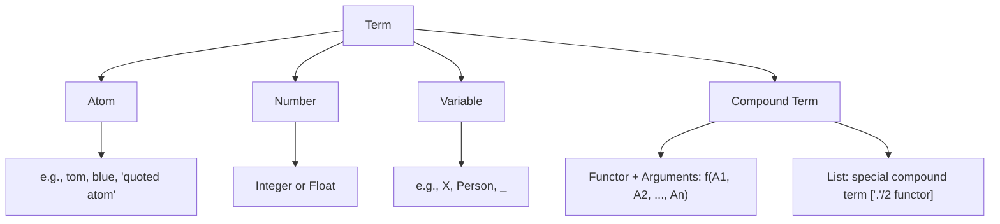
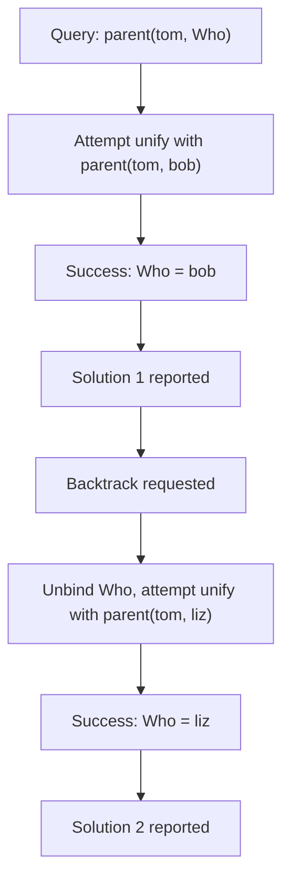

## Prolog Terms and Unification

### Overview

Terms are the fundamental data structures of Prolog — every fact, rule, query, and piece of data in a Prolog program is built from terms. Unification is the single mechanism Prolog uses to compare terms, bind variables, and match queries against the clause database, making it the computational heart of the language. Understanding the term structure and unification algorithm is prerequisite to understanding how any Prolog program actually executes.

### Categories of Terms

**Key Points**

- **Atoms**: constant, named symbols with no internal structure, e.g., `tom`, `blue`, `'hello world'` (quoted when containing spaces or special characters)
- **Numbers**: integers (`42`, `-7`) and floating-point numbers (`3.14`, `-0.5`)
- **Variables**: symbols beginning with an uppercase letter or underscore, e.g., `X`, `Person`, `_Result`, representing as-yet-unbound placeholders
- **Compound terms**: a functor (a name) applied to one or more arguments, e.g., `parent(tom, bob)`, `point(3, 4)`, `tree(leaf, node(1, leaf, leaf))`
- **Lists**: a special, commonly used compound term structure, syntactically sugared as `[a, b, c]`, internally built from the `'.'/2` functor (or `'[|]'/2` in some implementations)
- **Strings**: sequences of character codes, often represented as lists of character codes or, in modern implementations, as a distinct string type depending on the Prolog system and flags in use [Unverified — string representation specifics vary meaningfully across Prolog implementations (e.g., SWI-Prolog's native string type vs. traditional code lists) and are not uniform across the language]

```prolog
% Examples of each term category
atom_example(blue).
number_example(42).
number_example(3.14).
variable_example(X).                    % X is unbound until bound by unification
compound_example(point(3, 4)).
list_example([1, 2, 3]).
```

### The Term Hierarchy



### Compound Terms and Arity

A compound term consists of a **functor** (name) and a fixed number of arguments, referred to jointly as the term's **functor/arity** signature.

**Key Points**

- `parent(tom, bob)` has functor `parent` and arity 2, written `parent/2`
- `point(3, 4)` has functor `point` and arity 2, written `point/2`
- A functor with the same name but different arity — e.g., `foo/1` and `foo/2` — are treated as entirely distinct predicates/structures in Prolog, not overloaded versions of the same thing
- Compound terms can be nested arbitrarily: `tree(node(1, leaf, leaf), node(2, leaf, leaf))` builds a structured, tree-shaped term

### Lists as Compound Terms

Prolog lists are syntactic sugar over a recursive compound term structure using a head/tail pattern.

```prolog
[1, 2, 3]
% is internally equivalent to:
'.'(1, '.'(2, '.'(3, [])))

% Head/tail pattern matching in a clause
first_element([H|_], H).

?- first_element([a, b, c], X).
% X = a.
```

**Key Points**

- `[]` represents the empty list, itself a special atom
- `[H|T]` destructures a non-empty list into its head `H` and tail `T` (the remainder of the list)
- This recursive structure is why list processing predicates in Prolog are almost always written using recursion that peels off one head element at a time

### The Unification Algorithm

Unification takes two terms and attempts to find a substitution (a mapping of variables to terms) that makes them syntactically identical.

**Key Points**

- Two identical atoms unify with each other and with nothing else: `tom = tom` succeeds; `tom = bob` fails
- Two identical numbers unify with each other only: `42 = 42` succeeds; `42 = 43` fails
- An unbound variable unifies with anything, becoming bound to that term: `X = tom` succeeds, binding `X` to `tom`
- Two compound terms unify only if they have the same functor and arity, and each corresponding pair of arguments unifies (recursively): `foo(X, 2) = foo(1, Y)` succeeds, binding `X = 1` and `Y = 2`
- Two terms with different functors, different arities, or incompatible atoms/numbers fail to unify

```prolog
?- tom = tom.
% true.

?- tom = bob.
% false.

?- X = tom.
% X = tom.

?- foo(X, 2) = foo(1, Y).
% X = 1, Y = 2.

?- foo(X) = bar(X).
% false.  (different functors: foo vs bar)

?- foo(X, Y) = foo(1, 2, 3).
% false.  (different arity: 2 vs 3)
```

### Unification with Compound and Nested Terms

Unification recurses into the structure of compound terms, matching corresponding sub-terms and accumulating bindings along the way.

```prolog
?- point(X, Y) = point(3, 4).
% X = 3, Y = 4.

?- tree(node(A, leaf, leaf), B) = tree(node(1, leaf, leaf), node(2, leaf, leaf)).
% A = 1, B = node(2, leaf, leaf).
```

**Key Points**

- All variable bindings produced during a single unification must be mutually consistent — if a variable is bound to one value in one part of the term and a conflicting value elsewhere, unification fails overall
- Unification is applied left-to-right, argument by argument, but the entire operation either succeeds as a whole (producing a combined substitution) or fails as a whole

```prolog
?- foo(X, X) = foo(1, 2).
% false.  (X cannot simultaneously be 1 and 2)

?- foo(X, X) = foo(1, 1).
% X = 1.
```

### Variable-to-Variable Unification

When two unbound variables unify with each other, they become linked (aliased) rather than bound to a concrete value — a binding for either one propagates to both.

```prolog
?- X = Y, Y = 5.
% X = 5, Y = 5.
```

Here, `X = Y` links the two variables; subsequently binding `Y` to `5` also resolves `X` to `5`, since they were unified together.

### The Occurs Check

A theoretically important but often practically skipped part of the unification algorithm is the **occurs check**: verifying that a variable being bound does not itself occur within the term it is being bound to.

```prolog
?- X = f(X).
% In standard SWI-Prolog (without occurs check enabled):
% X = f(f(f(f(f(f(f(f(f(f(...)))))))))) (or similar infinite/cyclic structure representation)
```

**Key Points**

- Without the occurs check, binding `X` to `f(X)` creates a **cyclic term** — a structure that infinitely contains itself — which is logically unsound with respect to classical unification theory but is often permitted by default for performance reasons
- Most standard Prolog implementations use `unify_with_occurs_check/2` as an explicit, separate predicate for cases where sound (occurs-check-respecting) unification is required, while ordinary `=/2` skips the check by default [Inference — this reflects widely documented default behavior in major Prolog implementations such as SWI-Prolog and is consistent with the ISO Prolog standard's optional treatment of the occurs check; specific default behavior can still vary by implementation flags or configuration]
- Omitting the occurs check is a deliberate engineering trade-off: full occurs-checking unification is more expensive to compute, and cyclic term creation is rare in typical programs, so most systems accept the small risk of unsound results in pathological cases in exchange for better average performance

```prolog
?- unify_with_occurs_check(X, f(X)).
% false.   (fails safely rather than constructing a cyclic term)
```

### Unification vs. Assignment

**Key Points**

- Unification is fundamentally different from assignment in imperative languages: assignment (`x = 5` in C or Java) is a one-directional, destructive operation that overwrites a variable's value
- Unification is symmetric and non-destructive with respect to already-bound terms: `5 = X` and `X = 5` behave identically, both binding `X` to `5`
- Once a Prolog variable is bound within a given proof path, it cannot be rebound to a different, conflicting value within that path (though backtracking can undo the binding entirely, effectively "unbinding" it for exploration of alternative solutions)
- This immutability-until-backtracking characteristic is closely tied to Prolog's logical semantics: a variable represents an unknown quantity being solved for, not a mutable storage location being updated

### Unification's Role in Clause Resolution

Unification is not just a query-answering tool used explicitly by the programmer — it is the mechanism the Prolog engine uses internally every time it attempts to match a goal against a clause head during resolution.

```prolog
parent(tom, bob).
parent(tom, liz).

?- parent(tom, Who).
```

**Key Points**

- To answer `parent(tom, Who)`, the engine attempts to unify the query against each `parent/2` fact in turn
- `parent(tom, Who)` unifies with `parent(tom, bob)`, binding `Who = bob` — this becomes the first solution offered
- On backtracking (requesting further solutions), the engine unbinds `Who` and attempts unification against the next fact, `parent(tom, liz)`, yielding `Who = liz`
- This same unification process applies when matching a goal against a rule head, at which point the rule's body becomes new subgoals to resolve



### Illustration: Unification Recursing Through Structure

<svg xmlns="http://www.w3.org/2000/svg" viewBox="0 0 700 340">
<text x="350" y="30" text-anchor="middle" font-size="18" font-weight="bold" fill="#1a1a1a">Unification of Nested Compound Terms (svg_diagram)</text>
<text x="350" y="55" text-anchor="middle" font-size="12" fill="#333">tree(node(A, leaf, leaf), B) = tree(node(1, leaf, leaf), node(2, leaf, leaf))</text>
<rect x="120" y="80" width="200" height="40" rx="6" fill="#cfe8ff" stroke="#2b6cb0" stroke-width="2" />
<text x="220" y="105" text-anchor="middle" font-size="12" fill="#1a3d5c">tree(..., ...)</text>
<rect x="380" y="80" width="200" height="40" rx="6" fill="#cfe8ff" stroke="#2b6cb0" stroke-width="2" />
<text x="480" y="105" text-anchor="middle" font-size="12" fill="#1a3d5c">tree(..., ...)</text>

<text x="350" y="105" text-anchor="middle" font-size="14" fill="`#2f855a`">✓ same functor/arity</text>

<line x1="220" y1="120" x2="180" y2="160" stroke="#333" stroke-width="1.5" marker-end="url(#d1)" />
<line x1="480" y1="120" x2="440" y2="160" stroke="#333" stroke-width="1.5" marker-end="url(#d1)" />
<rect x="80" y="160" width="200" height="40" rx="6" fill="#d6f5d6" stroke="#2f855a" stroke-width="2" />
<text x="180" y="185" text-anchor="middle" font-size="11" fill="#1a4d2e">node(A, leaf, leaf)</text>
<rect x="340" y="160" width="200" height="40" rx="6" fill="#d6f5d6" stroke="#2f855a" stroke-width="2" />
<text x="440" y="185" text-anchor="middle" font-size="11" fill="#1a4d2e">node(1, leaf, leaf)</text>

<text x="350" y="220" text-anchor="middle" font-size="13" font-weight="bold" fill="`#2f855a`">Recurse: A unifies with 1 -&gt; A = 1</text>

<line x1="220" y1="120" x2="530" y2="160" stroke="#333" stroke-width="1.5" stroke-dasharray="4" marker-end="url(#d1)" />
<rect x="440" y="240" width="200" height="40" rx="6" fill="#ffe8cc" stroke="#c05621" stroke-width="2" />
<text x="540" y="265" text-anchor="middle" font-size="11" fill="#7c2d12">B unifies with node(2, leaf, leaf)</text>

<text x="350" y="310" text-anchor="middle" font-size="13" font-weight="bold" fill="#333">Final bindings: A = 1, B = node(2, leaf, leaf)</text>

</svg>

### Comparative Table: Term Types and Unification Rules

| Term Type | Unifies With | Example |
| --- | --- | --- |
| Atom | Same atom only | `blue = blue` succeeds |
| Number | Same number only | `42 = 42` succeeds; `42 = 42.0` fails (different types) |
| Unbound variable | Anything (becomes bound) | `X = foo(1,2)` succeeds, `X` bound |
| Bound variable | Whatever it is currently bound to | Behaves as its bound value in further unification |
| Compound term | Same functor/arity, all arguments unify | `f(X,2) = f(1,Y)` succeeds |
| List | Head/tail structural match | `[H|T] = [a,b,c]` succeeds, `H=a, T=[b,c]` |

[Unverified] The claim that `42 = 42.0` fails reflects standard Prolog type semantics distinguishing integers from floats, as documented in the ISO Prolog standard and common implementations; some systems may offer alternative comparison predicates (e.g., `=:=/2` for arithmetic equality) that behave differently from term unification.

### Common Pitfalls

**Key Points**

- Confusing `=/2` (unification) with `==/2` (structural equality without binding) or `=:=/2` (arithmetic equality) — these are distinct operators with different semantics in Prolog
- Assuming `X = Y` always means "compare X and Y" the way it might in an imperative language, when unbound variables actually become linked/aliased rather than compared
- Forgetting that Prolog's default unification skips the occurs check, which can silently produce unexpected cyclic terms in edge cases involving self-referential structures
- Treating lists as a primitive built-in type rather than understanding they are sugar over a recursive compound term, which matters when writing custom predicates that must handle list structure explicitly

### Related Topics

- Clausal form and Horn clauses as the structures unification operates over during resolution
- Resolution and SLD resolution as the broader inference process that relies on repeated unification
- List processing and recursive predicate patterns in Prolog
- The cut operator and its interaction with backtracking over unification choice points
- Definite Clause Grammars (DCGs) and their reliance on term structure for parsing
- Prolog's type system: atoms, numbers, compound terms, and dynamic typing in practice
- Constraint logic programming as an extension beyond pure syntactic unification
- The Warren Abstract Machine's internal representation of terms and unification instructions