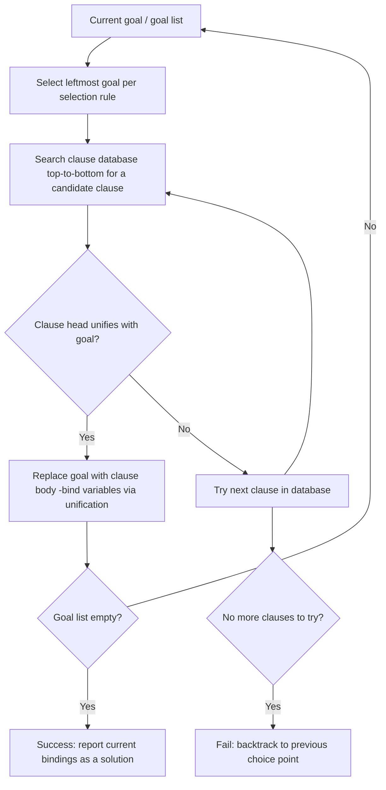
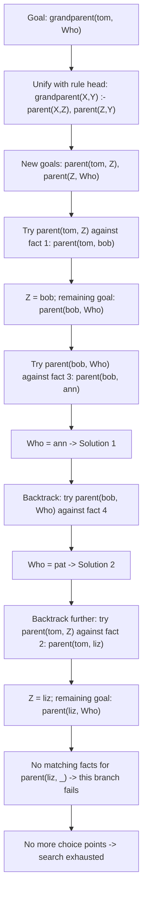

## Inferencing Process in Prolog

### Overview

The inferencing process in Prolog is the runtime mechanism by which a query is transformed into a proof, or shown to have no proof, through repeated application of unification, clause selection, and backtracking over SLD resolution. While facts and rules describe static relationships, it is this inferencing engine that performs the actual work of computation: searching the clause database, reducing goals to subgoals, and reporting variable bindings as solutions. Understanding this process in detail explains both why Prolog programs produce the answers they do and why clause ordering and program structure materially affect performance and behavior.

### The Resolution Cycle

At the core of Prolog's inferencing process is a repeated cycle: take the current goal, find a matching clause, unify, and replace the goal with the clause's body as new subgoals.



**Key Points**

- The **selection rule** in standard Prolog picks the leftmost unresolved goal in the current goal list, a specific instance of the more general SLD resolution framework
- The **search rule** tries clauses in the order they appear in the source file, top to bottom, attempting unification with each candidate clause head
- Successfully unifying a goal with a clause head replaces that goal with the clause's body (a conjunction of new subgoals), threading the accumulated variable bindings forward
- An empty goal list signals success — every subgoal has been resolved, and the accumulated bindings constitute the answer

### The SLD Resolution Tree

Prolog's execution can be visualized as traversing a tree of choices, where each branch represents an alternative clause that could match the current goal, and depth-first traversal with backtracking explores this tree.

```prolog
parent(tom, bob).
parent(tom, liz).
parent(bob, ann).
parent(bob, pat).

grandparent(X, Y) :- parent(X, Z), parent(Z, Y).

?- grandparent(tom, Who).
```



**Key Points**

- Each node in the resolution tree represents a state of the goal list and current variable bindings
- Branching occurs at **choice points**: places where more than one clause could potentially unify with the current goal
- Depth-first traversal means Prolog fully explores one branch (down to success or failure) before backtracking to try a sibling branch
- The overall search terminates either when all branches have been exhausted (no more solutions) or when the program/query explicitly stops requesting further solutions

### Choice Points and Backtracking

A **choice point** is created whenever a goal could potentially unify with more than one clause in the database, recording enough information (the current goal list, bindings, and which clauses remain untried) to resume the search there later.

**Key Points**

- Backtracking is triggered automatically when the current path fails (no clause matches) or when the user/program explicitly requests more solutions (e.g., typing `;` in an interactive Prolog session)
- On backtracking, all variable bindings made since the relevant choice point are undone, restoring the state to what it was when the choice point was created
- The engine then resumes the search at that choice point, trying the next untried clause
- Choice points are stored on a **backtracking stack** (conceptually), which grows with each new alternative and shrinks as branches are fully explored and discarded

```prolog
?- parent(tom, Who).
% Who = bob ;    <- user requests next solution via ';'
% Who = liz.
```

### Deterministic vs. Non-Deterministic Goals

**Key Points**

- A goal is **deterministic** if it can succeed in at most one way — no choice point is left behind after it succeeds, so no backtracking into it is possible
- A goal is **non-deterministic** if multiple clauses could match, leaving a choice point behind that backtracking can later revisit
- Facts and rules with mutually exclusive conditions (e.g., guarded by distinct argument patterns) are often effectively deterministic in practice, even though the engine may not know this in advance without additional annotations or first-argument indexing
- Understanding which goals in a program are deterministic versus non-deterministic is important for reasoning about both correctness (are all expected solutions actually found?) and performance (is unnecessary choice-point bookkeeping being retained?)

### The Role of the Cut in Controlling Inference

The **cut** (`!`) operator directly manipulates the inferencing process by committing to choices made so far and discarding certain choice points.

```prolog
classify(X, negative) :- X < 0, !.
classify(X, zero) :- X =:= 0, !.
classify(X, positive) :- X > 0.
```

**Key Points**

- When execution passes through a cut, it commits to the current clause choice and removes the choice points created since entering the current clause, including the choice to try subsequent clauses for the same goal
- This means that once `classify(-5, negative)` succeeds through the first clause and passes the cut, Prolog will not backtrack into trying the second or third `classify` clauses for that call
- Cuts materially change the shape of the resolution tree by pruning branches that would otherwise be explored, which is why cut placement affects both efficiency and, in cases involving side effects or negation-as-failure, program correctness
- A cut's scope is limited to the clause in which it appears — it commits choices made within that clause's execution, not the entire program's search

### First-Argument Indexing

**Key Points**

- Many practical Prolog implementations use **first-argument indexing** as an optimization: rather than blindly trying every clause for a given predicate, the engine uses the type/value of the first argument of the goal to quickly skip clauses that cannot possibly unify
- This does not change the logical semantics of the inferencing process, only its efficiency — the same solutions are found, typically faster, by avoiding unification attempts doomed to fail
- The degree and sophistication of indexing (first-argument only vs. multi-argument, static vs. dynamic) varies across Prolog implementations [Inference — first-argument indexing is a long-documented, widely implemented optimization technique described in Prolog implementation literature and the original WAM design; the exact indexing behavior and its extent differ across specific systems such as SWI-Prolog, GNU Prolog, and SICStus]

### Negation as Failure Within the Inferencing Process

```prolog
single(X) :- \+ married(X).
```

**Key Points**

- To evaluate `\+ Goal`, the engine attempts to prove `Goal` using the normal inferencing process described above
- If that sub-proof succeeds (finds at least one solution), `\+ Goal` fails
- If that sub-proof exhausts all choice points without success, `\+ Goal` succeeds
- Critically, any variable bindings made while attempting the inner `Goal` are undone regardless of the outcome, since `\+` only reports success or failure, not bindings — this is a direct consequence of how the inferencing process is structured around backtracking and bindings scoped to choice points

### Arithmetic Evaluation Within the Inference Cycle

Because Prolog terms are not automatically evaluated, arithmetic subgoals like `X is 2 + 3` are treated as calls to a built-in predicate that performs evaluation as a side computation within the same resolution cycle, rather than through unification against a database of facts.

```prolog
factorial(0, 1).
factorial(N, F) :- N > 0, N1 is N - 1, factorial(N1, F1), F is N * F1.
```

**Key Points**

- Built-in predicates like `is/2`, comparison operators (`<`, `>`, `=:=`), and I/O predicates are typically implemented directly by the Prolog engine (or a standard library shipped with it) rather than defined via user clauses, but they participate in the same goal-resolution cycle as user-defined predicates
- These built-ins are generally deterministic (succeed at most once) and do not search a clause database, distinguishing their role in the inferencing process from ordinary user-defined predicates

### Illustration: Anatomy of One Inference Step

<svg xmlns="http://www.w3.org/2000/svg" viewBox="0 0 700 320">
<text x="350" y="30" text-anchor="middle" font-size="18" font-weight="bold" fill="#1a1a1a">Anatomy of One Inference Step (svg_diagram)</text>
<rect x="40" y="60" width="180" height="50" rx="8" fill="#cfe8ff" stroke="#2b6cb0" stroke-width="2" />
<text x="130" y="90" text-anchor="middle" font-size="12" fill="#1a3d5c">Current Goal List</text>
<line x1="220" y1="85" x2="270" y2="85" stroke="#333" stroke-width="1.5" marker-end="url(#e1)" />
<rect x="270" y="60" width="180" height="50" rx="8" fill="#e0d4fa" stroke="#6b46c1" stroke-width="2" />
<text x="360" y="90" text-anchor="middle" font-size="12" fill="#3c1a78">Select Leftmost Goal</text>
<line x1="450" y1="85" x2="500" y2="85" stroke="#333" stroke-width="1.5" marker-end="url(#e1)" />
<rect x="500" y="60" width="180" height="50" rx="8" fill="#ffe8cc" stroke="#c05621" stroke-width="2" />
<text x="590" y="90" text-anchor="middle" font-size="12" fill="#7c2d12">Search Clause DB</text>
<line x1="590" y1="110" x2="590" y2="150" stroke="#333" stroke-width="1.5" marker-end="url(#e1)" />
<rect x="500" y="150" width="180" height="50" rx="8" fill="#d6f5d6" stroke="#2f855a" stroke-width="2" />
<text x="590" y="180" text-anchor="middle" font-size="12" fill="#1a4d2e">Unify with Clause Head</text>
<line x1="500" y1="175" x2="450" y2="175" stroke="#333" stroke-width="1.5" marker-end="url(#e1)" />
<rect x="270" y="150" width="180" height="50" rx="8" fill="#fde8e8" stroke="#c53030" stroke-width="2" />
<text x="360" y="180" text-anchor="middle" font-size="12" fill="#742a2a">Record Choice Point (if alternatives remain)</text>
<line x1="270" y1="175" x2="220" y2="175" stroke="#333" stroke-width="1.5" marker-end="url(#e1)" />
<rect x="40" y="150" width="180" height="50" rx="8" fill="#cfe8ff" stroke="#2b6cb0" stroke-width="2" />
<text x="130" y="180" text-anchor="middle" font-size="12" fill="#1a3d5c">Replace Goal with Clause Body</text>
<line x1="130" y1="200" x2="130" y2="240" stroke="#333" stroke-width="1.5" marker-end="url(#e1)" />

<text x="130" y="265" text-anchor="middle" font-size="12" font-weight="bold" fill="#333">New Goal List -&gt; repeat cycle</text>

</svg>

### Performance Implications of the Inferencing Process

**Key Points**

- Clause and fact ordering directly affects how quickly a solution is found, since the engine tries clauses top-to-bottom; placing common cases earlier can reduce average search effort [Inference — this follows directly from the documented top-to-bottom search rule in standard Prolog implementations, though the practical performance impact depends on data distribution and indexing support in the specific system used]
- Leaving unnecessary choice points active (failing to use cut where appropriate) can cause excessive memory use and wasted computation on backtracking into branches that will never yield new correct solutions
- Recursive predicates without appropriate base-case ordering or without last-call optimization support can consume significant stack space, and behavior here varies by implementation regarding tail-call-style optimizations for recursive logic programs [Unverified — the presence and effectiveness of last-call/tail-call optimization is implementation-specific and not guaranteed uniformly across all Prolog systems]
- Deep or infinite non-terminating searches can occur if recursive rules lack a proper base case or if cyclic data structures are unintentionally created, since the inferencing process has no built-in general mechanism to detect non-termination

### Common Pitfalls

**Key Points**

- Assuming Prolog searches "in parallel" or explores all clauses simultaneously — standard Prolog inferencing is strictly sequential and depth-first unless a specific implementation offers explicit parallel search extensions
- Misplacing or omitting cuts, leading to either overly restrictive pruning (losing valid solutions) or overly permissive backtracking (returning unintended extra solutions or degraded performance)
- Forgetting that failed branches fully undo their variable bindings, which can lead to confusion when debugging why a variable appears unbound after a seemingly successful sub-goal that was later backtracked over
- Writing recursive rules with the recursive call before the base case check, which can cause the engine to attempt unbounded recursion before ever reaching termination conditions in certain call patterns

### Related Topics

- SLD resolution as the formal inference strategy underlying this process
- The cut operator and choice point management in greater technical depth
- Prolog terms and unification, the mechanism used at each resolution step
- First-argument indexing and other Prolog implementation optimization techniques
- The Warren Abstract Machine (WAM) as a compiled realization of this inferencing cycle
- Negation as failure and its dependence on the underlying proof-search process
- Tail-call and last-call optimization in logic programming implementations
- Debugging techniques for tracing Prolog's resolution and backtracking behavior